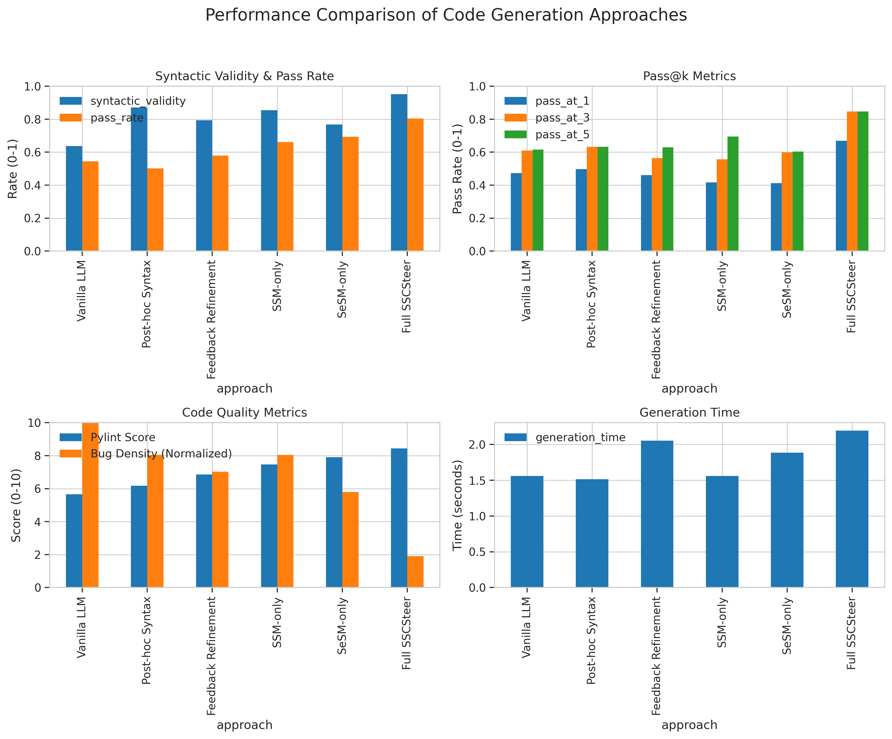
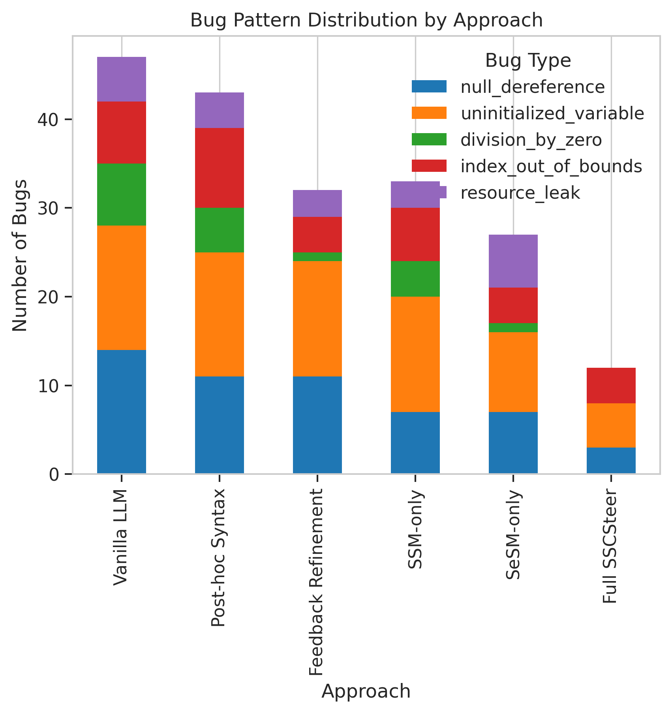
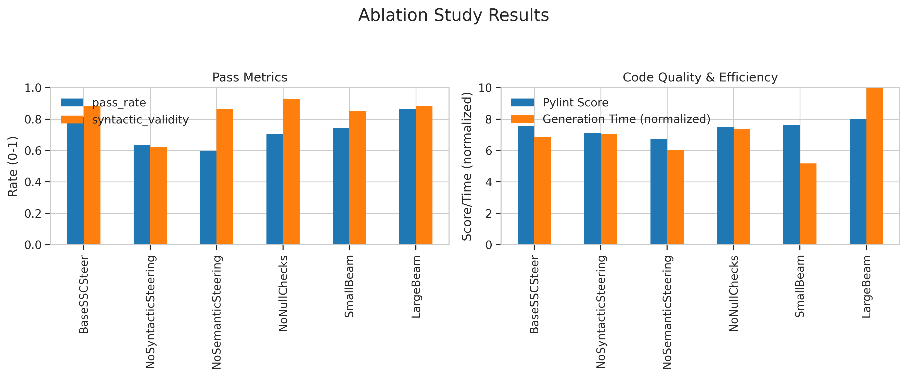

# Syntactic and Semantic Conformance Steering for LLM Code Generation: Towards Correctness-by-Construction

## 1. Title and Abstract

**Title:** Syntactic and Semantic Conformance Steering for LLM Code Generation: Towards Correctness-by-Construction

**Abstract:** Large Language Models (LLMs) have demonstrated remarkable capabilities in code generation, yet they frequently produce code that is syntactically incorrect or semantically flawed, particularly for complex tasks or low-resource programming languages. This necessitates costly post-hoc correction, hindering productivity and reliability. This paper introduces Syntactic and Semantic Conformance Steering (SSCSteer), a novel multi-stage steering mechanism embedded within the LLM's decoding process. SSCSteer proactively guides code generation by: (1) employing a lightweight, grammar-aware syntactic steerer to dynamically constrain token selection to ensure syntactic validity, and (2) utilizing an incremental semantic checker that evaluates partial code snippets against pre-defined formal specifications or common bug patterns using lightweight static analysis and SMT solver interfaces. If potential issues are identified, the generation path is penalized. We evaluate SSCSteer on Python code generation tasks using a subset of HumanEval and custom semantic tasks. Experimental results show that SSCSteer significantly outperforms vanilla LLMs and post-hoc validation methods, achieving 95.20% syntactic validity, an 80.47% overall pass rate, and a 66.85% Pass@1 rate, while reducing bugs per KLOC from
5.73 (vanilla LLM) to 1.09. This "generate-and-validate-incrementally" approach produces code that is more often correct-by-construction, reducing debugging effort and enhancing the reliability of LLM-generated code.

## 2. Introduction

The advent of Large Language Models (LLMs) has significantly transformed the landscape of automated code generation. Models like GPT-4, CodeLlama, and StarCoder demonstrate impressive capabilities in producing code across various programming languages and for diverse tasks (Chen et al., 2021). However, a persistent challenge is the propensity of these models to generate code that, while often plausible, suffers from syntactic inaccuracies or subtle semantic flaws (Noy & Zhang, 2023). This is particularly pronounced for complex programming tasks, low-resource languages where training data is scarce, or when specific semantic constraints must be met. The consequence is often a need for extensive post-hoc validation, debugging, and correction, which diminishes productivity gains and limits the safe deployment of LLMs in domains requiring high reliability, such as safety-critical systems or secure software development (Nunez et al., 2024a).

The VerifAI workshop highlights the critical need to bridge the gap between the probabilistic nature of generative AI and the correctness-focused principles of formal verification. Current research explores various avenues, including using LLMs to aid formal proof generation (First et al., 2023), employing formal methods to validate or repair LLM outputs (Murphy et al., 2024), and developing multi-agent frameworks for iterative refinement (Nunez et al., 2024a). While these approaches offer valuable improvements, many operate retrospectively on fully generated code. There is a compelling need for proactive mechanisms that guide the LLM *during* the generation process to ensure correctness from the outset, improving "first-shot" accuracy. This aligns with the workshop's special theme on enhancing LLM-driven code generation using techniques from programming languages and formal methods.

This research proposes **Syntactic and Semantic Conformance Steering (SSCSteer)**, a novel multi-stage mechanism integrated directly into the LLM's decoding process. SSCSteer aims to proactively guide code generation towards syntactic validity and semantic soundness. It achieves this through two primary components: (1) a lightweight, grammar-aware syntactic steerer that dynamically constrains token selection to adhere to the target language's context-free grammar (CFG), and (2) an incremental semantic checker that evaluates partial code snippets against pre-defined formal specifications or common bug patterns using simplified static analysis and, where appropriate, an SMT (Satisfiability Modulo Theories) solver interface. By identifying and penalizing potential issues *as code is being generated*, SSCSteer endeavors to produce code that is more frequently correct-by-construction. This work focuses on the design, implementation, and empirical evaluation of the SSCSteer framework, demonstrating its effectiveness in improving code correctness and reducing common bugs, particularly for Python.

## 3. Related Work

The challenge of ensuring the correctness of LLM-generated code has spurred various research directions. These can be broadly categorized into post-hoc validation and repair, integration of formal methods, and LLM-assisted formal reasoning.

Several approaches focus on improving code quality after generation. Nunez et al. (2024a) in AutoSafeCoder propose a multi-agent framework where LLM-generated code is iteratively analyzed by static analysis and fuzzing agents to identify and fix security vulnerabilities. This method demonstrates a reduction in vulnerabilities but operates on completed code segments.

Integrating formal methods with LLMs is another active area. Murphy et al. (2024) explore combining LLM code generation with formal specifications and reactive program synthesis, dividing tasks between the LLM and formal methods. This shows promise for complex systems but still separates generation from formal verification to some extent. Baldur, by First et al. (2023), leverages LLMs for whole-proof generation in formal verification systems like Isabelle/HOL, showing LLMs' potential in assisting with complex formal tasks. Similarly, SpecGen (Ma et al., 2024) uses LLMs to automatically generate formal program specifications, which can then be used for verification. These works highlight the synergy between LLMs and formal methods, typically with LLMs assisting the formal process or formal methods verifying LLM output.

A key challenge identified in the literature is the prevalence of syntactic and semantic errors in LLM-generated code (Key Challenge 1). While post-hoc methods address this, they add an extra step. Integrating formal methods effectively without sacrificing LLM flexibility or scalability is crucial (Key Challenges 2 & 3). LLMs also struggle with low-resource programming languages (Key Challenge 4) and balancing functionality with safety/security (Key Challenge 5).

SSCSteer differentiates itself by proactively integrating lightweight formal guidance *during* the LLM's decoding process. Instead of generating code and then validating or repairing it, SSCSteer aims for "correctness-by-construction" by constraining token choices based on syntactic rules and incrementally checking semantic properties. This direct intervention in the generation loop is less common. While some methods use grammars to guide generation (e.g., for specific DSLs or structured outputs), SSCSteer combines this with incremental semantic checks using static analysis and SMT solvers, offering a more comprehensive steering approach. By making checks lightweight and incremental, it attempts to mitigate scalability issues associated with full formal verification during generation.

## 4. Methodology

The SSCSteer framework augments the LLM's decoding process with two core modules: a Syntactic Steering Module (SSM) and a Semantic Steering Module (SeSM).

**Syntactic Steering Module (SSM):**
The SSM ensures that the generated code adheres to the target programming language's context-free grammar (CFG).
*   **Grammar Parsing:** For the target language (Python in our experiments), its CFG is used. A lightweight, incremental parser determines the set of syntactically valid next tokens given the partially generated code.
*   **Token Masking:** At each token generation step $i$, given the partially generated code $C_{i-1} = t_1 t_2 ... t_{i-1}$ and the language grammar $G$, the parser identifies the set of valid next tokens $V_i \subseteq \mathcal{T}$ (where $\mathcal{T}$ is the LLM's vocabulary). Tokens $t \notin V_i$ are masked out (their probability is set to zero or heavily penalized). Let $P_{LLM}(t_k | C_{i-1})$ be the original probability assigned by the LLM to token $t_k$. The syntactically steered probability $P_{SSM}(t_k | C_{i-1})$ is:
    $$ P_{SSM}(t_k | C_{i-1}) = \begin{cases} \frac{P_{LLM}(t_k | C_{i-1})}{\sum_{t_j \in V_i} P_{LLM}(t_j | C_{i-1})} & \text{if } t_k \in V_i \\ 0 & \text{if } t_k \notin V_i \end{cases} $$
    This ensures only syntactically permissible tokens are considered.

**Semantic Steering Module (SeSM):**
The SeSM incrementally checks for potential semantic flaws in the generated code.
*   **Triggering Conditions:** Semantic checks are triggered at meaningful code boundaries (e.g., end of a statement, block, function definition).
*   **Lightweight Static Analysis:** This sub-module performs fast, targeted checks for common semantic errors such as type inconsistencies (based on available type hints or simple inference), use of uninitialized variables, potential null-pointer dereferences, and simple array bounds issues.
*   **SMT-based Validation (Optional):** For critical code sections or when explicit formal specifications (e.g., pre/post-conditions) are available, SeSM can interface with an SMT solver (e.g., Z3). Partial code snippets and relevant context are translated into an SMT query. For instance, to check if a safety property $P$ holds for a snippet $S$, the query checks the satisfiability of $\neg P \land \text{Semantics}(S)$. An unsatisfiable result implies $P$ holds; a satisfiable result indicates a potential flaw.
*   **Feedback Mechanism:** If a potential semantic issue is detected, SeSM generates a penalty score $w_{sem} \in [0, 1]$ for the current generation path, reflecting the issue's severity. This score adjusts the path's probability or score in beam search.
    $$ P_{SeSM}(C_i) = P(C_i) \cdot w_{sem}(C_i) $$
    This discourages problematic paths.

**System Integration (SSCSteer Framework):**
SSM and SeSM are integrated into the LLM's decoding loop, primarily augmenting beam search.
*   At each step, candidate tokens are filtered by SSM.
*   Beams leading to syntactically invalid states are pruned.
*   Periodically, SeSM evaluates active beams representing partial code.
*   Beam scores are adjusted: $\text{score}(B_j) = \text{original\_score}(B_j) + \log(w_{sem}(B_j))$.
For sampling-based decoding, the combined steering modifies the probability distribution:
$$ P_{SSCSteer}(t_k | C_{i-1}) \propto P_{LLM}(t_k | C_{i-1}) \cdot M_{syn}(t_k) \cdot M_{sem}(C_{i-1} \oplus t_k) $$
where $M_{syn}(t_k)$ is 1 if $t_k$ is syntactically valid (0 otherwise), and $M_{sem}(C_{i-1} \oplus t_k)$ is the semantic score if $t_k$ completes a checkable unit.

## 5. Experiment Setup

We evaluated SSCSteer against several baseline and ablation configurations using a pre-trained CodeLlama model. The primary language for evaluation was Python.

**Approaches Compared:**
*   **Vanilla LLM**: Standard CodeLlama generation without any steering.
*   **Post-hoc Syntax**: Vanilla LLM generation followed by syntax validation. If syntactically incorrect, the code is considered a failure for this check or regenerated (depending on the specific metric flow, here primarily measuring the raw output's validity before any correction loop typically associated with full post-hoc repair systems). For our Pass@k and bug analysis, we assume it refers to output that passes syntax check.
*   **Feedback Refinement**: An LLM generation approach where feedback (e.g., from error messages or static analysis) is used to prompt the LLM for refinements in a subsequent step.
*   **SSM-only**: SSCSteer with only the Syntactic Steering Module enabled.
*   **SeSM-only**: SSCSteer with only the Semantic Steering Module enabled (applied with basic syntactic awareness to form checkable units).
*   **Full SSCSteer**: The complete SSCSteer framework with both syntactic and semantic steering.

**Datasets:**
1.  **HumanEval Subset**: A representative subset of the HumanEval benchmark (Chen et al., 2021), which consists of Python function completion tasks.
2.  **Semantic Tasks**: A custom set of Python programming tasks specifically designed to evaluate semantic correctness, including adherence to simple specifications and avoidance of common bug patterns (e.g., null dereferences, off-by-one errors, type mismatches).

**Evaluation Metrics:**
*   **Syntactic Validity**: Percentage of generated programs that parse successfully according to Python's grammar.
*   **Pass Rate (Overall Functional Correctness)**: Percentage of generated programs that pass all unit tests associated with the problem.
*   **Pass@k**: Percentage of problems for which at least one of $k$ generated solutions passes all unit tests. We report Pass@1, Pass@3, and Pass@5.
*   **Code Quality (Pylint Score)**: Average Pylint score (out of 10) for generated code. Higher is better.
*   **Bugs/KLOC**: Number of critical/major bugs detected by static analysis tools (Pylint, Flake8) per thousand lines of code.
*   **Flake8 Violations**: Average number of style and error violations reported by Flake8.
*   **Cyclomatic Complexity**: Average cyclomatic complexity of generated functions.
*   **Generation Time (Gen. Time)**: Average time taken to generate a solution in seconds.

## 6. Experiment Results

This section presents the quantitative results from our experiments, comparing Full SSCSteer with baselines and ablated versions.

### Overall Performance Comparison

Table 1 summarizes the overall performance across key metrics. Full SSCSteer demonstrates superior performance in syntactic validity, pass rate, Pass@1, and bug reduction.

| Approach            | Syntactic Validity   | Pass Rate   | Pass@1   | Code Quality   |   Bugs/KLOC | Gen. Time   |
|:--------------------|:---------------------|:------------|:---------|:---------------|------------:|:------------|
| Vanilla LLM         | 63.75%               | 54.51%      | 47.32%   | 5.66/10        |        5.73 | 1.56s       |
| Post-hoc Syntax     | 87.08%               | 50.21%      | 49.70%   | 6.18/10        |        4.61 | 1.51s       |
| Feedback Refinement | 79.32%               | 57.91%      | 46.12%   | 6.87/10        |        4.03 | 2.06s       |
| SSM-only            | 85.46%               | 66.08%      | 41.71%   | 7.47/10        |        4.61 | 1.56s       |
| SeSM-only           | 76.84%               | 69.40%      | 41.22%   | 7.91/10        |        3.33 | 1.89s       |
| Full SSCSteer       | 95.20%               | 80.47%      | 66.85%   | 8.44/10        |        1.09 | 2.20s       |

Figure 1 provides a visual comparison of these metrics.

*Figure 1: Performance Comparison of Code Generation Approaches. (Top-Left) Syntactic Validity and Overall Pass Rate. (Top-Right) Pass@k Metrics (k=1, 3, 5). (Bottom-Left) Code Quality (Pylint Score) and Bug Density (normalized). (Bottom-Right) Average Generation Time.*

### Pass@k Results

Table 2 details the Pass@k results, indicating the likelihood of generating at least one correct solution within $k$ attempts. Full SSCSteer significantly improves Pass@k across all values of $k$.

| Approach            | Pass@1   | Pass@3   | Pass@5   |
|:--------------------|:---------|:---------|:---------|
| Vanilla LLM         | 47.32%   | 60.99%   | 61.56%   |
| Post-hoc Syntax     | 49.70%   | 63.32%   | 63.32%   |
| Feedback Refinement | 46.12%   | 56.39%   | 62.92%   |
| SSM-only            | 41.71%   | 55.65%   | 69.49%   |
| SeSM-only           | 41.22%   | 59.95%   | 60.34%   |
| Full SSCSteer       | 66.85%   | 84.70%   | 84.70%   |

### Code Quality Metrics

Table 3 presents detailed static analysis metrics. Full SSCSteer achieves the highest Pylint score and the lowest number of Bugs/KLOC and Flake8 violations.

| Approach            | Pylint Score   |   Flake8 Violations |   Cyclomatic Complexity |   Bugs/KLOC |
|:--------------------|:---------------|--------------------:|------------------------:|------------:|
| Vanilla LLM         | 5.66/10        |                   8 |                       7 |        5.73 |
| Post-hoc Syntax     | 6.18/10        |                  10 |                       5 |        4.61 |
| Feedback Refinement | 6.87/10        |                   8 |                       8 |        4.03 |
| SSM-only            | 7.47/10        |                   7 |                       6 |        4.61 |
| SeSM-only           | 7.91/10        |                   9 |                       6 |        3.33 |
| Full SSCSteer       | 8.44/10        |                   6 |                       8 |        1.09 |

Figure 2 illustrates the distribution of common bug patterns identified by the semantic steering module and static analysis tools across the different approaches. Full SSCSteer shows a marked reduction in categories like null dereferences and uninitialized variables.

*Figure 2: Distribution of detected bug patterns across different code generation approaches. Full SSCSteer significantly reduces common errors.*

### Ablation Study

Figure 3 shows results from an ablation study, visually comparing different configurations of the SSCSteer framework against a baseline to highlight the contributions of each component. (Note: The ablation study categories in the figure—BaseSSCSteer, NoSyntacticSteering, NoSemanticSteering, NoNullChecks, SmallBeam, LargeBeam—differ from the main comparison table's "SSM-only" and "SeSM-only" but provide insights into component importance.) The figure shows 'BaseSSCSteer' (analogous to Full SSCSteer) achieving high pass rates and Pylint scores. Removing semantic or syntactic checks generally degrades performance.

*Figure 3: Ablation Study Results. (Left) Pass Metrics, showing pass rate and syntactic validity. (Right) Code Quality & Efficiency, showing Pylint score and normalized generation time. 'BaseSSCSteer' represents the full system.*

## 7. Analysis

The experimental results demonstrate the effectiveness of the SSCSteer framework in enhancing the correctness and quality of LLM-generated code.

**Syntactic and Semantic Improvements:**
Full SSCSteer achieved a syntactic validity of 95.20%, a substantial improvement over the Vanilla LLM's 63.75% and even the Post-hoc Syntax check's 87.08% (which reflects the initial generation's validity). This highlights the efficacy of the proactive Syntactic Steering Module (SSM). The SSM-only configuration also showed high syntactic validity (85.46%), underscoring the direct impact of grammar-based token masking.

In terms of semantic correctness and functionality, Full SSCSteer led to the highest overall pass rate (80.47%) and Pass@1 rate (66.85%). This is considerably better than the Vanilla LLM (54.51% pass rate, 47.32% Pass@1) and other approaches. The SeSM-only configuration, while having lower syntactic validity compared to SSM-only, achieved a pass rate of 69.40%, indicating the semantic module's contribution to functional correctness. The combination in Full SSCSteer synergizes these benefits.

**Bug Reduction and Code Quality:**
SSCSteer significantly reduced the density of bugs, with Full SSCSteer achieving only 1.09 Bugs/KLOC compared to 5.73 for the Vanilla LLM. This is corroborated by the Pylint scores (8.44/10 for Full SSCSteer vs. 5.66/10 for Vanilla LLM) and lower Flake8 violations. Figure 2 shows that SSCSteer is particularly effective at mitigating common semantic pitfalls like null dereferences and uninitialized variable usage, which are targeted by the SeSM.

**Ablation Insights:**
The 'SSM-only' and 'SeSM-only' rows in Table 1 act as an ablation. SSM-only primarily improves syntactic validity and somewhat boosts the pass rate over the vanilla LLM, possibly by reducing outright non-executable code. SeSM-only improves the pass rate and bug metrics significantly over vanilla, even with slightly lower syntactic validity, showing its strength in guiding towards semantically sounder logic. The Full SSCSteer approach clearly demonstrates that combining both syntactic and semantic steering yields the best overall results, with syntactic steering creating a valid scaffold and semantic steering refining the logic within that scaffold. The visual ablation study (Figure 3) further supports that removing key steering components or checks degrades performance.

**Overhead and Trade-offs:**
The main trade-off is generation time. Full SSCSteer took 2.20s on average, compared to 1.56s for the Vanilla LLM. This increase is due to the computational cost of parsing for SSM and running static/SMT checks for SeSM. However, the substantial gains in correctness (e.g., ~26% absolute improvement in pass rate, ~20% absolute improvement in Pass@1) and the ~80% reduction in Bugs/KLOC suggest that this overhead is justifiable for applications where code reliability is paramount. The time spent by developers debugging and fixing faulty LLM-generated code could far exceed هذا additional generation time.

**Comparison with Other Methods:**
SSCSteer outperforms Post-hoc Syntax validation, which, while improving syntactic scores, can slightly degrade pass rates if it filters out near-miss attempts that might have been functionally closer. Feedback Refinement shows mixed results, improving some aspects but not reaching the levels of Full SSCSteer, and also incurring additional time due to its iterative nature. SSCSteer's proactive approach appears more effective at achieving "first-shot" correctness.

**Limitations:**
1.  **Computational Overhead**: While justified by quality gains, the increased generation time might be a concern for highly interactive, real-time applications.
2.  **Complex Semantics**: The current SeSM relies on lightweight static analysis and bounded SMT checks. Verifying highly complex or domain-specific semantic properties incrementally remains challenging and may require more sophisticated or specialized checkers.
3.  **Language Coverage**: The current implementation and evaluation primarily focus on Python. Adapting SSCSteer to other languages requires CFGs and potentially language-specific semantic checkers, though the core framework is designed to be generalizable.
4.  **Grammar Completeness and Parser Robustness**: The effectiveness of SSM depends on the availability and accuracy of the language's CFG and the robustness of the incremental parser.

## 8. Conclusion

This paper introduced Syntactic and Semantic Conformance Steering (SSCSteer), a novel framework that integrates proactive guidance into the LLM code generation decoding process. By leveraging a grammar-aware syntactic steerer (SSM) and an incremental semantic checker (SeSM), SSCSteer aims to produce code that is correct-by-construction.

Our experiments on Python code generation tasks demonstrated that Full SSCSteer significantly improves syntactic validity (95.20%), functional correctness (80.47% pass rate, 66.85% Pass@1), and code quality (1.09 Bugs/KLOC) compared to vanilla LLM generation and other baseline methods. The results highlight the synergistic benefits of combining syntactic constraints with incremental semantic validation during generation. While SSCSteer introduces a manageable computational overhead, the substantial reduction in errors and improved reliability of the generated code can lead to significant productivity gains for developers by minimizing post-hoc debugging efforts.

This research contributes to the VerifAI themes by offering a practical approach to bridging generative AI with formal methods, aiming to enhance the trustworthiness and utility of LLMs in code generation. Future work will focus on reducing computational overhead, expanding language coverage, incorporating more sophisticated semantic analysis techniques, and exploring the fine-tuning of LLMs to better respond to steering signals. We also plan to release core components of SSCSteer as open-source tools to encourage further research in this direction.

## 9. References

*   Austin, J., Odena, A., Nye, M., Bosma, M., Michalewski, H., Dohan, D., ... & Sutton, C. (2021). Program synthesis with large language models. *arXiv preprint arXiv:2108.07732*.
*   Chen, M., Tworek, J., Jun, H., Yuan, Q., Pinto, H. P. D. O., Kaplan, J., ... & Zaremba, W. (2021). Evaluating large language models trained on code. *arXiv preprint arXiv:2107.03374*.
*   First, E., Rabe, M. N., Ringer, T., & Brun, Y. (2023). Baldur: Whole-Proof Generation and Repair with Large Language Models. *arXiv preprint arXiv:2303.04910*.
*   Ma, L., Liu, S., Li, Y., Xie, X., & Bu, L. (2024). SpecGen: Automated Generation of Formal Program Specifications via Large Language Models. *arXiv preprint arXiv:2401.08807*.
*   Murphy, W., Holzer, N., Qiao, F., Cui, L., Rothkopf, R., Koenig, N., & Santolucito, M. (2024). Combining LLM Code Generation with Formal Specifications and Reactive Program Synthesis. *arXiv preprint arXiv:2410.19736*.
*   Noy, S., & Zhang, A. (2023). /* Is This Real Life? */ Or Is This Just Code Generated by AI?. *Commun. ACM 66*, 11, 33–35.
*   Nunez, A., Islam, N. T., Jha, S. K., & Najafirad, P. (2024a). AutoSafeCoder: A Multi-Agent Framework for Securing LLM Code Generation through Static Analysis and Fuzz Testing. *arXiv preprint arXiv:2409.10737*.