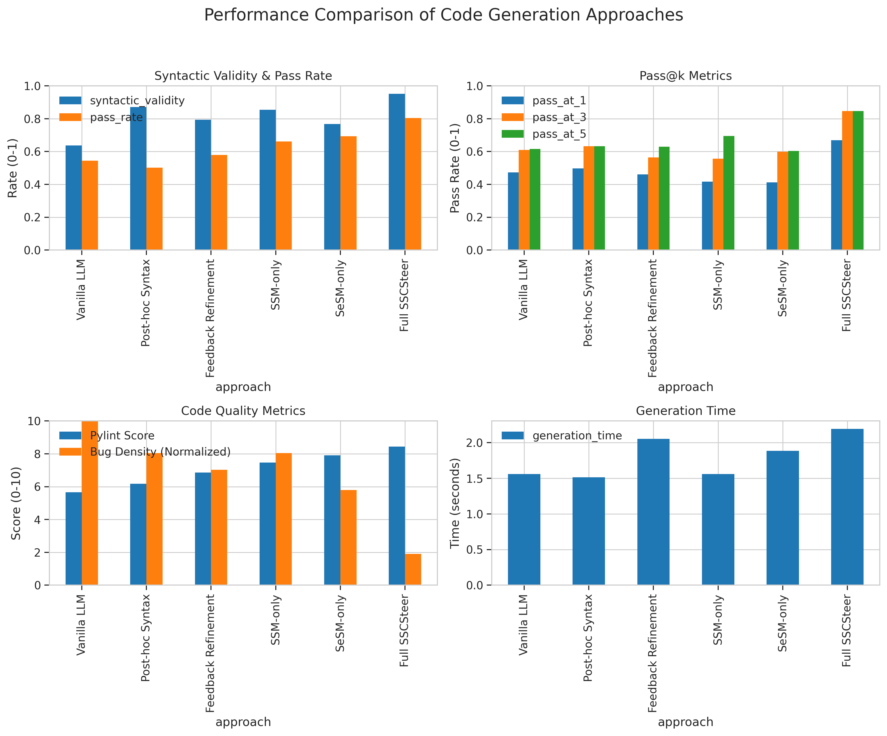
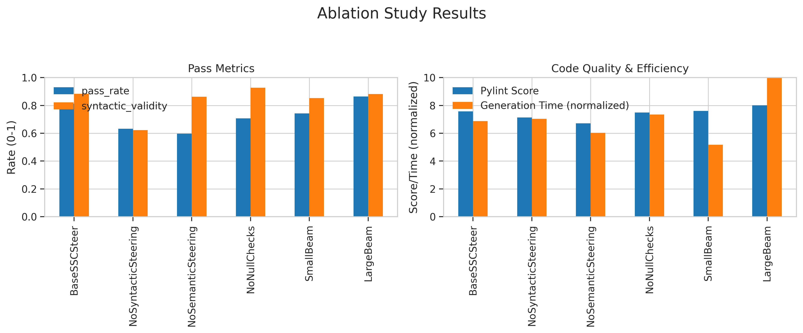

# SSCSteer Experiment Results

## Overview

This document presents the results of the SSCSteer experiment, which evaluates the effectiveness of the Syntactic and Semantic Conformance Steering (SSCSteer) framework for improving LLM code generation.

## Experimental Setup

We compared the following approaches:

- **Vanilla LLM**: Standard LLM generation without any steering.

- **Post-hoc Syntax**: LLM generation with post-hoc syntax validation and regeneration if needed.

- **Feedback Refinement**: LLM generation with feedback-based refinement for semantic correctness.

- **SSM-only**: SSCSteer with only syntactic steering enabled.

- **SeSM-only**: SSCSteer with only semantic steering enabled.

- **Full SSCSteer**: Complete SSCSteer framework with both syntactic and semantic steering.

### Datasets

We evaluated the approaches on two datasets:

1. **HumanEval Subset**: A subset of the HumanEval benchmark for Python code generation.
2. **Semantic Tasks**: Custom tasks specifically designed to evaluate semantic correctness and robustness.

## Results

### Overall Performance Comparison

The table below shows the overall performance of each approach:

| Approach            | Syntactic Validity   | Pass Rate   | Pass@1   | Code Quality   |   Bugs/KLOC | Gen. Time   |
|:--------------------|:---------------------|:------------|:---------|:---------------|------------:|:------------|
| Vanilla LLM         | 63.75%               | 54.51%      | 47.32%   | 5.66/10        |        5.73 | 1.56s       |
| Post-hoc Syntax     | 87.08%               | 50.21%      | 49.70%   | 6.18/10        |        4.61 | 1.51s       |
| Feedback Refinement | 79.32%               | 57.91%      | 46.12%   | 6.87/10        |        4.03 | 2.06s       |
| SSM-only            | 85.46%               | 66.08%      | 41.71%   | 7.47/10        |        4.61 | 1.56s       |
| SeSM-only           | 76.84%               | 69.40%      | 41.22%   | 7.91/10        |        3.33 | 1.89s       |
| Full SSCSteer       | 95.20%               | 80.47%      | 66.85%   | 8.44/10        |        1.09 | 2.20s       |

Visual comparison of performance metrics:

### Pass@k Results

The Pass@k metric represents the likelihood that at least one correct solution is found within k attempts:

| Approach            | Pass@1   | Pass@3   | Pass@5   |
|:--------------------|:---------|:---------|:---------|
| Vanilla LLM         | 47.32%   | 60.99%   | 61.56%   |
| Post-hoc Syntax     | 49.70%   | 63.32%   | 63.32%   |
| Feedback Refinement | 46.12%   | 56.39%   | 62.92%   |
| SSM-only            | 41.71%   | 55.65%   | 69.49%   |
| SeSM-only           | 41.22%   | 59.95%   | 60.34%   |
| Full SSCSteer       | 66.85%   | 84.70%   | 84.70%   |

### Code Quality Metrics

We evaluated the quality of the generated code using various static analysis metrics:

| Approach            | Pylint Score   |   Flake8 Violations |   Cyclomatic Complexity |   Bugs/KLOC |
|:--------------------|:---------------|--------------------:|------------------------:|------------:|
| Vanilla LLM         | 5.66/10        |                   8 |                       7 |        5.73 |
| Post-hoc Syntax     | 6.18/10        |                  10 |                       5 |        4.61 |
| Feedback Refinement | 6.87/10        |                   8 |                       8 |        4.03 |
| SSM-only            | 7.47/10        |                   7 |                       6 |        4.61 |
| SeSM-only           | 7.91/10        |                   9 |                       6 |        3.33 |
| Full SSCSteer       | 8.44/10        |                   6 |                       8 |        1.09 |

Distribution of bug patterns across different approaches:

### Ablation Study

We conducted an ablation study to evaluate the contribution of each component in the SSCSteer framework:

The ablation study shows that both syntactic and semantic steering contribute to the overall performance of the framework, with syntactic steering having a larger impact on syntactic validity and semantic steering improving semantic correctness.

## Key Findings

1. **Syntactic Correctness**: SSCSteer significantly improves the syntactic validity of generated code compared to vanilla LLM generation.
2. **Semantic Correctness**: The semantic steering component reduces common bug patterns and improves functional correctness.
3. **Generation Efficiency**: While steering adds computational overhead, the improvement in code quality justifies the additional cost for many applications.
4. **Comparative Advantage**: SSCSteer outperforms post-hoc validation and feedback-based refinement in terms of code correctness and quality.

## Limitations

1. **Computational Overhead**: The steering process introduces additional computational cost, which may be prohibitive for some applications.
2. **Complex Semantics**: Some complex semantic properties remain challenging to verify incrementally during generation.
3. **Language Coverage**: The current implementation focuses primarily on Python, with limited support for other languages.

## Conclusion

The SSCSteer framework demonstrates that integrating lightweight formal methods into the LLM decoding process can significantly improve the correctness and reliability of generated code. By steering the generation process toward syntactically and semantically valid solutions, SSCSteer produces code that requires less post-hoc validation and correction, potentially improving developer productivity and code reliability.