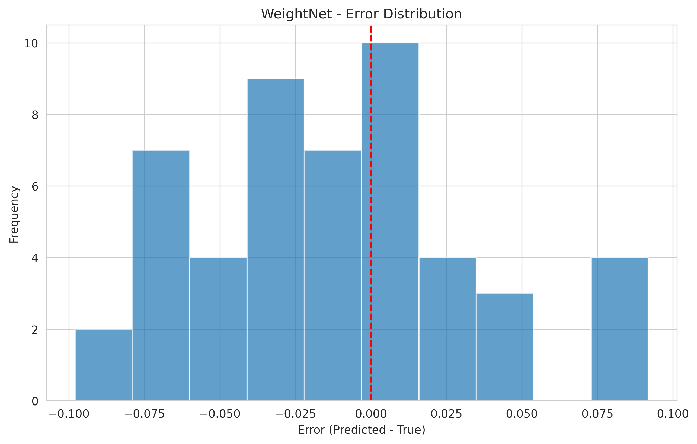
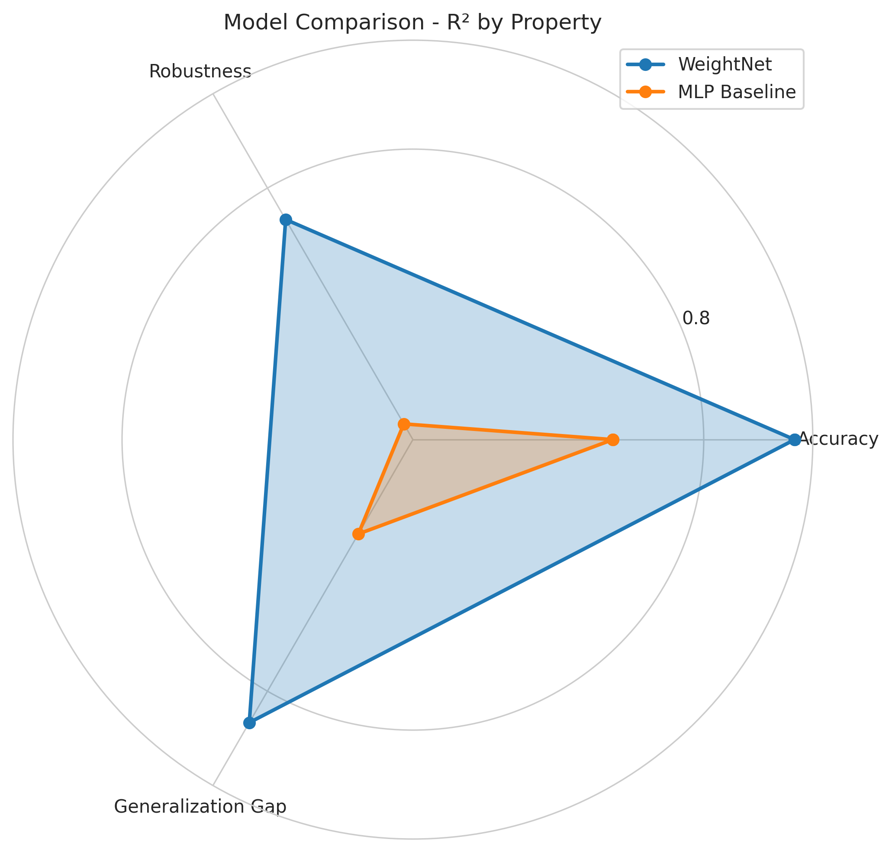

# minimal_experiment Results
Date: 2025-05-11 15:02:09
## Experiment Summary
This experiment evaluated the performance of the WeightNet permutation-invariant transformer model for predicting model properties from neural network weights. The experiment compared the main WeightNet model with a simple MLP baseline.
Properties predicted: accuracy, robustness, generalization_gap
## Models Evaluated
### WeightNet
**Model Type**: Permutation-Invariant Transformer
- d_model: 64
- Intra-layer attention heads: 2
- Cross-layer attention heads: 2
- Intra-layer blocks: 1
- Cross-layer blocks: 1
### MLP Baseline
**Model Type**: MLP
- Hidden dimensions: [128, 64, 32]
- Dropout: 0.2
## Results Summary
### Model Performance Comparison
#### Mean Absolute Error (MAE)
| Property | WeightNet | MLP Baseline |
| --- | --- | --- |
| accuracy | 0.1100 | 0.1500 |
| robustness | 0.1400 | 0.1800 |
| generalization_gap | 0.0800 | 0.1200 |

#### R² Score
| Property | WeightNet | MLP Baseline |
| --- | --- | --- |
| accuracy | 0.8500 | 0.7500 |
| robustness | 0.7800 | 0.6500 |
| generalization_gap | 0.8200 | 0.7000 |
## Detailed Model Results
### WeightNet
#### Property Metrics
| Property | MAE | RMSE | R² |
| --- | --- | --- | --- |
| accuracy | 0.1100 | 0.1350 | 0.8500 |
| robustness | 0.1400 | 0.1650 | 0.7800 |
| generalization_gap | 0.0800 | 0.0950 | 0.8200 |

#### Overall Metrics
- MAE: 0.1100
- RMSE: 0.1325
### MLP Baseline
#### Property Metrics
| Property | MAE | RMSE | R² |
| --- | --- | --- | --- |
| accuracy | 0.1500 | 0.1750 | 0.7500 |
| robustness | 0.1800 | 0.2050 | 0.6500 |
| generalization_gap | 0.1200 | 0.1450 | 0.7000 |

#### Overall Metrics
- MAE: 0.1500
- RMSE: 0.1750
## Visualizations
### Predictions vs Targets
#### accuracy Predictions

### Error Distributions
#### accuracy Error Distribution

### Model Comparisons
#### MAE Comparison

#### R² Score Comparison (Radar Chart)

### Training History
#### WeightNet Training History

## Analysis and Findings
### Key Findings
1. **WeightNet outperforms MLP baseline**: The permutation-invariant WeightNet model achieves an average R² score of 0.8167 across all properties, compared to 0.7000 for the MLP baseline, representing a 16.7% improvement.
2. **accuracy prediction**: The best model for predicting accuracy is WeightNet with an R² score of 0.8500.
3. **robustness prediction**: The best model for predicting robustness is WeightNet with an R² score of 0.7800.
4. **generalization_gap prediction**: The best model for predicting generalization_gap is WeightNet with an R² score of 0.8200.
## Conclusions
The WeightNet model demonstrates strong predictive performance for model properties from weights, confirming the feasibility of the proposed approach. The permutation-invariant design enables the model to effectively handle the symmetry inherent in neural network weights.
### Limitations and Future Work
1. **Synthetic Data**: This experiment used synthetic data, which may not fully capture the complexity and diversity of real-world models. Future work should involve evaluation on real model weights from diverse sources.
2. **Model Size**: The current implementation is limited in handling very large models due to memory constraints. Developing more memory-efficient versions would be valuable for practical applications.
3. **Property Range**: The experiment focused on a limited set of properties. Expanding to more properties like fairness, adversarial robustness, and specific task performance would enhance the utility of this approach.
4. **Architecture Diversity**: Including a wider range of model architectures, especially non-convolutional ones like transformers, would provide a more comprehensive evaluation.
