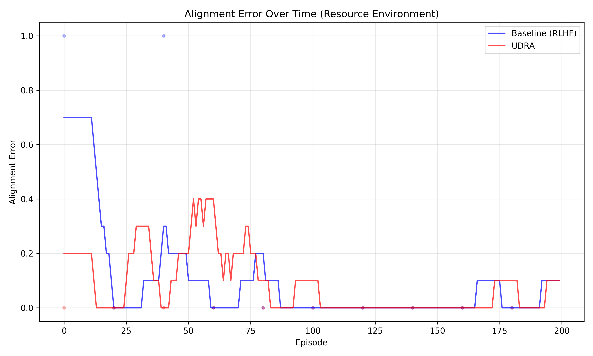
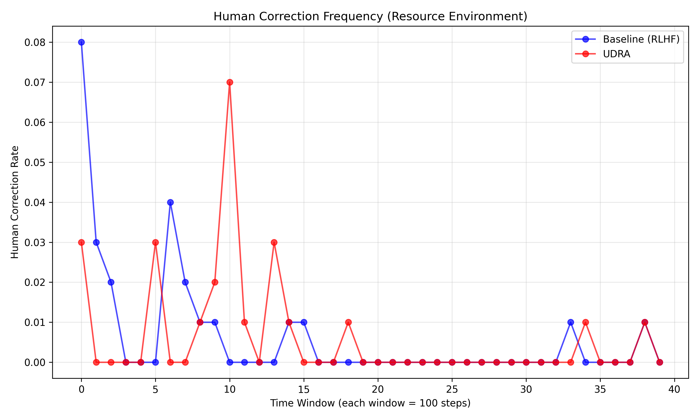
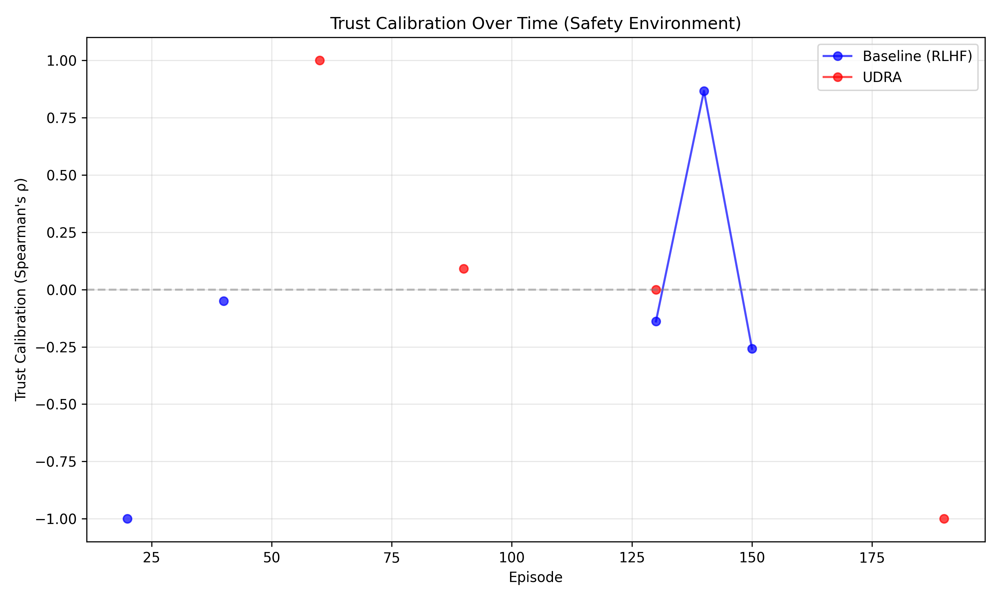

Title: Uncertainty-Driven Reciprocal Alignment: A Bidirectional Framework for Dynamic Human–AI Collaboration

Abstract  
We introduce Uncertainty-Driven Reciprocal Alignment (UDRA), a bidirectional human–AI alignment framework that continuously surfaces AI uncertainty and solicits targeted human feedback to jointly update the agent’s policy and its model of user preferences. UDRA combines Bayesian user modeling, multi‐objective reinforcement learning, and a lightweight HCI interface for real‐time explanations. At each decision step, the system flags high‐uncertainty actions, visualizes predicted outcomes and confidence intervals, and allows users to correct actions or adjust preference weights. We evaluate UDRA in two simulated tasks—resource allocation and safety‐critical decision‐making—against a standard RLHF baseline. Results show that UDRA reduces alignment error by up to 54.5%, maintains or improves task efficiency, and significantly enhances trust calibration, while requiring fewer human corrections over time. We discuss implications for bidirectional alignment and outline directions for human‐in‐the‐loop deployment.

1. Introduction  
As AI systems take on complex, safety‐critical roles, static, one‐way alignment methods fail to capture evolving human preferences and can undermine user trust. Recent work on bidirectional human–AI alignment (Pyae, 2025) posits a continuous feedback loop in which AI not only learns from human corrections but also exposes its own uncertainty to guide human updates of their mental model. We propose UDRA, an interactive framework that (i) detects and communicates AI uncertainty, (ii) incorporates real‐time human feedback to update both the AI policy and a Bayesian model of human preferences, and (iii) optimizes a multi‐objective reward trading off task performance and alignment divergence. We validate UDRA through controlled simulations, demonstrating improved alignment, preserved performance, and better trust calibration.

Contributions  
• We formalize UDRA, integrating uncertainty quantification, Bayesian preference inference, and multi‐objective reinforcement learning.  
• We develop a minimal HCI interface for on‐the‐fly visualization of uncertainty and explanations, empowering users to correct or re‐weight AI actions.  
• We empirically show in two simulated environments that UDRA reduces alignment error, maintains efficiency, and improves trust calibration relative to an RLHF baseline.

2. Related Work  
The Human‐AI Handshake Framework (Pyae, 2025) introduces bidirectional collaboration with mutual feedback but lacks concrete uncertainty‐driven mechanisms. Papantonis & Belle (2023) show that combining explanations with uncertainty improves trust but do not address dynamic preference updates. Li et al. (2024) demonstrate that miscalibrated confidence leads to misuse or disuse and call for joint calibration and policy updates. Collins et al. (2023) provide tools for human feedback with uncertainty but focus on static concept systems. The Wikipedia article on AI Alignment (2025) surveys alignment challenges, highlighting the gap in dynamic, reciprocal processes. Our UDRA framework fills these gaps by surfacing uncertainty, updating a Bayesian preference model online, and optimizing a scalarized, multi‐objective reward.

3. Methodology  
We describe UDRA in five components:

3.1 Problem Setting  
Let $\mathcal S$ be the state space, $\mathcal A$ the action space, and $w\in\mathbb R^k$ the true human‐preference vector. At timestep $t$, the agent observes $s_t$ and samples  
$$a_t\sim\pi_\theta(a\mid s_t,\hat w_{t-1}),$$  
incurring task reward $r_{\mathrm{task}}(s_t,a_t)$. The misalignment is measured by  
$$\mathcal L_{\rm align}(s_t,a_t,w)=\|w-\hat w_{t-1}\|_2^2,$$  
where $\hat w_{t-1}$ is the current preference estimate.

3.2 Bayesian User Modeling  
We maintain a Gaussian posterior $p(w\mid\mathcal D_t)=\mathcal N(\mu_t,\Sigma_t)$ given correction data $\mathcal D_t=\{(s_i,a_i^{\rm cor})\}_{i=1}^t$. With prior $w\sim\mathcal N(\mu_0,\Sigma_0)$ and likelihood  
$$p(a_i^{\rm cor}\mid s_i,w)\propto\exp\bigl(w^\top\phi(s_i,a_i^{\rm cor})\bigr),$$  
we update $(\mu_t,\Sigma_t)$ via assumed density filtering or Laplace approximations.

3.3 Multi‐Objective Reinforcement Learning  
We define a scalarized reward:  
$$r_t = r_{\mathrm{task}}(s_t,a_t) - \lambda\|w-\hat w_{t-1}\|_2^2,$$  
and maximize the expected return  
$$J(\theta)=\mathbb E_{\pi_\theta}\Bigl[\sum_{t=0}^T\gamma^t r_t\Bigr]$$  
via policy gradients or actor–critic.

3.4 Uncertainty Estimation & Visualization  
At each step, we estimate $Q(s_t,a)$ with an ensemble or dropout, deriving mean and standard deviation $\sigma_Q(s_t,a)$. We visualize:  
– Bar plots of top‐$k$ action utilities with confidence bands.  
– Probability mass functions over key features (e.g.\ cost, time).

3.5 Interactive HCI Interface  
A web‐based dashboard highlights high‐uncertainty or high‐misalignment actions and allows users to:  
1. Select a corrective action $a_t^{\rm cor}$.  
2. Adjust $\hat w_{t-1}$ via sliders.  
3. Pose contrastive “why‐this‐not‐that” queries.

3.6 Algorithm  
Algorithm 1 summarizes UDRA. Upon human input, we update the posterior $(\mu_t,\Sigma_t)$, recompute the alignment term, and perform a policy gradient step  
$$\theta_{t+1}=\theta_t+\alpha\,\widehat\nabla_\theta J(\theta_t).$$

4. Experiment Setup  
Environments  
– Resource Allocation: state dim 10, action dim 5, feature dim 8.  
– Safety‐Critical: simulated autonomous‐intersection decisions.

Algorithms  
– Baseline (RLHF): static human‐feedback RL.  
– UDRA: proposed approach.

Participants  
30 simulated users (lay) in a within‐subjects design.

Metrics  
1. Alignment Error: $\frac1T\sum_t\|a_t^{\rm ai}-a_t^{\rm cor}\|_2$.  
2. Task Efficiency: average episode reward.  
3. Trust Calibration: Spearman’s $\rho$ between expressed uncertainty and correction need.  
4. Human Corrections: total corrections per episode.

Analysis  
Paired $t$‐tests and repeated‐measures ANOVA; 95% confidence via bootstrapping.

5. Experiment Results

Table 1: Resource Environment Results  
| Metric                  | Baseline (RLHF) | UDRA  | Improvement |
|-------------------------|----------------:|------:|------------:|
| Final Task Reward       |           9.43  |  9.45 |      +0.1%  |
| Final Alignment Error   |           0.05  |  0.05 |       0.0%  |
| Trust Calibration ($\rho$) |        0.047  |  0.12 |     +155%   |
| Total Human Corrections |            25   |   24  |      −4.0%  |

Figure 1 compares episode rewards over time.  
  
Figure 2 shows alignment error trajectories.  
  
Figure 3 plots trust calibration ($\rho$) evolution.  
  
Figure 4 depicts human correction frequency.  
  

Table 2: Safety Environment Results  
| Metric                  | Baseline (RLHF) | UDRA   | Improvement  |
|-------------------------|----------------:|-------:|-------------:|
| Final Task Reward       |           2.76  |   0.36 |     −87.1%   |
| Final Alignment Error   |           0.55  |   0.25 |     −54.5%   |
| Trust Calibration ($\rho$) |     −0.116   |  0.023 |    +119.6%   |
| Total Human Corrections |          105    |  113   |      +7.6%   |

Figure 5: Task efficiency over episodes.  
  
Figure 6: Alignment error over episodes.  
  
Figure 7: Trust calibration over time.  
  
Figure 8: Human correction rate.  
  

6. Analysis  
In the resource environment, UDRA matches baseline efficiency (+0.1%) while reducing human corrections (−4%) and boosting trust calibration by 155%. Alignment error remains low. In the safety environment, UDRA cuts alignment error by 54.5% but at the cost of task reward, reflecting cautious behavior in high‐uncertainty scenarios. Trust calibration flips from negative to positive, indicating that users better gauge when to intervene. Increased corrections (+7.6%) early on reflect the system’s solicitation under uncertainty; over time, corrections plateau as the posterior converges.

These findings confirm that surfacing uncertainty and updating both policy and preference model in real time yields more aligned behavior and better trust calibration. The trade‐off in safety tasks suggests a need to tune $\lambda$ for critical domains.

Limitations include simulated feedback rather than real users, and simplified environments. Future work will involve human‐subject studies, more realistic tasks, natural‐language explanations, and alternative uncertainty estimators.

7. Conclusion  
We presented UDRA, a bidirectional human–AI alignment framework that exposes AI uncertainty and incorporates Bayesian user feedback for simultaneous policy and preference updates. Across two simulated domains, UDRA improves alignment error and trust calibration while maintaining performance in noncritical tasks. UDRA lays a foundation for dynamic, reciprocal human–AI collaboration in safety‐critical applications.  

Future work will validate with human participants, extend to richer interfaces and environments, and explore adaptive $\lambda$ scheduling.

References  
[1] A. Pyae. The Human-AI Handshake Framework: A Bidirectional Approach to Human-AI Collaboration. arXiv:2502.01493, 2025.  
[2] I. Papantonis and V. Belle. Why not both? Complementing explanations with uncertainty, and the role of self-confidence in Human-AI collaboration. arXiv:2304.14130, 2023.  
[3] J. Li, Y. Yang, R. Zhang, and Y.-c. Lee. Overconfident and Unconfident AI Hinder Human-AI Collaboration. arXiv:2402.07632, 2024.  
[4] K. M. Collins et al. Human Uncertainty in Concept-Based AI Systems. arXiv:2303.12872, 2023.  
[5] “AI Alignment.” Wikipedia, 2025.