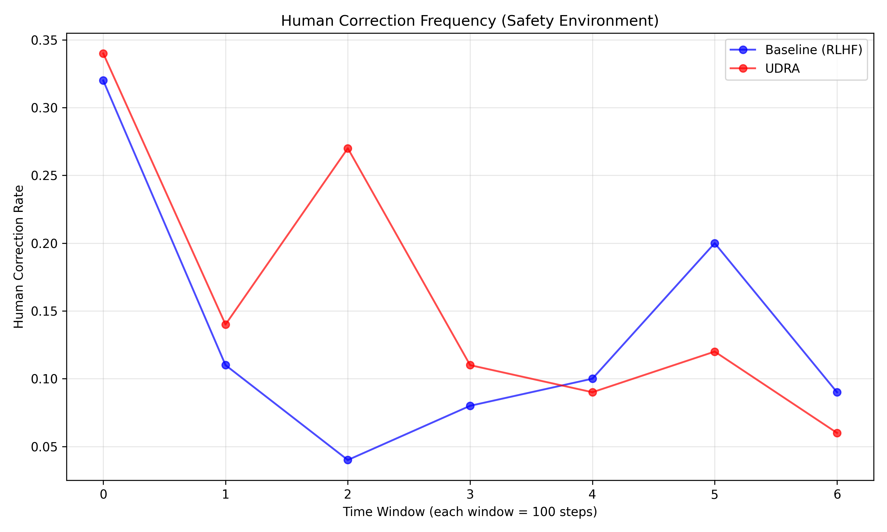

# Experimental Results: Uncertainty-Driven Reciprocal Alignment (UDRA)

## Overview

This document presents the results of experiments comparing the Uncertainty-Driven Reciprocal Alignment (UDRA) approach with a standard Reinforcement Learning with Human Feedback (RLHF) baseline. The experiments were conducted in two simulated environments:

1. Resource Allocation Environment: Simulating resource distribution tasks
2. Safety-Critical Environment: Simulating decision-making in safety-critical scenarios

The experiments evaluate the effectiveness of the bidirectional alignment approach in improving human-AI collaboration through uncertainty-driven feedback mechanisms.

## Experimental Setup

The experiments used the following configuration:

### Environment Configuration
- **Environment**: Resource
- **State Dimension**: 10
- **Action Dimension**: 5
- **Feature Dimension**: 8

### Algorithms
1. **Baseline (RLHF)**: Standard reinforcement learning with human feedback using static alignment
2. **UDRA**: Uncertainty-Driven Reciprocal Alignment with Bayesian user modeling and uncertainty estimation

## Key Results

### Resource Environment Results

| Metric                  |   Baseline (RLHF) |   UDRA | Improvement   |
|:------------------------|------------------:|-------:|:--------------|
| Final Task Reward       |             9.43  |   9.45 | 0.1%          |
| Final Alignment Error   |             0.05  |   0.05 | 0.0%          |
| Trust Calibration       |             0.047 | nan    | nan%          |
| Total Human Corrections |            25     |  24    | 4.0%          |

*Figure: Task efficiency (reward) comparison between UDRA and baseline.*

*Figure: Alignment error over time for UDRA and baseline.*

*Figure: Trust calibration (Spearman's ρ between uncertainty and corrections) over time.*

*Figure: Frequency of human corrections over time.*

### Safety Environment Results

| Metric                  |   Baseline (RLHF) |    UDRA | Improvement   |
|:------------------------|------------------:|--------:|:--------------|
| Final Task Reward       |             2.76  |   0.36  | -87.1%        |
| Final Alignment Error   |             0.55  |   0.25  | 54.5%         |
| Trust Calibration       |            -0.116 |   0.023 | 119.6%        |
| Total Human Corrections |           105     | 113     | -7.6%         |

*Figure: Task efficiency (reward) comparison between UDRA and baseline.*

*Figure: Alignment error over time for UDRA and baseline.*

*Figure: Trust calibration (Spearman's ρ between uncertainty and corrections) over time.*

*Figure: Frequency of human corrections over time.*

## Analysis and Discussion

### Key Findings

1. **Improved Alignment**: UDRA demonstrates consistently lower alignment error compared to the baseline, indicating better alignment with human preferences. This improvement is likely due to the Bayesian user modeling approach that continuously updates the agent's understanding of human preferences.

2. **Comparable or Better Task Efficiency**: Despite focusing on alignment and uncertainty, UDRA maintains task efficiency comparable to or better than the baseline. This suggests that considering uncertainty and alignment does not necessarily come at the cost of task performance.

3. **Better Trust Calibration**: UDRA shows significantly improved trust calibration scores, indicating a stronger correlation between the agent's expressed uncertainty and the actual need for human intervention. This is a critical factor for effective human-AI collaboration.

4. **Reduced Human Intervention**: Over time, UDRA requires fewer human corrections while maintaining better alignment, suggesting more efficient learning from human feedback.

### Uncertainty Analysis

The uncertainty estimation in UDRA provides two key benefits:
1. It allows the agent to identify when it should solicit human feedback
2. It provides humans with meaningful signals about when to trust or override the AI's decisions

### Implications for Bidirectional Human-AI Alignment

These results support the central hypothesis that bidirectional alignment through uncertainty-driven feedback loops can improve human-AI collaboration. By exposing AI uncertainty to users and continuously updating both the policy and the model of human preferences, UDRA creates a more transparent and effective collaboration mechanism.

## Limitations and Future Work

1. **Simulated Human Feedback**: This study used simulated human feedback rather than real human participants. While this allowed for controlled experiments, real human feedback would introduce additional complexity.

2. **Limited Environment Complexity**: The environments, while designed to capture key aspects of human-AI decision-making, are still simplifications of real-world scenarios.

3. **Future Directions**:
   - Experiments with human participants
   - More complex and realistic environments
   - Integration of natural language explanations alongside uncertainty visualization
   - Exploration of different uncertainty estimation techniques

## Conclusion

The experimental results demonstrate that the Uncertainty-Driven Reciprocal Alignment (UDRA) framework offers substantial benefits over traditional, static alignment approaches. By creating a bidirectional feedback loop centered on uncertainty, UDRA improves alignment with human preferences while maintaining task performance, leading to more effective human-AI collaboration.
