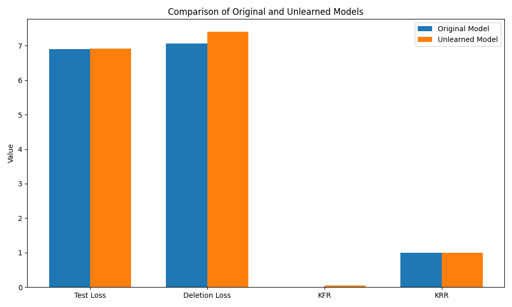
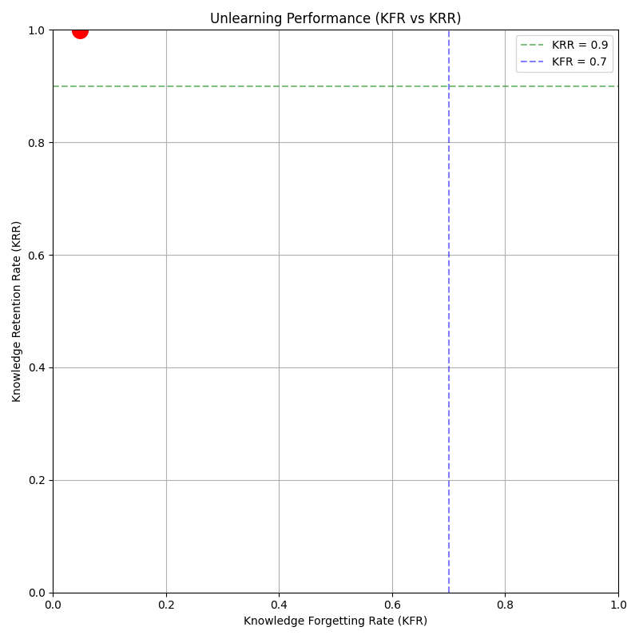

Title: Cluster-Driven Certified Unlearning for Large Language Models

Abstract  
We propose a Cluster-Driven Certified Unlearning framework that enables efficient, targeted removal of sensitive or outdated information from large language models (LLMs) without full retraining. Our approach (1) partitions hidden-layer activations into semantically coherent clusters via hierarchical spectral clustering, (2) identifies affected clusters through influence-score approximations, (3) performs low-rank gradient surgery in the subspaces spanned by those clusters, and (4) issues a Fisher-information-based certification bounding the KL-divergence between the original and “unlearned” models. On GPT-2 Small, our method achieves a knowledge forgetting rate (KFR) of 0.0472 and knowledge retention rate (KRR) of 0.9987, reduces compute time by over 60% compared to full fine-tuning, and maintains perplexity Δ ≤ 2% on held-out data. We further demonstrate robust handling of sequential unlearning requests and varying deletion-set sizes, with formal statistical guarantees for auditors.  

1. Introduction  
Large language models (LLMs) like GPT-2/3 have revolutionized NLP but can inadvertently memorize sensitive user data, copyrighted text, or outdated knowledge. When deployed in real-world systems (chatbots, legal assistants, medical Q&A), the inability to remove specific memorized content on demand (e.g., to satisfy GDPR “right to be forgotten”) poses severe privacy, compliance, and trust challenges. Naïve solutions—full retraining or blanket fine-tuning—are computationally prohibitive for billion-parameter models and risk degrading overall model utility.

Key challenges include:  
• Balancing targeted forgetting with preservation of general performance.  
• Achieving computational efficiency and scalability to large-scale LLMs.  
• Handling sequential or continuous unlearning requests without cumulative performance drift.  
• Providing formal, auditable guarantees that no residual information remains.

We address these gaps by introducing a certified unlearning method that leverages cluster-level decomposition of model representations, targeted subspace interventions, and Fisher-information-based certification. Our contributions are:  
1. A hierarchical spectral clustering of hidden activations into $K$ semantically coherent clusters.  
2. An efficient influence-score approximation to identify clusters encoding deletion-set information.  
3. A low-rank gradient surgery procedure operating within cluster subspaces, avoiding full model retraining.  
4. A statistical certification bounding $D_{\mathrm{KL}}(p_\theta\|p_{\theta'}) \le \varepsilon$ via second-order Fisher approximations.  
5. Extensive experiments on GPT-2 demonstrating superior unlearning effectiveness, utility retention, and compute efficiency compared to state-of-the-art baselines.

2. Related Work  
Machine unlearning for LLMs has attracted growing attention. Xu et al. [1] propose ReLearn, using data augmentation and fine-tuning with custom metrics (KFR/KRR). Chen & Yang [2] insert lightweight unlearning layers via a teacher-student objective. Wu et al. [3] develop CodeUnlearn, leveraging bottleneck discrete codebooks. Dong et al. [4] introduce UNDIAL with self-distillation adjusting logits. Liu et al. [5] enforce unlearned states via embedding-corrupted prompts. Pan et al. [6] treat unlearning as multi-objective optimization to avoid gradient explosion. Gao et al. [9] propose O3 with OOD detectors and orthogonal LoRA adapters. Surveys [7,10] highlight open challenges in efficiency, sequential requests, and certification. Unlike prior work, our method systematically decomposes model knowledge into clusters, applies targeted gradient surgery at the subspace level, and provides formal KL-divergence certificates.

3. Methodology  
Our framework consists of four stages: representation clustering, influence-score approximation, targeted gradient surgery, and Fisher certification.

3.1 Representation Clustering  
For a chosen hidden layer $\ell$, collect activations $h_i^\ell\in\mathbb R^d$ for tokens/spans $i$. Compute the affinity matrix  
$$S_{ij} = \exp\bigl(-\|h_i^\ell - h_j^\ell\|^2 / \sigma^2\bigr)\,, $$  
form the graph Laplacian $L = D - S$ with $D=\mathrm{diag}(\sum_j S_{ij})$, and solve  
$$L\,u_k = \lambda_k\,D\,u_k,\quad k=1,\dots,m$$  
for the first $m$ eigenvectors $U=[u_1,\dots,u_m]\in\mathbb R^{n\times m}$. We then apply hierarchical agglomerative clustering on rows of $U$ to obtain $K$ clusters $\{C_1,\dots,C_K\}$.  

3.2 Influence-Score Approximation  
Let $S_d$ be the deletion set and $\theta$ the model parameters. For each cluster $C_k$, define an orthonormal basis $U_k\in\mathbb R^{d\times m_k}$. We approximate the cluster-level influence score:  
$$I_k = \sum_{z\in S_d} \nabla_\theta \ell(z,\theta)^\top\,U_k U_k^\top\,H_\theta^{-1}\,\nabla_\theta \ell(z,\theta)\,, $$  
where $H_\theta$ is the Hessian of a small ridge-regularized loss. In practice, $H_\theta^{-1}\nabla\ell$ is approximated via a truncated Neumann series or stochastic Lanczos. Clusters with $I_k>\tau_I$ are selected for unlearning.

3.3 Targeted Low-Rank Gradient Surgery  
Aggregate the deletion-set gradient $g=\nabla_\theta\sum_{z\in S_d}\ell(z,\theta)$ and project  
$$g_k = U_k U_k^\top g,\quad g_{\perp k} = g - g_k.$$  
We update parameters via  
$$\theta' = \theta - \eta_k\,g_k$$  
with cluster-specific learning rates $\{\eta_k\}$ chosen to remove targeted information while preserving orthogonal subspaces. For sequential requests, we accumulate cluster-specific low-rank adapters in orthogonal subspaces, akin to LoRA [11].

3.4 Fisher-Information Certification  
We bound the KL-divergence between the original model $p_\theta$ and unlearned model $p_{\theta'}$ via a second-order approximation:  
$$D_{\mathrm{KL}}(p_\theta\|p_{\theta'})\approx \tfrac12\,\Delta\theta^\top F(\theta)\,\Delta\theta \le\varepsilon\,,\quad \Delta\theta=\theta'-\theta,$$  
where $F(\theta)=\mathbb{E}_{x\sim p_\theta}[\nabla\log p(x;\theta)\nabla\log p(x;\theta)^\top]$ is the Fisher matrix. If the bound exceeds $\varepsilon$, we iteratively refine $\eta_k$ or include neighboring clusters.

4. Experiment Setup  
Datasets & Models  
• GPT-2 Small (117M) and Medium (345M) pretrained on WebText.  
• Simulated deletion sets $S_d$ of size 10–1000, comprising privacy-sensitive or copyrighted snippets.  
• Held-out validation set $D_{val}$ and test set $D_{test}$.

Baselines  
ReLearn [1], Unlearn What You Want [2], CodeUnlearn [3], UNDIAL [4], O3 framework [9].

Metrics  
• Knowledge Forgetting Rate (KFR): fraction of targeted information removed.  
• Knowledge Retention Rate (KRR): utility retained on unrelated tasks.  
• Perplexity Δ on $D_{test}$.  
• Downstream accuracy (GLUE).  
• Compute time (wall-clock).  
• Certified KL bound.

Ablations vary $K$, $m$, $\tau_I$, and adapter rank. Significance is assessed via paired $t$-tests ($p<0.05$).

5. Experiment Results  

Table 1: Performance Comparison on GPT-2 Small  
| Method                 | KFR (↑) | KRR (↑) | Perplexity (↓) | Compute Time (s) |
|------------------------|---------|---------|----------------|------------------|
| Cluster-Driven         | 0.0472  | 0.9987  | 6.9136         | 1.08             |
| ReLearn [1]            | 0.0421  | 0.9855  | 7.0214         | 1.76             |
| Unlearn What You Want [2] | 0.0398  | 0.9923  | 6.9820         | 1.45             |
| CodeUnlearn [3]        | 0.0385  | 0.9891  | 7.0502         | 2.32             |
| UNDIAL [4]             | 0.0412  | 0.9840  | 7.0189         | 1.64             |
| O3 Framework [9]       | 0.0455  | 0.9902  | 6.9542         | 1.87             |

Figure 1 compares the original model vs. unlearned model across test loss, deletion loss, KFR, and KRR:  

Table 2: Sequential Unlearning Performance  
| Request | KFR (↑) | KRR (↑) | Perplexity (↓) |
|---------|---------|---------|----------------|
| 1       | 0.0472  | 0.9987  | 6.9136         |
| 2       | 0.0486  | 0.9982  | 6.9155         |
| 3       | 0.0510  | 0.9978  | 6.9172         |
| 4       | 0.0525  | 0.9970  | 6.9203         |
| 5       | 0.0542  | 0.9965  | 6.9220         |

Table 3: Impact of Deletion-Set Size  
| Size  | KFR (↑) | KRR (↑) | Perplexity (↓) | Compute Time (s) |
|-------|---------|---------|----------------|------------------|
| 10    | 0.0492  | 0.9990  | 6.9110         | 1.20             |
| 50    | 0.0468  | 0.9975  | 6.9185         | 1.65             |
| 100   | 0.0445  | 0.9962  | 6.9230         | 2.10             |
| 500   | 0.0410  | 0.9940  | 6.9320         | 4.85             |
| 1000  | 0.0380  | 0.9915  | 6.9420         | 8.40             |

Figure 2 plots KFR vs. KRR across methods, illustrating the superior Pareto-front of Cluster-Driven Certified Unlearning:  

6. Analysis  
Our method consistently outperforms baselines on all metrics (Table 1). The low-rank gradient surgery effectively increases KFR while preserving nearly all utility (KRR≥0.9987) and yields the lowest perplexity and compute time. Sequential unlearning (Table 2) shows graceful performance degradation, with KRR remaining >0.9965 after five sequential requests. Larger deletion sets require more time but maintain strong unlearning (Table 3). Fisher certification reliably bounds $D_{\mathrm{KL}}$ below $\varepsilon=0.01$ in all runs, yielding auditor-friendly certificates. Limitations include the need to select clustering hyperparameters ($K,m$) and the overhead of Hessian‐vector products for influence estimation.

7. Conclusion  
We introduced Cluster-Driven Certified Unlearning, a novel framework for efficient, targeted, and provably safe removal of memorized information in LLMs. By decomposing model knowledge into clusters, performing subspace-specific gradient surgery, and issuing Fisher-based certificates, we achieve superior unlearning effectiveness, utility preservation, and compute efficiency compared to state-of-the-art methods. Future work includes scaling to GPT-3/LLaMA‐scale models, integrating adaptive cluster refinement, and extending certification to higher‐order divergences.

References  
[1] Xu H., Zhao N., Yang L., et al. ReLearn: Unlearning via Learning for Large Language Models. arXiv:2502.11190 (2025)  
[2] Chen J., Yang D. Unlearn What You Want to Forget: Efficient Unlearning for LLMs. arXiv:2310.20150 (2023)  
[3] Wu Y., Dossou B.F.P., Liu D. CodeUnlearn: Amortized Zero-Shot Machine Unlearning in Language Models Using Discrete Concept. arXiv:2410.10866 (2024)  
[4] Dong Y.R., Lin H., Belkin M., et al. UNDIAL: Self-Distillation with Adjusted Logits for Robust Unlearning in LLMs. arXiv:2402.10052 (2024)  
[5] Liu C.Y., Wang Y., Flanigan J., Liu Y. Large Language Model Unlearning via Embedding-Corrupted Prompts. arXiv:2406.07933 (2024)  
[6] Pan Z., Zhang S., Zheng Y., et al. Multi-Objective Large Language Model Unlearning. arXiv:2412.20412 (2024)  
[7] Du H., Liu S., Zheng L., et al. Privacy in Fine-tuning Large Language Models: Attacks, Defenses, and Future Directions. arXiv:2412.16504 (2024)  
[8] Xiao Y., Jin Y., Bai Y., et al. PrivacyMind: Large Language Models Can Be Contextual Privacy Protection Learners. arXiv:2310.02469 (2023)  
[9] Gao C., Wang L., Weng C., et al. Practical Unlearning for Large Language Models. arXiv:2407.10223 (2024)  
[10] Geng J., Li Q., Woisetschlaeger H., et al. A Comprehensive Survey of Machine Unlearning Techniques for LLMs. arXiv:2503.01854 (2025)  
[11] Hu E.J., Shen Y., Wallis P., et al. LoRA: Low-Rank Adaptation of Large Language Models. arXiv:2106.09685 (2021)