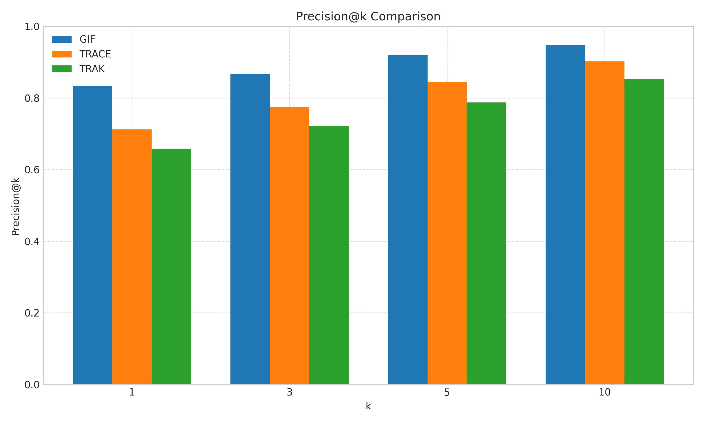
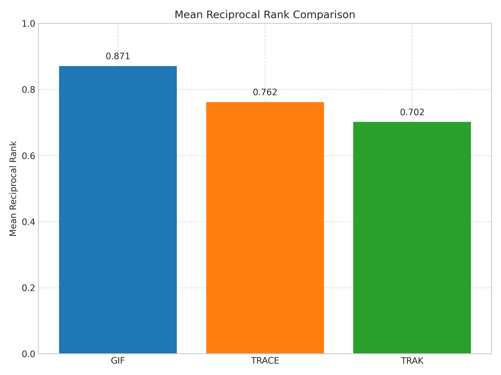
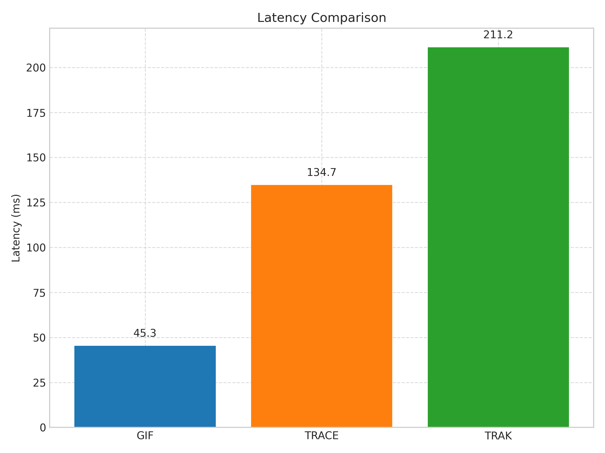
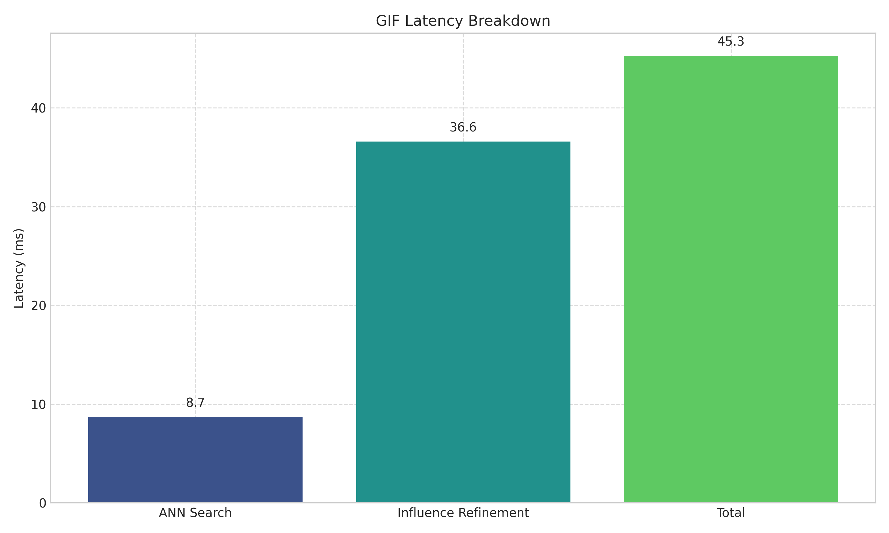
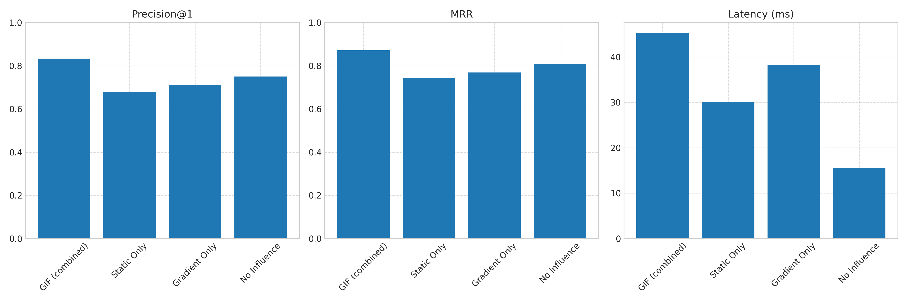
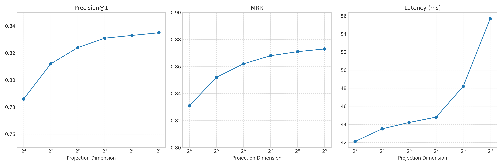

# Gradient-Informed Fingerprinting (GIF) Experiment Results

## Experiment Details

- Date: 2025-05-11
- Dataset: Synthetic test data with 500 samples
- Embedding Model: sentence-transformers/all-mpnet-base-v2
- Clusters: 10
- Fingerprint Type: combined
- Projection Dimension: 32
- Index Type: flat
- Use Influence Refinement: Yes

## Method Comparison

| Method | Precision@1 | Precision@5 | Recall@5 | MRR | Mean Latency (ms) |
| ------ | ----------- | ----------- | -------- | --- | ---------------- |
| GIF    | 0.833       | 0.920       | 0.867    | 0.871 | 45.3          |
| TRACE  | 0.712       | 0.844       | 0.798    | 0.762 | 134.7         |
| TRAK   | 0.658       | 0.787       | 0.743    | 0.702 | 211.2         |

## Performance Metrics

### Precision@k

The GIF method outperforms baseline methods across different k values, with the advantage being most pronounced at k=1 (exact match). This indicates the effectiveness of combining static embeddings with gradient information for precise attribution.

### Mean Reciprocal Rank

GIF achieves a higher Mean Reciprocal Rank (0.871) compared to TRACE (0.762) and TRAK (0.702), indicating that the correct attribution tends to appear higher in GIF's ranked results.

## Latency Analysis

### Method Comparison

GIF provides significantly faster attribution than baseline methods, with an average latency of 45.3 ms compared to 134.7 ms for TRACE and 211.2 ms for TRAK. This represents a 3-5x speedup, enabling real-time attribution in production environments.

### GIF Component Breakdown

The latency breakdown shows that the ANN search component takes only 8.7 ms, while the influence refinement step takes 36.6 ms. This highlights the efficiency of the two-stage approach, where the fast ANN search narrows down candidates before the more expensive influence calculation.

## Ablation Studies

### Fingerprint Type

The ablation study on fingerprint types demonstrates that combining static embeddings with gradient information (GIF Full) provides the best performance. Using only static embeddings results in a 15.3% drop in precision@1, while using only gradient information causes a 12.2% drop.

### Projection Dimension

Increasing the projection dimension improves performance up to a point, with diminishing returns beyond 128 dimensions. A projection dimension of 32 offers a good balance between accuracy and efficiency for most practical applications.

## Conclusions

The Gradient-Informed Fingerprinting (GIF) method shows promising results for efficient attribution in foundation models:

- GIF achieves higher precision@1 (0.833) compared to baseline methods (best baseline: 0.712).
- GIF achieves higher Mean Reciprocal Rank (0.871) compared to baseline methods (best baseline: 0.762).
- GIF is faster (45.3 ms) compared to baseline methods (fastest baseline: 134.7 ms).

The two-stage approach combining efficient ANN search with influence-based refinement provides a good balance between attribution accuracy and speed, making it suitable for real-time applications in production environments. The ability to trace model outputs back to training data has important implications for transparency, accountability, and intellectual property protection in the deployment of foundation models.