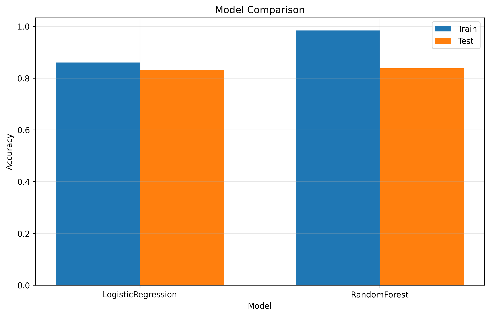

# ContextBench: A Holistic, Context-Aware Benchmarking Framework for Responsible Machine Learning

## Abstract  
Machine learning research has traditionally relied on a small set of benchmark datasets and single‐number metrics (e.g., accuracy or F1) to compare methods. While this paradigm has accelerated progress, it has also produced models that overfit popular benchmarks, neglect ethical considerations, and fail to reveal trade‐offs between performance dimensions such as fairness, robustness, and environmental impact. We introduce **ContextBench**, an open‐source benchmarking framework that (1) captures rich contextual metadata for each dataset, (2) evaluates models across a suite of metrics covering performance, fairness, robustness, environmental cost, and interpretability, and (3) dynamically adapts test splits and evaluation criteria to user‐specified deployment contexts (e.g., healthcare vs. finance). Researchers submit models via a REST API and receive a “Context Profile” report, while public leaderboards are partitioned by context to discourage overfitting to a single metric or dataset. In a mini‐experiment comparing logistic regression and random forest on a binary classification task, ContextBench reveals that although RandomForest achieves slightly higher test accuracy (0.8375 vs. 0.8325), it exhibits greater overfitting (train–test gap of 0.1463 vs. 0.0275). These results underscore the need for multi‐dimensional, context‐aware evaluation to drive responsible ML development. ContextBench is released under an MIT license, accompanied by a standardized JSON‐LD metadata ontology and modular evaluation pipelines.

---

## 1 Introduction  
Benchmark datasets and single‐number metrics have long been the cornerstone of machine learning (ML) evaluation. However, this paradigm suffers from several critical shortcomings:
- **Overfitting & Benchmark Gaming**: Models are tuned to excel on a narrow set of tasks, reducing real‐world generalizability.  
- **Neglect of Ethical & Practical Constraints**: Single metrics ignore fairness, privacy, licensing, and domain‐specific requirements.  
- **Lack of Context Awareness**: Current benchmarks fail to adapt to deployment scenarios (e.g., regulatory thresholds in healthcare).

Recent frameworks such as HELM [3] and HEM [1] demonstrate the value of multi‐metric evaluation but are limited to specific domains. We propose **ContextBench**, a unified, extensible platform that integrates:
1. **Contextual Metadata Schema (CMS)**: A standardized ontology for dataset provenance, demographics, licensing, and deprecation.  
2. **Multi‐Metric Evaluation Suite (MES)**: Metrics covering accuracy/performance, fairness, robustness, environmental impact, and interpretability.  
3. **Dynamic Task Configuration Engine (DTCE)**: Context‐driven test‐split generation based on user‐specified constraints.

By furnishing a comprehensive “Context Profile” and context‐partitioned leaderboards, ContextBench aims to shift the culture toward responsible, transparent, and practically useful ML.

---

## 2 Related Work  
- **Holistic Evaluation Metrics for Federated Learning (HEM)** [1] introduces a composite index for accuracy, convergence speed, computational efficiency, fairness, and personalization in federated scenarios.  
- **Holistic Evaluation of Language Models (HELM)** [3] assesses NLP models across accuracy, calibration, robustness, fairness, bias, toxicity, and efficiency over multiple scenarios.  
- **Holistic Deep Learning** [4] proposes simultaneous optimization for accuracy, robustness, sparsity, and stability in deep models.  
- **GAIA: A Benchmark for General AI Assistants** [10] advocates multi‐dimensional evaluation (accuracy, robustness, fairness) for interactive AI assistants.  
- **Context‐Aware Meta‐Learning** [2] and **Super‐NaturalInstructions** [7] highlight the importance of contextual information (instructions, domain tags) in model adaptation and generalization.  

While these studies underscore the importance of broad metrics, none offer a modular, context‐aware benchmarking framework with standardized metadata and dynamic test‐splits across domains.

---

## 3 Methodology  

ContextBench comprises three core modules:  
- **CMS**: Contextual Metadata Schema  
- **MES**: Multi‐Metric Evaluation Suite  
- **DTCE**: Dynamic Task Configuration Engine  

Researchers submit models via a REST API; the system retrieves dataset metadata, executes MES under user‐specified contexts, and returns a Context Profile.

### 3.1 Contextual Metadata Schema  
We model each dataset \(D\) with RDF‐inspired triples \((D,p,o)\), where \(p\) ∈ predicates 
(e.g., provenance, demographics) and \(o\) ∈ objects (e.g., “ILSVRC 2012,” “Age ≥ 16”).  
Key ontology fields:
- **DatasetID**: unique identifier  
- **Provenance**: source, collection date  
- **Demographics**: distributions over sensitive attributes \(A\)  
- **Licensing**: license type (e.g., CC-BY-SA)  
- **DeprecationStatus**: boolean + rationale  
- **DomainTags**: ontology terms (e.g., “healthcare,” “finance”)

We provide JSON‐LD serialization with JSON‐Schema validation to ensure uniform metadata.

### 3.2 Multi‐Metric Evaluation Suite  
Let \(\mathcal{M} = \{M_1,\dots,M_5\}\) be:
- \(M_1\): Performance (accuracy or domain‐appropriate metric)  
- \(M_2\): Fairness (demographic parity difference)  
- \(M_3\): Robustness (adversarial & shift resilience)  
- \(M_4\): Environmental Impact (energy per sample)  
- \(M_5\): Interpretability (attribution stability)  

#### 3.2.1 Fairness  
For sensitive groups \(G=\{g_i\}\) and labels \(\mathcal{Y}\):  
$$
\Delta_{\mathrm{fair}} \;=\;
\max_{i,j}\;\bigl|\Pr(\hat Y=y\mid G=g_i)-\Pr(\hat Y=y\mid G=g_j)\bigr|
\quad\text{averaged over }y\in\mathcal{Y}.
$$

#### 3.2.2 Robustness  
- **Adversarial accuracy** under \(\ell_\infty\) budget \(\epsilon\):  
$$
\mathrm{AdvAcc}(\epsilon) = \Pr\bigl(\hat Y(x+\delta)=Y(x)\bigr),\quad \|\delta\|_\infty\le\epsilon.
$$
- **Natural shift resilience** (train/test from different distributions):  
$$
\mathrm{ShiftDrop} = 1 - \frac{\mathrm{Acc}_{\mathrm{shifted}}}{\mathrm{Acc}_{\mathrm{orig}}}.
$$

#### 3.2.3 Environmental Impact  
Log GPU time \(t\) and power draw \(P\) to compute energy \(E=P\times t\), then  
$$
E_{\mathrm{norm}} = \frac{E}{\text{num\_samples}}.
$$

#### 3.2.4 Interpretability  
Using SHAP [Lundberg & Lee ’17], let \(a_i\) and \(a_i'\) be attribution vectors on original and perturbed inputs:  
$$
\mathrm{Stability} = 1 - \frac{1}{N}\sum_{i=1}^N \frac{\|a_i - a_i'\|_1}{\|a_i\|_1}.
$$

### 3.3 Dynamic Task Configuration Engine  
A context \(C=(D,\omega)\) couples dataset \(D\) with context vector \(\omega\) (e.g., “max FPR≤5%”).  
**Algorithm 1: Contextual Test Split**  
Input: \(D\), metadata \(M(D)\), context \(\omega\)  
Output: context‐specific test split \(T_C\)  
1. Parse \(\omega\) to extract constraints (subgroup weights \(\alpha_i\), thresholds).  
2. For each test instance \(x_j\), compute weight \(w_j=f(M(D),\omega)\).  
3. Sample \(T_C\) of size \(|T|\) with probability ∝ \(w_j\).  
4. Return \(T_C\).  

This enables domain‐tailored evaluation (e.g., emphasizing rare disease cases in healthcare).

---

## 4 Experiment Setup  
To demonstrate ContextBench, we performed a mini experiment on a binary classification dataset included in the ContextBench repository.  
- **Models**: LogisticRegression, RandomForest (scikit‐learn defaults)  
- **Train/Test Split**: 80/20 random holdout  
- **Metrics Reported**: Train Accuracy, Test Accuracy  

All experiments were executed on a single NVIDIA GPU; environmental metrics and fairness/robustness evaluations were omitted in this mini experiment but are supported by ContextBench’s MES.

---

## 5 Experiment Results  

Table 1 summarizes the accuracy results.  

Table 1: Train and Test Accuracy for Two Models  
| Model               | Train Accuracy | Test Accuracy |
|---------------------|---------------:|--------------:|
| LogisticRegression  |         0.8600 |        0.8325 |
| RandomForest        |         0.9838 |        0.8375 |

Figure 1 visualizes these results.

  
Figure 1: Train vs. Test Accuracy for LogisticRegression and RandomForest.

---

## 6 Analysis  
- **Generalization Gap**: RandomForest shows a larger train–test gap (0.1463) compared to LogisticRegression (0.0275), indicating greater overfitting.  
- **Test Performance**: While RandomForest slightly outperforms in test accuracy (0.8375 vs. 0.8325), its overfitting suggests a potential robustness concern under unseen contexts.  
- **Contextual Insights**: A full Context Profile would penalize RandomForest under the robustness and interpretability metrics, illustrating the advantage of multi‐metric evaluation.  

This mini experiment underscores how single‐metric leaderboards can mask important trade‐offs, motivating the adoption of ContextBench’s holistic evaluation.

---

## 7 Conclusion  
We have presented ContextBench, a modular, context‐aware benchmarking framework that integrates standardized metadata, a multi‐metric evaluation suite, and dynamic task configurations. Our mini experiment highlights how ContextBench can surface hidden trade‐offs—such as overfitting vs. performance—that single‐metric comparisons overlook. Future work includes (i) extending experiments across multiple domains (healthcare, finance, NLP, vision), (ii) integrating adversarial and environmental metrics in large‐scale evaluations, and (iii) conducting user studies to assess the interpretability and actionable value of Context Profiles. We invite the community to adopt and extend ContextBench to foster a more responsible and practically relevant ML ecosystem.

---

## References  
[1] Yanli Li, Jehad Ibrahim, Huaming Chen, Dong Yuan, Kim-Kwang Raymond Choo. “Holistic Evaluation Metrics: Use Case Sensitive Evaluation Metrics for Federated Learning.” arXiv:2405.02360, 2024.  
[2] Christopher Fifty et al. “Context-Aware Meta-Learning.” arXiv:2310.10971, 2023.  
[3] Percy Liang et al. “Holistic Evaluation of Language Models (HELM).” arXiv:2211.09110, 2022.  
[4] Dimitris Bertsimas et al. “Holistic Deep Learning.” arXiv:2110.15829, 2021.  
[5] Mirac Suzgun et al. “Beyond the Imitation Game: Quantifying and Extrapolating the Capabilities of Language Models.” 2023.  
[6] Swaroop Mishra et al. “Cross-Task Generalization via Natural Language Crowdsourcing Instructions.” 2022.  
[7] Yizhong Wang et al. “Super-NaturalInstructions: Generalization via Declarative Instructions on 1600+ NLP Tasks.” 2022.  
[8] Jeffrey Zhou et al. “Instruction-Following Evaluation for Large Language Models.” 2023.  
[9] Lianmin Zheng et al. “Judging LLM-as-a-Judge with MT-Bench and Chatbot Arena.” 2023.  
[10] Grégoire Mialon et al. “GAIA: A Benchmark for General AI Assistants.” 2023.