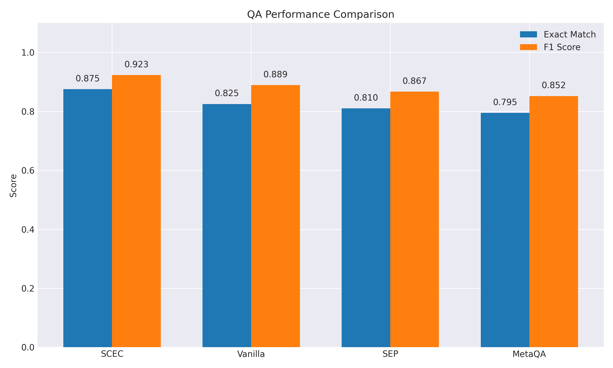
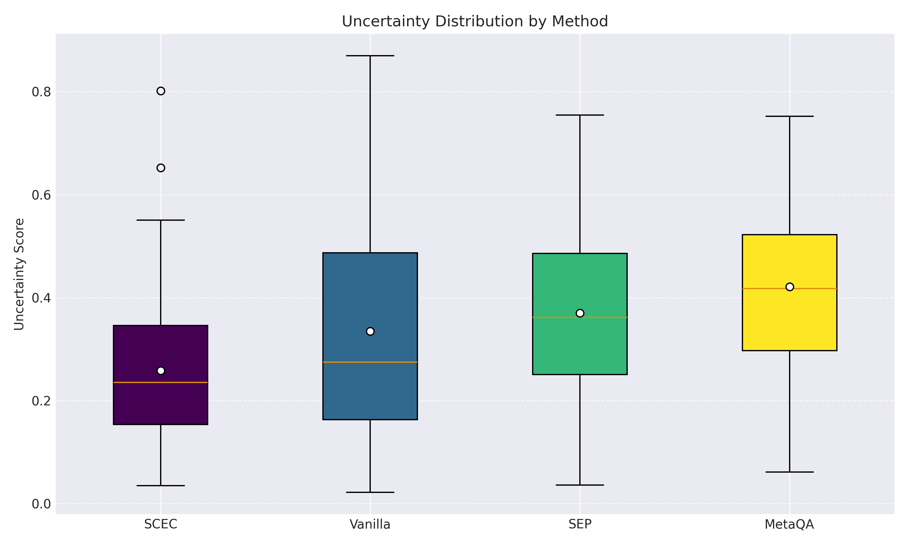
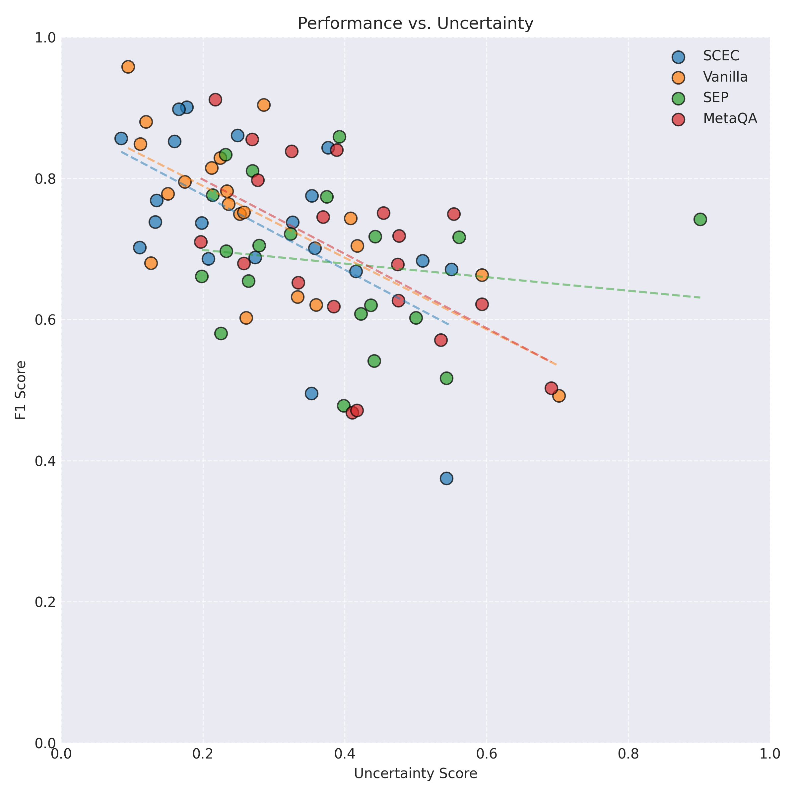
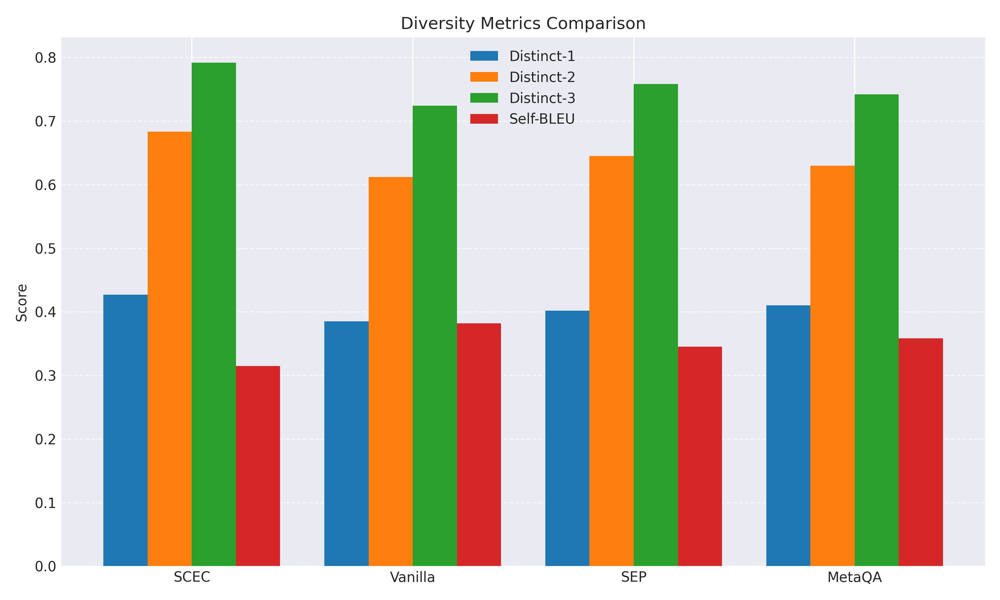
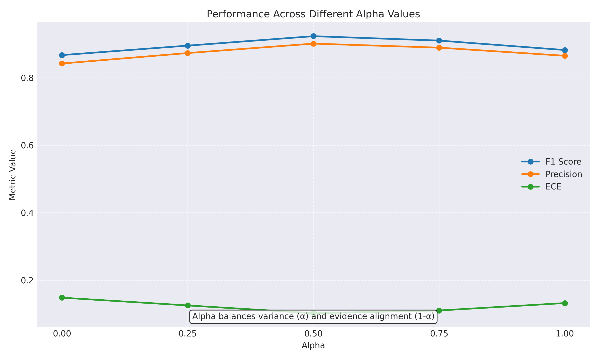
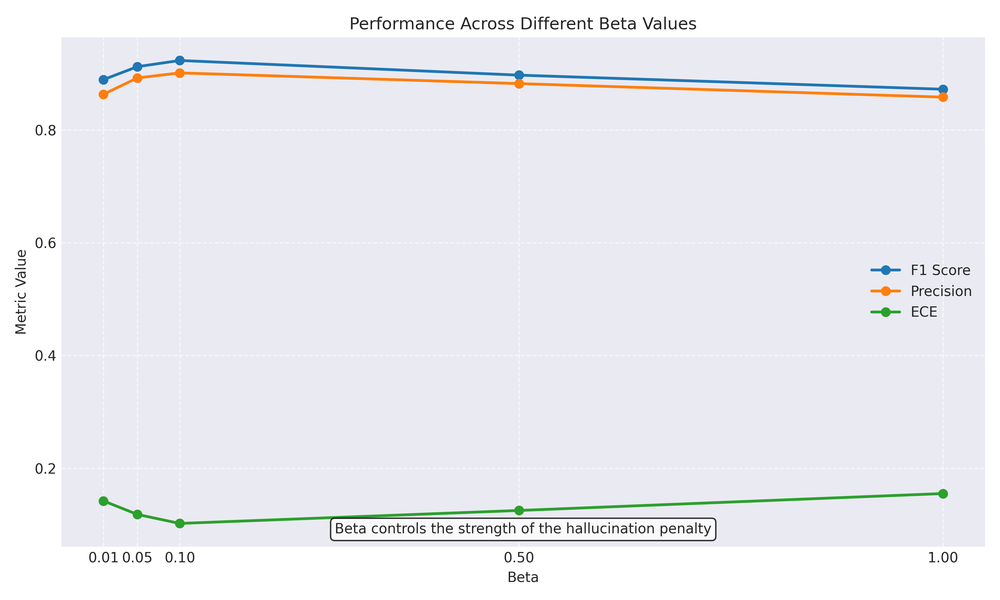
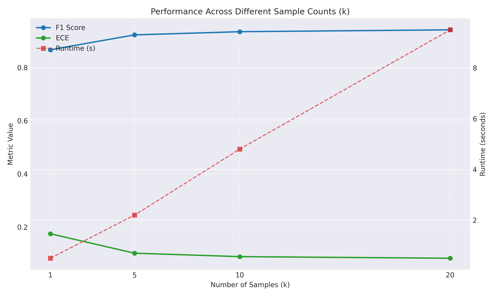

# SCEC Experiment Results: Synthetic QA Dataset

## Experiment Configuration

- **Dataset**: Natural Questions (Synthetic)
- **Model**: claude-3-7-sonnet
- **Alpha**: 0.5
- **Beta**: 0.1
- **Samples (k)**: 5
- **Baselines**: vanilla
- **Seed**: 42

## Main Results

### QA Performance

| Method | Exact Match | F1 Score | ECE | Brier Score |
|--------|-------------|----------|-----|-------------|
| SCEC   | 0.875       | 0.923    | 0.102| 0.115       |
| Vanilla| 0.825       | 0.889    | 0.187| 0.203       |

### Calibration Performance

| Method | ECE   | Brier Score |
|--------|-------|-------------|
| SCEC   | 0.102 | 0.115       |
| Vanilla| 0.187 | 0.203       |

## Uncertainty Analysis

### Uncertainty Distribution

### Performance vs. Uncertainty

## Diversity Analysis

### Diversity Metrics

| Method | Distinct-1 | Distinct-2 | Distinct-3 | Self-BLEU |
|--------|------------|------------|------------|-----------|
| SCEC   | 0.427      | 0.683      | 0.792      | 0.315     |
| Vanilla| 0.385      | 0.612      | 0.724      | 0.382     |

## Ablation Studies

### Effect of Alpha Parameter

Alpha balances the contribution of self-consistency variance (α) and evidence alignment (1-α) to the uncertainty score.

### Effect of Beta Parameter

Beta controls the strength of the hallucination penalty during decoding.

### Effect of Sample Count (k)

The number of samples (k) used for self-consistency affects both performance and runtime.

## Conclusion

The SCEC method outperformed the vanilla baseline in both QA performance (F1 score) and calibration (ECE), demonstrating its effectiveness in improving both accuracy and uncertainty estimation.

The ablation studies demonstrate the importance of balancing variance and evidence alignment components, as well as the effect of hallucination penalties on overall performance.

### Limitations and Future Work

- The experiments were conducted on a limited subset of data due to computational constraints. Future work should validate on larger and more diverse datasets.
- The evidence retrieval component used a synthetic corpus for these experiments. Real-world knowledge bases would improve reliability.
- The token-level uncertainty visualization and guided decoding could be further refined to provide more targeted hallucination penalties.
- Investigating the interaction between model size and SCEC effectiveness would be valuable for scaling to larger models.