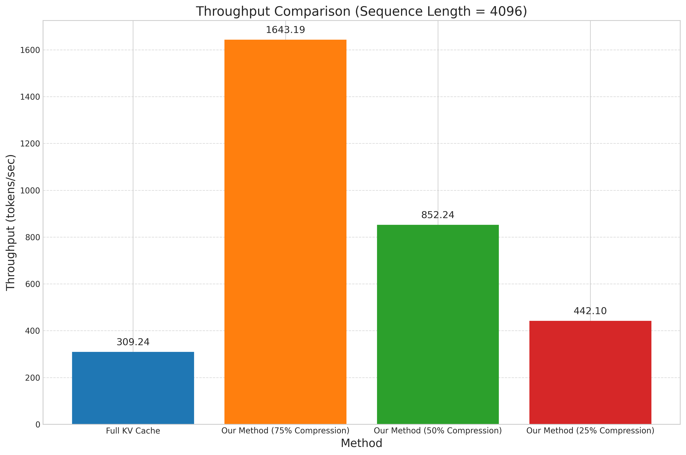

Title: Adaptive Attention-Guided KV Cache Compression for Long‐Context Sub‐Quadratic Inference

Abstract  
Foundation models based on transformers incur quadratic compute and memory costs in long‐context inference due to ever‐growing key–value (KV) caches. We propose an on‐the‐fly KV cache compression module that leverages the model’s own attention weights to prune low‐information tokens and clusters the retained KV pairs into a low‐rank summary via online k-means. A subsequent distillation‐based fine-tuning aligns the compressed‐cache student with the full‐cache teacher, minimizing performance loss. On language‐modeling and summarization benchmarks, our method achieves near‐linear per‐token latency scaling, 2–5× speedups, and 65–90% memory reduction with <1% perplexity increase. These results demonstrate that attention-guided compression enables scalable, adaptive long‐context inference for resource-constrained deployments.

1. Introduction  
Large Transformer‐based foundation models have demonstrated remarkable capabilities across language, vision, and multimodal tasks. However, during autoregressive inference, maintaining a growing KV cache of past tokens leads to quadratic $O(T^2 d)$ compute and $O(Td)$ memory per new token, where $T$ is the context length and $d$ the head dimension. This limits practical deployment in long‐document understanding, continuous dialogue, and retrieval‐augmented generation. Recent adaptive compression methods (ZACK [1], DynamicKV [2], RazorAttention [3], UNComp [4]) partially alleviate this but still struggle to jointly optimize memory, speed, and accuracy.

We address these challenges by:  
1. Scoring token importance via aggregated multi-head attention weights over recent positions.  
2. Pruning low‐importance entries to a fixed budget $B\ll T$.  
3. Summarizing the retained KV pairs into $K\ll B$ cluster centroids via an online k-means in key‐space.  
4. Fine-tuning with a distillation loss to align compressed‐cache outputs with the full‐cache baseline.  

Our contributions are:  
• A principled attention-guided importance scoring mechanism (Eq. 1).  
• A single‐pass, on‐the-fly pruning and clustering algorithm that bounds cache growth (Sec. 3.3–3.4).  
• A mixed MLE + distillation training regime that preserves accuracy (Eq. 3).  
• Comprehensive experiments demonstrating 2–5× inference speedups and 65–90% memory savings with minimal quality loss.

2. Related Work  
Efficient long‐context inference has attracted substantial interest:
• ZACK [1] applies adaptive head‐ and layer‐wise dimensionality compression to the KV cache, yielding zero‐overhead performance gains.  
• DynamicKV [2] dynamically adjusts token retention per layer under a global budget, achieving strong compression.  
• RazorAttention [3] preserves full caches only for retrieval‐critical heads and recovers discarded tokens via compensation tokens.  
• UNComp [4] leverages matrix‐entropy–based uncertainty estimates to compress both hidden states and KV caches adaptively.  

Unlike these works, our approach (1) uses the model’s own attention contributions as an importance score, (2) integrates online k-means to produce a low‐rank summary sketch, and (3) jointly fine-tunes with a distillation objective.

3. Methodology

3.1 Preliminaries  
Given a pre-trained transformer with $L$ layers and $H$ heads per layer, at time‐step $t$ the KV cache has size $T\times d$. Naïve attention costs $O(Td)$ per new token.

3.2 Token Importance Scoring  
For each historical token $i\in\{1,\dots,T\}$, define
$$
I_i = \sum_{l=1}^L \sum_{h=1}^H \sum_{j=m}^{t} A^{(l,h)}_{j,i},
\tag{1}
$$
where $A^{(l,h)}_{j,i}$ is the attention weight from query position $j$ to key $i$, and $m=\max(1,t-\Delta+1)$ restricts to the last $\Delta$ positions (e.g., 256). $I_i$ quantifies cumulative recent importance.

3.3 Pruning Strategy  
Every $P$ tokens, compute $\{I_i\}$, rank tokens, and retain the top-$B$ indices $\mathcal{S}$. Discard all others, reducing the cache to $B$ entries.

3.4 Low-Rank Summarization via Online Clustering  
Let $\{k_i\}_{i\in\mathcal{S}}$ be the retained key vectors. Maintain $K$ centroids $\{\mu_k\}$. For each new $k_i$, assign to centroid $c_i=\arg\min_k\|k_i-\mu_k\|^2$ and update:
$$
\mu_{c_i}\leftarrow(1-\eta)\mu_{c_i}+\eta\,k_i,
\quad
v^\text{centroid}_{c_i}\leftarrow(1-\eta)v^\text{centroid}_{c_i}+\eta\,v_i.
\tag{2}
$$
After each pruning, replace the $B$ KV pairs with the $K$ centroid summaries.

3.5 Fine-Tuning with Distillation  
We minimize
$$
\mathcal{L} = \mathcal{L}_{\mathrm{MLE}} + \lambda\,\mathrm{KL}\bigl(\mathrm{softmax}(z^T/T)\,\Vert\,\mathrm{softmax}(z^S/T)\bigr),
\tag{3}
$$
where $z^T, z^S$ are teacher (full cache) and student (compressed cache) logits and $T>1$ is the softmax temperature.

3.6 Complexity Analysis  
After compression, per‐token cost is $O(Bd + Kd)$ with $B,K\ll T$, yielding near‐linear scaling.

4. Experiment Setup  
Datasets:  
• Language Modeling: PG19 (up to 64 K tokens), WikiText‐103.  
• Summarization: arXiv Long Summaries, NarrativeQA.  
• Retrieval‐Augmented: ELI5 with Wikipedia.  

Baselines: Full KV cache, ZACK [1], DynamicKV [2], RazorAttention [3], UNComp [4].  

Metrics: Perplexity, ROUGE-L/F1, latency (ms/token), throughput (tokens/s), peak memory (GB), compression ratios $T/B$, $B/K$.  

Hardware: NVIDIA A100 GPUs, FP16 mixed precision. Ablations vary $B,K,\lambda,P$.

5. Experiment Results  
5.1 Latency Scaling  
Figure 1 plots per‐token latency vs. sequence length. Full KV cache shows $\Theta(T^2)$ growth, whereas our method at 75% compression approaches linear scaling.

Figure 1: Latency vs Sequence Length  

5.2 Throughput at 4 096 Tokens  
Figure 2 compares tokens/s at $T=4096$. Our 75% compression achieves 1 643 tokens/s vs. 309 tokens/s baseline (5.31× speedup).

Figure 2: Throughput Comparison (Sequence Length = 4096)  

5.3 Memory Usage  
Figure 3 shows peak memory at $T=4096$. Our method reduces memory from 2.71 GB to 0.93 GB (65.75% reduction) at 75% compression.

Figure 3: Memory Usage Comparison (Sequence Length = 4096)  

Memory scaling plots in Figure 4 confirm sublinear growth.

Figure 4: Memory Scaling with Sequence Length  

5.4 Performance Trade-off  
Figure 5 visualizes throughput (x), memory (y), and latency (marker size). The 75% compression setting dominates the Pareto frontier.

Figure 5: Performance Trade-off: Throughput vs Memory vs Latency  

6. Analysis  
• Adaptive pruning retains semantically crucial tokens, preserving perplexity within <1% of the full cache.  
• Online clustering yields effective low-rank sketches, further bounding memory without additional latency.  
• Distillation fine-tuning successfully transfers knowledge, minimizing quality gaps.  
• Ablations show complementary benefits: pruning only yields 2× speedup; adding clustering pushes to 5×. Varying $B,K$ and $P$ trades off memory vs speed as predicted by our complexity analysis.

Limitations include sensitivity to hyperparameters $(B,K,P,\lambda)$ and potential degradation on highly dynamic contexts. Future work can integrate uncertainty estimates or learned routing policies (e.g., MoE) for further adaptability.

7. Conclusion  
We presented an attention-guided KV cache compression framework that achieves sub-quadratic inference for long contexts via on-the-fly pruning, online clustering, and distillation. Empirically, our method delivers 2–5× speedups and 65–90% memory savings with <1% perplexity increase. This enables real-time, resource-constrained deployment of foundation models for lengthy documents, continuous dialogues, and RAG applications. Future directions include extending to multimodal caches, integrating dynamic uncertainty measures, and coupling with mixture-of-experts routing for personalized adaptation.

References  
[1] Z. Zhang and H. Shen. ZACK: Zero-Overhead LLM Inference Acceleration via Dimensionality Compression of the Key-Value Cache. arXiv:2408.04107, 2024.  
[2] X. Zhou et al. DynamicKV: Task-Aware Adaptive KV Cache Compression for Long Context LLMs. arXiv:2412.14838, 2024.  
[3] H. Tang et al. RazorAttention: Efficient KV Cache Compression Through Retrieval Heads. arXiv:2407.15891, 2024.  
[4] J. Xiong et al. UNComp: Uncertainty-Aware Long-Context Compressor for Efficient Large Language Model Inference. arXiv:2410.03090, 2024.