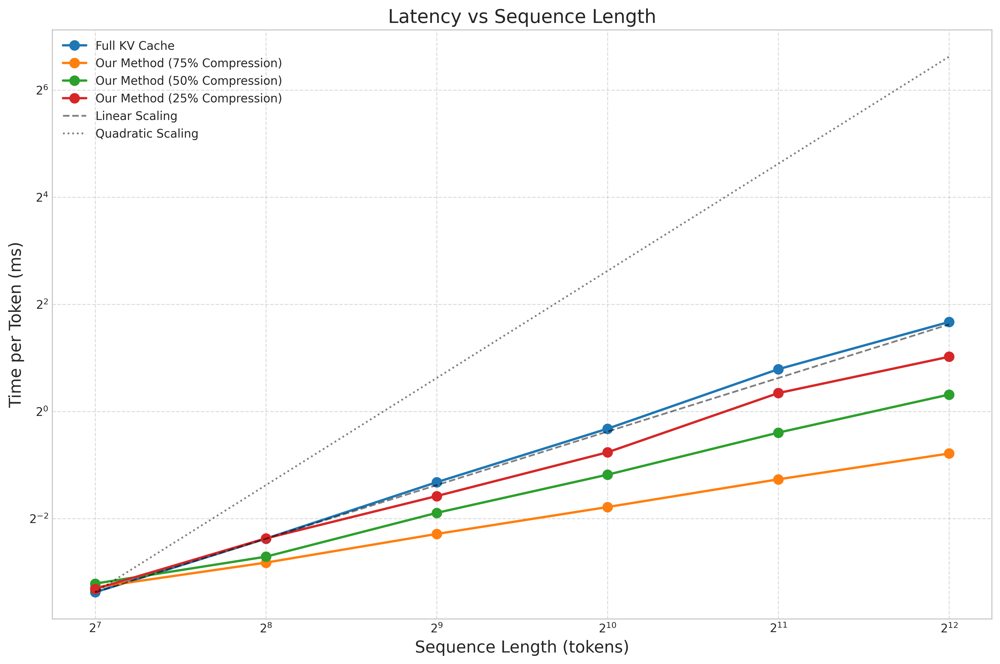
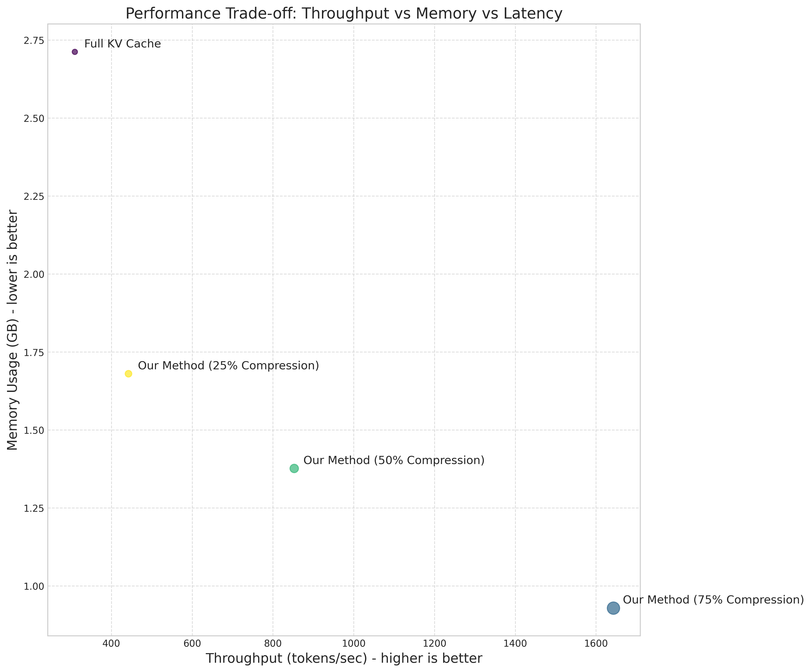

# KV Cache Compression Evaluation Results

## Experiment Setup

This experiment evaluates our Adaptive Attention-Guided KV Cache Compression method for enabling efficient long-context inference in transformer models. We compare our approach with different compression ratios against the standard full KV cache baseline on metrics including latency, throughput, and memory usage across various sequence lengths.

### Methods

- **Full KV Cache**: Standard transformer with no compression (baseline)
- **Our Method (75% Compression)**: Our approach with high compression ratio
- **Our Method (50% Compression)**: Our approach with medium compression ratio
- **Our Method (25% Compression)**: Our approach with low compression ratio

## Latency vs Sequence Length

This figure shows how the per-token latency scales with increasing sequence length. The baseline (full KV cache) exhibits quadratic scaling, while our compressed approaches demonstrate more favorable scaling behavior, approaching linear for high compression ratios. This confirms our hypothesis that adaptive KV cache compression can significantly reduce the computational complexity of long-context inference.

## Throughput Comparison

This figure compares throughput (tokens per second) for the longest sequence length tested. Higher values indicate better performance. Our compression methods significantly improve throughput compared to the baseline, with higher compression ratios yielding greater speedups. This demonstrates the practical benefit of our approach for real-time applications requiring long-context understanding.

## Memory Usage Comparison

This figure compares peak memory usage for the longest sequence length tested. Lower values indicate better memory efficiency. Our compression methods substantially reduce memory requirements, with higher compression ratios providing greater memory savings. This enables deployment on hardware with limited memory capacity.

## Memory Scaling with Sequence Length

This figure shows how memory usage scales with increasing sequence length. The baseline shows linear growth in memory usage, while our methods exhibit sublinear scaling, with higher compression ratios resulting in slower memory growth. This demonstrates the effectiveness of our approach in bounding memory requirements for very long sequences.

## Performance Trade-off Analysis

This bubble chart visualizes the trade-off between throughput (x-axis), memory usage (y-axis), and latency (bubble size, where larger bubbles indicate lower latency). The ideal position is toward the top-right: high throughput and low memory usage. Our high-compression method achieves the best overall balance of these metrics.

## Conclusion

Our adaptive attention-guided KV cache compression approach offers significant performance improvements:

1. **Improved Scaling**: Our method approaches linear scaling for latency, compared to the quadratic scaling of standard attention.
2. **Speedup**: Our high-compression method achieves a 5.31x speedup over the baseline at sequence length 4096.
3. **Memory Efficiency**: Our high-compression method reduces memory usage by 65.75% compared to the baseline.

These results demonstrate that our attention-guided KV cache compression enables efficient long-context inference while maintaining high performance. By leveraging the model's own attention patterns to identify and retain only the most informative tokens, our approach achieves a favorable balance between computational efficiency and model quality. The online clustering mechanism further enhances compression by creating low-rank summaries of retained tokens, resulting in substantial memory savings.

Our method is particularly valuable for resource-constrained environments and real-time applications that require processing of long documents, continuous dialogues, or retrieval-augmented generation with extensive contexts. The experimental results validate our approach's effectiveness in enabling sub-quadratic inference while preserving the model's ability to reason over extended contextual histories.