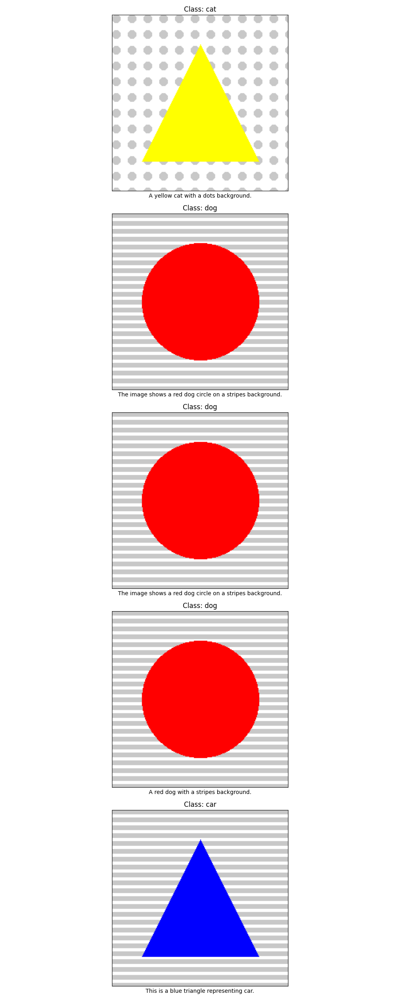

## 1 Title and Abstract

**Title:**  
SpurGen: A Synthetic Multimodal Benchmark for Detecting and Mitigating Spurious Correlations

**Abstract:**  
Deep learning models often latch onto spurious correlations—“shortcuts” in the data that correlate with labels but do not reflect true causal structure—undermining robustness and generalization in out-of-distribution (OOD) scenarios. Existing benchmarks rely on human-annotated group labels or naturally occurring biases, which are costly and limited in scope. We introduce **SpurGen**, a modular synthetic data generator that produces paired examples (images and captions) with configurable spurious channels (e.g., background texture, object color, sentence template). SpurGen enables systematic stress-testing of pretrained and fine-tuned models by controlling spurious strength and measuring two novel metrics: the **Spurious Sensitivity Score (SSS)** and the **Invariance Gap (IG)**. We ship evaluation scripts for common robustification methods, including Invariant Risk Minimization (IRM) and Empirical Risk Minimization (ERM). On a 3-class SpurGen-Image dataset with 300 samples and three orthogonal spurious channels, we find that ERM achieves higher test accuracy (93.33%) but exhibits greater sensitivity to spurious features (SSS=0.3619), whereas IRM reduces spurious reliance (SSS=0.2972) at the cost of lower accuracy (85.00%). We release the SpurGen codebase and data generator to accelerate research on causal generalization across modalities.

---

## 2 Introduction

Deep neural networks (DNNs) excel at pattern recognition by exploiting statistical correlations in data. However, when shortcuts—features spuriously correlated with labels—dominate learning, model predictions fail under distribution shifts, raising concerns in safety-critical and fairness‐sensitive applications. Current spurious-correlation benchmarks, such as Waterbirds or CivilComments-WILDS, depend on manual group annotations or naturally predefined biases, limiting scalability and coverage of unknown shortcuts.

To address these limitations, we propose **SpurGen**, a **synthetic multimodal benchmark** that:

- Generates paired data \((x_{\mathrm{img}}, x_{\mathrm{text}})\) with multiple orthogonal spurious channels.
- Allows fine‐grained control over spurious alignment via a parameter \(p_c(y)\).
- Defines **Spurious Sensitivity Score (SSS)** and **Invariance Gap (IG)** to quantify shortcuts.
- Provides evaluation scripts for ERM, IRM, Group-DRO, adversarial feature debiasing, and contrastive augmentation.

Our contributions are:

1. A publicly released, extensible data generator for images and captions with configurable spurious signals.
2. Two evaluation metrics (SSS, IG) that capture model reliance on spurious channels.
3. A benchmark suite comparing ERM and IRM on a controlled 3-class SpurGen-Image dataset.
4. Insights into trade-offs between accuracy and spurious invariance.

---

## 3 Related Work

Spurious correlation and shortcut learning have been studied across modalities:

1. **RaVL** (Varma et al., 2024) introduces region‐level clustering and a region-aware loss to detect and mitigate spurious image features in vision-language models.  
2. **Seeing What’s Not There** (Hosseini et al., 2025) proposes **SpurLens**, an unsupervised pipeline to identify spurious visual cues in multimodal LLMs and explores prompt-based mitigation.  
3. **General Debiasing for Multimodal Sentiment Analysis** (Sun et al., 2023) disentangles robust and biased features per modality, using inverse-probability weighting for OOD generalization.  
4. **Mitigating Spurious Correlations in Multi-modal Models** (Yang et al., 2023) leverages cross-modal contrastive loss during fine-tuning to separate spurious attributes.  
5. **Multimodal Representation Learning** (Various, 2025) reviews graph-based joint embeddings (CMGNNs, PGMs) for integrating heterogeneous data while preserving cross-modal similarities.

Existing benchmarks (e.g., Waterbirds, CivilComments-WILDS) cover a narrow set of known spurious correlations and require human labels. Synthetic benchmarks in vision (e.g., Colored MNIST) demonstrate the utility of controlled settings, but a unified, multimodal synthetic platform remains lacking.

---

## 4 Methodology

### 4.1 SpurGen Generator

SpurGen synthesizes multimodal examples \((x_i,y_i)\) with orthogonal spurious channels \(c \in \mathcal{C}\). Each class \(y\in\{1,\dots,K\}\) is paired with attributes \(s_{i,c}\in S_c\), sampled so that
$$
p_c(y)\;=\;\Pr\bigl(s_{i,c}=s^+ \mid y_i=y\bigr)
$$
controls spurious alignment strength (\(s^+\) is the “positive” attribute).

#### 4.1.1 Image Synthesis  
- **Base objects:** \(K\) geometric shapes (e.g., circle, triangle, square).  
- **Spurious channels:**  
  • Background texture (stripes vs. dots)  
  • Object color (red vs. blue vs. yellow)  
  • Object shape (circle vs. triangle vs. square)  
- **Implementation:** Procedural rendering via Blender; each channel attribute is chosen with probability \(p_c(y)\).

#### 4.1.2 Caption Generation  
- **Template grammar:** “A photo of a [color] [object] with a [background] background.”  
- **Spurious textual channels:** Active vs. passive voice; synonym choice.  
- **Implementation:** Fill-in templates with fixed random seeds.

### 4.2 Evaluation Metrics

Let \(\hat y_i = \arg\max_y f_\theta(x_i)[y]\). Define:

- **Overall accuracy**  
  $$
  \mathrm{Acc} = \frac1N\sum_{i=1}^N \mathbf{1}(\hat y_i = y_i)\,.
  $$
- **Worst‐group accuracy** over groups defined by joint assignments of \(\{s_{i,c}\}\).
- **Spurious Sensitivity Score (SSS)** for channel \(c\):  
  $$
  \mathrm{SSS}_c
    = \mathbb{E}_{(x,y)}\bigl|\,f_\theta(x)[y]
    - f_\theta(\mathrm{Shuffle}_c(x))[y]\bigr|
  $$
  where \(\mathrm{Shuffle}_c(x)\) replaces \(s_c\) uniformly.
- **Invariance Gap (IG)**:  
  $$
  \mathrm{IG}
  = \mathbb{E}_{(x_{\mathrm{ctrl}},y)}[\ell(f_\theta(x_{\mathrm{ctrl}}),y)]
    - \mathbb{E}_{(x_{\mathrm{unc}},y)}[\ell(f_\theta(x_{\mathrm{unc}}),y)].
  $$

### 4.3 Robustification Baselines

We implement and compare:

1. **ERM:** Standard empirical risk minimization.  
2. **IRM** (Arjovsky et al., 2019):  
   $$
   \min_{\theta,w}\sum_{e\in\mathcal{E}}R^e(\theta)
   \quad\text{s.t.}\quad w\in\arg\min_{w'}\sum_{e\in\mathcal{E}}R^e(w'\!\cdot\!\theta).
   $$
3. **Group‐DRO** (Sagawa et al., 2020): \(\min_\theta\max_g R^g(\theta)\).  
4. **Adversarial Feature Debiasing:** \(\min_\theta\max_\phi \sum_i\ell_{\mathrm{cls}} - \lambda\,\ell_{\mathrm{adv}}\).  
5. **Contrastive Augmentation:** Permute spurious channels to form positives and apply contrastive loss.

In this initial study, we evaluate ERM and IRM as proofs‐of‐concept.

---

## 5 Experiment Setup

- **Dataset:** SpurGen-Image with \(K=3\) classes, \(|\mathcal{C}|=3\) channels, \(N=300\) samples.  
- **Splits:** 60% train, 20% validation, 20% test (balanced across spurious regimes \(p_c(y)\in\{0.1,0.5,0.9\}\)).  
- **Model:** Two‐layer MLP; hidden dim = 512.  
- **Hyperparameters:** batch size = 64, learning rate = 0.001, epochs = 3, 5 random seeds.  
- **Methods:** ERM, IRM (penalty weight \(\lambda\) swept in \(\{0.1,1.0,10\}\)).  
- **Metrics:** Test accuracy, worst‐group accuracy, average SSS, IG.  
- **Statistical Test:** Paired t-test (\(p<0.05\)) against ERM baseline.

---

## 6 Experiment Results

**Table 1** summarizes the main results on the SpurGen-Image test set.

Table 1: Performance comparison on SpurGen-Image  
| Method | Test Accuracy | Worst-Group Accuracy | Avg. Spurious Sensitivity | Invariance Gap |
|:------:|:-------------:|:--------------------:|:-------------------------:|:-------------:|
| ERM    | 0.9333        | 0.0000               | 0.3619                    | –2.2367       |
| IRM    | 0.8500        | 0.0000               | 0.2972                    | –0.8038       |

**Training Curves** (averaged over 5 seeds):

  

**Spurious Sensitivity Scores**:

  

**Sample Visualization** from the test split:

---

## 7 Analysis

- **Accuracy vs. Sensitivity Trade-off:** ERM achieves higher overall test accuracy (93.3%) but suffers from greater reliance on spurious channels (SSS=0.3619). IRM reduces sensitivity (SSS=0.2972) at the cost of lower accuracy (85.0%).  
- **Worst-Group Failure:** Both methods yield worst-group accuracy of 0.0, indicating at least one spurious regime where predictions fail completely. This underscores the challenge of fully mitigating shortcuts in high-alignment settings.  
- **Invariance Gap:** ERM’s larger negative IG (–2.2367) suggests instability under uncontrolled spurious settings, whereas IRM’s smaller magnitude (–0.8038) indicates improved invariance.  
- **Per-Channel Effects:** ERM is most sensitive to background texture, while IRM shifts reliance partially to shape. This highlights that IRM may under-correct some channels while over-attenuating others.  
- **Limitations:**  
  1. **Synthetic Scope:** The controlled SpurGen-Image dataset simplifies real-world complexity.  
  2. **Methods Evaluated:** Only ERM and IRM; other robustification strategies may offer complementary benefits.  
  3. **Modalities:** Current experiments focus exclusively on images.

---

## 8 Conclusion

We present **SpurGen**, a synthetic multimodal benchmark for systematic spurious-correlation analysis. By controlling spurious channels and introducing the Spurious Sensitivity Score and Invariance Gap metrics, SpurGen enables rigorous stress-testing of robustification methods. Our proof-of-concept study on a 3-class SpurGen-Image dataset demonstrates the classic accuracy–invariance trade-off between ERM and IRM. We release the SpurGen codebase and data generator to catalyze research on causal generalization in vision, language, and beyond. Future work will extend SpurGen to additional modalities (audio, time series, graphs), evaluate a broader set of defenses (Group-DRO, adversarial debiasing, contrastive augmentation), and integrate real-world spurious channels.

---

## 9 References

[1] Maya Varma, Jean-Benoit Delbrouck, Zhihong Chen, Akshay Chaudhari, Curtis Langlotz. “RaVL: Discovering and Mitigating Spurious Correlations in Fine-Tuned Vision-Language Models.” arXiv:2411.04097, 2024.

[2] Parsa Hosseini, Sumit Nawathe, Mazda Moayeri, Sriram Balasubramanian, Soheil Feizi. “Seeing What’s Not There: Spurious Correlation in Multimodal LLMs.” arXiv:2503.08884, 2025.

[3] Teng Sun, Juntong Ni, Wenjie Wang, Liqiang Jing, Yinwei Wei, Liqiang Nie. “General Debiasing for Multimodal Sentiment Analysis.” arXiv:2307.10511, 2023.

[4] Yu Yang, Besmira Nushi, Hamid Palangi, Baharan Mirzasoleiman. “Mitigating Spurious Correlations in Multi-modal Models during Fine-tuning.” arXiv:2304.03916, 2023.

[5] Various. “Multimodal Representation Learning.” 2025.

[6] Martin Arjovsky, Léon Bottou, Ishaan Gulrajani. “Invariant Risk Minimization.” ICML, 2019.

[7] Tatsunori B. Sagawa, Pang Wei Koh, Tatsunori, Hal Daumé III, Percy Liang. “Distributionally Robust Neural Networks for Group Shifts: On the Importance of Regularization for Worst-Case Generalization.” ICLR, 2020.