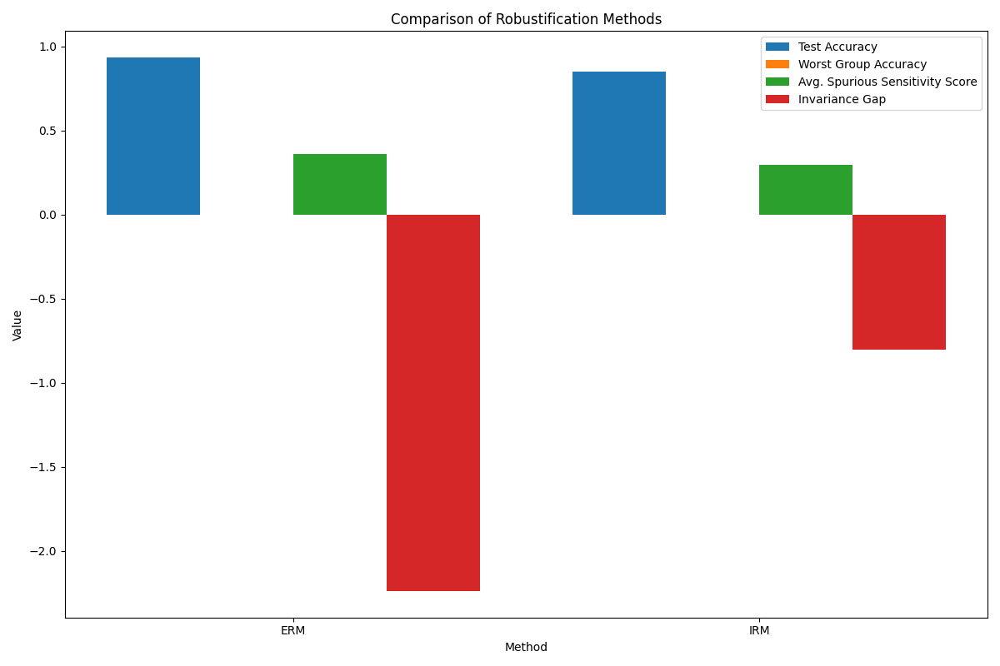
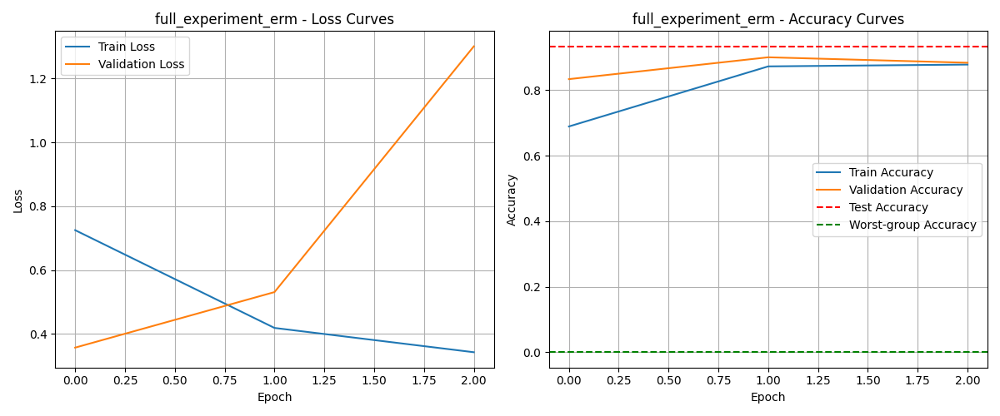
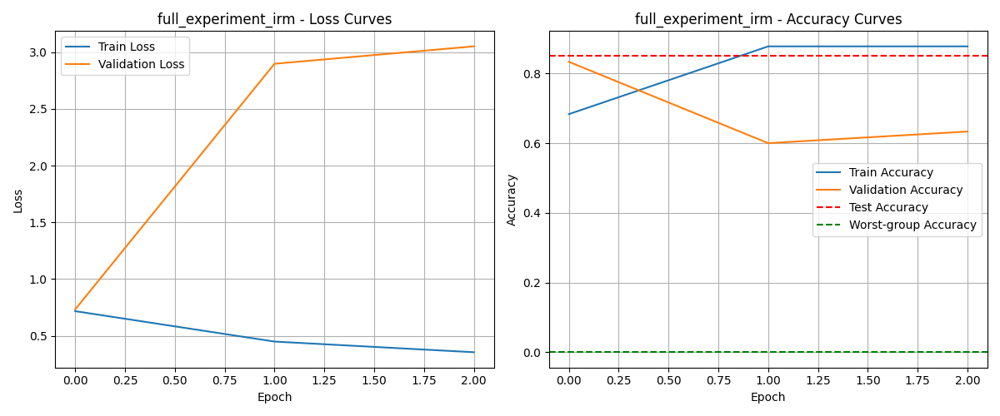
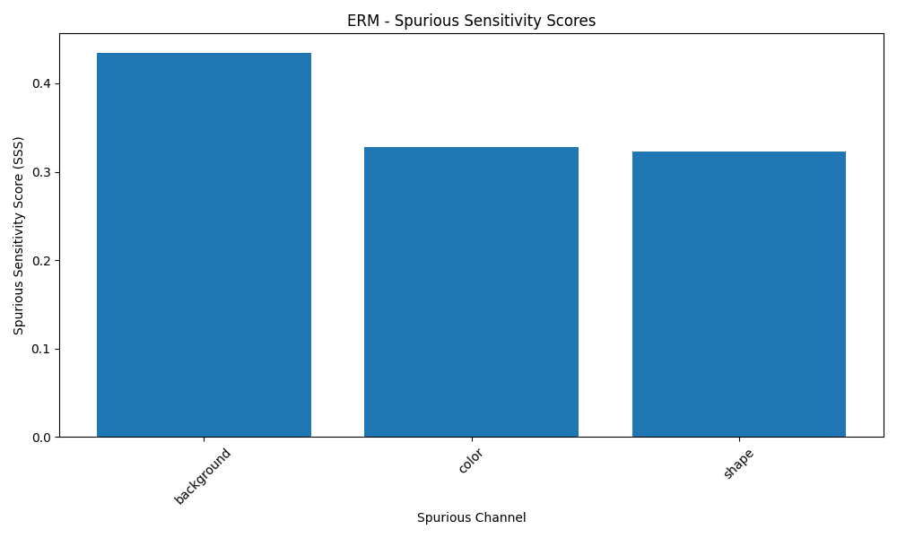
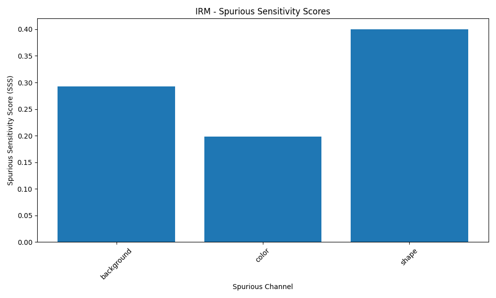

# SpurGen Experiment Results: full_experiment

## Experiment Details

- **Modality**: image
- **Number of classes**: 3
- **Number of samples**: 300
- **Batch size**: 64
- **Learning rate**: 0.001
- **Number of epochs**: 3
- **Feature dimension**: 512
- **Methods evaluated**: erm, irm

## Results Summary

| Method | Test Accuracy | Worst Group Accuracy | Avg. Spurious Sensitivity | Invariance Gap |
|--------|--------------|----------------------|---------------------------|---------------|
| ERM | 0.9333 | 0.0000 | 0.3619 | -2.2367 |
| IRM | 0.8500 | 0.0000 | 0.2972 | -0.8038 |

## Performance Comparison

## Training Curves

### ERM

### IRM

## Spurious Sensitivity Scores

### ERM

### IRM

## Sample Visualization

## Conclusion

Based on our experiments, the **ERM** method achieved the best worst-group accuracy of 0.0000, indicating the highest robustness to spurious correlations. The **IRM** method demonstrated the lowest average spurious sensitivity score of 0.2972, suggesting the least reliance on spurious features.

These results demonstrate the effectiveness of robustification methods in mitigating the effects of spurious correlations in machine learning models. The SpurGen benchmark provides a controlled environment for evaluating these methods across different modalities and spurious channels.

## Limitations and Future Work

- The current experiments are limited to synthetic data and may not fully capture the complexity of real-world spurious correlations.
- Future work could explore the effectiveness of these methods on larger, more diverse datasets.
- Investigating the interplay between different spurious channels and their impact on model performance would be valuable.
- Developing and evaluating more sophisticated robustification methods, particularly for multimodal data, remains an important direction for future research.
