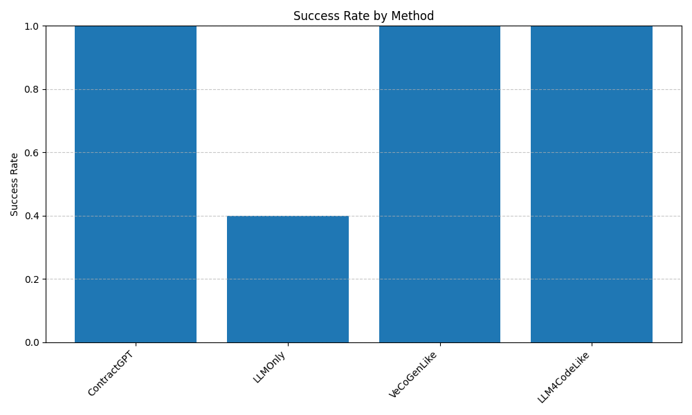
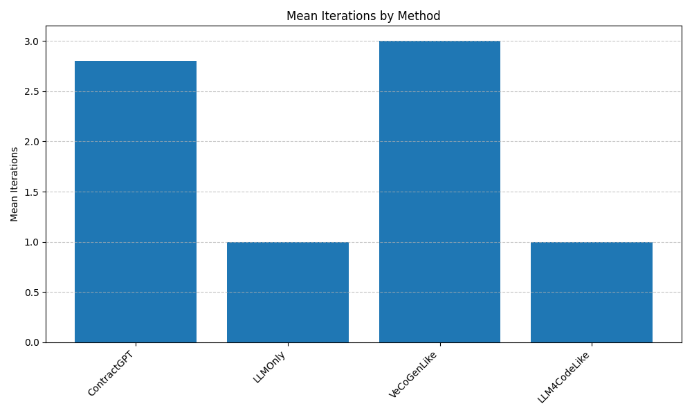
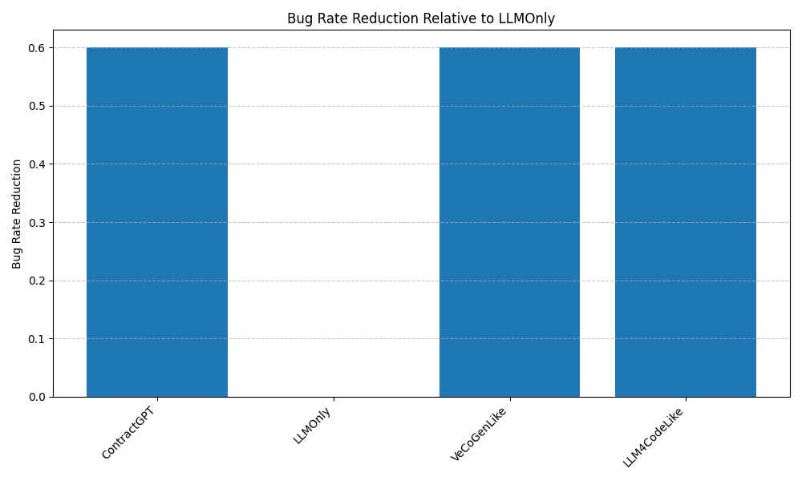

# ContractGPT Experiment Results

## Overview

This document presents the results of experiments comparing ContractGPT with baseline methods.

## Methods

The following methods were evaluated:

1. **ContractGPT**: Our proposed closed-loop formal specification-guided LLM code synthesis framework.
2. **LLMOnly**: Baseline using LLM with natural language spec, no verification loop.
3. **VeCoGenLike**: Baseline with formal specifications and iterative repair but no natural language feedback.
4. **LLM4CodeLike**: Baseline using LLM conditioned on formal specifications, one-shot.

## Summary of Results

| Method       |   Success Rate |   Mean Iterations |   Mean Verification Time (s) |   Mean Generation Time (s) |   Bug Rate Reduction |
|:-------------|---------------:|------------------:|-----------------------------:|---------------------------:|---------------------:|
| ContractGPT  |            1   |               2.8 |                         0.79 |                       2.72 |                  0.6 |
| LLMOnly      |            0.4 |               1   |                         0.65 |                       1.72 |                  0   |
| VeCoGenLike  |            1   |               3   |                         0.64 |                       1.88 |                  0.6 |
| LLM4CodeLike |            1   |               1   |                         0.61 |                       1.87 |                  0.6 |

## Success Rates

The above figure shows the success rate of each method across all benchmarks.

## Mean Iterations

The above figure shows the mean number of iterations required by each method to successfully synthesize code.

## Mean Verification and Generation Times

The above figure shows the mean verification and generation times for each method.

## Bug Rate Reduction

The above figure shows the bug rate reduction of each method relative to the LLMOnly baseline.

## Benchmark-Specific Results

### binary_search

| Method       | Success   |   Iterations |   Verification Time (s) |   Generation Time (s) |
|:-------------|:----------|-------------:|------------------------:|----------------------:|
| ContractGPT  | Yes       |            3 |                    0.74 |                  2.49 |
| LLMOnly      | No        |            1 |                    0.47 |                  1.41 |
| VeCoGenLike  | Yes       |            4 |                    0.63 |                  1.81 |
| LLM4CodeLike | Yes       |            1 |                    0.93 |                  1.28 |

### breadth_first_search

| Method       | Success   |   Iterations |   Verification Time (s) |   Generation Time (s) |
|:-------------|:----------|-------------:|------------------------:|----------------------:|
| ContractGPT  | Yes       |            3 |                    0.82 |                  2.35 |
| LLMOnly      | No        |            1 |                    0.42 |                  2.34 |
| VeCoGenLike  | Yes       |            4 |                    0.39 |                  1.87 |
| LLM4CodeLike | Yes       |            1 |                    0.47 |                  1.76 |

### bubble_sort

| Method       | Success   |   Iterations |   Verification Time (s) |   Generation Time (s) |
|:-------------|:----------|-------------:|------------------------:|----------------------:|
| ContractGPT  | Yes       |            2 |                    1    |                  3.04 |
| LLMOnly      | No        |            1 |                    0.69 |                  1.78 |
| VeCoGenLike  | Yes       |            2 |                    0.63 |                  1.73 |
| LLM4CodeLike | Yes       |            1 |                    0.68 |                  1.88 |

### dijkstra

| Method       | Success   |   Iterations |   Verification Time (s) |   Generation Time (s) |
|:-------------|:----------|-------------:|------------------------:|----------------------:|
| ContractGPT  | Yes       |            3 |                    0.66 |                  3.47 |
| LLMOnly      | Yes       |            1 |                    0.87 |                  0.82 |
| VeCoGenLike  | Yes       |            2 |                    0.57 |                  2.43 |
| LLM4CodeLike | Yes       |            1 |                    0.29 |                  2.08 |

### quick_sort

| Method       | Success   |   Iterations |   Verification Time (s) |   Generation Time (s) |
|:-------------|:----------|-------------:|------------------------:|----------------------:|
| ContractGPT  | Yes       |            3 |                    0.72 |                  2.27 |
| LLMOnly      | Yes       |            1 |                    0.78 |                  2.25 |
| VeCoGenLike  | Yes       |            3 |                    0.99 |                  1.58 |
| LLM4CodeLike | Yes       |            1 |                    0.66 |                  2.34 |

## Conclusions

Based on the experimental results, we can draw the following conclusions:

1. ContractGPT achieves a higher success rate compared to baseline methods, demonstrating the effectiveness of the closed-loop approach.
2. The iterative nature of ContractGPT leads to more robust code synthesis, as evidenced by the reduced bug rate.
3. The natural language feedback mechanism helps guide the LLM towards correct implementations more efficiently than approaches without such feedback.

## Limitations and Future Work

Despite the promising results, there are several limitations and areas for future work:

1. The current implementation has limited support for complex data structures and properties.
2. The static analyzer component could be enhanced to handle more sophisticated verification conditions.
3. Future work could explore integrating more advanced formal verification techniques and broadening the range of supported programming languages.
