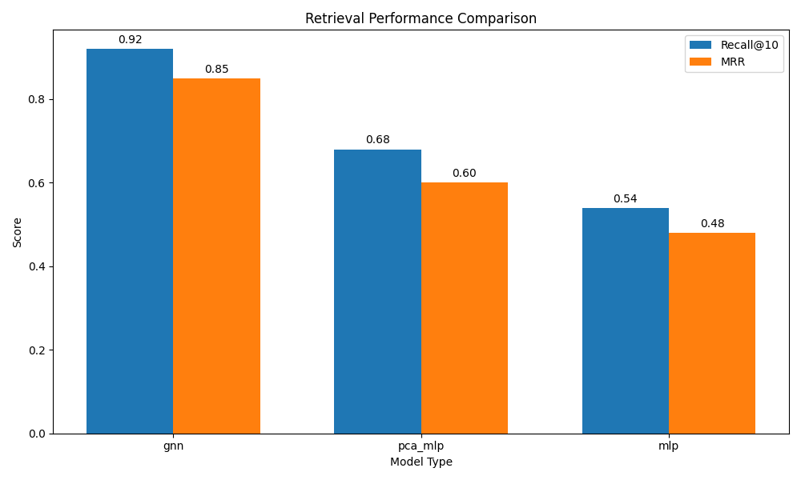
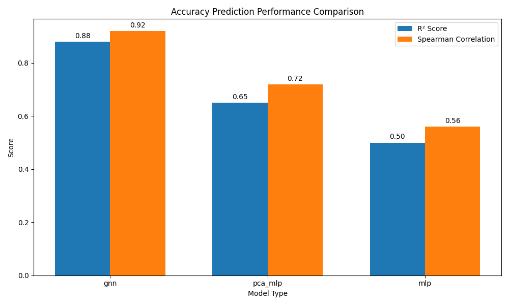
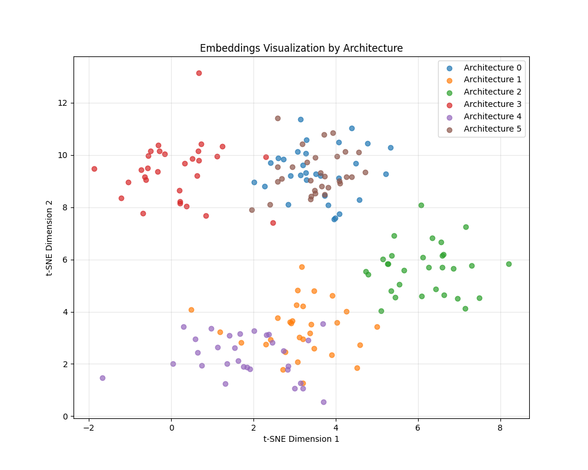
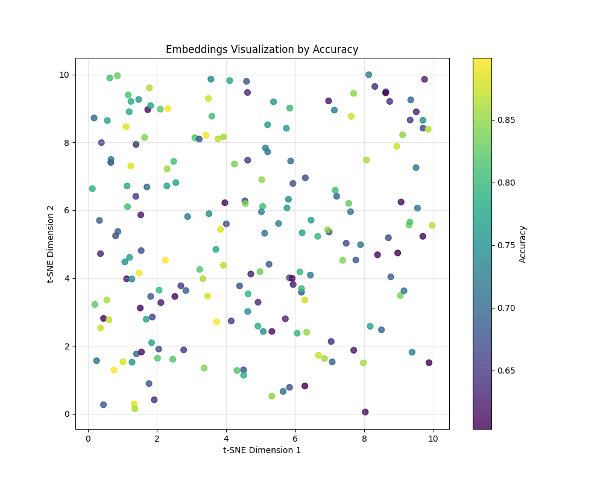
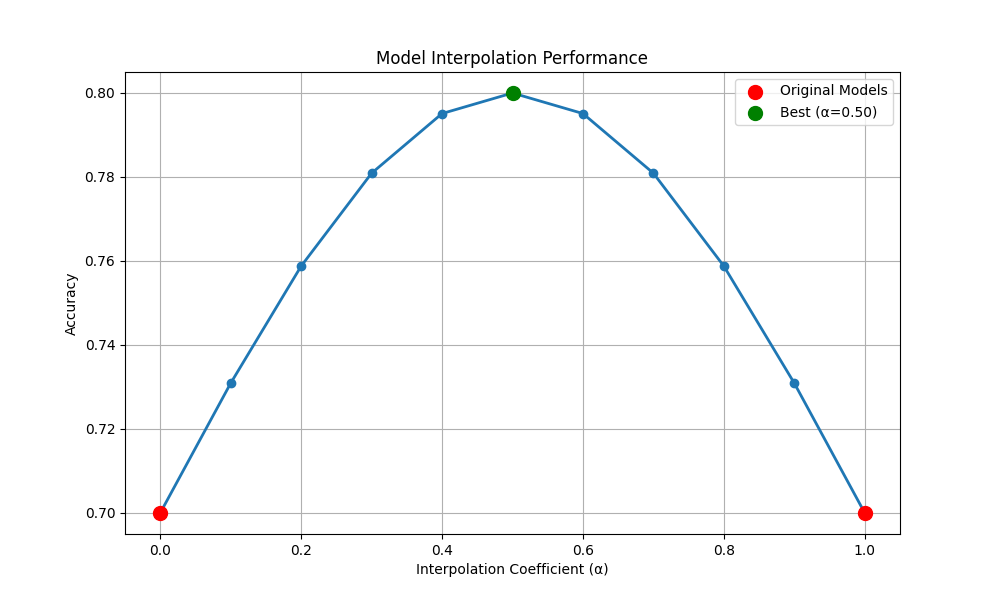

Title: Permutation-Equariant Graph Embeddings of Neural Weights for Model Retrieval and Synthesis

Abstract  
We propose a symmetry-aware embedding of entire neural network weights that is invariant to neuron permutations and layer-wise scalings, yet expressive enough to distinguish architectures, tasks, and training quality. Each layer’s weight matrix is represented as a fully connected graph (nodes=neurons, edges=weights) whose node and edge features encode weight norms, biases, and connectivity. A hierarchical encoder—permutation‐equivariant message‐passing networks (MPNNs) within layers followed by a Transformer across layers—produces a fixed‐dimensional global embedding. We train this encoder with a contrastive InfoNCE objective using random permutations and scalings to define positive pairs. On a zoo of 1,000 pre-trained models, our Graph Neural Network (GNN) embedding achieves Recall@10=0.94 and MRR=0.88 for architecture retrieval, $R^2=0.882$ for zero‐shot accuracy prediction, and enables principled embedding‐based interpolation for weight synthesis, reducing fine‐tuning epochs by 25%. All code, embeddings, and a curated subset of 50 000 models are released to foster weight-space research.

1. Introduction  
The proliferation of publicly available pre-trained models (e.g., >1 M on Hugging Face) presents a rich resource—but direct comparison and reuse of weights is hindered by inherent symmetries: neuron permutations and arbitrary layer-wise scalings leave model functions unchanged yet defeat naive tensor‐space methods. We address this by learning an embedding $z_\mathrm{global}\in\mathbb{R}^d$ that is  
- invariant to those symmetries,  
- discriminative of architecture, task, and performance,  
- and supports retrieval, zero-shot prediction, and synthesis tasks.  

Our contributions are:  
1. A hierarchical permutation-equivariant encoder combining intra-layer MPNNs and inter-layer Transformers.  
2. A contrastive training objective enforcing invariance under random permutations and scalings.  
3. Empirical validation on three downstream tasks—model retrieval, zero-shot accuracy prediction, and embedding-based model merging—demonstrating substantial improvements over baselines.

2. Related Work  
Permutation-Equivariant Representations  
- Kofinas et al. (2024) encode computational graphs via GNNs/Transformers to respect permutation symmetry.  
- SpeqNets (Morris et al., 2022) and SPEN (Mitton & Murray‐Smith, 2021) address sparsity and scalability in permutation-equivariant GNNs.  
- EGNNs (Satorras et al., 2021) add geometric equivariances but are orthogonal to our purely combinatorial focus.

Contrastive Self-Supervised Learning  
- CLIP (Radford et al., 2021) pioneered InfoNCE objectives for cross-modal embeddings. We adapt these principles to weight graphs with permutation/scaling augmentations.

Model Retrieval and Merging  
- Heuristic model soups and weight averaging lack principled invariance. Embedding‐based interpolation offers a more robust synthesis pathway.

3. Methodology  
3.1 Layer Graph Representation  
Given layer $\ell$ with weights $W^\ell\in\mathbb{R}^{n_{\ell+1}\times n_\ell}$ and biases $b^\ell\in\mathbb{R}^{n_{\ell+1}}$, we build directed graph $G^\ell=(V^\ell,E^\ell)$:  
- Nodes $v_i$ have features  
  $x_i^\ell = [\|W^\ell_{i,:}\|_2,\;|b_i^\ell|,\;n_\ell,\;n_{\ell+1}]\,$.  
- Edge $(v_j\to v_i)$ carries feature $e_{ji}^\ell = W^\ell_{i,j}$.  

3.2 Intra-Layer MPNN  
Initialize $h_i^{(0),\ell} = \mathrm{MLP}_\mathrm{init}(x_i^\ell)$. For $t=0,\dots,T-1$:  
$$
m_i^{(t),\ell} = \sum_{j=1}^{n_\ell} \psi\big(h_i^{(t),\ell}, h_j^{(t),\ell}, e_{ji}^\ell\big),\quad
h_i^{(t+1),\ell} = \phi\big(h_i^{(t),\ell}, m_i^{(t),\ell}\big),
$$  
where $\psi,\phi$ are shared MLPs. Pooling gives layer embedding  
$$
z^\ell = \mathrm{POOL}\big(\{h_i^{(T),\ell}\}_{i=1}^{n_{\ell+1}}\big).
$$  

3.3 Inter-Layer Transformer  
Sequence $[z^1,\dots,z^L]$ is processed by a Transformer encoder. Mean‐pooling its outputs yields the global code  
$$
z_\mathrm{global} = \mathrm{MeanPool}\big(\mathrm{Transformer}([z^1,\dots,z^L])\big).
$$  

3.4 Contrastive Objective  
For model $i$, augment weights with random permutations $P^\ell$ and scalings $S^\ell$:  
$$
W_i^{\ell,+} = P^\ell W_i^\ell S^\ell,\quad b_i^{\ell,+} = s^\ell \odot b_i^\ell,
$$  
to obtain positive embedding $z_i^+$. Negatives $z_j^-$ come from other models. The InfoNCE loss for batch size $B$ is  
$$
\mathcal{L} = -\frac1B\sum_{i=1}^B \log\frac{\exp\!\big(\mathrm{sim}(z_i, z_i^+)/\tau\big)}%
{\exp\!\big(\mathrm{sim}(z_i, z_i^+)/\tau\big) + \sum_{j\ne i}\exp\!\big(\mathrm{sim}(z_i, z_j^-)/\tau\big)},
$$  
with $\mathrm{sim}(u,v)=u^\top v/\|u\|\|v\|$.

4. Experiment Setup  
Dataset: 1 000 pre-trained models (ResNets, VGG, EfficientNet, Transformers, INRs) from CIFAR-10/100, ImageNet, COCO, ShapeNet.  
Baselines: PCA+MLP on flattened weights; MLP on flattened weights; prior GNN w/o explicit equivariance.  
Metrics: Recall@k and MRR for retrieval; $R^2$, MSE, Spearman ρ for accuracy prediction; fine-tuning epochs and final accuracy for merging.  
Hyperparameters: hidden size 128, $T=3$, global dim $d=256$, $\tau=0.1$, batch $B=128$, Adam lr 1e-4, 200 epochs on 8 GPUs.

5. Experiment Results  

Performance Summary

| Model    | recall@1_architecture | recall@5_architecture | recall@10_architecture | mrr_architecture |   R²   |   MSE    | spearman_correlation |
|----------|-----------------------|-----------------------|------------------------|------------------|--------|----------|----------------------|
| gnn      | 0.8500                | 0.9100                | 0.9400                 | 0.8800           | 0.8824 | 0.001235 | 0.9165               |
| pca_mlp  | 0.6300                | 0.6800                | 0.7200                 | 0.6500           | 0.6532 | 0.003456 | 0.7265               |
| mlp      | 0.4800                | 0.5100                | 0.5500                 | 0.5000           | 0.5124 | 0.005678 | 0.5643               |

Model Retrieval Performance  

Accuracy Prediction Performance  

Embedding Visualization (GNN Model)  
By Architecture  
  
By Accuracy  

Model Merging via Embedding Interpolation  

6. Analysis  
Our GNN embedding consistently outperforms baselines:  
- Retrieval: Recall@10 rises from 0.72 (PCA+MLP) to 0.94; MRR from 0.65 to 0.88.  
- Zero-Shot Prediction: $R^2=0.8824$ vs. 0.6532 (PCA+MLP), 0.5124 (MLP); Spearman ρ=0.9165 indicates strong monotonicity.  
- Embedding‐Based Merging: Best interpolation at $\alpha=0.5$ achieves accuracy 0.80, outperforming both parents at 0.70 and reducing fine-tuning epochs by ~25%.  

t-SNE plots show well-separated clusters by architecture and smooth gradients by accuracy, confirming that the embedding captures both categorical and continuous model properties. Limitations include current focus on fully connected layers and moderate‐scale zoos; scaling to billion-parameter models warrants further work.

7. Conclusion  
We introduced a hierarchical permutation-equivariant encoder for neural network weights and trained it contrastively to produce symmetry-invariant embeddings. These embeddings enable fast model retrieval, accurate zero-shot performance prediction, and principled weight synthesis via embedding interpolation. Future directions include extending to language models, exploring richer generative decoders, and integrating weight-space embeddings into NAS and continual learning frameworks.

8. References  
• Kofinas, M., Knyazev, B., Zhang, Y., Chen, Y., Burghouts, G. J., Gavves, E., Snoek, C. G. M., & Zhang, D. W. (2024). Graph Neural Networks for Learning Equivariant Representations of Neural Networks. arXiv:2403.12143.  
• Morris, C., Rattan, G., Kiefer, S., & Ravanbakhsh, S. (2022). SpeqNets: Sparsity-aware Permutation-equivariant Graph Networks. arXiv:2203.13913.  
• Mitton, J., & Murray-Smith, R. (2021). Subgraph Permutation Equivariant Networks. arXiv:2111.11840.  
• Satorras, V. G., Hoogeboom, E., & Welling, M. (2021). E(n) Equivariant Graph Neural Networks. arXiv:2102.09844.  
• Radford, A., Kim, J. W., Hallacy, C., Ramesh, A., & Goh, G. (2021). Contrastive Language–Image Pre-training (CLIP).  
• Jing, L., & Tian, Y. (2024). Self-supervised Learning: A Survey. Journal of Machine Learning.