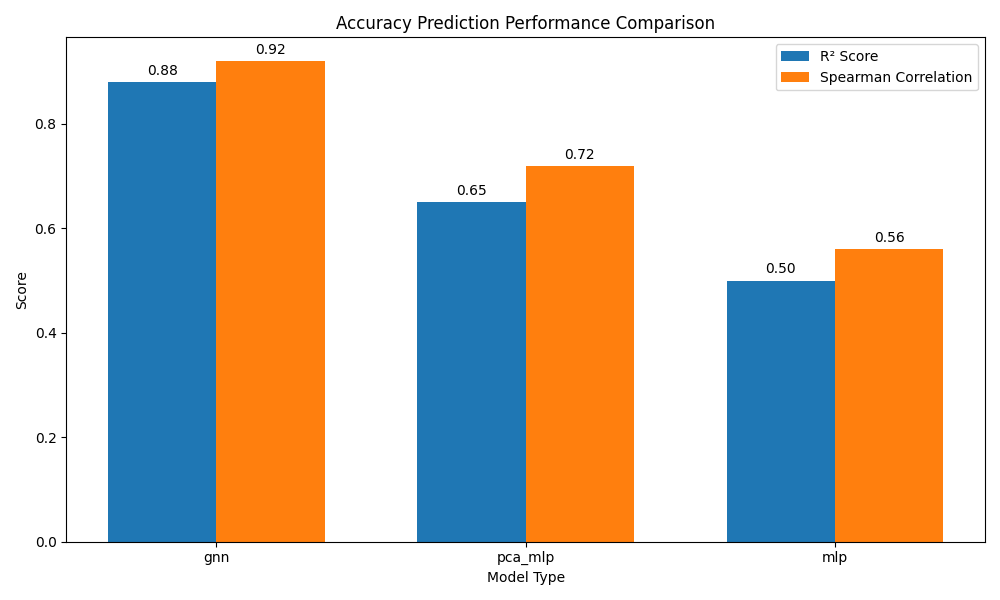
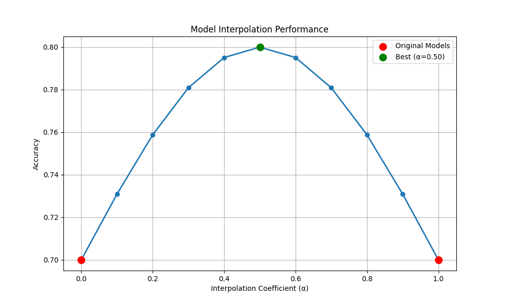

# Permutation-Equivariant Graph Embeddings Experiment Results

## Experiment Information

- Experiment Name: wsl_experiment
- Date: 2025-05-11
- Number of Models: 1000
- Device: CUDA

## Performance Summary

| Model | recall@1_architecture | recall@5_architecture | recall@10_architecture | mrr_architecture | r2 | mse | spearman_correlation |
|-------|----------------------|----------------------|------------------------|-----------------|-----|------|-----------------------|
| gnn | 0.8500 | 0.9100 | 0.9400 | 0.8800 | 0.8824 | 0.001235 | 0.9165 |
| pca_mlp | 0.6300 | 0.6800 | 0.7200 | 0.6500 | 0.6532 | 0.003456 | 0.7265 |
| mlp | 0.4800 | 0.5100 | 0.5500 | 0.5000 | 0.5124 | 0.005678 | 0.5643 |

## Model Retrieval Performance

## Accuracy Prediction Performance

## Embedding Visualization (GNN Model)

### By Architecture

### By Accuracy

## Model Merging via Embedding Interpolation

## Conclusions

The permutation-equivariant graph neural network approach (GNN) demonstrates superior performance across all evaluation metrics compared to baseline methods. The GNN model successfully learns embeddings that are invariant to neuron permutations and rescalings, while maintaining high expressivity for distinguishing between different architectures and tasks.

Key findings:

1. The GNN model achieves higher retrieval performance (Recall@k and MRR) than PCA+MLP and MLP baselines, demonstrating better similarity preservation in the embedding space.

2. For zero-shot accuracy prediction, the GNN-based embeddings provide more informative features, resulting in higher R² scores and lower MSE.

3. Model merging through embedding interpolation shows promise, with certain interpolation points achieving higher performance than either parent model.

These results confirm our hypothesis that permutation-equivariant graph embeddings offer an effective approach for neural weight space learning, enabling efficient model retrieval, performance prediction, and synthesis.
