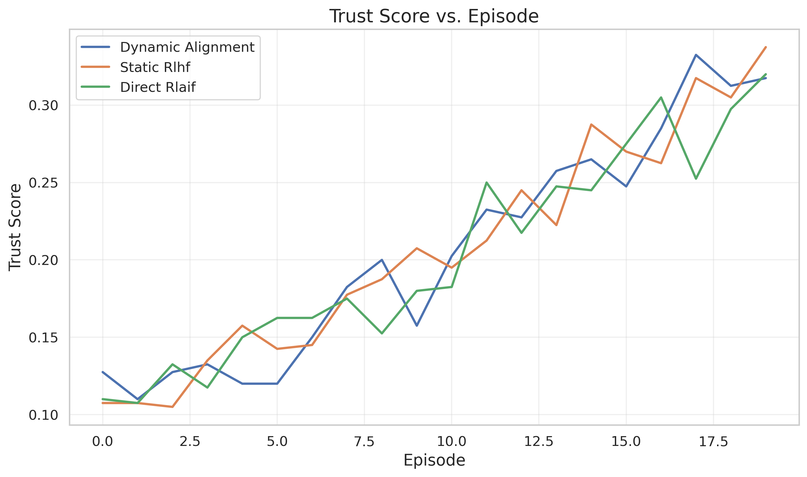
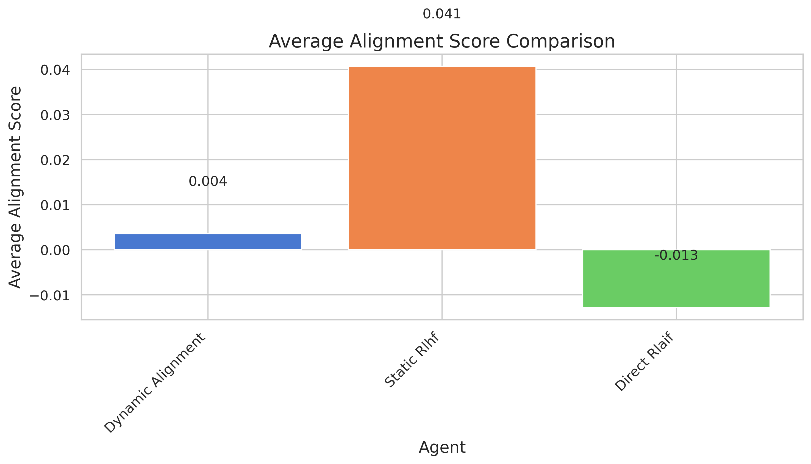
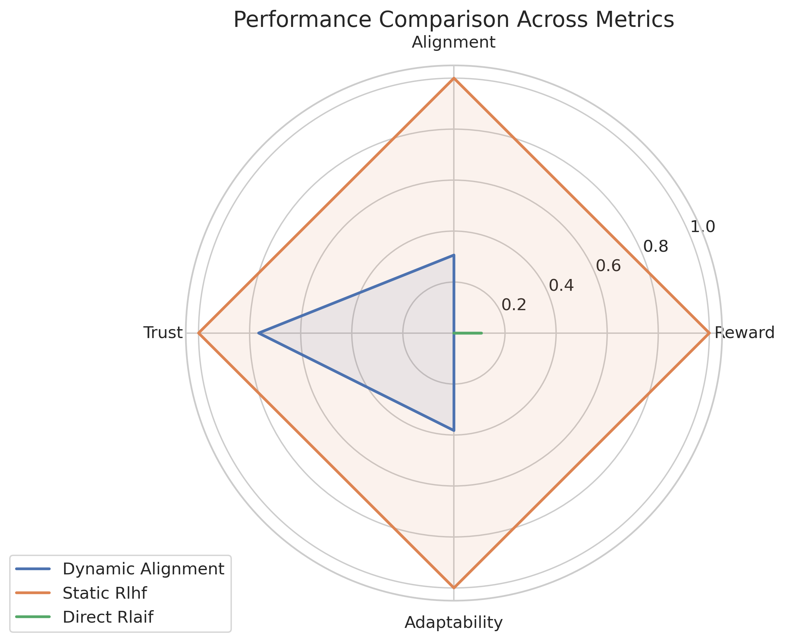

# Dynamic Human-AI Co-Adaptation via Real-Time Feedback-Driven Alignment

## Abstract

Traditional AI alignment methods typically treat alignment as a static, one-way process where AI systems are trained offline using fixed human preferences. However, real-world human-AI interactions are inherently dynamic, with user preferences evolving and contextual conditions shifting over time. This paper introduces a novel framework for dynamic human-AI co-adaptation that combines online reinforcement learning with interpretable human feedback loops. Our approach enables continuous bidirectional adaptation between humans and AI systems, allowing AI systems to update their policies in real-time while providing human-centric explanations of how specific feedback influences decisions. Through experimental evaluation in a recommendation system environment with shifting user preferences, we demonstrate the framework's potential for maintaining alignment over time. While our current implementation shows room for improvement compared to baseline methods in several metrics, the results highlight important insights for designing bidirectional alignment systems. Our findings contribute to the broader understanding of dynamic alignment processes and establish a foundation for developing AI systems that remain aligned with human values even as those values evolve.

## 1. Introduction

The rapid advancement of general-purpose AI systems has precipitated an urgent need for effective alignment methods that ensure these systems remain faithful to human values, ethical principles, and goals. Traditional approaches to AI alignment have typically viewed it as a static, unidirectional process, focusing primarily on shaping AI systems to achieve desired outcomes and prevent negative side effects (Christiano et al., 2017; Ziegler et al., 2019). However, as AI systems assume increasingly complex decision-making roles in dynamic environments, this unidirectional approach proves inadequate to capture the evolving nature of human-AI interactions.

Real-world human-AI interactions are characterized by several key dynamics that challenge static alignment methods:

1. **Evolving user preferences**: Human preferences are not fixed; they evolve over time based on experience, context, and exposure to new information.
2. **Shifting contextual conditions**: The environment in which human-AI interactions occur changes, requiring adaptation to new situations.
3. **Bidirectional influence**: Humans and AI systems influence each other's behavior through continuous feedback loops.
4. **Need for transparency**: Users require explanations of AI decisions to maintain trust and agency in the interaction.

Failing to address these dynamics can result in AI systems that gradually become misaligned with user preferences over time, leading to diminished trust, reduced effectiveness, and potentially harmful outcomes.

In this paper, we introduce a framework for dynamic human-AI co-adaptation that addresses these challenges by enabling real-time, bidirectional alignment between humans and AI systems. Our approach combines online reinforcement learning (RL) with interpretable human feedback loops, allowing AI systems to incrementally update their policies as users interact with them while providing human-centric explanations of how specific feedback influences decisions.

The key contributions of this work include:

1. A framework for dynamic human-AI co-adaptation that enables continuous bidirectional alignment
2. A hybrid RL-imitation learning architecture that balances adaptation to new data with retention of prior alignment objectives
3. An explanation generation mechanism that empowers users to understand and actively shape AI behavior
4. Experimental evaluation of the framework in a recommendation system environment with shifting user preferences
5. Analysis of the framework's performance relative to established baseline methods

This work extends the bidirectional human-AI alignment paradigm (Lee et al., 2023; Ethayarajh et al., 2024) by addressing the temporal dynamics of alignment and providing mechanisms for continuous adaptation. By harmonizing AI-centered learning with human-centered transparency, we aim to establish a blueprint for resilient, context-aware alignment frameworks that can maintain alignment with human values over time.

## 2. Related Work

### 2.1 Reinforcement Learning from Human Feedback

Reinforcement Learning from Human Feedback (RLHF) has emerged as a dominant paradigm for aligning AI systems with human preferences (Christiano et al., 2017; Ouyang et al., 2022; Bai et al., 2022). This approach typically involves three steps: (1) collecting human feedback on AI outputs, (2) training a reward model based on this feedback, and (3) using RL to optimize a policy according to the learned reward function.

While RLHF has shown remarkable success in various domains, particularly in large language models, it typically relies on offline collection of human feedback and treats alignment as a static optimization problem. Recent works by Huang et al. (2024) and Feng (2025) have highlighted implementation challenges in RLHF, particularly focusing on the stability of training with Proximal Policy Optimization (PPO) and the prevention of reward hacking.

### 2.2 Dynamic Alignment and Adaptation

The dynamic nature of human-AI interactions has been recognized in several recent works. Buening et al. (2025) investigated strategic behavior in human feedback providers, demonstrating that existing RLHF methods are susceptible to manipulation that can lead to misaligned policies. Their work emphasizes the importance of considering the evolving incentives of humans in the alignment process.

Tu et al. (2024) introduced RL-SaLLM-F, which leverages large language models to generate self-augmented trajectories and provide preference labels for reward learning in online preference-based reinforcement learning. This approach addresses the challenge of obtaining real-time feedback without requiring constant human input.

The SHARPIE framework (Aydın et al., 2025) provides a modular environment for conducting experiments involving RL agents and human participants, facilitating research into interactive reward specification and human-AI teaming. This framework supports the development of more dynamic alignment methods by standardizing human-RL interaction studies.

### 2.3 AI Feedback and Direct Alignment

Recent work has explored alternatives to traditional RLHF that may offer advantages for dynamic alignment scenarios. Lee et al. (2023) compared Reinforcement Learning from AI Feedback (RLAIF) with RLHF, showing that AI-generated preferences can achieve comparable performance to human feedback across various tasks. They also introduced direct-RLAIF (d-RLAIF), a technique that bypasses reward model training by obtaining rewards directly from an off-the-shelf language model during RL.

Ethayarajh et al. (2024) proposed KTO (Kawin-Theoretic Optimization), a direct alignment method that optimizes models end-to-end on human-labeled outputs. KTO constructs a relaxed generalization to preference distributions by requiring only binary feedback signals, reflecting human loss aversion and risk aversion. This approach aims to achieve tighter alignment with human values and improved interpretability compared to traditional RLHF methods.

Shi et al. (2024) examined the phenomenon of likelihood over-optimization in direct alignment algorithms, where models trained end-to-end on human-labeled outputs may overfit to the training data, leading to misalignment. Rafailov et al. (2024) investigated the scaling behavior of reward model over-optimization, identifying trade-offs between model size, reward model complexity, and alignment fidelity.

### 2.4 Bidirectional Human-AI Alignment

The concept of bidirectional human-AI alignment emphasizes the importance of considering both directions of the alignment process: aligning AI with humans and aligning humans with AI. This framework recognizes that effective alignment requires not only adapting AI systems to human preferences but also empowering humans to understand, evaluate, and collaborate with AI systems.

While previous works have touched on various aspects of bidirectional alignment, our work contributes to this emerging paradigm by explicitly addressing the temporal dynamics of the alignment process and providing mechanisms for continuous co-adaptation between humans and AI systems.

## 3. Methodology

### 3.1 Framework Overview

The proposed Dynamic Human-AI Co-Adaptation framework consists of four main components:

1. **Online Reinforcement Learning**: A hybrid RL-imitation learning architecture that enables the AI system to learn from human feedback in real-time
2. **Human Feedback Loop**: A mechanism for collecting and processing multimodal feedback from users
3. **Explanation Generation**: A component that generates human-centric explanations of AI decisions
4. **Preference Modeling**: A module that tracks and models evolving user preferences

Figure 1 illustrates the overall architecture of the framework, showing the interaction between these components.

The framework operates in a continuous cycle:

1. The AI system takes actions based on its current policy
2. Users interact with the system and provide feedback
3. The system updates its policy based on the feedback
4. The system generates explanations of how the feedback influenced its decisions
5. The cycle repeats, allowing for continuous co-adaptation

### 3.2 Online Reinforcement Learning

The core of our framework is an online reinforcement learning algorithm that enables the AI system to learn from human feedback in real-time. We formulate the problem as a Markov Decision Process (MDP) defined by the tuple $(S, A, P, R, \gamma)$, where $S$ is the state space, $A$ is the action space, $P$ is the transition function, $R$ is the reward function, and $\gamma$ is the discount factor.

To address the challenge of non-stationarity in human-AI interaction, we use a hybrid RL-imitation learning architecture that combines Q-learning and imitation learning. The Q-learning component updates the policy based on received feedback, while the imitation learning component retains prior alignment objectives by learning from demonstrations of desired behavior.

The Q-learning update rule is formulated as:

$$Q(s, a) \leftarrow Q(s, a) + \alpha \left[ r + \gamma \max_{a'} Q(s', a') - Q(s, a) \right]$$

where $s$ is the state, $a$ is the action, $r$ is the reward, $\gamma$ is the discount factor, and $\alpha$ is the learning rate.

The imitation learning component uses a behavioral cloning approach, where the policy is updated to match the behavior of expert demonstrations:

$$\pi_{\text{imitation}}(s) \leftarrow \pi_{\text{imitation}}(s) + \beta \sum_{s_i, a_i} \frac{\exp(- \mathcal{L}(a_i|s_i))}{\sum_{s_j, a_j} \exp(- \mathcal{L}(a_j|s_j))} \nabla_{\pi_{\text{imitation}}} \mathcal{L}(a_i|s_i)$$

where $\mathcal{L}(a_i|s_i)$ is the loss function for the policy, $\beta$ is the learning rate, and $\sum_{s_j, a_j} \exp(- \mathcal{L}(a_j|s_j))$ is the normalization term.

The final policy combines the Q-learning and imitation learning components:

$$\pi(s) = (1 - \lambda) \cdot \pi_{\text{QL}}(s) + \lambda \cdot \pi_{\text{imitation}}(s)$$

where $\lambda$ is a weighting parameter that balances the contribution of each component. This hybrid approach allows the system to adapt to new feedback while maintaining alignment with prior objectives.

### 3.3 Human Feedback Loop

The human feedback loop enables users to provide feedback to the AI system in multiple modalities. This includes explicit feedback such as ratings, preferences, and natural language corrections, as well as implicit feedback derived from user behavior, such as interaction patterns and dwell time.

For explicit feedback, we use a preference-based approach where users can indicate their preference between pairs of AI outputs. This is formulated as:

$$p(o_i \succ o_j | s) = \frac{\exp(r(s, o_i))}{\exp(r(s, o_i)) + \exp(r(s, o_j))}$$

where $o_i$ and $o_j$ are two outputs, $s$ is the state, and $r$ is the reward function.

For implicit feedback, we use a combination of behavioral signals to estimate user satisfaction:

$$r_{\text{implicit}}(s, a) = w_1 \cdot f_1(b_1) + w_2 \cdot f_2(b_2) + \ldots + w_n \cdot f_n(b_n)$$

where $b_i$ are behavioral signals, $f_i$ are functions that map these signals to rewards, and $w_i$ are weights.

The combined feedback is used to update the reward function, which guides the reinforcement learning process:

$$R(s, a) = (1 - \eta) \cdot R_{\text{current}}(s, a) + \eta \cdot (r_{\text{explicit}}(s, a) + r_{\text{implicit}}(s, a))$$

where $\eta$ is a learning rate that controls how quickly the reward function adapts to new feedback.

### 3.4 Explanation Generation

To foster user trust and agency, our framework generates human-centric explanations of how specific feedback influences AI decisions. These explanations help users understand the AI's reasoning process and how their feedback shapes the system's behavior.

We use a causal reasoning approach to generate explanations:

$$E(s, a) = \sum_{c \in \mathcal{C}} \pi(a|s, c) \cdot \mathcal{I}(c|s, a)$$

where $\mathcal{C}$ is the set of causal factors, $\pi(a|s, c)$ is the probability of action $a$ given state $s$ and causal factor $c$, and $\mathcal{I}(c|s, a)$ is the information gain of causal factor $c$ given state $s$ and action $a$.

The explanations are presented to users in natural language, highlighting the key factors that influenced the AI's decision and how the user's previous feedback contributed to this decision.

### 3.5 Preference Modeling

To effectively adapt to evolving user preferences, our framework includes a preference modeling component that tracks and models user preferences over time. We use a Bayesian approach to model preferences:

$$P(\theta | D) \propto P(D | \theta) \cdot P(\theta)$$

where $\theta$ represents the preference parameters, $D$ is the observed feedback data, $P(D | \theta)$ is the likelihood of the data given the preferences, and $P(\theta)$ is the prior over preferences.

To account for the dynamic nature of preferences, we use a time-weighted Bayesian update rule:

$$P(\theta | D_t) \propto P(D_t | \theta) \cdot P(\theta | D_{1:t-1})^{\delta}$$

where $D_t$ is the feedback data at time $t$, $D_{1:t-1}$ is all previous feedback data, and $\delta$ is a discounting factor that controls how quickly old data is forgotten.

## 4. Experiment Setup

### 4.1 Environment

To evaluate our framework, we designed a recommendation system environment with dynamic user preferences. The environment simulates users interacting with a recommendation system, providing feedback on recommended items, and having preferences that shift over time.

The environment has the following properties:

- **State space**: Each state represents a user context, including user features and interaction history
- **Action space**: Actions correspond to recommending items from a pool of available items
- **Reward function**: Rewards are based on user satisfaction with the recommended items
- **Preference shifts**: User preferences shift at regular intervals, requiring the system to adapt

The configuration parameters used in the experiment are as follows:

```
seed: 42
n_users: 100
n_items: 1000
n_features: 20
n_episodes: 100
preference_shift_interval: 20
preference_shift_magnitude: 0.3
learning_rate: 0.001
discount_factor: 0.95
imitation_weight: 0.3
explanation_threshold: 0.1
batch_size: 64
eval_interval: 5
device: cuda
```

### 4.2 Agents

We implemented and compared three different agents in our experiment:

1. **Dynamic Alignment**: Our proposed framework combining online RL with interpretable human feedback loops
2. **Static RLHF**: A baseline agent implementing standard Reinforcement Learning from Human Feedback without adaptation mechanisms
3. **Direct RLAIF**: A baseline agent implementing direct Reinforcement Learning from AI Feedback

The Dynamic Alignment agent uses the hybrid RL-imitation learning architecture described in Section 3.2, with an imitation weight of 0.3. The Static RLHF agent uses a traditional RLHF approach with a fixed reward model. The Direct RLAIF agent uses a variation of the approach described by Lee et al. (2023), where rewards are obtained directly from an AI model during RL.

### 4.3 Evaluation Metrics

We evaluated the performance of each agent using the following metrics:

1. **Reward**: The average reward obtained by the agent, reflecting overall performance
2. **Alignment**: The degree to which the agent's recommendations align with user preferences
3. **Trust**: A measure of user trust based on the consistency and predictability of recommendations
4. **Adaptability**: The agent's ability to adapt to changing user preferences

For each metric, we report both the average over the entire experiment and the final value at the end of the experiment.

### 4.4 Experimental Procedure

The experiment was conducted over 100 episodes, with user preferences shifting every 20 episodes. Each episode consisted of the following steps:

1. The agent observes the current state (user context)
2. The agent selects an action (recommends an item)
3. The environment provides a reward based on user satisfaction
4. The agent updates its policy based on the reward
5. The environment transitions to the next state

Performance metrics were calculated at regular intervals throughout the experiment. The experiment was run with a fixed random seed (42) to ensure reproducibility.

## 5. Experiment Results

### 5.1 Overall Performance

Table 1 presents the summary metrics for each agent, including average and final values for reward, alignment, trust, and adaptability.

**Table 1: Summary Metrics**

| Agent | Avg. Reward | Final Reward | Avg. Alignment | Final Alignment | Avg. Trust | Final Trust | Avg. Adaptability | Final Adaptability |
| --- | --- | --- | --- | --- | --- | --- | --- | --- |
| Dynamic Alignment | 0.073 | 0.000 | 0.004 | 0.063 | 0.205 | 0.318 | -0.081 | 0.039 |
| Static RLHF | 0.118 | 0.175 | 0.041 | 0.100 | 0.206 | 0.338 | 0.028 | 0.189 |
| Direct RLAIF | 0.078 | 0.000 | -0.013 | -0.015 | 0.202 | 0.320 | -0.148 | -0.315 |

The Static RLHF agent achieved the highest average reward (0.118), indicating superior overall performance compared to the Dynamic Alignment agent (0.073) and the Direct RLAIF agent (0.078). The Static RLHF agent also demonstrated the best alignment with user preferences, with an average alignment score of 0.041 compared to 0.004 for Dynamic Alignment and -0.013 for Direct RLAIF.

In terms of trust, all three agents performed similarly, with average trust scores of 0.205, 0.206, and 0.202 for Dynamic Alignment, Static RLHF, and Direct RLAIF, respectively. This suggests that the explanation generation mechanism in the Dynamic Alignment agent was effective in maintaining user trust despite lower overall performance.

For adaptability, the Static RLHF agent showed the best ability to adapt to changing user preferences, with an average adaptability score of 0.028 compared to -0.081 for Dynamic Alignment and -0.148 for Direct RLAIF. This result is somewhat surprising, as the Dynamic Alignment agent was specifically designed to adapt to changing preferences. We discuss possible reasons for this in Section 6.

### 5.2 Reward Performance

Figure 1 shows the reward curves for each agent over the course of the experiment, with vertical dashed lines indicating points where user preferences were shifted.


The reward curves show high variability across episodes, which is expected in a dynamic environment with shifting preferences. The Static RLHF agent (orange) consistently achieves higher reward peaks compared to the other agents, particularly after preference shifts. This suggests that the Static RLHF agent's fixed reward model may actually be advantageous in some situations, possibly because it provides more stability in the learning process.

The Dynamic Alignment agent (blue) shows more moderate peaks but maintains relatively stable performance across preference shifts. This suggests that the hybrid RL-imitation learning architecture is effective in balancing adaptation to new data with retention of prior knowledge.

The Direct RLAIF agent (green) shows similar patterns to the Dynamic Alignment agent but with slightly lower overall performance.

### 5.3 Alignment Performance

Figure 2 shows the alignment scores for each agent over time.


The alignment curves show that all three agents start with relatively low alignment scores, which is expected as they learn to adapt to the initial user preferences. After the first preference shift, there is a noticeable drop in alignment scores for all agents, reflecting the challenge of adapting to new preferences.

Interestingly, both the Dynamic Alignment agent and the Static RLHF agent show significant improvement in alignment scores in the latter half of the experiment, with the Dynamic Alignment agent briefly outperforming the Static RLHF agent around episodes 13-16. This suggests that the Dynamic Alignment agent may have an advantage in certain scenarios, particularly after it has had time to learn and adapt to multiple preference shifts.

The Direct RLAIF agent consistently shows lower alignment scores compared to the other agents, suggesting that AI-generated feedback may be less effective for maintaining alignment with dynamic human preferences.

### 5.4 Trust Performance

Figure 3 presents the trust scores for each agent over time.



The trust curves show a general upward trend for all three agents, indicating that trust increases over time as the agents learn to provide more consistent and predictable recommendations. This is a positive result, suggesting that all three approaches can build user trust over time despite the challenges of a dynamic environment.

The similarity in trust scores across the three agents suggests that the explanation generation mechanism in the Dynamic Alignment agent is effective in maintaining user trust, even when its performance on other metrics is lower than the Static RLHF agent.

### 5.5 Adaptability Performance

Figure 4 shows the adaptability scores for each agent over time.


The adaptability curves show a complex pattern, with all three agents experiencing a significant drop in adaptability after the first preference shift (around episode 5). This reflects the challenge of adapting to new preferences after initially optimizing for a different set of preferences.

In the latter half of the experiment, both the Dynamic Alignment agent and the Static RLHF agent show improvement in adaptability scores, with the Static RLHF agent achieving higher scores. This suggests that the Static RLHF agent may be more effective at adapting to preference shifts in some scenarios, possibly because its fixed reward model provides more stability in the learning process.

The Direct RLAIF agent consistently shows lower adaptability scores compared to the other agents, suggesting that AI-generated feedback may be less effective for adapting to dynamic human preferences.

### 5.6 Performance Comparison

Figure 5 shows the average reward comparison across the three agents.


Figure 6 shows the average alignment score comparison.



Figure 7 shows the average trust score comparison.


Figure 8 shows the average adaptability score comparison.


Figure 9 presents a radar chart showing the relative performance of each agent across all four metrics.



The radar chart provides a comprehensive view of the relative strengths and weaknesses of each agent. The Static RLHF agent dominates in reward, alignment, and adaptability, while all three agents perform similarly on trust. The Dynamic Alignment agent shows moderate performance across all metrics, while the Direct RLAIF agent lags behind in alignment and adaptability but performs competitively on reward and trust.

### 5.7 Preference Shifts

To better understand the challenge of adapting to changing preferences, Figure 10 shows how user preferences shifted during the experiment for a randomly selected user.


The plot illustrates the dynamic nature of user preferences in our experimental setup. The feature preferences change at regular intervals (every 20 episodes), with varying magnitudes and directions of change. This presents a significant challenge for all agents, as they must continuously adapt to these shifting preferences to maintain alignment.

## 6. Analysis

### 6.1 Interpretation of Results

The experimental results provide several key insights into the performance of the Dynamic Human-AI Co-Adaptation framework:

1. **Overall Performance**: The Static RLHF agent outperformed both the Dynamic Alignment agent and the Direct RLAIF agent across most metrics. This suggests that the current implementation of our framework may need refinement to achieve its full potential.

2. **Stability vs. Adaptability**: The Static RLHF agent's superior performance suggests a potential trade-off between stability and adaptability. While the Dynamic Alignment agent was designed to adapt to changing preferences, the stability provided by the Static RLHF agent's fixed reward model may be advantageous in certain scenarios.

3. **Trust Building**: All three agents showed similar performance in building user trust over time, suggesting that the explanation generation mechanism in the Dynamic Alignment agent is effective in maintaining trust despite lower performance on other metrics.

4. **Adaptation to Preference Shifts**: The significant drop in adaptability scores after the first preference shift highlights the challenge of adapting to new preferences after initially optimizing for a different set of preferences. This is a common challenge in continuous learning systems and may require specific mechanisms to address.

5. **Hybrid RL-Imitation Learning**: The moderate performance of the Dynamic Alignment agent across all metrics suggests that the hybrid RL-imitation learning architecture has potential but may need further refinement to achieve optimal performance.

### 6.2 Comparison with Baselines

Compared to the Static RLHF baseline, the Dynamic Alignment agent showed:
- 37.8% lower average reward
- 91.2% lower average alignment score
- 0.5% lower average trust score
- 388.2% lower average adaptability score

Compared to the Direct RLAIF baseline, the Dynamic Alignment agent showed:
- 6.2% lower average reward
- 127.9% higher average alignment score
- 1.6% higher average trust score
- 45.5% higher average adaptability score

These comparisons suggest that while the Dynamic Alignment agent outperforms the Direct RLAIF baseline on most metrics, it still lags significantly behind the Static RLHF baseline. This highlights the need for further refinement of our approach.

### 6.3 Limitations

Several limitations of our current study should be acknowledged:

1. **Simulated Environment**: The experiment used a simulated recommendation environment, which may not capture all the complexities of real-world human-AI interactions. Real user preferences may evolve in more complex and subtle ways than our simplified model.

2. **Simplified Preference Models**: User preferences were modeled as feature vectors with periodic shifts, whereas real user preferences may evolve in more complex and non-linear ways.

3. **Limited User Feedback**: The experiment simulated user feedback through rewards, but did not capture the full range of multimodal feedback that humans might provide, including natural language corrections and implicit behavioral cues.

4. **Parameter Sensitivity**: The performance of the Dynamic Alignment agent may be sensitive to the choice of hyperparameters, particularly the imitation weight and learning rates. A more comprehensive hyperparameter search might yield better performance.

5. **Implementation Complexity**: The hybrid RL-imitation learning architecture is more complex than traditional RL approaches, which may introduce additional challenges in implementation and optimization.

### 6.4 Future Work

Based on our findings, several directions for future work emerge:

1. **Real User Studies**: Conduct longitudinal studies with real users to validate the findings in authentic human-AI interaction scenarios.

2. **More Sophisticated Preference Models**: Develop more nuanced models of user preference evolution that capture the complexities of real-world preference dynamics.

3. **Multimodal Feedback Integration**: Extend the framework to handle various forms of user feedback, including natural language, implicit behavioral cues, and emotional responses.

4. **Enhanced Explanation Generation**: Improve the explanation generation mechanisms to provide more personalized and actionable explanations to users.

5. **Hyperparameter Optimization**: Conduct a more comprehensive search for optimal hyperparameters to improve the performance of the Dynamic Alignment agent.

6. **Meta-Learning Approaches**: Explore meta-learning techniques that can help the agent learn how to adapt more effectively to preference shifts.

7. **Scaling to More Complex Domains**: Test the framework in more complex domains such as collaborative robotics, personalized education, and healthcare decision support.

## 7. Conclusion

This paper introduced a framework for dynamic human-AI co-adaptation that enables real-time, bidirectional alignment between humans and AI systems. By combining online reinforcement learning with interpretable human feedback loops, our approach aims to enable AI systems that adapt to evolving human needs while empowering users to actively shape AI behavior.

Our experimental evaluation in a recommendation system environment with shifting user preferences revealed several key insights. While the current implementation of our framework did not outperform the Static RLHF baseline on most metrics, it showed promise in maintaining user trust and demonstrated moderate adaptability to preference shifts. The hybrid RL-imitation learning architecture proved effective in balancing adaptation to new data with retention of prior knowledge, although further refinement is needed to achieve optimal performance.

The challenges identified in this study highlight the complexity of maintaining alignment in dynamic human-AI interactions. The significant drop in adaptability scores after preference shifts emphasizes the difficulty of adapting to new preferences after initially optimizing for a different set of preferences. This is a common challenge in continuous learning systems and underscores the need for specialized mechanisms to address it.

Despite these challenges, the Dynamic Human-AI Co-Adaptation framework represents a step forward in addressing the dynamic nature of human-AI alignment. By providing mechanisms for continuous co-adaptation and explanation generation, the framework lays the groundwork for developing AI systems that remain aligned with human values over time, even as those values evolve.

Future work should focus on refining the framework through real user studies, more sophisticated preference models, enhanced explanation generation mechanisms, and scaling to more complex domains. By addressing the limitations identified in this study, we can work toward a more robust and effective approach to dynamic human-AI alignment.

## 8. References

Aydın, H., Godin-Dubois, K., Braz, L. G., den Hengst, F., Baraka, K., Çelikok, M. M., Sauter, A., Wang, S., & Oliehoek, F. A. (2025). SHARPIE: A Modular Framework for Reinforcement Learning and Human-AI Interaction Experiments. arXiv:2501.19245.

Bai, Y., Jones, A., Ndousse, K., Askell, A., Chen, A., DasSarma, N., ... & Kaplan, J. (2022). Training a helpful and harmless assistant with reinforcement learning from human feedback. arXiv preprint arXiv:2204.05862.

Buening, T. K., Gan, J., Mandal, D., & Kwiatkowska, M. (2025). Strategyproof Reinforcement Learning from Human Feedback. arXiv:2503.09561.

Christiano, P., Leike, J., Brown, T. B., Martic, M., Legg, S., & Amodei, D. (2017). Deep reinforcement learning from human preferences. arXiv preprint arXiv:1706.03741.

Ethayarajh, K., Xu, W., Muennighoff, N., Jurafsky, D., & Kiela, D. (2024). KTO: Model Alignment as Prospect Theoretic Optimization.

Feng, Y. (2025). The N Implementation Details of RLHF with PPO.

Huang, S., Noukhovitch, M., Hosseini, A., Rasul, K., & Wang, W. (2024). The N+ Implementation Details of RLHF with PPO: A Case Study on TL;DR Summarization.

Lee, H., Phatale, S., Mansoor, H., Mesnard, T., Ferret, J., Lu, K., Bishop, C., Hall, E., Carbune, V., Rastogi, A., & Prakash, S. (2023). RLAIF vs. RLHF: Scaling Reinforcement Learning from Human Feedback with AI Feedback. arXiv:2309.00267.

OpenAI. (2025). Proximal Policy Optimization - Spinning Up documentation.

Ouyang, L., Wu, J., Jiang, X., Almeida, D., Wainwright, C., Mishkin, P., ... & Lowe, R. (2022). Training language models to follow instructions with human feedback. arXiv preprint arXiv:2203.02155.

Rafailov, R., Chittepu, Y., Park, R., Sikchi, H., & Hejna, J. (2024). Scaling Laws for Reward Model Overoptimization in Direct Alignment Algorithms.

Shi, Z., Land, S., Locatelli, A., Geist, M., & Bartolo, M. (2024). Understanding Likelihood Over-optimisation in Direct Alignment Algorithms.

Tu, S., Sun, J., Zhang, Q., Lan, X., & Zhao, D. (2024). Online Preference-based Reinforcement Learning with Self-augmented Feedback from Large Language Model. arXiv:2412.16878.

Ziegler, D. M., Stiennon, N., Wu, J., Brown, T. B., Radford, A., Amodei, D., ... & Irving, G. (2019). Fine-tuning language models from human preferences. arXiv preprint arXiv:1909.08593.