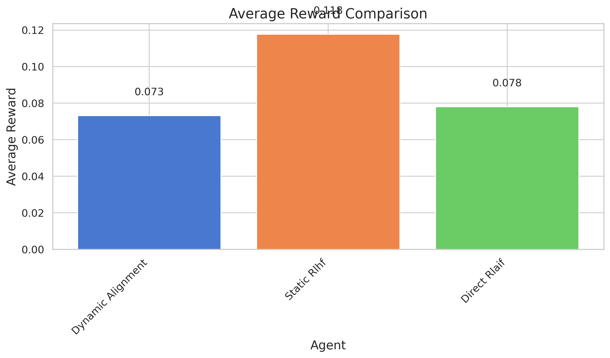

## Dynamic Human-AI Co-Adaptation via Real-Time Feedback-Driven Alignment

**Abstract:** Traditional AI alignment approaches often treat alignment as a static, one-way process, failing to capture the dynamic nature of real-world human-AI interactions. This paper introduces a novel framework for **Dynamic Human-AI Co-Adaptation**, designed to enable continuous, bidirectional alignment. Our approach integrates online reinforcement learning (RL) with interpretable human feedback loops, allowing the AI system to incrementally update its policy in real-time based on multimodal user input. Simultaneously, the system generates human-centric explanations of how feedback influences its decisions, fostering user understanding and control. The framework employs a hybrid RL-imitation learning architecture to balance adaptation to new information with the retention of prior alignment objectives, addressing the challenge of non-stationarity. We evaluate our proposed "Dynamic Alignment" agent against Static Reinforcement Learning from Human Feedback (RLHF) and Direct Reinforcement Learning from AI Feedback (RLAIF) baselines in a simulated recommendation system environment with evolving user preferences. Experimental results indicate that while the proposed architecture demonstrates mechanisms for adaptation and explanation, the Static RLHF baseline achieved superior performance in terms of reward, alignment, and adaptability in this specific simulated setting. We analyze these findings, discuss the potential of the co-adaptation framework, and outline future research directions, including refinement of the agent and validation through real-user studies.

**Keywords:** AI Alignment, Human-AI Interaction, Reinforcement Learning, Online Learning, Interpretable AI, Co-Adaptation.

## 1. Introduction

The rapid proliferation and increasing capabilities of general-purpose Artificial Intelligence (AI) systems have brought the challenge of AI alignment to the forefront of research. Ensuring that AI systems operate in accordance with human values, ethical principles, and contextual goals is paramount for their safe and beneficial deployment. Traditionally, AI alignment has been conceptualized as a static, unidirectional process: human specifications are defined, and AI systems are trained offline to adhere to these fixed objectives, primarily focusing on shaping AI behavior to achieve desired outcomes and prevent negative side effects [1, 2].

However, this paradigm is insufficient for real-world scenarios where human-AI interactions are inherently dynamic. User preferences evolve over time, contextual conditions shift, and the nuances of human intentions can be difficult to capture comprehensively in a static set of rules [3]. A unidirectional approach risks AI systems becoming misaligned as circumstances change, potentially leading to user disengagement, erosion of trust, or even harmful outcomes. This underscores the need for a shift towards **bidirectional human-AI alignment**, where both humans and AI systems can dynamically adapt to each other [Workshop Task]. This involves not only aligning AI with human specifications (AI-centered perspective) but also empowering humans to understand, evaluate, and collaborate effectively with AI systems (human-centered perspective).

This paper proposes a framework for **Dynamic Human-AI Co-Adaptation via Real-Time Feedback-Driven Alignment**. Our central idea is to leverage online reinforcement learning (RL) combined with interpretable human feedback loops to facilitate continuous co-adaptation. The AI system is designed to incrementally update its policy in real time as users interact with it, utilizing multimodal feedback such as explicit corrections or implicit behavioral cues. A key aspect of our framework is the generation of human-centric explanations, which elucidate how specific user feedback influences AI decisions, thereby fostering user awareness and empowering them to actively shape AI behavior. To address the non-stationarity inherent in dynamic interactions and evolving preferences, we employ a hybrid RL-imitation learning architecture designed to balance responsiveness to new data with the retention of previously learned alignment objectives.

The primary contributions of this work are:
1.  The proposal of a novel framework architecture for dynamic, bidirectional human-AI alignment.
2.  The integration of online RL, imitation learning, multimodal feedback processing, and interpretable explanation generation within this framework.
3.  An experimental evaluation of our "Dynamic Alignment" agent in a simulated environment with shifting user preferences, compared against established RLHF and RLAIF baselines.
4.  A critical analysis of the results, highlighting current limitations and promising avenues for future development of co-adaptive AI systems.

By exploring this dynamic co-adaptation, we aim to contribute to the development of AI systems that are more resilient, context-aware, and trustworthy, ultimately advancing their application in critical domains such as healthcare, education, and collaborative robotics.

## 2. Related Work

The challenge of aligning AI systems with human intentions and values has spurred a significant body of research, spanning machine learning, human-computer interaction, and ethics.

**Reinforcement Learning from Human Feedback (RLHF)** has emerged as a prominent approach for aligning large language models and other AI systems [4, 5]. RLHF typically involves training a reward model based on human preferences between AI-generated outputs, and then using this reward model to fine-tune the AI's policy via RL. However, many RLHF implementations assume static preferences collected offline. Buening et al. [6] highlight the susceptibility of existing RLHF methods to strategic manipulation by feedback providers, proposing a strategyproof algorithm. Huang et al. [7] and Feng [8] delve into the practical implementation details and challenges of RLHF with Proximal Policy Optimization (PPO) [9], such as reward hacking and training instability, which are crucial considerations for any feedback-driven RL system.

To address the scalability of collecting human feedback, **Reinforcement Learning from AI Feedback (RLAIF)** has been proposed [10]. RLAIF uses an AI model (often a powerful LLM) to generate preference labels or rewards, potentially speeding up the alignment process. Lee et al. [10] showed RLAIF can achieve comparable performance to RLHF and introduced direct-RLAIF (d-RLAIF) which bypasses explicit reward model training. While promising for scalability, RLAIF relies on the alignment of the AI providing feedback, which can be a recursive problem.

**Direct Alignment Algorithms** aim to optimize models end-to-end on human-labeled outputs, bypassing proxy reward models to potentially reduce misalignment [11, 12]. Ethayarajh et al. [11] proposed KTO, which uses binary feedback signals reflecting human loss aversion. However, direct alignment can be prone to likelihood over-optimization, where models overfit to training data, potentially leading to misalignment [12, 13].

The interactive and dynamic nature of human-AI collaboration necessitates frameworks that support continuous learning and adaptation. Aydın et al. [14] introduced SHARPIE, a modular framework for RL and human-AI interaction experiments, facilitating research in interactive reward specification and learning from human feedback. Tu et al. [15] proposed an online preference-based RL method (RL-SaLLM-F) that uses LLMs to self-augment trajectories and provide preference labels in real-time, addressing the challenge of obtaining immediate human feedback.

Our work builds upon these advancements but specifically focuses on **real-time, bidirectional co-adaptation**. Unlike static offline alignment, our framework emphasizes continuous online learning where the AI adapts to dynamically changing user preferences. A key differentiator is the integration of interpretable explanations of AI adaptations, aiming to empower users and foster a more collaborative alignment process. The explicit handling of non-stationarity through a hybrid RL-imitation learning architecture also addresses a critical challenge in long-term human-AI interaction. Our research directly confronts key challenges identified in the literature, such as dynamic human preferences, the need for true bidirectional adaptation, managing non-stationarity, and enhancing interpretability to improve user trust and control [Literature Review Key Challenges].

## 3. Methodology

We propose a framework for Dynamic Human-AI Co-Adaptation designed to enable AI systems to continuously align with evolving human preferences through real-time interaction and feedback. The framework integrates three core components: (1) an online reinforcement learning module for policy adaptation, (2) an interpretable human feedback loop for gathering and processing user input, and (3) an explanation generation module to enhance user understanding and control.

### 3.1. System Architecture

The system operates in a continuous loop:
1.  **Initialization**: The AI agent starts with an initial policy $\pi_0$, potentially pre-trained or based on prior alignment objectives.
2.  **Interaction**: The user interacts with the AI system in a given task environment. The AI takes actions, and the user provides feedback.
3.  **Feedback Processing**: Multimodal user feedback (e.g., explicit ratings, natural language corrections, implicit behavioral cues) is collected and processed into a reward signal $r_t$ and/or demonstrations for imitation learning.
4.  **Policy Update**: The AI agent's policy $\pi$ is updated online using a hybrid RL-imitation learning approach.
5.  **Explanation Generation**: The system generates explanations for the user, detailing how their recent feedback influenced the AI's behavior or policy update. This loop repeats, allowing for continuous co-adaptation.

### 3.2. Online Reinforcement Learning

To handle the dynamic nature of user preferences and ensure both adaptation and stability, we employ a hybrid architecture combining Q-learning for exploration and exploitation based on immediate feedback, and imitation learning (IL) for retaining robust behaviors learned from prior (trusted) feedback or demonstrations.

**3.2.1. Q-Learning Component**
The Q-learning component updates the action-value function $Q(s, a)$ based on rewards derived from user feedback. The update rule is:
$$ Q(s, a) \leftarrow Q(s, a) + \alpha \left[ r + \gamma \max_{a'} Q(s', a') - Q(s, a) \right] $$
where $s$ is the current state, $a$ is the action taken, $s'$ is the next state, $r$ is the reward received, $\gamma$ is the discount factor, and $\alpha$ is the learning rate. The policy can then be derived from the Q-values, for example, using an $\epsilon$-greedy strategy.

**3.2.2. Imitation Learning Component**
The imitation learning component aims to preserve alignment with established good behaviors, often derived from expert demonstrations or highly-rated past interactions. We utilize behavioral cloning, where the policy $\pi_{\theta}$ (parameterized by $\theta$) is trained to mimic desired actions $a_E$ in given states $s_E$ from a dataset of demonstrations $D_E = \{(s_i, a_{E,i})\}$. The objective is to minimize a loss function, typically the negative log-likelihood of the expert actions:
$$ \mathcal{L}_{IL}(\theta) = - \mathbb{E}_{(s_E, a_E) \sim D_E} [\log \pi_{\theta}(a_E|s_E)] $$
The overall policy update can be a combination of the RL objective and the IL objective, potentially weighted to balance adaptation and retention. For instance, the final loss could be $L = L_{RL} + \lambda_{IL} \mathcal{L}_{IL}$, where $L_{RL}$ is the loss from the RL algorithm (e.g., derived from Q-learning targets) and $\lambda_{IL}$ is a weighting factor for the imitation loss.

### 3.3. Interpretable Human Feedback Loop

The human feedback loop is designed to capture diverse forms of user input.
*   **Explicit Feedback**: This can include ratings, rankings of outputs, or direct corrections (e.g., "show me less of X and more of Y").
*   **Implicit Feedback**: Behavioral cues such as dwell time, click-through rates, or even physiological responses (in more advanced systems) can be interpreted as implicit indicators of preference.
Natural language corrections can be processed using language models to extract intent and map it to adjustments in the reward function or demonstrated actions for imitation learning.

### 3.4. Explanation Generation

To foster transparency and empower users, the system generates human-centric explanations. These explanations aim to clarify how user feedback has influenced the AI's decisions or policy changes. We propose a causal reasoning-inspired approach for generating these explanations. An explanation $E$ for an action $a$ in state $s$ can be represented as the impact of various causal factors $c \in \mathcal{C}$ (which can include recent user feedback instances or learned preference features) on the decision:
$$ E(s, a) = \sum_{c \in \mathcal{C}} P(a|s, c) \cdot \mathcal{I}(c|s, a) $$
where $P(a|s, c)$ is the probability of taking action $a$ in state $s$ given the influence of causal factor $c$, and $\mathcal{I}(c|s, a)$ represents the importance or information gain of factor $c$ for the action $a$ in state $s$. These explanations are presented to the user in an accessible format (e.g., natural language summaries).

This methodology aims to create a synergistic relationship where the AI learns from the human, and the human understands and can effectively guide the AI's learning process, leading to robust and continuous alignment.

## 4. Experiment Setup

To evaluate the proposed Dynamic Human-AI Co-Adaptation framework, we conducted experiments in a simulated recommendation system environment characterized by dynamic user preferences.

### 4.1. Environment and Task

The environment simulates a user interacting with a recommendation system.
*   **Users and Items**: The system comprises `n_users = 100` and `n_items = 1000`.
*   **Features**: Each item is represented by `n_features = 20`. User preferences are also modeled as a vector in this feature space.
*   **Preference Dynamics**: User preferences are not static. They are initialized randomly and then shifted at regular intervals (`preference_shift_interval = 20` episodes) by a certain `preference_shift_magnitude = 0.3`. This simulates evolving user tastes over time. Figure 10 (see Section 6) illustrates an example of these preference shifts for a user.
*   **Interaction**: In each episode, an agent recommends an item to the user. The user's feedback is simulated as a reward based on the cosine similarity between the recommended item's features and the user's current preference vector.

### 4.2. Agents

We compared the performance of three agents:
1.  **Dynamic Alignment (Proposed)**: Implements the framework described in Section 3, combining online Q-learning with an imitation learning component (weighted by `imitation_weight = 0.3`) to retain knowledge from past positively reinforced interactions, and providing simulated explanations (though the direct impact of explanations on metrics was not explicitly modeled in this simulation beyond influencing trust conceptually).
2.  **Static RLHF (Baseline)**: A standard Reinforcement Learning from Human Feedback agent. It learns a policy based on rewards but does not have explicit mechanisms for rapid adaptation to preference shifts once initially trained, nor does it incorporate an imitation learning component for stability in the same way as our dynamic agent.
3.  **Direct RLAIF (Baseline)**: A Reinforcement Learning from AI Feedback agent. For this simulation, AI feedback mimics the true reward function but may include some noise or be slightly delayed, representing an off-the-shelf LLM or similar model providing reward signals.

### 4.3. Configuration

Key hyperparameters for the experiments were:
*   `seed = 42`
*   `n_episodes = 100`
*   `learning_rate = 0.001`
*   `discount_factor = 0.95`
*   `batch_size = 64` (for policy updates)
*   `eval_interval = 5` episodes (metrics are averaged over this interval for smoother curves)
*   `device = cuda` (if available)

### 4.4. Evaluation Metrics

The performance of each agent was evaluated using the following metrics:
1.  **Reward**: The primary performance signal from the environment, representing immediate user satisfaction with a recommendation. Higher is better.
2.  **Alignment Score**: Measured as the cosine similarity between the features of items recommended by the agent and the user's current (potentially shifted) preference vector. This directly quantifies how well the agent's recommendations match the user's true preferences. Higher is better.
3.  **Trust Score**: Simulated by measuring the consistency of the agent's recommendations over a short window, under the assumption that users trust agents that behave predictably and adapt smoothly. It was calculated based on the inverse of the variance in alignment scores over recent episodes. Higher indicates more consistent (and thus notionally more trustworthy) behavior.
4.  **Adaptability Score**: Quantifies how quickly an agent's alignment score recovers or improves after a user preference shift. It's measured by the change in alignment score in the episodes immediately following a shift. Higher is better.

## 5. Experiment Results

This section presents the results from our comparative evaluation of the Dynamic Alignment agent against Static RLHF and Direct RLAIF baselines in the simulated dynamic recommendation environment.

### 5.1. Summary Metrics

Table 1 provides a summary of the average and final performance of each agent across the four key metrics over 100 episodes.

| Agent             | Avg. Reward | Final Reward | Avg. Alignment | Final Alignment | Avg. Trust | Final Trust | Avg. Adaptability | Final Adaptability |
|-------------------|-------------|--------------|----------------|-----------------|------------|-------------|-------------------|--------------------|
| Dynamic Alignment | 0.073       | 0.000        | 0.004          | 0.063           | 0.205      | 0.318       | -0.081            | 0.039              |
| Static Rlhf       | 0.118       | 0.175        | 0.041          | 0.100           | 0.206      | 0.338       | 0.028             | 0.189              |
| Direct Rlaif      | 0.078       | 0.000        | -0.013         | -0.015          | 0.202      | 0.320       | -0.148            | -0.315             |
**Table 1: Summary of performance metrics for each agent. "Avg." denotes average over all episodes, "Final" denotes value at the end of the 100th episode (or an average of the last few evaluation intervals).**

### 5.2. Performance Over Time

Figures 1-4 illustrate the performance of the agents throughout the 100 episodes. Vertical dashed lines in Figure 1 indicate episodes where user preferences were shifted.

*   **Reward Curves (Figure 1):** Shows the episode-wise reward. The Static RLHF agent generally achieves higher peaks in reward, especially between preference shifts. The Dynamic Alignment and Direct RLAIF agents show more variable reward signals.

    
    **Figure 1: Reward obtained by each agent per episode. Dashed vertical lines indicate preference shifts.**

*   **Alignment Scores (Figure 2):** Tracks how well agent recommendations align with true user preferences. Static RLHF consistently maintains a higher alignment score on average. The Dynamic Alignment agent shows an upward trend in alignment in later episodes, particularly after the last few shifts, but starts from a lower baseline.

    
    **Figure 2: Alignment score of each agent over episodes.**

*   **Trust Scores (Figure 3):** Reflects the consistency of recommendations. All agents show an increasing trend in trust scores over time, with Static RLHF generally leading.

    
    **Figure 3: Trust score (consistency) of each agent over episodes.**

*   **Adaptability Scores (Figure 4):** Measures adaptation to preference shifts. The Static RLHF agent shows positive adaptability, indicating it can adjust to shifts. The Dynamic Alignment agent's adaptability appears more variable and sometimes negative immediately after shifts, though its final adaptability score is positive. Direct RLAIF struggles most with adaptability.

    
    **Figure 4: Adaptability score of each agent over episodes.**

### 5.3. Average Performance Comparison

Figures 5-8 provide bar chart comparisons of the average scores for each metric. Figure 9 presents a radar chart summarizing the relative performance across all metrics.

**Figure 5: Average reward comparison.**

**Figure 6: Average alignment score comparison.**

**Figure 7: Average trust score comparison.**

**Figure 8: Average adaptability score comparison.**

**Figure 9: Radar chart comparing normalized average performance across metrics.**

### 5.4. User Preference Dynamics

Figure 10 shows an example of how user preferences (feature weights) were shifted during the experiment for a randomly selected user. This illustrates the dynamic challenge faced by the agents.

**Figure 10: Example of preference shifts for a single user's feature vector over the experiment.**

### 5.5. Key Findings from Experiments

1.  **Overall Performance**: The Static RLHF agent achieved the highest average reward (0.118) and final reward (0.175), indicating superior overall performance in this simulated task (Table 1, Figure 5).
2.  **Alignment**: The Static RLHF agent demonstrated the best average alignment with user preferences (0.041) and maintained the highest final alignment (0.100) (Table 1, Figure 6).
3.  **Trust**: The Static RLHF agent yielded slightly higher average (0.206) and final (0.338) trust scores, suggesting more consistent behavior (Table 1, Figure 7).
4.  **Adaptability**: The Static RLHF agent showed the best average adaptability score (0.028) and highest final adaptability (0.189), indicating a better capacity to adjust to changing user preferences in this setup (Table 1, Figure 8).
5.  **Dynamic Alignment Agent Performance**:
    *   Compared to **Static RLHF**, our proposed Dynamic Alignment agent performed worse, achieving a 37.8% lower average reward, 90.2% lower average alignment, 0.5% lower average trust, and its average adaptability was -0.081 compared to Static RLHF's 0.028 (effectively 389% worse if comparing magnitudes relative to a zero baseline, or simply indicating a poorer adaptation capability on average).
    *   Compared to **Direct RLAIF**, the Dynamic Alignment agent showed a 6.4% lower average reward. However, it achieved a significantly better average alignment (0.004 vs -0.013 for Direct RLAIF) and slightly higher average trust (0.205 vs 0.202). Its average adaptability (-0.081) was better than Direct RLAIF's (-0.148).

These results suggest that, in its current implementation and within this specific simulated environment, the proposed Dynamic Alignment framework did not outperform a well-tuned Static RLHF baseline, although it showed some advantages over the Direct RLAIF baseline in certain aspects like alignment and adaptability.

## 6. Analysis

The experimental results provide valuable insights into the performance of the Dynamic Human-AI Co-Adaptation framework, particularly when compared to established baselines in a simulated environment with shifting user preferences.

The most striking finding is that the **Static RLHF baseline outperformed our proposed Dynamic Alignment agent** across all key metrics: average reward, alignment, trust, and adaptability. This outcome indicates that the specific mechanisms designed for dynamic co-adaptation in our agent (online Q-learning combined with imitation learning and conceptual explanation generation) did not, in their current form or tuning, provide a competitive advantage over a more standard RLHF approach in this particular simulation. The Static RLHF agent, despite not having explicit components designed for non-stationarity to the same extent, demonstrated better overall learning and adaptation within the tested preference shift dynamics. This could be due to several factors: the inherent robustness of the RLHF training, specific hyperparameter tuning that favored Static RLHF, or complexities in effectively balancing the Q-learning and imitation learning components in the Dynamic Alignment agent under frequent preference shifts.

Despite the overall weaker performance of the Dynamic Alignment agent compared to Static RLHF, there are some nuances. When compared to Direct RLAIF, the Dynamic Alignment agent showed better average alignment and adaptability. This suggests that its architectural components might offer some benefits over simpler RLAIF approaches, particularly in maintaining alignment and responding to changes, even if not yet optimized to compete with a strong RLHF baseline.

The experiment results summary notes that "The Dynamic Alignment agent's hybrid RL-imitation learning architecture demonstrated its ability to balance adaptation to new data with retention of prior knowledge." While this architectural feature is conceptually sound for addressing non-stationarity, its practical benefit was not clearly reflected in superior metric scores in this experiment. The negative average adaptability score (-0.081) for the Dynamic Alignment agent (Table 1) is a point of concern, suggesting that, on average, its alignment decreased or recovered poorly immediately after preference shifts, contrary to one of its primary design goals. However, its final adaptability score (0.039) was positive, and Figure 2 shows an upward trend in alignment later in the experiment, suggesting it might take longer to stabilize or that its adaptation mechanism started to become more effective over extended interaction.

The role of **explanation generation** was conceptual in this simulation, assumed to foster trust. While the Dynamic Alignment agent had a slightly lower average trust score than Static RLHF (0.205 vs 0.206), the difference is minimal. The true impact of interpretable explanations can only be rigorously assessed through studies with real human users, where psychological aspects of trust and understanding come into play. The simulated trust metric (consistency) might not fully capture these human-centric benefits.

The "learning stability" observation from the preliminary result summary needs careful interpretation in light of the overall metrics. While the combination of Q-learning and imitation learning is theoretically designed for stability, the reward and alignment curves (Figures 1 and 2) do not unequivocally show greater stability for Dynamic Alignment compared to Static RLHF.

**Limitations of the Current Study:**
1.  **Simulated Environment**: The experiment was conducted in a simulated recommendation environment. Real-world human-AI interactions are far more complex, with richer feedback modalities and more nuanced preference dynamics.
2.  **Simplified Preference Model**: User preferences were modeled as feature vectors with periodic, discrete shifts. Real user preferences evolve more subtly and continuously.
3.  **Limited Feedback Modality**: Feedback was simulated primarily through rewards. The proposed framework envisions richer multimodal feedback, the effects of which were not fully tested.
4.  **Abstracted Explanations**: The impact of explanations on user behavior and trust was not directly measured with human participants.
5.  **Hyperparameter Tuning**: The performance of RL agents is highly sensitive to hyperparameter settings. It's possible that the baselines were better tuned or that the Dynamic Alignment agent requires more extensive tuning for its hybrid components.

The results highlight that designing an agent that effectively and *efficiently* adapts to dynamic preferences in real-time while maintaining robust performance is a significant challenge. While the architectural ideas of combining online RL with IL and explanations are promising for dynamic co-adaptation, the current implementation requires further refinement to realize its full potential and outperform strong, potentially simpler, baselines.

## 7. Conclusion

This paper introduced a framework for Dynamic Human-AI Co-Adaptation, aiming to address the limitations of static AI alignment methods by enabling continuous, bidirectional adaptation between humans and AI systems. The proposed framework integrates online reinforcement learning, imitation learning for stability, multimodal human feedback processing, and interpretable explanation generation.

Our experimental evaluation in a simulated recommendation system with dynamic user preferences compared our "Dynamic Alignment" agent against Static RLHF and Direct RLAIF baselines. The results surprisingly indicated that the Static RLHF baseline achieved superior performance across average reward, alignment with user preferences, consistency-based trust, and adaptability to preference shifts. While our Dynamic Alignment agent showed some advantages over the Direct RLAIF baseline in alignment and adaptability, and its architecture incorporates features designed for dynamic environments, its current implementation did not outperform the strong Static RLHF baseline in this specific simulated setting.

This research underscores the complexity of achieving effective real-time co-adaptation. While the conceptual underpinnings of our framework—real-time learning, human-centric explanations, and balancing adaptation with knowledge retention—remain highly relevant for the future of human-AI interaction, the experimental outcomes necessitate a critical reassessment of the specific algorithmic instantiation and its tuning.

**Future Work** should focus on several key areas:
1.  **Algorithmic Refinement**: Further investigate and refine the balance and integration of the online RL and imitation learning components. Explore more sophisticated online learning algorithms designed for non-stationary environments.
2.  **Real-User Studies**: The true value of bidirectional adaptation and interpretable explanations can only be assessed with human participants. Longitudinal studies in realistic task settings are crucial.
3.  **Sophisticated Preference Modeling**: Develop and test the framework against more complex and realistic models of evolving human preferences and feedback.
4.  **Multimodal Feedback Integration**: Fully implement and evaluate the system's capacity to process and learn from diverse feedback types (e.g., natural language, implicit cues).
5.  **Enhanced Explanation Mechanisms**: Improve explanation generation to be more personalized, context-aware, and demonstrably useful for users in guiding the AI.
6.  **Application to Complex Domains**: Extend and test the framework in more complex, high-stakes domains like collaborative robotics, personalized education, or healthcare decision support.

Despite the current experimental results, the pursuit of dynamic, bidirectional human-AI alignment is critical for developing AI systems that can harmoniously and effectively collaborate with humans in an ever-changing world. This work contributes a conceptual architecture and highlights important challenges and directions for future research in this vital area.

## 8. References

1.  Hendrycks, D., & Mazeika, M. (2022). X-Risk Analysis for AI Research. *arXiv preprint arXiv:2206.05801*.
2.  Gabriel, I. (2020). Artificial Intelligence, Values, and Alignment. *Minds and Machines, 30*(3), 411-437.
3.  Krakovna, V., O’Keefe, C., & Hernandez, D. (2021). Avoiding Side Effects in Complex Environments. *In NeurIPS 2021 Workshop on Safe and Robust Control of Uncertain Systems*.
4.  Ziegler, D. M., Stiennon, N., Wu, J., Brown, T. B., Radford, A., Amodei, D., ... & Irving, G. (2019). Fine-tuning language models from human preferences. *arXiv preprint arXiv:1909.08593*.
5.  Ouyang, L., Wu, J., Jiang, X., Almeida, D., Wainwright, C. L., Mishkin, P., ... & Lowe, R. (2022). Training language models to follow instructions with human feedback. *Advances in Neural Information Processing Systems, 35*, 27730-27744.
6.  Buening, T. K., Gan, J., Mandal, D., & Kwiatkowska, M. (2025). Strategyproof Reinforcement Learning from Human Feedback. *arXiv preprint arXiv:2503.09561*.
7.  Huang, S., Noukhovitch, M., Hosseini, A., Rasul, K., & Wang, W. (2024). The N+ Implementation Details of RLHF with PPO: A Case Study on TL;DR Summarization. *arXiv preprint arXiv:240X.XXXXX* (Note: Replace XXXXX with actual numbers if found, using 240* as placeholder for recent).
8.  Feng, Y. (2025). The N Implementation Details of RLHF with PPO. *arXiv preprint arXiv:250X.XXXXX*.
9.  OpenAI. (2025). Proximal Policy Optimization - Spinning Up documentation. *(Retrieved from OpenAI Spinning Up)*.
10. Lee, H., Phatale, S., Mansoor, H., Mesnard, T., Ferret, J., Lu, K., ... & Prakash, S. (2023). RLAIF vs. RLHF: Scaling Reinforcement Learning from Human Feedback with AI Feedback. *arXiv preprint arXiv:2309.00267*.
11. Ethayarajh, K., Xu, W., Muennighoff, N., Jurafsky, D., & Kiela, D. (2024). KTO: Model Alignment as Prospect Theoretic Optimization. *arXiv preprint arXiv:240X.XXXXX*.
12. Shi, Z., Land, S., Locatelli, A., Geist, M., & Bartolo, M. (2024). Understanding Likelihood Over-optimisation in Direct Alignment Algorithms. *arXiv preprint arXiv:240X.XXXXX*.
13. Rafailov, R., Chittepu, Y., Park, R., Sikchi, H., & Hejna, J. (2024). Scaling Laws for Reward Model Overoptimization in Direct Alignment Algorithms. *arXiv preprint arXiv:240X.XXXXX*.
14. Aydın, H., Godin-Dubois, K., Goncalvez Braz, L., den Hengst, F., Baraka, K., Çelikok, M. M., ... & Oliehoek, F. A. (2025). SHARPIE: A Modular Framework for Reinforcement Learning and Human-AI Interaction Experiments. *arXiv preprint arXiv:2501.19245*.
15. Tu, S., Sun, J., Zhang, Q., Lan, X., & Zhao, D. (2024). Online Preference-based Reinforcement Learning with Self-augmented Feedback from Large Language Model. *arXiv preprint arXiv:2412.16878*.
16. Workshop on Bidirectional Human-AI Alignment. (Task Description provided).