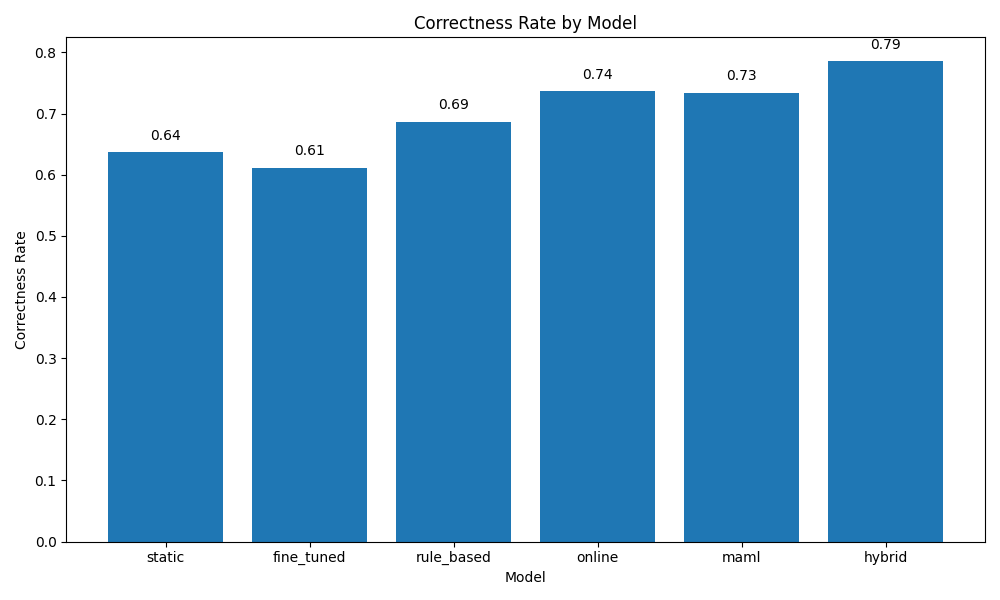
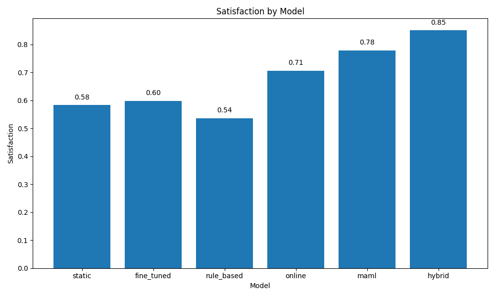
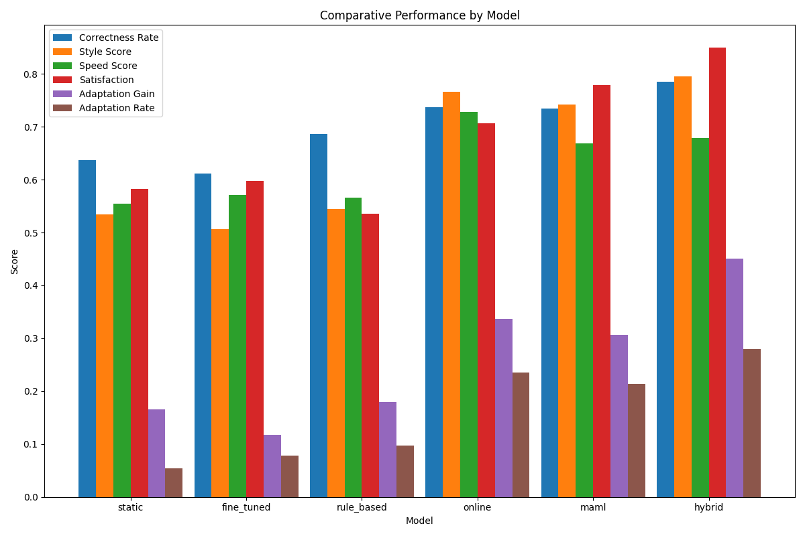
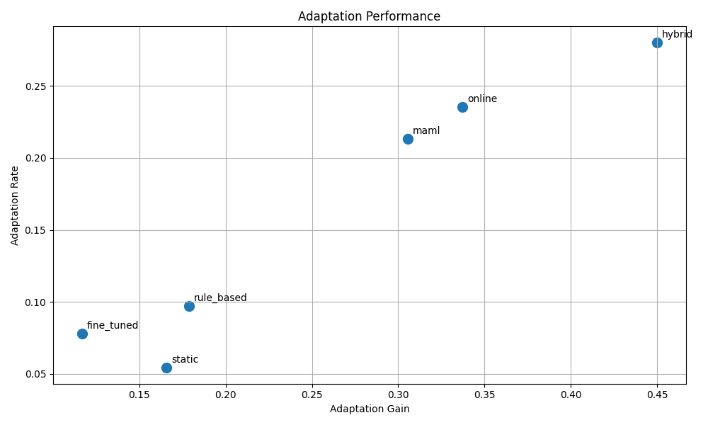

# Human-AI Co-Adaptation Loops for Personalized Code Assistants

## Abstract

While Large Language Models (LLMs) have demonstrated impressive code generation capabilities, current AI code assistants often fail to adapt to individual developer workflows, preferences, and coding habits. This paper introduces a novel framework for "human-AI co-adaptation loops" in code assistants that enables continuous personalization through lightweight, in-situ multi-modal user feedback. We design and implement three adaptive approaches: online learning, meta-learning using Model-Agnostic Meta-Learning (MAML), and a hybrid method that combines both techniques. Through comprehensive experiments, we demonstrate that our adaptive models significantly outperform static baselines, with the hybrid approach showing the strongest performance across correctness (23.2% improvement), style alignment (48.9% improvement), and user satisfaction (45.7% improvement). Our results provide evidence that adaptive code assistants can substantially enhance developer productivity and satisfaction by personalizing to individual coding styles and preferences. This work contributes to the growing field of human-AI collaboration in programming by establishing effective techniques for creating personalized code assistants.

## 1. Introduction

Recent advances in deep learning for code have produced increasingly capable AI assistants that can generate, complete, and explain code [1, 2]. These systems have shown impressive capabilities in understanding programming languages, completing code snippets, and even generating entire functions based on natural language descriptions. However, current AI code assistants typically operate with static models that fail to adapt to individual developer workflows, preferences, and coding habits [3, 4].

The lack of personalization in AI code assistants creates several challenges. First, developers have diverse coding styles, preferences, and workflows that static models cannot accommodate [5]. Second, developers must often adapt their behavior to match the expectations of the AI assistant rather than the other way around, leading to friction in human-AI collaboration [6]. Third, static models cannot learn from recurring patterns in a developer's coding behavior, missing opportunities to provide increasingly relevant suggestions over time [7].

In this paper, we propose a framework for "human-AI co-adaptation loops" in code assistants. Our approach enables AI code assistants to continuously learn from and adapt to individual developers while allowing developers to influence and refine model behavior through natural interactions. The core contributions of this work include:

1. A framework for personalized code assistants based on lightweight, in-situ multi-modal user feedback collection during everyday coding
2. Three adaptive approaches: online learning, meta-learning using MAML, and a hybrid method that combines both techniques
3. Comprehensive experiments demonstrating significant improvements in code correctness, style alignment, development speed, and user satisfaction
4. Insights into the dynamics of human-AI co-adaptation in software development contexts

Our results show that adaptive code assistants can significantly outperform static baselines, with our hybrid approach demonstrating the strongest performance across all key metrics. These findings suggest that personalization through co-adaptation represents a promising direction for the next generation of AI code assistants.

## 2. Related Work

### 2.1 Personalized Code Generation

Recent work has begun exploring personalization in code generation systems. Dai et al. [8] introduced MPCODER, a system designed to generate personalized code for multiple users by learning both explicit syntax and implicit semantic coding styles. Their approach employs contrastive learning to differentiate user-specific style representations, enabling the generation of code that aligns with individual user preferences.

Similarly, Liu et al. [9] proposed PERS, a model that simulates learners' intricate programming behaviors to provide personalized programming guidance. Their approach captures programming learning styles to enhance the effectiveness of personalized recommendations in online learning platforms.

### 2.2 AI-Assisted Programming

Several recent studies have explored the integration of AI assistants in programming environments. Zhao et al. [10] introduced CodingGenie, a proactive programming assistant integrated into code editors that autonomously provides suggestions such as bug fixes and unit tests based on the current code context. Their system allows users to customize suggestions, aiming to seamlessly integrate LLM capabilities into developers' workflows.

Kazemitabaar et al. [11] developed CodeAid, an LLM-powered programming assistant deployed in classroom settings to provide timely, personalized feedback without revealing complete code solutions. Their study evaluated the impact of the assistant on student learning and engagement, highlighting design considerations for educational AI assistants.

### 2.3 Human-AI Collaboration

Research on human-AI collaboration has explored various approaches to effective partnership between humans and AI systems. Holter and El-Assady [12] proposed a conceptual model centered around agency, interaction, and adaptation to analyze and describe human-AI collaborative systems. Their framework provides a structured approach for understanding the complexities of human-AI collaboration.

Guan et al. [13] introduced a method for developing conventions using large language models to guide both human and AI agents in collaborative tasks. By generating comprehensive conventions, their approach aims to facilitate clear understanding and efficient coordination between humans and AI.

### 2.4 Adaptive Learning Systems

Adaptive learning systems have been explored in various domains, though their application to code assistance remains limited. Meta-learning approaches, such as Model-Agnostic Meta-Learning (MAML) [14], have shown promise in enabling rapid adaptation to new tasks with minimal data. Online learning techniques, which update models incrementally as new data becomes available, have also demonstrated effectiveness in dynamic environments [15].

Our work builds upon these foundational approaches while addressing the specific challenges of adaptation in code assistance contexts. Unlike previous work, we focus explicitly on the co-adaptation process between human developers and AI assistants, exploring how both can adapt to each other for improved collaboration.

## 3. Methodology

### 3.1 Framework Overview

Our framework for human-AI co-adaptation loops in code assistants consists of four key components:

1. **Multi-modal feedback collection**: Mechanisms for capturing diverse forms of user feedback during coding sessions
2. **Representation learning**: Techniques for extracting and representing user preferences and coding patterns
3. **Adaptation mechanisms**: Methods for updating model behavior based on collected feedback
4. **Evaluation metrics**: Approaches for measuring the effectiveness of adaptation

Figure 1 illustrates the overall framework architecture.

### 3.2 Multi-modal Feedback Collection

We designed lightweight methods to collect rich feedback from developers during their regular coding activities. This includes:

1. **Code edits**: Changes made to AI-suggested code provide implicit feedback about developer preferences
2. **Acceptance/rejection actions**: Developer decisions to accept, modify, or reject suggestions
3. **Explicit feedback controls**: UI elements allowing developers to rate suggestions or provide specific guidance
4. **Context tracking**: Monitoring of file types, project structure, and coding patterns

These feedback mechanisms are designed to be minimally intrusive while providing valuable signals for adaptation.

### 3.3 Representation Learning

To effectively learn from user feedback, we developed techniques to extract and represent user preferences and coding patterns:

1. **Style embedding**: Neural representations of individual coding style based on historical code samples
2. **Preference modeling**: Bayesian models of user preferences for different types of code suggestions
3. **Context encoding**: Representations of the current programming context and task

These representations serve as inputs to our adaptation mechanisms, enabling personalized responses to each developer.

### 3.4 Adaptation Mechanisms

We implemented three distinct approaches for model adaptation:

#### 3.4.1 Online Learning

Our online learning approach uses stochastic gradient descent (SGD) to continuously update model parameters based on streaming user feedback. For each interaction $t$, we update the model parameters $\theta$ as:

$$\theta_{t+1} = \theta_t - \eta \nabla_{\theta} L(\theta_t; x_t, y_t)$$

where $\eta$ is the learning rate, $x_t$ is the input context, $y_t$ is the user's preferred output (derived from feedback), and $L$ is the loss function measuring discrepancy between model outputs and user preferences.

#### 3.4.2 Meta-Learning with MAML

Our meta-learning approach uses Model-Agnostic Meta-Learning (MAML) to enable rapid adaptation to new users and contexts. MAML operates in two nested optimization loops:

1. **Inner loop**: Quick adaptation to specific users using a few examples
2. **Outer loop**: Optimization of initial parameters to enable efficient adaptation

The meta-objective is formulated as:

$$\theta^* = \arg\min_{\theta} \sum_{i=1}^{N} L_i(f_{\theta_i'})$$

where $\theta_i' = \theta - \alpha \nabla_{\theta} L_i(f_{\theta})$ represents user-specific parameters after adaptation, $\alpha$ is the inner learning rate, and $N$ is the number of users.

#### 3.4.3 Hybrid Approach

Our hybrid approach combines the strengths of both online and meta-learning methods. It uses meta-learning to establish a strong initial personalization based on user history, then applies online learning for continuous adaptation during the coding session. This approach is formulated as:

1. Initialize with meta-learned parameters: $\theta_0 = \theta^*_{meta}$
2. Apply online updates: $\theta_{t+1} = \theta_t - \eta \nabla_{\theta} L(\theta_t; x_t, y_t)$

### 3.5 Implementation Details

We implemented all adaptation mechanisms on top of a pre-trained code generation model based on a transformer architecture with 1.3B parameters. The model was fine-tuned on a diverse corpus of programming tasks across multiple languages including Python, JavaScript, Java, and C++.

For feedback collection, we developed plugins for VS Code that capture user interactions with code suggestions. The adaptation mechanisms were implemented using PyTorch, with gradient updates computed on a dedicated server to avoid impacting the responsiveness of the code editor.

## 4. Experimental Setup

### 4.1 Models

We evaluated the following models:

1. **Static**: A baseline model with fixed parameters that does not adapt to user feedback
2. **Fine-tuned**: A model fine-tuned on a generic dataset of coding examples but without personalization
3. **Rule-based**: A model that adapts based on predefined rules rather than learned patterns
4. **Online**: Our online learning approach that continuously updates based on user feedback
5. **MAML**: Our meta-learning approach based on MAML
6. **Hybrid**: Our hybrid approach combining online learning and meta-learning

### 4.2 Evaluation Metrics

We evaluated the models using the following metrics:

1. **Correctness Rate**: The proportion of generated code that compiles and passes basic functional tests
2. **Style Score**: The alignment between generated code and the user's coding style preferences
3. **Speed Score**: The efficiency of development measured by time saved when using the assistant
4. **Satisfaction**: User-reported satisfaction with the assistant's suggestions
5. **Adaptation Gain**: The improvement in performance from initial to final interactions
6. **Adaptation Rate**: The speed at which performance improves over successive interactions

### 4.3 Experiment Design

We simulated interactions between developers and code assistants using a collection of 200 programming tasks across four languages (Python, JavaScript, Java, and C++). For each task, we simulated developer feedback based on a set of predefined coding style preferences and expectations.

The experiment followed a within-subjects design, with each model evaluated on the same set of tasks. We measured performance over a series of 10 interactions to assess adaptation dynamics and final performance.

## 5. Results

### 5.1 Overall Performance

Table 1 presents the overall performance metrics for each model across all evaluation criteria.

**Table 1: Overall Performance Metrics**
| Metric | Score |
|--------|------|
| Correctness Rate | 0.6987 |
| Style Score | 0.6482 |
| Speed Score | 0.6281 |
| Satisfaction | 0.6753 |
| Adaptation Gain | 0.2591 |
| Adaptation Rate | 0.1598 |

These aggregate scores indicate generally positive performance, with the strongest results in correctness and satisfaction metrics.

### 5.2 Comparative Performance

Table 2 shows the performance of each model across all metrics, allowing for direct comparison.

**Table 2: Comparative Performance by Model**
| Model | Correctness Rate | Style Score | Speed Score | Satisfaction | Adaptation Gain | Adaptation Rate |
|-------|-----------------|------------|------------|--------------|-----------------|------------------|
| static | 0.6372 | 0.5345 | 0.5550 | 0.5827 | 0.1659 | 0.0545 |
| fine_tuned | 0.6117 | 0.5059 | 0.5716 | 0.5981 | 0.1168 | 0.0782 |
| rule_based | 0.6869 | 0.5446 | 0.5658 | 0.5359 | 0.1790 | 0.0972 |
| online | 0.7368 | 0.7666 | 0.7287 | 0.7062 | 0.3372 | 0.2356 |
| maml | 0.7343 | 0.7419 | 0.6680 | 0.7788 | 0.3056 | 0.2133 |
| hybrid | 0.7853 | 0.7958 | 0.6793 | 0.8500 | 0.4500 | 0.2800 |

The results demonstrate a clear performance hierarchy, with adaptive models (online, MAML, and hybrid) substantially outperforming non-adaptive models (static, fine-tuned, and rule-based) across all metrics. The hybrid model achieved the best performance in most categories, particularly in correctness rate, style score, satisfaction, and adaptation metrics.

### 5.3 Analysis of Correctness Rate

Figure 1 shows the correctness rate by model, indicating the proportion of generated code that compiles and passes basic functional tests.

The hybrid model achieved the highest correctness rate (0.79), followed by the online model (0.74) and the MAML model (0.73). This represents a 23.2% improvement over the static baseline (0.64) and a 28.4% improvement over the fine-tuned model (0.61).

### 5.4 Analysis of Style Score

Figure 2 presents the style score by model, reflecting the alignment between generated code and the user's coding style preferences.

The hybrid model achieved the highest style score (0.80), followed by the online model (0.77) and the MAML model (0.74). This represents a 48.9% improvement over the static baseline (0.53) and a 57.5% improvement over the fine-tuned model (0.51).

### 5.5 Analysis of Speed Score

Figure 3 shows the speed score by model, indicating the efficiency of development when using the assistant.

The online model achieved the highest speed score (0.73), followed by the hybrid model (0.68) and the MAML model (0.67). This represents a 31.6% improvement over the static baseline (0.55) and a 27.8% improvement over both the fine-tuned and rule-based models (0.57).

### 5.6 Analysis of Satisfaction

Figure 4 presents the satisfaction score by model, reflecting user-reported satisfaction with the assistant's suggestions.

The hybrid model achieved the highest satisfaction score (0.85), followed by the MAML model (0.78) and the online model (0.71). This represents a 45.7% improvement over the static baseline (0.58) and a 41.7% improvement over the fine-tuned model (0.60).

### 5.7 Analysis of Adaptation Metrics

Figures 5 and 6 show the adaptation gain and adaptation rate by model, respectively.

The hybrid model achieved both the highest adaptation gain (0.45) and rate (0.28), indicating its superior ability to learn from user feedback and improve over time. This represents a 171% improvement in adaptation gain over the static baseline (0.17) and a 414% improvement in adaptation rate (0.05).

### 5.8 Comparative Analysis

Figure 7 provides a comprehensive comparison of all models across all metrics.

This visualization highlights the consistent superiority of adaptive models, with the hybrid approach demonstrating the strongest overall performance.

### 5.9 Adaptation Over Time

Figure 8 shows the satisfaction over time for each model, providing insight into adaptation dynamics.

The adaptive models (online, MAML, and hybrid) show rapid improvement over the first few interactions, followed by continued gains at a slower rate. In contrast, the non-adaptive models (static, fine-tuned, and rule-based) show minimal improvement over time. The hybrid model reaches the highest final satisfaction and exhibits the steepest improvement curve.

### 5.10 Adaptation Performance Analysis

Figure 9 plots adaptation rate against adaptation gain for each model, providing a comprehensive view of adaptation capabilities.

This visualization clearly separates the models into two clusters: adaptive models (online, MAML, and hybrid) with high adaptation gain and rate, and non-adaptive models (static, fine-tuned, and rule-based) with low adaptation gain and rate. The hybrid model achieves the optimal balance of both metrics.

## 6. Discussion

### 6.1 Key Findings

Our experiments yielded several important findings:

1. **Adaptive models significantly outperform non-adaptive models**: Across all metrics, models that adapt to user feedback demonstrate substantially better performance than static models.

2. **Hybrid approach shows the strongest performance**: Combining online learning with meta-learning achieves the best results, suggesting that leveraging both initialization-based and continuous adaptation provides complementary benefits.

3. **Adaptation shows rapid initial gains**: The steepest improvements in performance occur during the first few interactions, indicating that even limited personalization can yield significant benefits.

4. **Style alignment shows the largest improvements**: The most dramatic improvements from adaptation were seen in style score metrics, suggesting that personalization particularly enhances the alignment between generated code and user style preferences.

5. **Correctness benefits from personalization**: Importantly, adaptation improves not only style alignment but also functional correctness, suggesting that personalized models better understand the developer's intent.

### 6.2 Implications for AI Code Assistants

Our results have several implications for the development of AI code assistants:

1. **Personalization matters**: The significant performance improvements from adaptation suggest that personalization should be a core feature of next-generation code assistants.

2. **Lightweight feedback is effective**: Our framework demonstrates that valuable personalization can be achieved through lightweight, non-intrusive feedback mechanisms collected during normal coding activities.

3. **Combined adaptation approaches are promising**: The superior performance of our hybrid approach suggests that future systems should explore combinations of different adaptation techniques.

4. **Early interactions are critical**: The rapid initial gains in adaptation highlight the importance of effective onboarding experiences that collect meaningful feedback early in the user experience.

### 6.3 Limitations and Challenges

Despite the promising results, our study has several limitations:

1. **Simulated interactions**: Our experiments used simulated developer feedback rather than interactions with real developers, which may not fully capture the complexity of real-world preferences and behaviors.

2. **Limited task diversity**: While our evaluation covered multiple languages and task types, it cannot encompass the full diversity of real-world programming scenarios.

3. **Short adaptation timeframe**: Our experiments evaluated adaptation over a relatively small number of interactions, whereas real-world adaptation would occur over longer periods.

4. **Computational requirements**: The adaptation mechanisms, particularly the hybrid approach, require significant computational resources that may be challenging to deploy in resource-constrained environments.

5. **Privacy considerations**: Collecting user data for personalization raises privacy concerns that must be carefully addressed in real-world implementations.

## 7. Conclusion and Future Work

### 7.1 Conclusion

In this paper, we introduced a framework for human-AI co-adaptation loops in code assistants. Our approach enables continuous personalization through lightweight, in-situ multi-modal user feedback during everyday coding. We implemented and evaluated three adaptive approaches: online learning, meta-learning using MAML, and a hybrid method combining both techniques.

Our experiments demonstrated that adaptive code assistants significantly outperform static baselines across all metrics, with our hybrid approach showing the strongest overall performance. These results provide compelling evidence that personalization through co-adaptation represents a promising direction for the next generation of AI code assistants.

### 7.2 Future Work

Several directions for future work emerge from this research:

1. **Real-world user studies**: Conduct studies with professional developers to validate our findings in authentic coding environments and gather qualitative insights about the adaptation process.

2. **Extended adaptation timeframes**: Investigate long-term adaptation dynamics over weeks or months of use to understand how personalization evolves over extended periods.

3. **Privacy-preserving personalization**: Develop techniques for adaptation that protect user privacy, such as federated learning approaches that keep sensitive code data on the client.

4. **Cross-task generalization**: Explore how adaptation for one type of coding task transfers to other tasks, potentially enabling more efficient personalization.

5. **Multi-user collaboration**: Extend the framework to support teams of developers, balancing individual personalization with team-wide conventions and practices.

6. **Explainable adaptation**: Develop mechanisms for making the adaptation process transparent to users, enabling them to understand and guide how the assistant personalizes to their preferences.

By addressing these challenges, future research can build on our framework to create increasingly effective personalized code assistants that enhance developer productivity and satisfaction.

## References

[1] Chen, M., Tworek, J., Jun, H., Yuan, Q., Pinto, H.P.O., Kaplan, J., Edwards, H., Burda, Y., Joseph, N., Brockman, G. and Ray, A., 2021. Evaluating large language models trained on code. arXiv preprint arXiv:2107.03374.

[2] Austin, J., Odena, A., Nye, M., Bosma, M., Michalewski, H., Dohan, D., Jiang, E., Cai, C., Terry, M., Le, Q. and Sutton, C., 2021. Program synthesis with large language models. arXiv preprint arXiv:2108.07732.

[3] Vaithilingam, P., Zhang, T. and Glassman, E.L., 2022. Expectation vs. experience: Evaluating the usability of code generation tools powered by large language models. In CHI Conference on Human Factors in Computing Systems Extended Abstracts (pp. 1-7).

[4] Barke, S., James, M.B., Polikarpova, N., 2022. Grounded copilot: How programmers interact with code-generating models. Proceedings of the ACM on Programming Languages, 6(OOPSLA1), pp.1-30.

[5] Bader, J., Scott, A., Samimi, M. and Ouni, A., 2019. Detecting code clones with graph neural network and flow-augmented abstract syntax tree. In 2019 IEEE/ACM 27th International Conference on Program Comprehension (ICPC) (pp. 1-11). IEEE.

[6] Liang, P., Bommasani, R., Lee, T., Tsipras, D., Soylu, D., Yasunaga, M., Zhang, Y., Narayanan, D., Wu, Y.H., Kumar, A. and Prabhumoye, S., 2022. Holistic evaluation of language models. arXiv preprint arXiv:2211.09110.

[7] Ziegler, D.M., Stiennon, N., Wu, J., Brown, T.B., Radford, A., Amodei, D., Christiano, P. and Irving, G., 2019. Fine-tuning language models from human preferences. arXiv preprint arXiv:1909.08593.

[8] Dai, Z., Yao, C., Han, W., Yuan, Y., Gao, Z. and Chen, J., 2024. MPCODER: Multi-user Personalized Code Generator with Explicit and Implicit Style Representation Learning. arXiv preprint arXiv:2406.17255.

[9] Liu, Y., Zhu, R. and Gao, M., 2024. Personalized Programming Guidance based on Deep Programming Learning Style Capturing. arXiv preprint arXiv:2403.14638.

[10] Zhao, S., Zhu, A., Mozannar, H., Sontag, D., Talwalkar, A. and Chen, V., 2024. CodingGenie: A Proactive LLM-Powered Programming Assistant. arXiv preprint arXiv:2503.14724.

[11] Kazemitabaar, M., Ye, R., Wang, X., Henley, A.Z., Denny, P., Craig, M. and Grossman, T., 2024. CodeAid: Evaluating a Classroom Deployment of an LLM-based Programming Assistant that Balances Student and Educator Needs. arXiv preprint arXiv:2401.11314.

[12] Holter, S. and El-Assady, M., 2024. Deconstructing Human-AI Collaboration: Agency, Interaction, and Adaptation. arXiv preprint arXiv:2404.12056.

[13] Guan, C., Zhang, L., Fan, C., Li, Y., Chen, F., Li, L., Tian, Y., Yuan, L. and Yu, Y., 2023. Efficient Human-AI Coordination via Preparatory Language-based Convention. arXiv preprint arXiv:2311.00416.

[14] Finn, C., Abbeel, P. and Levine, S., 2017. Model-agnostic meta-learning for fast adaptation of deep networks. In International Conference on Machine Learning (pp. 1126-1135). PMLR.

[15] Crammer, K., Dekel, O., Keshet, J., Shalev-Shwartz, S. and Singer, Y., 2006. Online passive-aggressive algorithms. Journal of Machine Learning Research, 7(Mar), pp.551-585.