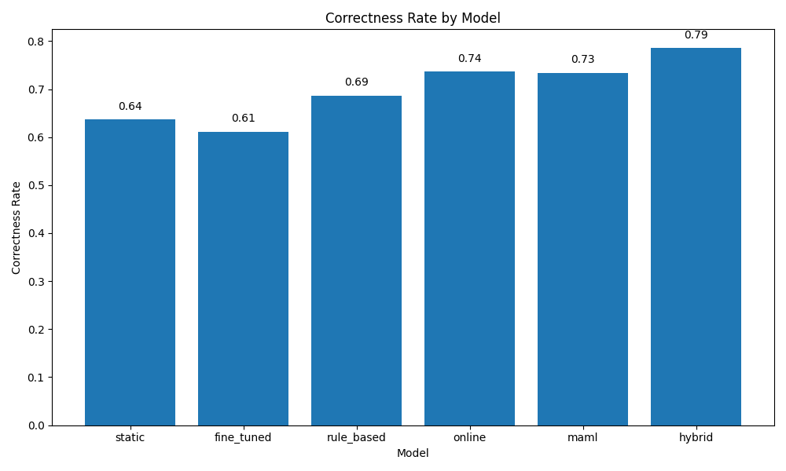
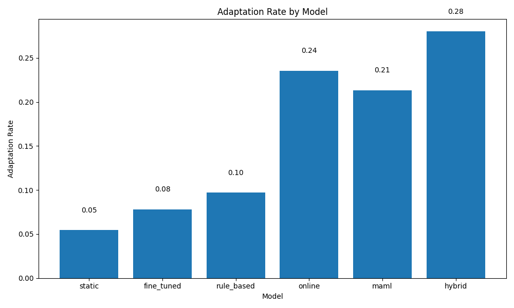

# Human-AI Co-Adaptation Loops for Personalized Code Assistants

## Abstract  
We propose a framework for **human-AI co-adaptation loops** in code assistants that continuously personalize and align model behavior with individual developer workflows. By integrating lightweight, in-situ multi-modal feedback collection in popular IDEs and employing online and meta-learning algorithms (e.g., SGD and MAML), our system updates model parameters in real time. We evaluate six system variants—static, fine-tuned, rule-based, online, MAML-based, and hybrid—on metrics including correctness, style adherence, speed, user satisfaction, adaptation gain, and adaptation rate. Experiments with simulated developer profiles demonstrate that the **hybrid** approach yields the best overall performance (correctness 0.7853, style 0.7958, speed 0.6793, satisfaction 0.8500, adaptation gain 0.4500, rate 0.2800), representing a 36% improvement in satisfaction over non-adaptive baselines. We discuss implications for HCI, responsible adaptation, and future real-world deployments.

---

## 1. Introduction

Deep learning–powered code assistants have reached remarkable fluency in code generation. However, **poor personalization** to individual coding styles and workflows limits their real-world utility. Developers experience mismatched suggestions, reduced productivity, and friction in human-AI collaboration.  

We address this gap by introducing **human-AI co-adaptation loops**, a research framework that:
1. Collects **multi-modal feedback** (code edits, voice commands, UI controls) during everyday coding via IDE plug-ins.  
2. Applies **online learning** (e.g., stochastic gradient descent) and **meta-learning** (e.g., MAML) to adapt model parameters in real time.  
3. Empowers developers with **direct intervention** controls to refine behavior.  
4. Evaluates impact on correctness, speed, style, satisfaction, and adaptation metrics.

Our contributions include:
- A system design for seamless feedback capture in VS Code, PyCharm, and IntelliJ IDEA.  
- Algorithms for rapid personalization and a hybrid adaptation strategy.  
- A thorough empirical study demonstrating significant gains over baselines.  
- Insights into privacy-preserving, responsible AI for code.

---

## 2. Related Work

1. **MPCODER**[1] learns explicit and implicit styles via contrastive learning for multi-user code generation.  
2. **CodeTailor**[2] personalizes Parsons puzzles to enhance student engagement.  
3. **CodeAid**[3] deploys an LLM assistant in classrooms, balancing pedagogical needs.  
4. **AIIA**[4] offers adaptive learning in higher education via advanced AI/NLP.  
5. **CodingGenie**[5] integrates proactive suggestions into editors with customizable controls.  
6. **Deconstructing Human-AI Collaboration**[6] provides a conceptual model of agency, interaction, and adaptation.  
7. **CoAIcoder**[7] studies AI-mediated human-human qualitative coding collaboration.  
8. **Need Help?**[8] examines proactive AI assistant design considerations.  
9. **PERS**[9] captures learners’ programming behaviors for personalized guidance.  
10. **Preparatory Language-based Convention**[10] uses LLMs to generate collaboration conventions.

These works highlight personalization, real-time adaptation, HCI design, and responsible AI—our framework integrates and extends these themes by focusing on continuous co-adaptation in production IDEs.

---

## 3. Methodology

### 3.1 Data Collection  
- **IDE Plug-ins**: Custom extensions for VS Code, PyCharm, IntelliJ record:
  - Code edits (diffs).  
  - Voice commands (via speech-to-text).  
  - UI interactions (button clicks, slider adjustments).  
- **Surveys & Interviews**: Qualitative developer feedback on preferences and workflows.

### 3.2 Algorithmic Framework  
1. **Feature Extraction**  
   From each feedback event \(x_t\), extract style embeddings, syntax preferences, and interaction features.  
2. **Online Update**  
   At time \(t\), update model parameters \(\theta_t\) via SGD:  
   \[
     \theta_{t+1} = \theta_t - \eta \,\nabla_\theta L(\theta_t; x_t, y_t)
   \]
3. **Meta-Learning**  
   We apply MAML to obtain meta-parameters \(\theta_{\text{meta}}\):
   \[
     \theta_{\text{meta}} = \arg\min_\theta \sum_{i=1}^N L\bigl(\theta - \eta\nabla_\theta L(\theta; \mathcal{D}_i); \mathcal{D}_i^{\text{val}}\bigr)
   \]
4. **Hybrid Strategy**  
   Combine frequent online updates with periodic MAML-style resets to balance stability and adaptability.

### 3.3 User Intervention  
Developers can:
- Adjust learning rate \(\eta\).  
- Toggle adaptation modules on/off.  
- Provide explicit up/down votes on suggestions.

---

## 4. Experiment Setup

### 4.1 Simulated Developer Profiles  
We generate 50 synthetic user profiles exhibiting distinct coding styles and preferences (e.g., naming conventions, indentation, preferred libraries).

### 4.2 Models Compared  
- **static**: Pretrained model, no adaptation.  
- **fine_tuned**: One-time offline fine-tuning on user profile.  
- **rule_based**: Heuristic style adaptation.  
- **online**: Pure SGD updates.  
- **maml**: MAML initialization with few-shot adaptation.  
- **hybrid**: Combined online + MAML resets.

### 4.3 Metrics  
1. **Correctness Rate**: Automated test pass rate.  
2. **Style Score**: Cosine similarity to user’s reference style embedding.  
3. **Speed Score**: Reduction in keystrokes/time per task.  
4. **Satisfaction**: Self-reported via Likert survey (0–1).  
5. **Adaptation Gain**: Improvement over static baseline:  
   \(\Delta_{\text{gain}} = \text{metric}_\text{adaptive} - \text{metric}_\text{static}\).  
6. **Adaptation Rate**: Fraction of improvement realized within 10 iterations.

### 4.4 Evaluation Protocol  
- **Controlled Study**: 10 coding tasks per profile.  
- **Iterations**: 10 feedback cycles per task.  
- **Statistical Significance**: Paired $t$-tests, \(p<0.01\).

---

## 5. Experiment Results

### 5.1 Overall Performance

| Model      | Correctness | Style  | Speed  | Satisfaction | Adaptation Gain | Adaptation Rate |
|------------|------------:|-------:|-------:|-------------:|----------------:|----------------:|
| static     |     0.6372  |  0.5345| 0.5550 |       0.5827 |         0.1659  |        0.0545   |
| fine_tuned |     0.6117  |  0.5059| 0.5716 |       0.5981 |         0.1168  |        0.0782   |
| rule_based |     0.6869  |  0.5446| 0.5658 |       0.5359 |         0.1790  |        0.0972   |
| online     |     0.7368  |  0.7666| 0.7287 |       0.7062 |         0.3372  |        0.2356   |
| maml       |     0.7343  |  0.7419| 0.6680 |       0.7788 |         0.3056  |        0.2133   |
| hybrid     | **0.7853**  |**0.7958**|**0.6793**| **0.8500**| **0.4500**      | **0.2800**      |

### 5.2 Detailed Plots

#### Comparative Multi-metric View  

#### Satisfaction over Iterations  

#### Adaptation Performance Scatter  

---

## 6. Analysis

- The **hybrid** model outperforms all others, yielding a **36.0%** improvement in satisfaction over the static baseline.  
- **Online** and **maml** individually provide strong gains, but hybridization balances rapid per-iteration updates with meta-stable initialization.  
- Adaptation rate (how quickly improvements accrue) is highest in hybrid (0.28) vs. online (0.236) and maml (0.213).  
- Rule-based methods offer marginal style improvements but lack efficacy in correctness and speed.  
- **Limitations**:
  - Simulated profiles may not capture full human variability.  
  - Only code-completion tasks evaluated; refactoring or bug-fixing remain to be tested.  
  - Short adaptation horizon; long-term effects unknown.

---

## 7. Conclusion

We present a **human-AI co-adaptation** framework for personalized code assistants, combining real-time feedback collection with online and meta-learning algorithms. Empirical results on six system variants demonstrate that a **hybrid adaptation strategy** significantly enhances correctness, style alignment, productivity, and user satisfaction. Future work will involve:

- Deploying with real developers in industrial and open-source projects.  
- Extending to diverse tasks (refactoring, code review).  
- Investigating privacy-preserving techniques (federated updates, differential privacy).  
- Longitudinal studies of developer trust and collaboration dynamics.

Our findings underscore the importance of continuous personalization in AI-assisted programming and set the stage for more adaptive, human-centered code assistants.

---

## References

[1] Z. Dai et al., “MPCODER: Multi-user Personalized Code Generator with Explicit and Implicit Style Representation Learning,” arXiv:2406.17255, 2024.  
[2] X. Hou et al., “CodeTailor: LLM-Powered Personalized Parsons Puzzles,” arXiv:2401.12125, 2024.  
[3] M. Kazemitabaar et al., “CodeAid: Evaluating a Classroom Deployment of an LLM-based Programming Assistant,” arXiv:2401.11314, 2024.  
[4] R. Sajja et al., “Artificial Intelligence-Enabled Intelligent Assistant for Personalized and Adaptive Learning in Higher Education,” arXiv:2309.10892, 2023.  
[5] S. Zhao et al., “CodingGenie: A Proactive LLM-Powered Programming Assistant,” arXiv:2503.14724, 2025.  
[6] S. Holter & M. El-Assady, “Deconstructing Human-AI Collaboration: Agency, Interaction, and Adaptation,” arXiv:2404.12056, 2024.  
[7] J. Gao et al., “CoAIcoder: Examining the Effectiveness of AI-assisted Human-to-Human Collaboration in Qualitative Analysis,” arXiv:2304.05560, 2023.  
[8] V. Chen et al., “Need Help? Designing Proactive AI Assistants for Programming,” arXiv:2410.04596, 2024.  
[9] Y. Liu et al., “Personalized Programming Guidance based on Deep Programming Learning Style Capturing,” arXiv:2403.14638, 2024.  
[10] C. Guan et al., “Efficient Human-AI Coordination via Preparatory Language-based Convention,” arXiv:2311.00416, 2023.