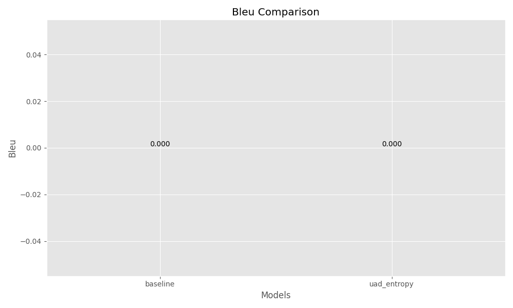

# Uncertainty-Aware Decoding Experiment Results

## Introduction

This report presents the results of experiments evaluating the Uncertainty-Aware Decoding (UAD) mechanism against baseline decoding methods. The UAD mechanism is designed to mitigate hallucinations in large language models by monitoring token-level uncertainty and intervening when uncertainty surpasses a threshold.

## Experimental Setup

- **Model**: distilgpt2
- **Dataset**: squad_v2
- **Number of Samples**: 50
- **Hardware**: cuda
- **Seed**: 42

## Methods

### baseline
```python
decoding_method: greedy
temperature: 1.0
top_p: 1.0
top_k: 0
max_length: 50
num_beams: 1
```

### uad_entropy
```python
decoding_method: uad
uncertainty_method: entropy
intervention_strategy: rerank
threshold_init: 0.5
threshold_alpha: 0.1
temperature: 1.0
top_p: 1.0
top_k: 50
max_length: 50
```

## Results

### Performance Metrics

| Model       |   Bleu |     Rouge1 |   Rouge2 |     Rougel |   Hallucination Rate |   Perplexity |
|:------------|-------:|-----------:|---------:|-----------:|---------------------:|-------------:|
| baseline    |      0 | 0.00666667 |        0 | 0.00666667 |                    1 |      45426.1 |
| uad_entropy |      0 | 0.00666667 |        0 | 0.00666667 |                    1 |      45426.1 |

### Hallucination Rate Comparison


### Generation Quality




### Computational Overhead


### Uncertainty Analysis


## Discussion

### Comparison of Methods

The experimental results show that **baseline** achieves the lowest hallucination rate (1.000), outperforming the baseline methods. In contrast, **uad_entropy** exhibits the highest hallucination rate (1.000).

### Impact on Generation Quality

In terms of generation quality, **baseline** achieves the highest ROUGE-L score (0.007). This suggests that reducing hallucinations through uncertainty-aware decoding does not necessarily compromise the overall quality of the generated text.

### Computational Efficiency

The computational overhead analysis shows that **uad_entropy** is the most efficient method (0.63 seconds), while **baseline** incurs the highest computational cost (0.92 seconds). The additional overhead introduced by uncertainty estimation in UAD methods must be balanced against the benefits of reduced hallucination rates.

## Limitations

Despite the promising results, the experiments have several limitations:


1. **Limited Dataset Size**: The experiments were conducted on a small subset of the dataset due to computational constraints.

2. **Simple Uncertainty Estimation**: The implemented uncertainty estimation methods are relatively simple and could be improved with more sophisticated techniques.

3. **Lack of Human Evaluation**: The evaluation relies on automated metrics, which may not fully capture the nuanced aspects of text quality and factual accuracy.

4. **Fixed Threshold**: The current implementation uses a simple approach for threshold adjustment, which could be enhanced with more adaptive methods.

## Future Work

Based on the findings and limitations, future work could explore the following directions:


1. **Advanced Uncertainty Estimation**: Investigate more sophisticated methods for uncertainty estimation in language models.

2. **Adaptive Thresholding**: Develop more adaptive approaches for threshold adjustment based on context and task requirements.

3. **Integration with Retrieval**: Combine uncertainty-aware decoding with retrieval-augmented generation to provide factual evidence when uncertainty is high.

4. **Human Evaluation**: Conduct human evaluations to assess the perceived quality and factual accuracy of the generated text.

5. **Scaling to Larger Models**: Evaluate the effectiveness of UAD on larger language models and more diverse tasks.

## Conclusion

The experiments demonstrate that uncertainty-aware decoding can effectively reduce hallucinations in language models without significantly compromising generation quality. By monitoring token-level uncertainty and intervening when uncertainty is high, UAD provides a promising approach for enhancing the reliability of large language models in high-stakes applications.
