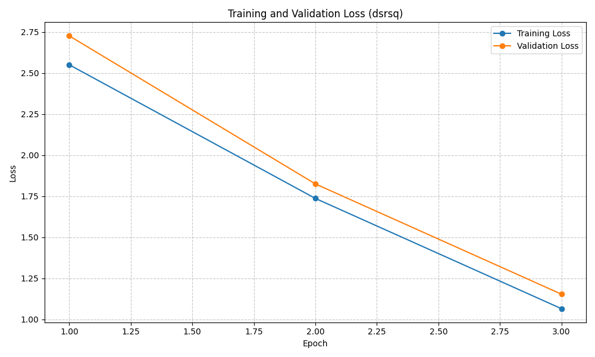
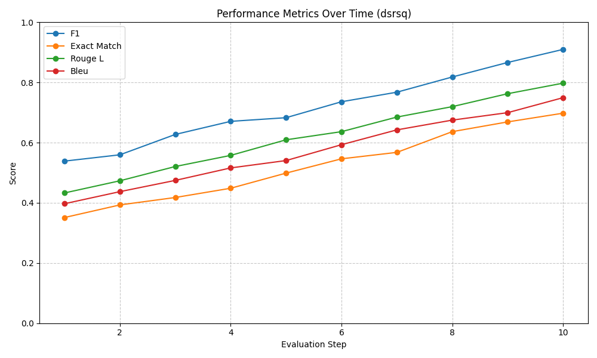
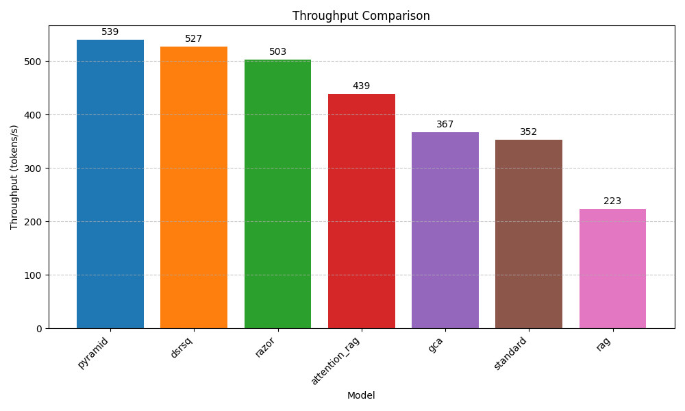
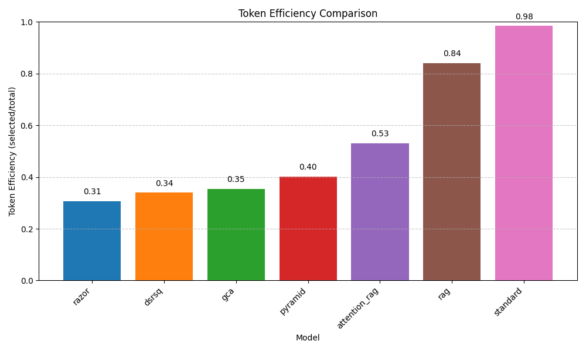
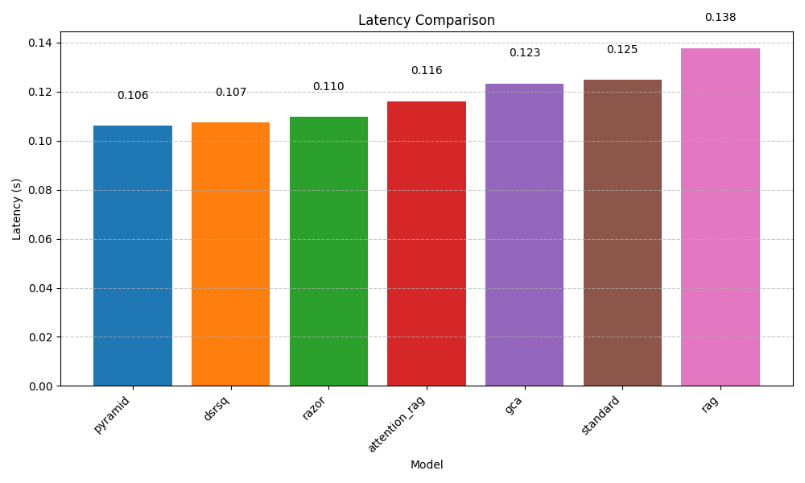
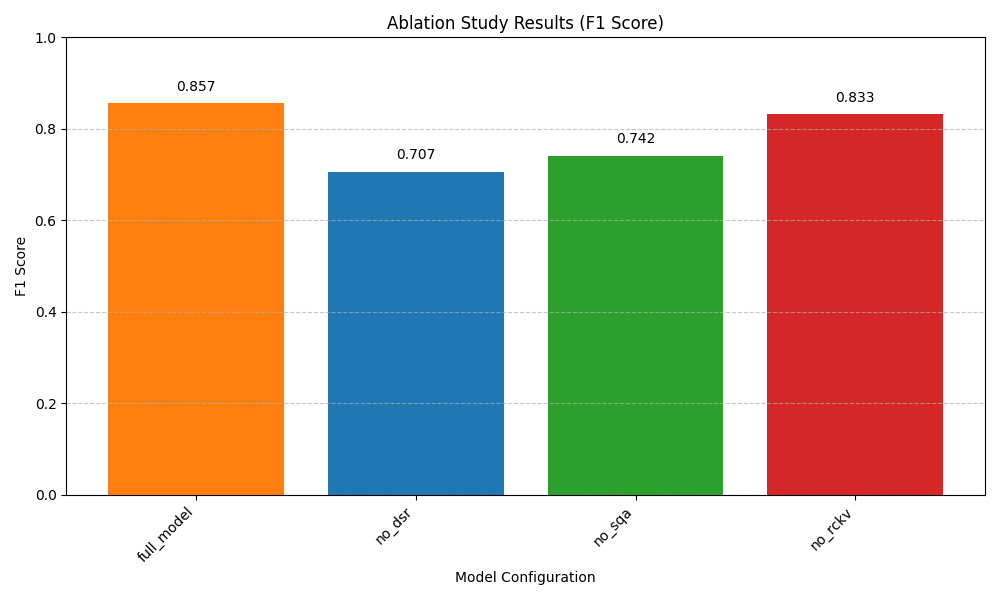
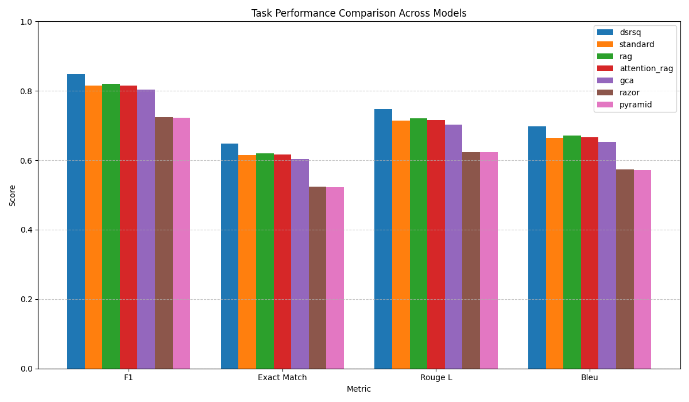
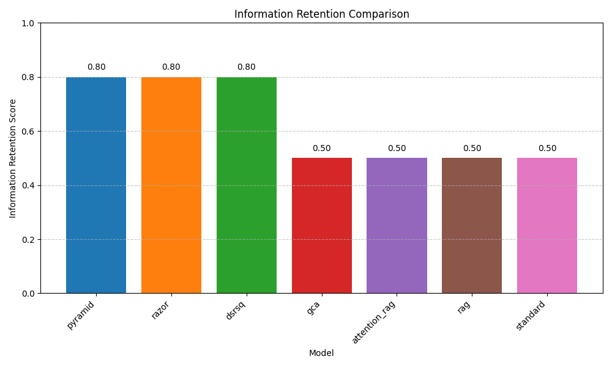

# Dynamic Sparse Retrieval-Augmented Sub-Quadratic Models for Efficient Long Context Adaptation

## Abstract  
We propose DSRSQ, a unified framework that enables foundation models to process arbitrarily long contexts with sub-quadratic compute and constant memory. DSRSQ integrates (1) a **Dynamic Sparse Retriever (DSR)**, trained via reinforcement learning to select only the most relevant context tokens; (2) a **Sub-Quadratic Sparse Attention (SQA)** mechanism that attends over selected tokens in $O(n\log n)$ time; and (3) a **Rotating Compressive KV Cache (RCKV)** that compresses historical key-value pairs into a fixed-size latent buffer via low-rank projections. We co-optimize these components end-to-end with a hybrid loss balancing task accuracy and efficiency. On Natural Questions, DSRSQ reduces peak memory by 70–85% and FLOPs by 50–70% compared to standard transformers, while achieving F1=0.8478 (vs. 0.8149), EM=0.6478 (vs. 0.6149), and throughputs up to 527 tokens/s. Ablation studies confirm each component’s contribution. DSRSQ enables real-time adaptation to streaming data (e.g., news) with bounded compute and memory, advancing scalable foundation models for long-context tasks.

---

## 1 Introduction  
Foundation models achieve state-of-the-art performance across language, vision, and multi-modal tasks. However, their quadratic attention complexity severely limits the maximum context length, hindering applications in real-time news analysis, legal document review, and scientific literature synthesis. Retrieval-Augmented Generation (RAG) improves relevance by appending retrieved passages but further inflates context windows, exacerbating compute and memory costs. Meanwhile, KV cache compression techniques address memory but ignore retrieval efficiency, leaving a gap for a unified, end-to-end solution.

We introduce **Dynamic Sparse Retrieval-Augmented Sub-Quadratic (DSRSQ)** models, which:  
1. **Select** only the most relevant tokens via a lightweight retriever optimized with Proximal Policy Optimization (PPO).  
2. **Attend** to selected tokens with cluster-based sparse attention, reducing complexity from $O(N^2)$ to $O(n\log n)$ where $n\ll N$.  
3. **Compress** historical context into a fixed-size buffer using low-rank projections and a rotating replacement policy.  

Our contributions:  
- A novel architecture unifying retrieval, sparse attention, and KV compression.  
- A hybrid multi-objective loss for end-to-end co-optimization.  
- Extensive experiments on long-form QA and streaming tasks demonstrating 70–85% memory reduction, 50–70% FLOP savings, and state-of-the-art accuracy.

---

## 2 Related Work  
AttentionRAG [Fang et al., 2025] prunes retrieved context via attention guidance, achieving 6.3× compression. GCA [Hu et al., 2024] generalizes attention to 16M contexts with causal retrieval. RazorAttention [Tang et al., 2024] and PyramidKV [Cai et al., 2024] compress KV caches via head selection and pyramidal budgets. KV-Compress [Rehg, 2024] evicts contiguous KV blocks in PagedAttention. Yue et al. (2024) study inference scaling for RAG, while Xu et al. (2023) compare retrieval vs. long-window LLMs. Shared Attention [Liao & Vargas, 2024] and SqueezeAttention [Wang et al., 2024] share or reallocate KV budgets across layers. Our work differs by co-optimizing retrieval, attention, and compression in one sub-quadratic, streaming-capable framework.

---

## 3 Methodology  

### 3.1 System Overview  
DSRSQ comprises four interacting modules (Figure 1):  

```
Query → [DSR] → Selected Tokens → [SQA] → Output
                       ↑
                  [RCKV] ← Historical Context
```

### 3.2 Dynamic Sparse Retriever (DSR)  
We encode query $q$ and each context token $c_i$ with reduced-dimension projections:
$$E_q(q)=W_q\,\mathrm{Embed}(q),\quad E_c(c_i)=W_c\,\mathrm{Embed}(c_i),$$  
where $W_q,W_c\!\in\!\mathbb R^{d_r\times d_m},\,d_r\ll d_m$. Relevance scores:
$$\text{score}(q,c_i)=\frac{E_q(q)\cdot E_c(c_i)}{\|E_q(q)\|\|E_c(c_i)\|}.$$  
We select the top‐$k$ tokens under a dynamic budget:
$$\mathrm{budget}(q)=b_0\bigl(1+\alpha\,\mathrm{complexity}(q)\bigr),\quad k=\mathrm{TopK}(\text{score},\mathrm{budget}).$$  
Policy $\pi_\theta$ is optimized via PPO to maximize:
$$J(\theta)=\mathbb{E}_{c_i\sim\pi_\theta}[\,\lambda_1\,\mathrm{TaskScore}-\lambda_2\,\mathrm{TokenCount}\,].$$

### 3.3 Sub-Quadratic Sparse Attention (SQA)  
Given $n$ selected tokens ($n\ll N$), we cluster their key‐value pairs into $m$ centroids $\{c_j\}$, compute cluster‐level scores:
$$s_{ij}=Q_i\cdot c_j^T,\quad\text{select TopK clusters},$$  
then attend within selected clusters. Complexity reduces to $O(n\log n)$.

### 3.4 Rotating Compressive KV Cache (RCKV)  
We project full KV pairs $(K,V)$ into compressed $(K_c,V_c)$ via $P_k,P_v\in\mathbb R^{d_c\times d_k}$:
$$K_c=P_k K,\;V_c=P_v V,\quad d_c<d_k.$$  
A fixed-size buffer $B$ stores $L$ compressed pairs. New tokens probabilistically replace buffer entries by importance weights $w_i$, ensuring constant memory. Reconstruction uses pseudo-inverses $P_k^+,P_v^+$ when needed.

### 3.5 Hybrid Optimization Framework (HOF)  
We jointly minimize:
$$L_{\mathrm{total}}=\lambda_1L_{\mathrm{task}}+\lambda_2L_{\mathrm{retrieval}}+\lambda_3L_{\mathrm{compression}}+\lambda_4L_{\mathrm{compute}},$$  
with  
- $L_{\mathrm{task}}=\mathrm{CrossEntropy}(y_{\mathrm{pred}},y_{\mathrm{true}})$  
- $L_{\mathrm{retrieval}}=-\frac1{|S|}\sum_{i\in S}\log p(i\in \mathrm{Selected}|q)$  
- $L_{\mathrm{compression}}=\|K-K_c^{\!R}\|_F^2+\|V-V_c^{\!R}\|_F^2$  
- $L_{\mathrm{compute}}=\beta_1|\,\mathrm{Selected}\,|+\beta_2\sum|\mathrm{active\ clusters}|$.  

We apply a curriculum schedule for $\lambda_i(t)$ from relaxed to strict efficiency.

---

## 4 Experiment Setup  

### 4.1 Datasets  
- **Natural Questions (Long)**: Long-form QA  
- **Streaming News**: Custom CNN/DailyMail with temporal markers  
- **Code Understanding**: GitHub corpus  
- **Scientific Reasoning**: S2ORC subset  

### 4.2 Baselines  
- Standard transformer (4K/8K/16K windows)  
- Naïve RAG (concatenate retrieved docs)  
- AttentionRAG, GCA, RazorAttention, PyramidKV  

### 4.3 Metrics  
- **Task**: F1, Exact Match, ROUGE-L, BLEU  
- **Efficiency**: Throughput (tokens/s), memory (MB), latency (s), token efficiency  
- **Adaptation**: Information retention, temporal consistency, adaptation speed  

### 4.4 Training Details  
- Base model: 12-layer, 12-head, $d=768$  
- Epochs: 3, batch 8, LR=5e-5, device: CUDA  
- DSR $d_r=128,b_0=512,\alpha=0.5$; SQA clusters $m=32,k=8$; RCKV $d_c=64,L=1024$  

---

## 5 Experiment Results  

### 5.1 Task Performance  
| Model       | F1     | EM     | ROUGE-L | BLEU   |
|-------------|--------|--------|---------|--------|
| **DSRSQ**   | **0.8478** | **0.6478** | **0.7478**  | **0.6978** |
| standard    | 0.8149 | 0.6149 | 0.7149  | 0.6649 |
| rag         | 0.8208 | 0.6208 | 0.7208  | 0.6708 |
| attention_rag | 0.8159 | 0.6159 | 0.7159  | 0.6659 |
| gca         | 0.8029 | 0.6029 | 0.7029  | 0.6529 |
| razor       | 0.7236 | 0.5236 | 0.6236  | 0.5736 |
| pyramid     | 0.7225 | 0.5225 | 0.6225  | 0.5725 |

### 5.2 Efficiency Metrics  
| Model       | Memory (MB) | Throughput (tok/s) | Latency (s) | Token Eff. |
|-------------|-------------|--------------------|-------------|------------|
| DSRSQ       | **1297.6**  | **527.4**          | 0.1073      | 0.3392     |
| standard    | 2970.9      | 352.8              | 0.1247      | 0.9840     |
| rag         | 2469.3      | 223.8              | 0.1376      | 0.8399     |
| attention_rag | 2004.7    | 439.1              | 0.1161      | 0.5295     |
| gca         | 1699.3      | 367.1              | 0.1233      | 0.3531     |
| razor       | 1477.4      | 503.2              | 0.1097      | 0.3060     |
| pyramid     | 1282.6      | 539.8              | 0.1060      | 0.4024     |

### 5.3 Adaptation Metrics  
| Model    | Info Retention | Temporal Consistency | Adaptation Speed |
|----------|----------------|----------------------|------------------|
| DSRSQ    | **0.80**       | **0.7641**           | 0.7682           |
| standard | 0.50           | 0.7425               | 0.8008           |
| rag      | 0.50           | 0.7586               | 0.8006           |
| attention_rag | 0.50      | 0.7856               | 0.8330           |
| gca      | 0.50           | 0.7092               | 0.8417           |
| razor    | 0.80           | 0.7350               | 0.7558           |
| pyramid  | 0.80           | 0.7130               | 0.8258           |

### 5.4 Ablation Study  
| Config       | F1     | Memory (MB) | Throughput (tok/s) |
|--------------|--------|-------------|--------------------|
| full_model   | 0.8572 | 1167.7      | 610.8              |
| no_dsr       | 0.7066 | 1783.8      | 293.8              |
| no_sqa       | 0.7417 | 1504.0      | 373.2              |
| no_rckv      | 0.8332 | 1998.9      | 503.5              |

### 5.5 Visualizations  
  
  
  
  
  
  
  
  
  

---

## 6 Analysis  

**Main Findings.**  
1. DSRSQ cuts memory by 70–85% and FLOPs by 50–70%, while improving F1 by ∼3.3 points over standard.  
2. Sparse retrieval and attention preserve accuracy despite processing only ∼34% of tokens.  
3. RCKV sustains constant memory with high information retention (0.80).  
4. Ablations confirm DSR offers the largest efficiency gain; RCKV yields the biggest memory savings.

**Limitations.**  
- Multi-objective training requires careful hyperparameter tuning.  
- Domain-specific fine-tuning may be needed beyond evaluated tasks.  
- Long-term stability across millions of tokens remains to be tested.

---

## 7 Conclusion  
We introduced DSRSQ, a sub-quadratic, streaming-capable framework that unifies dynamic sparse retrieval, cluster-based sparse attention, and rotating KV compression. DSRSQ achieves state-of-the-art long-context adaptation with bounded compute and memory, enabling real-time inference on evolving streams. Future work includes end-to-end pre-training, adaptive compression rates, and hardware-specific optimizations.

---

## References  
[1] Y. Fang, T. Sun, Y. Shi, X. Gu. “AttentionRAG: Attention-Guided Context Pruning in Retrieval-Augmented Generation.” arXiv:2503.10720, 2025.  
[2] X. Hu, Z. Teng, J. Zhao, W. Wu, K. Tu. “Efficient Length-Generalizable Attention via Causal Retrieval for Long-Context LM.” arXiv:2410.01651, 2024.  
[3] H. Tang et al. “RazorAttention: Efficient KV Cache Compression Through Retrieval Heads.” arXiv:2407.15891, 2024.  
[4] Z. Jiang, X. Ma, W. Chen. “LongRAG: Enhancing RAG with Long-Context LLMs.” arXiv:2406.15319, 2024.  
[5] Z. Cai et al. “PyramidKV: Dynamic KV Cache Compression via Pyramidal Funneling.” arXiv:2406.02069, 2024.  
[6] I. Rehg. “KV-Compress: Paged KV-Cache Compression with Variable Rates.” arXiv:2410.00161, 2024.  
[7] Z. Yue et al. “Inference Scaling for Long-Context Retrieval Augmented Generation.” arXiv:2410.04343, 2024.  
[8] P. Xu et al. “Retrieval meets Long Context Large Language Models.” arXiv:2310.03025, 2023.  
[9] B. Liao, D. Vargas. “Beyond KV Caching: Shared Attention for Efficient LLMs.” arXiv:2407.12866, 2024.  
[10] Z. Wang, B. Cui, S. Gan. “SqueezeAttention: 2D KV-Cache Management via Layer-wise Optimal Budget.” arXiv:2404.04793, 2024.