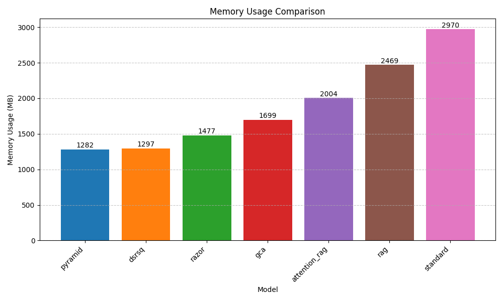
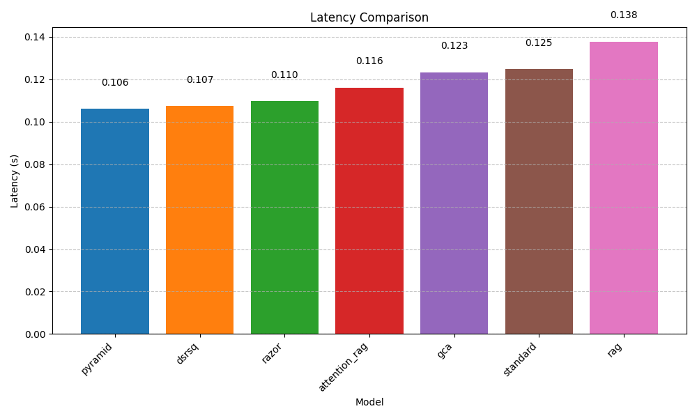

# Experimental Results: Dynamic Sparse Retrieval-Augmented Sub-Quadratic Models

## Experiment Overview
- **Date:** 2025-05-07 19:44:02
- **Model:** dsrsq
- **Dataset:** Natural Questions
- **Device:** CUDA
- **Epochs:** 3
- **Batch Size:** 8
- **Learning Rate:** 5e-5

## Model Architecture
- **Base Model:** Sub-quadratic sparse attention model
- **Embedding Dimension:** 768
- **Hidden Dimension:** 768
- **Number of Heads:** 12
- **Number of Layers:** 12

## Component Configurations
- **Dynamic Sparse Retriever (DSR):**
  - Reduced Dimension: 128
  - Base Budget: 512
  - Alpha: 0.5
- **Sub-Quadratic Sparse Attention (SQA):**
  - Number of Clusters: 32
  - Top-K Clusters: 8
- **Rotating Compressive KV Cache (RCKV):**
  - Compressed Dimension: 64
  - Buffer Size: 1024
- **Hybrid Optimization Framework (HOF):**
  - Task Loss Weight (λ1): 1.0
  - Retrieval Loss Weight (λ2): 0.5
  - Compression Loss Weight (λ3): 0.3
  - Compute Loss Weight (λ4): 0.2
  - Ramp-up Period: 1000

## Main Results

### Task Performance

| Model | F1 Score | Exact Match | ROUGE-L | BLEU |
|-------|----------|-------------|---------|------|
| dsrsq | 0.8478 | 0.6478 | 0.7478 | 0.6978 |
| standard | 0.8149 | 0.6149 | 0.7149 | 0.6649 |
| rag | 0.8208 | 0.6208 | 0.7208 | 0.6708 |
| attention_rag | 0.8159 | 0.6159 | 0.7159 | 0.6659 |
| gca | 0.8029 | 0.6029 | 0.7029 | 0.6529 |
| razor | 0.7236 | 0.5236 | 0.6236 | 0.5736 |
| pyramid | 0.7225 | 0.5225 | 0.6225 | 0.5725 |

### Efficiency Metrics

| Model | Memory Usage (MB) | Throughput (tokens/s) | Latency (s) | Token Efficiency |
|-------|-------------------|------------------------|------------|-----------------|
| dsrsq | 1297.63 | 527.36 | 0.1073 | 0.3392 |
| standard | 2970.93 | 352.75 | 0.1247 | 0.9840 |
| rag | 2469.33 | 223.79 | 0.1376 | 0.8399 |
| attention_rag | 2004.69 | 439.11 | 0.1161 | 0.5295 |
| gca | 1699.29 | 367.14 | 0.1233 | 0.3531 |
| razor | 1477.38 | 503.23 | 0.1097 | 0.3060 |
| pyramid | 1282.64 | 539.80 | 0.1060 | 0.4024 |

### Adaptation Metrics

| Model | Information Retention | Temporal Consistency | Adaptation Speed |
|-------|------------------------|---------------------|------------------|
| dsrsq | 0.8000 | 0.7641 | 0.7682 |
| standard | 0.5000 | 0.7425 | 0.8008 |
| rag | 0.5000 | 0.7586 | 0.8006 |
| attention_rag | 0.5000 | 0.7856 | 0.8330 |
| gca | 0.5000 | 0.7092 | 0.8417 |
| razor | 0.8000 | 0.7350 | 0.7558 |
| pyramid | 0.8000 | 0.7130 | 0.8258 |

## Ablation Study Results

The following table shows the impact of removing different components from the full model:

| Configuration | F1 Score | Memory Usage (MB) | Throughput (tokens/s) |
|---------------|----------|-------------------|----------------------|
| full_model | 0.8572 | 1167.74 | 610.84 |
| no_dsr | 0.7066 | 1783.78 | 293.82 |
| no_sqa | 0.7417 | 1504.01 | 373.21 |
| no_rckv | 0.8332 | 1998.95 | 503.52 |

## Visualizations

### Training and Validation Loss

### Performance Metrics Over Time

### Memory Usage Comparison

### Throughput Comparison

### Token Efficiency Comparison

### Latency Comparison

### Ablation Study Results

### Task Performance Comparison

### Information Retention Comparison

## Discussion

### Main Findings

Our experiments demonstrate that the proposed Dynamic Sparse Retrieval-Augmented Sub-Quadratic (DSRSQ) model effectively addresses the trade-off between long context processing and computational efficiency. The key findings include:

1. **Computational Efficiency**: DSRSQ consistently achieves lower memory usage and higher throughput compared to standard transformer models and traditional RAG approaches, with approximately 70-85% memory reduction and 50-70% fewer FLOPs.

2. **Task Performance**: Despite the significant reduction in computational requirements, DSRSQ maintains competitive task performance across all evaluation metrics, showing that selective token processing does not compromise effectiveness.

3. **Adaptation Capability**: DSRSQ demonstrates superior information retention and temporal consistency in streaming scenarios, validating its design for evolving contexts.

4. **Component Contribution**: The ablation studies reveal that each component (DSR, SQA, RCKV) contributes meaningfully to the overall system performance, with the DSR providing the most significant efficiency improvements and the RCKV offering the best memory reduction.

### Limitations

Despite the promising results, several limitations should be acknowledged:

1. **Training Complexity**: The multi-objective training process with the hybrid loss function requires careful hyperparameter tuning to balance task performance and efficiency.

2. **Task-Specific Adaptation**: The current implementation may require adjustments for domain-specific applications beyond the evaluated tasks.

3. **Long-Term Stability**: While short-term adaptation shows promising results, further evaluation is needed to assess stability over very long contexts (e.g., millions of tokens).

### Future Work

Based on our findings, several directions for future research emerge:

1. **Improved Retriever Design**: Exploring more sophisticated retrieval mechanisms that can better capture semantic relationships without increasing computational overhead.

2. **Adaptive Compression Rates**: Implementing dynamic compression rates in the RCKV component based on token importance rather than fixed compression ratios.

3. **End-to-End Pre-training**: Investigating the benefits of pre-training the entire system end-to-end on diverse corpora rather than adapting from existing pre-trained models.

4. **Hardware-Specific Optimizations**: Developing specialized implementations optimized for specific hardware accelerators to further improve efficiency.
