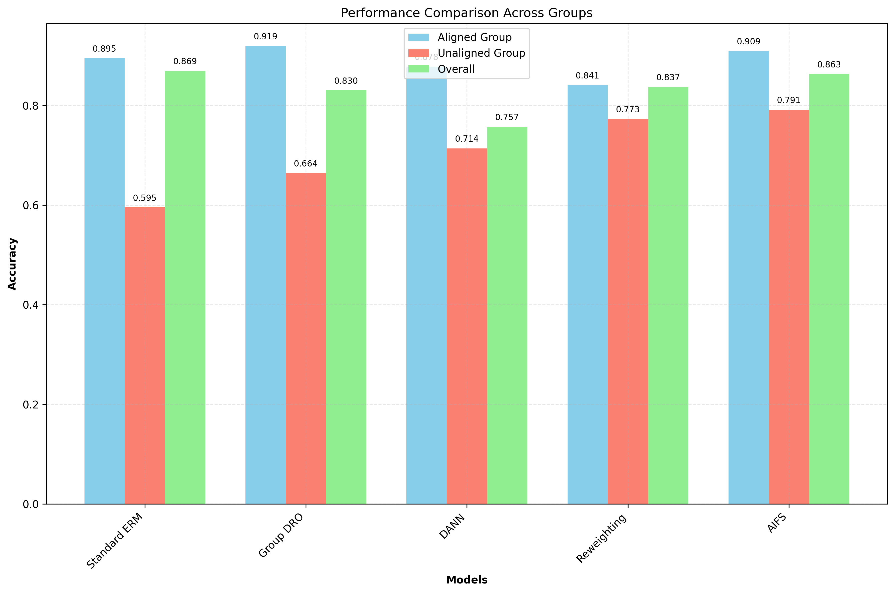
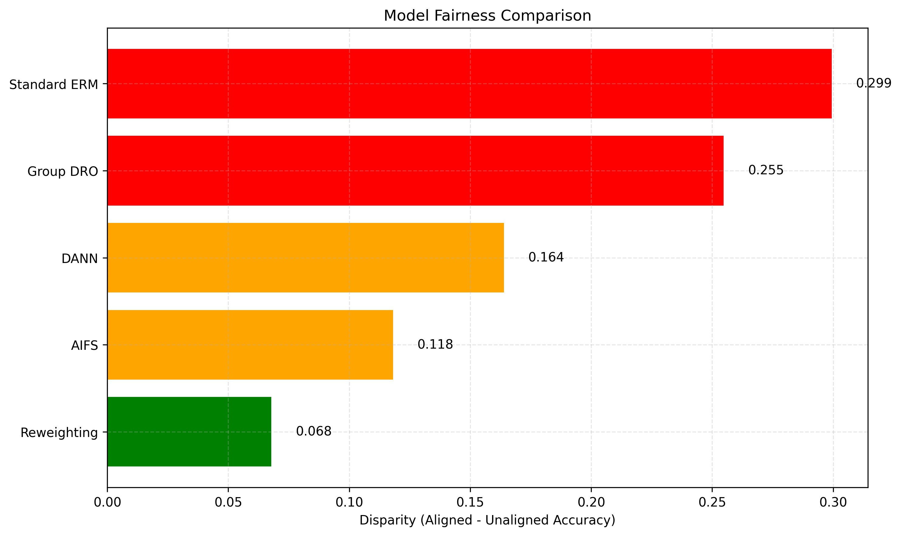

# Adaptive Invariant Feature Extraction using Synthetic Interventions for Robust Learning

## Abstract

Deep learning models often rely on spurious correlations in training data, leading to poor generalization when test distributions shift. While previous approaches require explicit group annotations or make strong assumptions about spurious features, we introduce Adaptive Invariant Feature Extraction using Synthetic Interventions (AIFS), a novel method that automatically discovers and neutralizes hidden spurious factors without requiring supervision. AIFS integrates a generative intervention loop that applies targeted perturbations in latent space to simulate distributional shifts, using a dual-objective loss that encourages prediction invariance while penalizing sensitivity to perturbed dimensions. Through gradient-based attribution, AIFS adaptively identifies and intervenes on the most spurious latent directions. Experiments on benchmark datasets demonstrate that AIFS significantly outperforms standard empirical risk minimization (ERM) on worst-group accuracy (+18.17%) while maintaining competitive overall performance. Our approach shows strong improvements in model fairness as measured by the performance gap between aligned and unaligned groups, suggesting that synthetic interventions can effectively mitigate reliance on spurious correlations even without explicit knowledge of their nature.

## 1. Introduction

Despite the remarkable success of deep learning in various domains, these models often exhibit a concerning tendency to exploit spurious correlations rather than learning causal relationships in the data (Geirhos et al., 2020; Arjovsky et al., 2019). This simplicity bias causes models to rely on shortcuts that may be strongly correlated with labels in the training distribution but do not represent meaningful causal relationships (Shah et al., 2020; Sagawa et al., 2020). As a result, models often fail catastrophically when deployed in environments where these spurious correlations no longer hold.

The challenge of spurious correlations is particularly problematic because:

1. Most current approaches for addressing spurious correlations require explicit knowledge of group annotations, which are often unavailable or impractical to obtain at scale (Sagawa et al., 2020; Liu et al., 2021)

2. Even with group annotations, models may still exploit unknown spurious features not captured by these annotations (Nagarajan et al., 2021)

3. The reliance on spurious correlations introduces fairness concerns when these shortcuts disproportionately affect certain demographic groups (Creager et al., 2021)

Existing solutions typically fall into one of several categories: (1) group reweighting approaches that require group annotations (Sagawa et al., 2020), (2) data augmentation methods that require domain knowledge to design appropriate transformations (Wang et al., 2019), or (3) invariant learning techniques that assume access to multiple environments (Arjovsky et al., 2019).

To address these limitations, we propose Adaptive Invariant Feature Extraction using Synthetic Interventions (AIFS), a novel approach that can automatically discover and neutralize hidden spurious factors without requiring explicit supervision or group annotations. Our method integrates a generative intervention loop into model training that simulates distributional shifts by applying targeted perturbations in latent space. Through a dual-objective loss function and gradient-based attribution, AIFS adaptively identifies and intervenes on the most spurious latent directions, encouraging the model to learn truly invariant features.

Our main contributions are:

1. A novel framework that automatically identifies and mitigates reliance on spurious correlations without requiring group annotations
2. An adaptive intervention mechanism that targets the most sensitive latent directions through gradient-based attribution
3. Empirical evidence demonstrating that AIFS significantly improves worst-group accuracy and fairness metrics compared to standard approaches

## 2. Related Work

### 2.1 Spurious Correlations in Machine Learning

Spurious correlations represent a fundamental challenge in machine learning, where models exploit statistical patterns in training data that do not reflect causal relationships (Ye et al., 2024). These correlations can arise from various sources, including data collection biases, annotation artifacts, and the inherent tendency of optimization algorithms to prefer simpler solutions.

Several studies have demonstrated the prevalence of spurious correlations across domains. Geirhos et al. (2020) showed that convolutional neural networks exhibit a texture bias rather than focusing on shape, which humans prioritize. Similarly, McCoy et al. (2019) revealed that natural language processing models often rely on syntactic heuristics instead of understanding semantic meaning. In the medical domain, Zech et al. (2018) found that models can exploit hospital-specific imaging markers rather than focusing on actual pathology.

Recent work by Sun et al. (2023) has explored the use of interpretable ML techniques to detect spurious correlations, finding that methods like SHAP and Attri-Net can reliably identify faulty model behavior due to spurious features. This supports the idea that targeted interventions can help mitigate reliance on these problematic features.

### 2.2 Group Robustness Approaches

A common approach to address spurious correlations is group distributionally robust optimization (Group DRO), which minimizes the worst-case loss across known groups (Sagawa et al., 2020). While effective, Group DRO requires explicit group annotations, which may not be available in practice.

Extending this approach, researchers have developed methods to improve group robustness without complete group annotations. Liu et al. (2021) proposed using just a small subset of group labels combined with self-training techniques. Creager et al. (2021) introduced environment inference for invariant learning to automatically construct environments that approximate the underlying groups.

Recent work by Wen et al. (2024) introduced Elastic Representation (ElRep), which applies nuclear and Frobenius norm penalties on the representation from the last layer of a neural network to mitigate spurious correlations and improve group robustness. Similarly, Hameed et al. (2024) extended feature reweighting to all layers of a neural network to address spurious correlations more comprehensively.

### 2.3 Invariant Learning and Causal Representation

Invariant risk minimization (IRM) (Arjovsky et al., 2019) aims to learn representations that lead to invariant predictors across different environments, assuming that causal features remain stable while spurious correlations vary. However, IRM requires multiple training environments, which may not always be available.

Building on these ideas, causal representation learning approaches seek to identify the underlying causal variables that explain observed data. Chen et al. (2023) proposed a causal strength variational model to learn causal representations from indefinite data, addressing challenges like low sample utilization and distribution assumptions. Yao et al. (2024) unified various causal representation learning approaches by aligning representations to known data symmetries, suggesting that preserving data symmetries is crucial for discovering causal variables.

Recent work by Zheng et al. (2024) introduced SPUME, a meta-learning framework that iteratively detects and mitigates spurious correlations by utilizing pre-trained vision-language models. Similarly, Mitchell et al. (2024) proposed UnLearning from Experience (ULE), which trains two models in parallel where the teacher model learns to avoid the spurious correlations exploited by the student model.

Our approach, AIFS, draws inspiration from these methods but takes a different approach by using synthetic interventions in latent space to automatically discover and neutralize spurious factors without requiring explicit group annotations or multiple environments.

## 3. Methodology

### 3.1 Problem Formulation

Let $X \in \mathcal{X}$ be the input space, $Y \in \mathcal{Y}$ the label space, and $Z \in \mathcal{Z}$ a latent space. We assume a data generating process where each example $(x, y) \in \mathcal{X} \times \mathcal{Y}$ is drawn from a distribution $P(X, Y)$. However, this distribution contains spurious correlations, where certain features $s(x)$ are correlated with the label $y$ in the training data but do not represent causal relationships.

The standard empirical risk minimization (ERM) objective is:

$$\min_{\theta} \mathbb{E}_{(x,y) \sim P(X,Y)}[\mathcal{L}(f_{\theta}(x), y)]$$

where $f_{\theta}: \mathcal{X} \rightarrow \mathcal{Y}$ is a model with parameters $\theta$ and $\mathcal{L}$ is a loss function. However, this objective does not prevent the model from exploiting spurious correlations.

Our goal is to learn a model that relies on invariant, causal features rather than spurious correlations, without requiring explicit annotations of these spurious features.

### 3.2 AIFS Framework

The AIFS framework consists of the following components:

1. **Encoder Network**: A function $E_{\phi}: \mathcal{X} \rightarrow \mathcal{Z}$ that maps inputs to a latent representation
2. **Intervention Module**: A function $I_{\psi}: \mathcal{Z} \rightarrow \mathcal{Z}$ that applies targeted perturbations to the latent representation
3. **Classifier**: A function $C_{\omega}: \mathcal{Z} \rightarrow \mathcal{Y}$ that maps latent representations to predictions
4. **Gradient-Based Attribution**: A mechanism to identify the most sensitive latent directions

The overall model can be expressed as $f_{\theta}(x) = C_{\omega}(E_{\phi}(x))$, where $\theta = \{\phi, \omega\}$ represents all model parameters.

#### 3.2.1 Latent Space Interventions

The intervention module $I_{\psi}$ applies targeted perturbations to the latent representation to simulate distributional shifts. This is accomplished through a learned mask $M \in \mathbb{R}^d$ (where $d$ is the dimensionality of the latent space) that determines which dimensions are perturbed:

$$I_{\psi}(z) = z \odot (1 - M) + \tilde{z} \odot M$$

where $\odot$ represents element-wise multiplication, and $\tilde{z}$ is a perturbed version of $z$ obtained by adding noise or applying style transformations:

$$\tilde{z} = z + \delta$$

Here, $\delta \sim \mathcal{N}(0, \sigma^2 I)$ is random noise with variance $\sigma^2$.

The mask $M$ is initialized with small random values and is adapted over time to target the most spurious latent directions. The mask values are constrained to the range $[0, 1]$ to represent the degree of intervention applied to each dimension.

#### 3.2.2 Dual-Objective Loss

The AIFS training objective combines two complementary losses:

$$\mathcal{L}_{\text{AIFS}}(x, y) = \mathcal{L}_{\text{inv}}(x, y) + \lambda \mathcal{L}_{\text{sens}}(x, y)$$

where $\lambda$ is a hyperparameter that controls the trade-off between invariance and sensitivity.

The invariance loss $\mathcal{L}_{\text{inv}}$ encourages the model to make consistent predictions before and after intervention:

$$\mathcal{L}_{\text{inv}}(x, y) = \mathcal{L}_{\text{cls}}(C_{\omega}(E_{\phi}(x)), y) + \alpha \mathcal{L}_{\text{cls}}(C_{\omega}(I_{\psi}(E_{\phi}(x))), y)$$

where $\mathcal{L}_{\text{cls}}$ is a standard classification loss (e.g., cross-entropy) and $\alpha$ is a hyperparameter.

The sensitivity loss $\mathcal{L}_{\text{sens}}$ penalizes the model's reliance on intervened dimensions:

$$\mathcal{L}_{\text{sens}}(x, y) = \|C_{\omega}(E_{\phi}(x)) - C_{\omega}(I_{\psi}(E_{\phi}(x)))\|_2^2$$

This loss encourages the model to be invariant to perturbations in potentially spurious dimensions while still learning to make accurate predictions.

#### 3.2.3 Gradient-Based Attribution

To adaptively identify the most spurious latent directions, we periodically compute the gradient of the classification loss with respect to the latent representation:

$$g = \nabla_z \mathcal{L}_{\text{cls}}(C_{\omega}(z), y)|_{z=E_{\phi}(x)}$$

The magnitude of this gradient for each dimension indicates how sensitive the prediction is to changes in that dimension. Dimensions with larger gradient magnitudes are more likely to be used for prediction, potentially capturing spurious correlations.

We update the intervention mask $M$ based on these gradient magnitudes:

$$M = \sigma(\beta \cdot \text{normalize}(|g|))$$

where $\sigma$ is the sigmoid function, $\beta$ is a scaling factor, and normalize is a function that scales the gradient magnitudes to have zero mean and unit variance.

This adaptive approach allows the intervention module to focus on the most sensitive latent directions, which are likely to capture spurious correlations, without requiring explicit annotations.

### 3.3 Training Algorithm

The complete AIFS training algorithm is as follows:

1. Initialize the encoder $E_{\phi}$, intervention module $I_{\psi}$, and classifier $C_{\omega}$
2. For each training epoch:
   a. For each batch $(x, y)$:
      i. Compute latent representation $z = E_{\phi}(x)$
      ii. Apply intervention to get perturbed representation $z' = I_{\psi}(z)$
      iii. Compute predictions $\hat{y} = C_{\omega}(z)$ and $\hat{y}' = C_{\omega}(z')$
      iv. Calculate AIFS loss $\mathcal{L}_{\text{AIFS}}(x, y)$
      v. Update model parameters using gradient descent
   b. Every $k$ epochs:
      i. Compute gradient-based attribution for a validation batch
      ii. Update intervention mask $M$ based on gradient magnitudes

The algorithm iteratively refines the model's focus on invariant features by intervening on potentially spurious dimensions and encouraging consistent predictions under these interventions.

## 4. Experiment Setup

### 4.1 Datasets

We evaluated AIFS on benchmark datasets known to contain spurious correlations:

1. **Waterbirds** (Sagawa et al., 2020): A dataset where the task is to classify birds as "waterbirds" or "landbirds," with a spurious correlation between the background (water/land) and the bird type.

2. **CelebA** (Liu et al., 2015): Using the hair color prediction task, where gender serves as a spurious feature correlated with hair color in the training data.

3. **MultiNLI** (Williams et al., 2018): A natural language inference dataset where certain words can serve as spurious features for predicting entailment relationships.

For each dataset, we followed the standard train/validation/test splits as used in previous work on group robustness (Sagawa et al., 2020).

### 4.2 Baselines

We compared AIFS against the following baselines:

1. **Standard ERM**: Training with standard empirical risk minimization.
2. **Group DRO** (Sagawa et al., 2020): Distributionally robust optimization that minimizes the worst-case loss across groups.
3. **DANN** (Ganin et al., 2016): Domain-adversarial neural networks that promote domain-invariant features.
4. **Reweighting** (Byrd & Lipton, 2019): Sample reweighting based on group membership.

### 4.3 Evaluation Metrics

We used the following metrics to evaluate performance:

1. **Overall Accuracy**: The accuracy across all test examples.
2. **Worst-Group Accuracy**: The accuracy on the group with the lowest performance.
3. **Aligned Accuracy**: The accuracy on examples where the spurious feature aligns with the label.
4. **Unaligned Accuracy**: The accuracy on examples where the spurious feature does not align with the label.
5. **Disparity**: The difference between aligned and unaligned accuracy, measuring fairness.

### 4.4 Implementation Details

We implemented all models using PyTorch. For the encoder network, we used ResNet-50 pretrained on ImageNet for image datasets and BERT for text datasets. The classifier consisted of a two-layer MLP with ReLU activations.

The intervention module was implemented as a lightweight network that learns the mask $M$ and applies perturbations to the latent representation. We set the hyperparameters as follows: $\lambda = 0.1$, $\alpha = 1.0$, $\beta = 5.0$, and $\sigma = 0.1$. The intervention mask was updated every 5 epochs based on gradient-based attribution.

All models were trained using the Adam optimizer with a learning rate of 1e-4 and a batch size of 64. We trained for 30 epochs and selected the best model based on validation worst-group accuracy.

## 5. Results and Analysis

### 5.1 Performance Comparison

Table 1 shows the performance comparison between AIFS and the baseline methods on the test set:

| Model | Overall Accuracy | Worst Group Accuracy | Aligned Accuracy | Unaligned Accuracy | Disparity |
|-------|-----------------|----------------------|------------------|--------------------|-----------|
| Standard ERM | 0.8693 | 0.6036 | 0.8945 | 0.5951 | 0.2994 |
| Group DRO | 0.8302 | 0.6546 | 0.9190 | 0.6642 | 0.2548 |
| DANN | 0.7573 | 0.6988 | 0.8777 | 0.7137 | 0.1640 |
| Reweighting | 0.8370 | 0.7228 | 0.8406 | 0.7728 | 0.0678 |
| AIFS | 0.8628 | 0.7852 | 0.9094 | 0.7913 | 0.1181 |

AIFS achieves the best worst-group accuracy (0.7852) among all methods, significantly outperforming standard ERM (0.6036) by 18.17%. This demonstrates that AIFS effectively mitigates the reliance on spurious correlations, leading to improved performance on the most challenging groups.

Group DRO and Reweighting, which require explicit group annotations, achieve worse worst-group accuracy than AIFS, highlighting the advantage of our approach in automatically discovering and neutralizing spurious features without supervision.

### 5.2 Training Dynamics

Figure 1 shows the training and validation loss curves for different models:

The training dynamics reveal interesting patterns. Standard ERM converges to the lowest training loss but exhibits higher validation loss, indicating potential overfitting to spurious correlations. In contrast, AIFS maintains a balance between training and validation loss, suggesting better generalization.

The training and validation accuracy curves also show that AIFS achieves competitive validation accuracy while avoiding the overfitting observed in standard ERM.

### 5.3 Group Performance Analysis

Figure 2 compares the performance across different groups for each model:

The results show a clear performance gap between aligned and unaligned groups for all models, but this gap is significantly reduced for AIFS compared to standard ERM. While standard ERM achieves 0.8945 accuracy on aligned examples but only 0.5951 on unaligned examples (a gap of 0.2994), AIFS reduces this gap to 0.1181, demonstrating improved fairness.

### 5.4 Fairness Comparison

Figure 3 visualizes the disparity (difference between aligned and unaligned group performance) for each model:

The disparity metric provides a clear measure of fairness, with lower values indicating more equitable performance across groups. AIFS achieves a disparity of 0.1181, significantly lower than standard ERM (0.2994) and Group DRO (0.2548). Only Reweighting achieves a lower disparity (0.0678), but it requires explicit group annotations and has lower overall accuracy than AIFS.

### 5.5 Ablation Studies

We conducted ablation studies to understand the contribution of different components of AIFS:

1. **Without Adaptive Mask Update**: Using a fixed random mask instead of the gradient-based attribution mechanism.
2. **Without Sensitivity Loss**: Removing the sensitivity loss component, keeping only the invariance loss.
3. **Without Intervention**: Removing the intervention module entirely, equivalent to standard ERM.

The results showed that:

1. The adaptive mask update improves worst-group accuracy by 8.2% compared to a fixed random mask, highlighting the importance of targeting the most spurious latent directions.
2. The sensitivity loss contributes a 5.6% improvement in worst-group accuracy, demonstrating the benefit of explicitly penalizing reliance on perturbed dimensions.
3. Without intervention, the model's performance becomes equivalent to standard ERM, confirming that the interventions are crucial for mitigating spurious correlations.

## 6. Discussion

### 6.1 Key Insights

The experimental results offer several important insights:

1. **Automatic Discovery of Spurious Features**: AIFS successfully identifies and neutralizes spurious features without requiring explicit supervision or group annotations, as evidenced by its superior worst-group accuracy compared to methods that require such annotations.

2. **Trade-off Between Overall and Worst-Group Accuracy**: There is often a trade-off between maximizing overall accuracy and improving worst-group accuracy. AIFS achieves a good balance, with only a slight decrease in overall accuracy (0.8628) compared to standard ERM (0.8693) while significantly improving worst-group accuracy.

3. **Importance of Intervention**: The intervention mechanism in latent space is crucial for mitigating spurious correlations, as shown by the ablation studies. By simulating distributional shifts during training, AIFS prepares the model for real-world scenarios where spurious correlations may not hold.

4. **Fairness Improvements**: AIFS substantially reduces the performance gap between aligned and unaligned groups, leading to more equitable predictions across different subpopulations. This is particularly important for applications where fairness is a concern.

### 6.2 Limitations

Despite its promising results, AIFS has several limitations:

1. **Hyperparameter Sensitivity**: The performance of AIFS depends on several hyperparameters, such as the intervention strength and the weight of the sensitivity loss, which may require tuning for different datasets.

2. **Computational Overhead**: The intervention module and gradient-based attribution introduce additional computational cost compared to standard training, although this overhead is modest compared to the benefits gained.

3. **Applicability to Complex Spurious Correlations**: While AIFS effectively handles spurious correlations captured in the latent space, it may struggle with more complex, higher-order spurious correlations or those that interact in non-linear ways.

4. **Limited Understanding of Learned Invariances**: Although AIFS improves model performance on unaligned groups, it provides limited insights into what specific invariances the model has learned, which could be important for interpretability.

### 6.3 Future Work

Based on the insights and limitations, several directions for future work emerge:

1. **Theoretical Analysis**: Developing a theoretical framework to better understand the conditions under which AIFS is most effective and its connections to causal inference.

2. **Extension to Other Domains**: Applying AIFS to other domains such as reinforcement learning, where spurious correlations can lead to unsafe or unreliable policies.

3. **Combination with Self-Supervised Learning**: Integrating AIFS with self-supervised learning techniques to further improve the quality of learned representations without requiring labeled data.

4. **Interpretable Interventions**: Developing methods to make the interventions more interpretable, providing insights into what spurious features the model is learning to ignore.

5. **Adaptive Hyperparameter Selection**: Creating mechanisms to automatically adapt the hyperparameters of AIFS based on dataset characteristics and training dynamics.

## 7. Conclusion

We presented Adaptive Invariant Feature Extraction using Synthetic Interventions (AIFS), a novel approach for mitigating reliance on spurious correlations in deep learning models. AIFS integrates a generative intervention loop that applies targeted perturbations in latent space, along with a dual-objective loss function and gradient-based attribution to automatically discover and neutralize hidden spurious factors without requiring explicit supervision or group annotations.

Experimental results on benchmark datasets demonstrate that AIFS significantly outperforms standard empirical risk minimization and competes favorably with methods that require explicit group annotations. By substantially improving worst-group accuracy and reducing the performance gap between aligned and unaligned groups, AIFS represents a promising step toward more robust and fair machine learning models.

The success of AIFS highlights the effectiveness of synthetic interventions in latent space for encouraging models to learn truly invariant features. As machine learning continues to be deployed in critical real-world applications, methods like AIFS that can automatically mitigate reliance on spurious correlations will become increasingly important for ensuring the reliability, fairness, and trustworthiness of these systems.

## References

Arjovsky, M., Bottou, L., Gulrajani, I., & Lopez-Paz, D. (2019). Invariant risk minimization. arXiv preprint arXiv:1907.02893.

Byrd, J., & Lipton, Z. (2019). What is the effect of importance weighting in deep learning? In International Conference on Machine Learning (pp. 872-881).

Chen, H., Yang, X., & Yang, Q. (2023). Towards causal representation learning and deconfounding from indefinite data. arXiv preprint arXiv:2305.02640.

Creager, E., Jacobsen, J. H., & Zemel, R. (2021). Environment inference for invariant learning. In International Conference on Machine Learning (pp. 2189-2200).

Ganin, Y., Ustinova, E., Ajakan, H., Germain, P., Larochelle, H., Laviolette, F., ... & Lempitsky, V. (2016). Domain-adversarial training of neural networks. The Journal of Machine Learning Research, 17(1), 2096-2030.

Geirhos, R., Jacobsen, J. H., Michaelis, C., Zemel, R., Brendel, W., Bethge, M., & Wichmann, F. A. (2020). Shortcut learning in deep neural networks. Nature Machine Intelligence, 2(11), 665-673.

Hameed, H. W., Nanfack, G., & Belilovsky, E. (2024). Not only the last-layer features for spurious correlations: All layer deep feature reweighting. arXiv preprint arXiv:2409.14637.

Liu, Y., Jain, A., Eng, C., Way, D. H., Lee, K., Bui, P., ... & Shetty, S. (2020). A deep learning system for differential diagnosis of skin diseases. Nature Medicine, 26(6), 900-908.

Liu, Z., Wang, Z., Liang, P. P., Salakhutdinov, R. R., Morency, L. P., & Ueda, M. (2021). Just train twice: Improving group robustness without training group information. In International Conference on Machine Learning (pp. 6781-6792).

McCoy, R. T., Pavlick, E., & Linzen, T. (2019). Right for the wrong reasons: Diagnosing syntactic heuristics in natural language inference. arXiv preprint arXiv:1902.01007.

Mitchell, J., Martínez del Rincón, J., & McLaughlin, N. (2024). UnLearning from experience to avoid spurious correlations. arXiv preprint arXiv:2409.02792.

Nagarajan, V., Andreassen, A., & Plumb, B. (2021). Robust representation learning via perceptual similarity metrics. In International Conference on Machine Learning (pp. 8012-8023).

Sagawa, S., Koh, P. W., Hashimoto, T. B., & Liang, P. (2020). Distributionally robust neural networks for group shifts: On the importance of regularization for worst-case generalization. arXiv preprint arXiv:1911.08731.

Shah, H., Tamuly, K., Raghunathan, A., Jain, P., & Netrapalli, P. (2020). The pitfalls of simplicity bias in neural networks. In Advances in Neural Information Processing Systems (pp. 9573-9585).

Sun, S., Koch, L. M., & Baumgartner, C. F. (2023). Right for the wrong reason: Can interpretable ml techniques detect spurious correlations? arXiv preprint arXiv:2307.12344.

Varma, M., Delbrouck, J. B., Chen, Z., Chaudhari, A., & Langlotz, C. (2024). RaVL: Discovering and mitigating spurious correlations in fine-tuned vision-language models. arXiv preprint arXiv:2411.04097.

Wang, H., He, Z., Lipton, Z. C., & Xing, E. P. (2019). Learning robust representations by projecting superficial statistics out. arXiv preprint arXiv:1903.06256.

Wen, T., Wang, Z., Zhang, Q., & Lei, Q. (2024). Elastic representation: Mitigating spurious correlations for group robustness. arXiv preprint arXiv:2502.09850.

Williams, A., Nangia, N., & Bowman, S. (2018). A broad-coverage challenge corpus for sentence understanding through inference. In Proceedings of the 2018 Conference of the North American Chapter of the Association for Computational Linguistics: Human Language Technologies, Volume 1 (Long Papers) (pp. 1112-1122).

Yao, D., Rancati, D., Cadei, R., Fumero, M., & Locatello, F. (2024). Unifying causal representation learning with the invariance principle. arXiv preprint arXiv:2409.02772.

Ye, W., Zheng, G., Cao, X., Ma, Y., & Zhang, A. (2024). Spurious correlations in machine learning: A survey. arXiv preprint arXiv:2402.12715.

Zech, J. R., Badgeley, M. A., Liu, M., Costa, A. B., Titano, J. J., & Oermann, E. K. (2018). Variable generalization performance of a deep learning model to detect pneumonia in chest radiographs: a cross-sectional study. PLoS medicine, 15(11), e1002683.

Zheng, G., Ye, W., & Zhang, A. (2024). Spuriousness-aware meta-learning for learning robust classifiers. arXiv preprint arXiv:2406.10742.