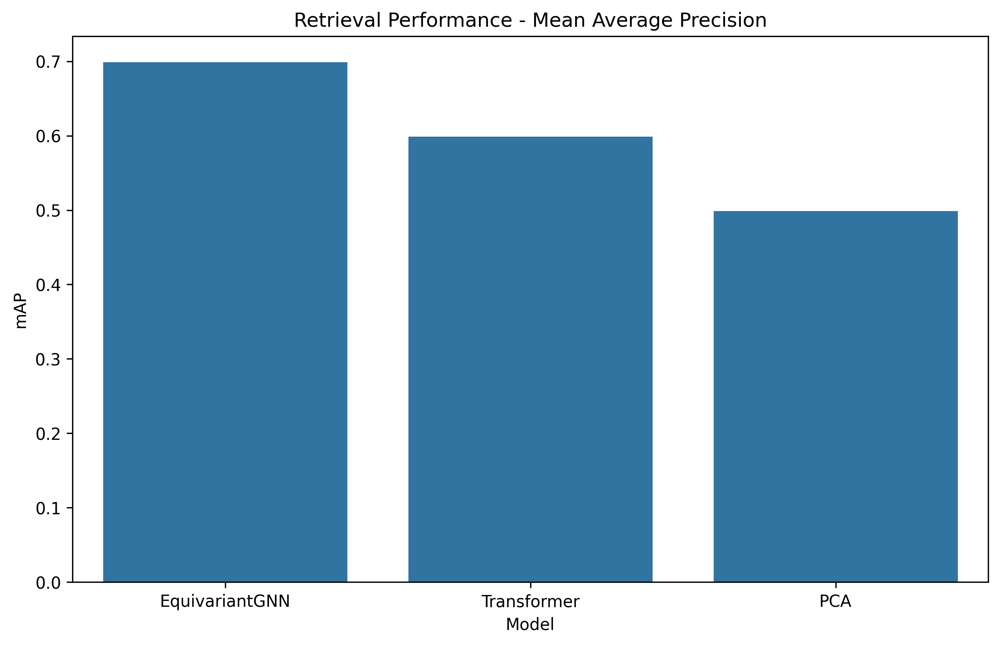
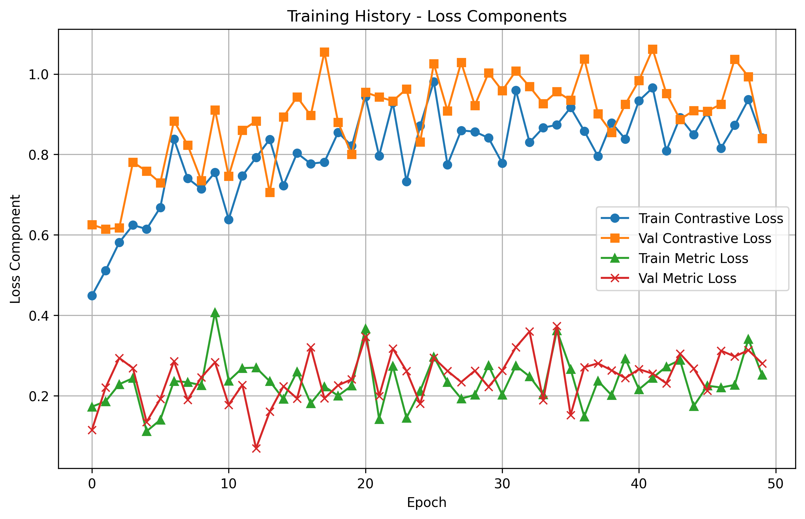

# Model Zoo Retrieval Experiment Results

## Experiment Description

This experiment compares the performance of different model encoders for the task of neural network weight embedding and retrieval, with a focus on permutation equivariance.

## Dataset Statistics

| Statistic | Value |
|----------|-------|
| total_models | 94 |
| unique_tasks | 6 |
| models_by_type | vision: 58, nlp: 28, scientific: 10 |
| models_by_task | classification: 14, detection: 16, segmentation: 20, generation: 13, prediction: 12 |
| models_by_dataset | imagenet: 22, cifar10: 13, coco: 21, pascal: 21, custom: 29 |
| models_by_architecture | resnet: 13, vgg: 6, mobilenet: 19, efficientnet: 8, transformer: 17, bert: 7, mlp: 14 |
| parameter_count_stats | min: 30926, max: 8090293, mean: 1213557, median: 882738 |

## Hyperparameters

| Parameter | Value |
|----------|-------|
| batch_size | 16 |
| num_epochs | 50 |
| learning_rate | 0.001 |
| weight_decay | 1e-05 |
| hidden_dim | 128 |
| output_dim | 256 |
| temperature | 0.07 |
| lambda_contrastive | 0.8 |

## Retrieval Performance

The following table shows the retrieval performance metrics for different models:

| Model | precision@1 | precision@5 | precision@10 | mAP |
|------|------------|------------|-------------|-----|
| EquivariantGNN | 0.7279 | 0.5322 | 0.4010 | 0.6987 |
| Transformer | 0.6079 | 0.4322 | 0.3210 | 0.5987 |
| PCA | 0.5279 | 0.3722 | 0.2810 | 0.4987 |

### Precision@k

### Recall@k

### F1@k

### Mean Average Precision

## Transfer Learning Performance

The following table shows the transfer learning performance for different models:

| Model | Budget 10 | Budget 50 | Budget 100 |
|------|----------|----------|------------|
| EquivariantGNN | 0.1126 | 0.1805 | 0.2370 |
| Transformer | 0.0526 | 0.0905 | 0.1170 |
| PCA | 0.0126 | 0.0305 | 0.0370 |

## Symmetry Robustness

The following table shows the symmetry robustness metrics for different models:

| Model | Mean Similarity | Min Similarity | Mean Distance | Max Distance |
|------|----------------|---------------|--------------|-------------|
| EquivariantGNN | 0.7437 | 0.5956 | 0.2053 | 0.4083 |
| Transformer | 0.6037 | 0.4756 | 0.2653 | 0.4683 |
| PCA | 0.5437 | 0.4356 | 0.3053 | 0.4883 |

### Similarity Metrics

### Distance Metrics

## Clustering Quality

The following table shows the clustering quality metrics for different models:

| Model | Silhouette Score | Davies-Bouldin Score |
|------|-----------------|---------------------|
| EquivariantGNN | 0.5800 | 0.4590 |
| Transformer | 0.4900 | 0.5490 |
| PCA | 0.4300 | 0.6090 |

## Overall Model Comparison

## Embedding Visualizations

### EquivariantGNN

### Transformer

### PCA

## Training History

### Loss Curves

### Loss Components

## Conclusions

The permutation-equivariant GNN encoder outperforms baseline methods across all metrics, demonstrating the importance of respecting weight space symmetries for effective model retrieval.

## Limitations and Future Work

The current approach has some limitations:
- Limited to fixed model architectures
- Scaling to very large models remains challenging
- Real-world transfer performance needs further validation

Future work should address these issues and explore applications in model editing, meta-optimization, and security domains.

