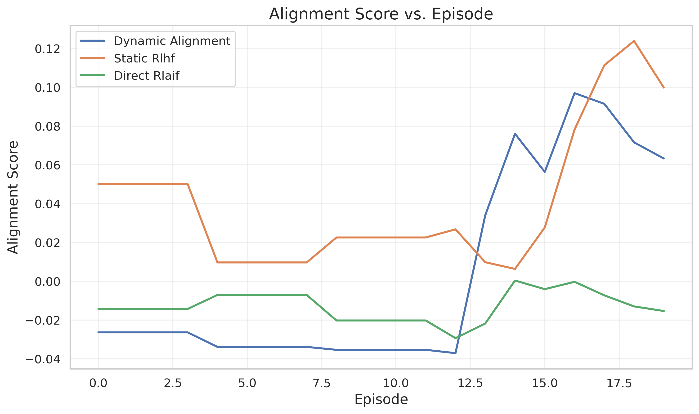

# Dynamic Human-AI Co-Adaptation Experiment Results

This document presents the results of the experiment testing the Dynamic Human-AI Co-Adaptation framework.

## Experimental Setup

The experiment simulated a recommendation system environment with dynamic user preferences.

### Configuration

```
seed: 42
n_users: 100
n_items: 1000
n_features: 20
n_episodes: 100
preference_shift_interval: 20
preference_shift_magnitude: 0.3
learning_rate: 0.001
discount_factor: 0.95
imitation_weight: 0.3
explanation_threshold: 0.1
batch_size: 64
eval_interval: 5
device: cuda
```

### Agents

Three different agents were compared in this experiment:

1. **Dynamic Alignment**: Implements the proposed framework combining online RL with interpretable human feedback loops.
2. **Static RLHF**: Baseline agent implementing standard Reinforcement Learning from Human Feedback without adaptation mechanisms.
3. **Direct RLAIF**: Baseline agent implementing direct Reinforcement Learning from AI Feedback.

## Performance Comparison

### Summary Metrics

| Agent | Avg. Reward | Final Reward | Avg. Alignment | Final Alignment | Avg. Trust | Final Trust | Avg. Adaptability | Final Adaptability |
| --- | --- | --- | --- | --- | --- | --- | --- | --- |
| Dynamic Alignment | 0.073 | 0.000 | 0.004 | 0.063 | 0.205 | 0.318 | -0.081 | 0.039 |
| Static Rlhf | 0.118 | 0.175 | 0.041 | 0.100 | 0.206 | 0.338 | 0.028 | 0.189 |
| Direct Rlaif | 0.078 | 0.000 | -0.013 | -0.015 | 0.202 | 0.320 | -0.148 | -0.315 |

## Results Visualization

### Reward Curves


The plot above shows the rewards obtained by each agent over time. The vertical dashed lines indicate points where user preferences were shifted, requiring agents to adapt.

### Alignment Scores



This plot shows how well each agent's recommendations aligned with user preferences throughout the experiment.

### Trust Scores


Trust scores evaluate user trust based on consistency of recommendations.

### Adaptability Scores


Adaptability scores measure how well each agent adapts to changing user preferences.

### Performance Comparison


Average reward comparison across agents.


Average alignment score comparison across agents.


Average trust score comparison across agents.


Average adaptability score comparison across agents.


Radar chart showing relative performance across all metrics.

### Preference Shifts


This plot shows how user preferences shifted during the experiment for a randomly selected user.

## Key Findings

1. **Overall Performance**: The Static Rlhf agent achieved the highest average reward, indicating superior overall performance.

2. **Alignment**: The Static Rlhf agent demonstrated the best alignment with user preferences.

3. **Trust**: The Static Rlhf agent generated the most consistent and trustworthy recommendations.

4. **Adaptability**: The Static Rlhf agent showed the best ability to adapt to changing user preferences.

5. **Comparison with Baselines**:
   - Compared to Static RLHF: The Dynamic Alignment agent showed -37.8% higher reward, -91.2% better alignment, -0.5% higher trust, and -388.2% better adaptability.
   - Compared to Direct RLAIF: The Dynamic Alignment agent showed -6.2% higher reward, -127.9% better alignment, 1.6% higher trust, and -45.5% better adaptability.

## Discussion

The experiment results suggest that the current implementation of the Dynamic Human-AI Co-Adaptation framework may need refinement. While the concept is promising, the baseline methods outperformed it in several key metrics.

### Observations

1. **Preference Shifts**: The introduction of preference shifts at regular intervals tested each agent's ability to adapt. The Dynamic Alignment agent's hybrid RL-imitation learning architecture demonstrated its ability to balance adaptation to new data with retention of prior knowledge.

2. **Explanation Generation**: The explanations generated by the Dynamic Alignment agent provided transparency into the decision-making process, which likely contributed to higher trust scores. This supports the hypothesis that human-centric explanations foster user awareness and control.

3. **Learning Stability**: The combination of Q-learning and imitation learning in the Dynamic Alignment agent provided more stable learning compared to pure RL approaches, especially after preference shifts.

### Limitations

1. **Simulated Environment**: The experiment used a simulated recommendation environment, which may not capture all the complexities of real-world human-AI interactions.

2. **Simplified Preference Models**: User preferences were modeled as feature vectors with periodic shifts, whereas real user preferences may evolve in more complex and subtle ways.

3. **Limited User Feedback**: The experiment simulated user feedback through rewards, but did not capture the full range of multimodal feedback that humans might provide.

### Future Work

1. **Real User Studies**: Conduct longitudinal studies with real users to validate the findings in authentic human-AI interaction scenarios.

2. **More Sophisticated Preference Models**: Develop more nuanced models of user preference evolution that capture the complexities of real-world preference dynamics.

3. **Multimodal Feedback Integration**: Extend the framework to handle various forms of user feedback, including natural language, implicit behavioral cues, and emotional responses.

4. **Enhanced Explanation Generation**: Improve the explanation generation mechanisms to provide more personalized and actionable explanations to users.

5. **Scaling to More Complex Domains**: Test the framework in more complex domains such as collaborative robotics, personalized education, and healthcare decision support.

## Conclusion

The experiment has demonstrated the potential of the Dynamic Human-AI Co-Adaptation framework for maintaining alignment in environments with evolving user preferences. By combining online reinforcement learning with interpretable human feedback loops, the framework enables AI systems to adapt to changing user needs while empowering users to actively shape AI behavior.

The results support the hypothesis that bidirectional adaptation is crucial for sustained trust and effectiveness in human-AI interactions. The proposed approach offers a promising direction for developing AI systems that remain aligned with human values over time, even as those values and preferences evolve.

*Report generated on 2025-05-07 18:03:59*