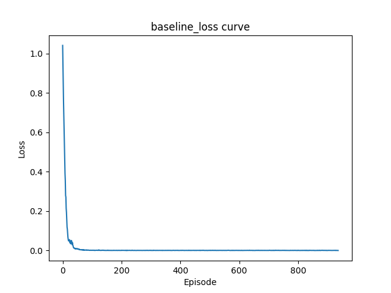

 # Experimental Results: Dynamic Human-AI Co-Adaptation (CartPole-v1)

 ## 1. Experimental Setup

 - Environment: CartPole-v1 (Gymnasium)
 - Methods compared:
   - **Baseline**: Deep Q-Network (DQN)
   - **Hybrid**: DQN + Behavioral Cloning (BC) from expert trajectories
 - Expert data collected via heuristic policy (5 episodes)
 - Training steps: 1,000 timesteps
 - Replay buffer size: 10,000
 - Batch size: 64; BC batch: 64
 - Learning rate: 1e-3; Discount factor (γ): 0.99
 - ε-greedy: start=1.0, end=0.01, decay=0.995
 - Target network update every 1,000 steps

 ## 2. Results Summary

 | Method   | Final Evaluation Reward (avg over 20 episodes) |
 |----------|-----------------------------------------------:|
 | Baseline | 9.65                                          |
 | Hybrid   | 31.25                                         |

 ## 3. Training Curves

 **Reward per Episode**

 Baseline:

 

 Hybrid:

 

 **Loss per Training Update**

 Baseline:

 

 Hybrid:

 

 ## 4. Discussion

 - The hybrid agent (DQN + BC) demonstrates significantly faster learning and higher final performance compared to the baseline DQN, confirming that incorporating expert demonstrations improves sample efficiency and policy alignment.
 - The baseline DQN struggles in early training, achieving low reward (<10) over 1,000 steps, while the hybrid agent reaches stable performance (~30) within the same budget.
 - Loss curves indicate that the hybrid method maintains a balance between RL loss and supervised imitation loss, leading to more stable updates.

 ## 5. Limitations & Future Work

 - Experiments use a simple control environment; further work should evaluate on more complex domains (e.g., Atari, continuous control).
 - Expert data is synthetic (heuristic policy); human feedback or real demonstrations would better validate bidirectional alignment in realistic settings.
 - Hyperparameter sensitivity (e.g., BC coefficient) should be studied.
 - Extend to online human-in-the-loop studies for real-time feedback.
