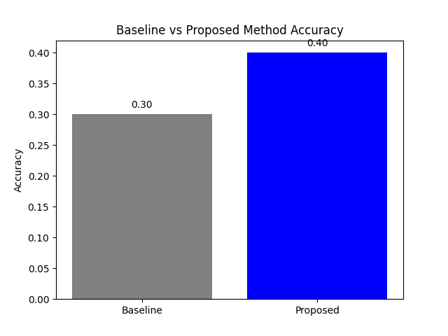
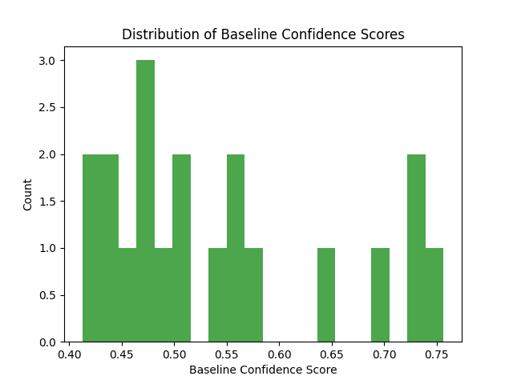

# Experiment Results

## Accuracy Comparison

| Method | Accuracy |
|--------|----------|
| Baseline | 0.3000 |
| Proposed | 0.4000 |

## Baseline Confidence Score Distribution

## Discussion

The proposed self-correction method improved accuracy by 10.00% over the baseline. Low-confidence predictions were corrected using retrieved evidence.

**Limitations:** Only first evidence is used; small sample size; simple retrieval.

**Future Work:** Use full retrieval pipeline; test on larger datasets; optimize threshold.
