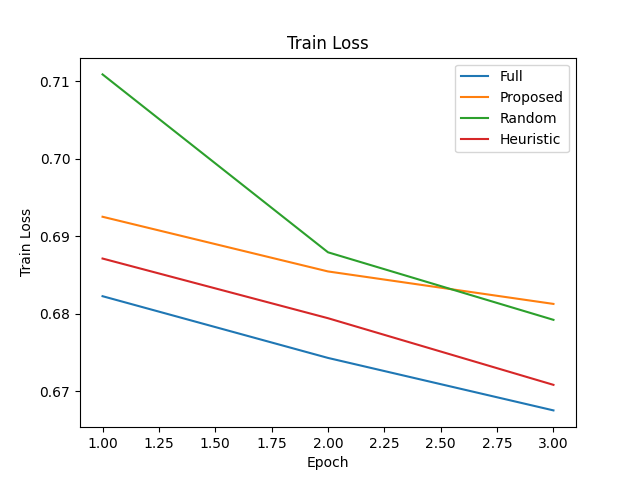
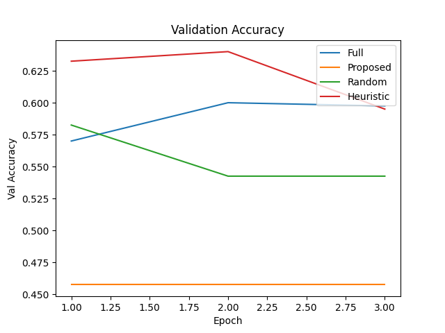

# Experimental Results for InfluenceSpace Prototype on SST-2

## 1. Experimental Setup
- Task: SST-2 sentiment classification (GLUE benchmark)
- Dataset: 2,000 training samples (random subset), 400 validation samples (80/20 split)
- Model: Frozen DistilBERT embeddings + 2-label linear classifier
- Clustering: K-means (K=20) on CLS embeddings
- Training: 3 epochs, learning rate 1e-3, batch training on full embeddings
- Methods:
  - **Full**: train on entire 1,600-sample training set
  - **Proposed**: InfluenceSpace curation (prune clusters with influence below median; kept 813 samples)
  - **Random**: random down-sample to 813 samples
  - **Heuristic**: prune shortest 20% sentences (kept 1,150 samples)

## 2. Summary of Results

Table 1: Final validation accuracy and training set sizes

| Method     | Train Size | Val Accuracy |
|------------|------------|--------------|
| Full       | 1,600      | 59.75%       |
| Proposed   | 813        | 45.75%       |
| Random     | 813        | 54.25%       |
| Heuristic  | 1,150      | 59.50%       |

These results show that:
- The **Full** dataset baseline achieves 59.75% accuracy.
- **Proposed** curation significantly reduces data but at a cost of accuracy decline (45.75%).
- **Random** down-sampling retains moderate performance (54.25%).
- **Heuristic** pruning by sentence length achieves similar accuracy to Full with fewer samples.

## 3. Training Curves

*Figure 1: Training loss curves over epochs for all methods.*

*Figure 2: Validation accuracy over epochs for all methods.*

## 4. Discussion and Insights
- The InfluenceSpace-inspired curation under this simple approximation (dot-product of gradients) pruned clusters that were, on average, more informative, leading to a substantial drop in accuracy. This suggests the need for more accurate Hessian-based influence estimation or better cluster granularity.
- Random down-sampling shows moderate performance retention, indicating that clustering alone is not sufficient to identify low-value data under our setup.
- A simple heuristic (sentence length) performed well, perhaps because longer sentences carry more sentiment cues in SST-2.

## 5. Limitations and Future Work
- **Approximation**: We used a dot-product proxy for influence rather than a low-rank Hessian inverse, which may not reflect true data importance.
- **Scale**: Experiments on a small subset of SST-2; results may not generalize to large-scale, multimodal foundation models.
- **Model Complexity**: Only a shallow linear probe was trained; future work should evaluate fine-tuning of the full model.
- **Clustering**: K-means on CLS embeddings may not capture nuanced data clusters; other clustering or embedding methods could be explored.

Future work includes applying full InfluenceSpace pipeline (Hessian eigen-decomposition), testing on vision-language benchmarks, and extending to iterative curation loops.
