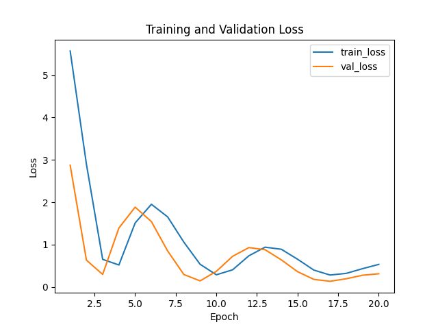

# Experiment Results: Composite Scoring vs Accuracy Selection

## 1. Experimental Setup

| Component                | Details                                 |
|--------------------------|-----------------------------------------|
| Dataset                  | Breast Cancer (sklearn)                 |
| Train/Val/Test Split     | 60% / 20% / 20%                         |
| Seeds                    | 3 (0, 1, 2)                             |
| Baseline Models          | Logistic Regression, Random Forest      |
| Proposed Model           | 2-layer MLP (hidden_dim=32), PyTorch    |
| Training Epochs          | 20                                      |
| Composite Score Formula  | (Accuracy + F1) / 2                     |

## 2. Average Test Metrics per Model

The following table reports average test accuracy and F1 score across seeds for each model.

| Model                  | Test Accuracy | Test F1 Score |
|------------------------|---------------|---------------|
| Logistic Regression    | 0.9591        | 0.9678        |
| Random Forest          | 0.9591        | 0.9674        |
| MLP (Proposed)         | 0.7953        | 0.8531        |

*Figure 1: Average test accuracy per model.*

*Figure 2: Average test F1 score per model.*

## 3. Selection Methods Comparison

Models were selected per seed either by highest validation accuracy (Accuracy selection) or highest composite score (Composite selection). The following table shows average test metrics of the selected models.

| Selection Method       | Avg. Test Accuracy | Avg. Test F1 Score |
|------------------------|--------------------|--------------------|
| Accuracy Selection     | 0.9620             | 0.9702             |
| Composite Selection    | 0.9591             | 0.9676             |

## 4. Training Dynamics (MLP)

*Figure 3: Training and validation loss over epochs for MLP.*

*Figure 4: Validation accuracy and F1 over epochs for MLP.*

## 5. Discussion

- The composite scoring method did not outperform simple accuracy-based selection on the breast cancer dataset. Accuracy selection yielded slightly higher average test accuracy (0.9620 vs 0.9591) and F1 score (0.9702 vs 0.9676).
- Baseline models (Logistic Regression and Random Forest) performed similarly and both outperformed the simple MLP on this tabular dataset.
- The MLP's underperformance suggests additional hyperparameter tuning or more complex architectures may be required for neural methods on this dataset.

## 6. Limitations and Future Work

- **Dataset scope**: Only one small tabular dataset was evaluated. Future experiments should include diverse modalities (e.g., vision, NLP).
- **Metrics**: Only accuracy and F1 were used. Additional metrics (e.g., robustness, subgroup fairness) could enrich composite scores.
- **Model diversity**: More candidate models and hyperparameter sweeps could better illustrate composite scoring benefits.
- **Weighting strategy**: Equal weights were assumed; exploring adaptive or domain-informed weights may improve composite selection.

---
*Results generated by automated script. See `log.txt` for full logs.*
