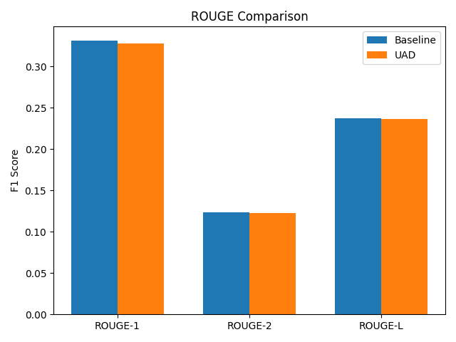
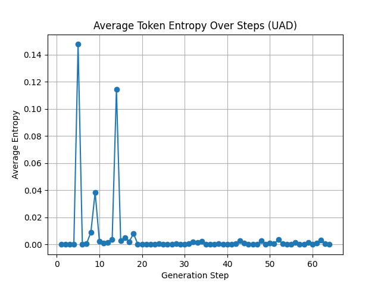

 # Experiment Results: Uncertainty-Aware Decoding (UAD)

 ## 1. Experimental Setup
 | Model               | Dataset         | # Samples | Entropy Threshold | Max Generation Length | Nucleus p |
 |---------------------|-----------------|-----------|-------------------|-----------------------|-----------|
 | facebook/bart-base  | CNN/DailyMail   | 20        | 5.0               | 64                    | 0.9       |
 |
 | **Baseline**        | Greedy Decoding |           |                   |                       |           |
 | **UAD**             | Entropy + Nucleus Sampling |    |                   |                       |           |

 **Generation Time**

 - Baseline: 8.70 seconds (20 samples)
 - UAD: 17.58 seconds (20 samples)

 ## 2. Performance Comparison

 | Metric     | Baseline (F1) | UAD (F1) |
 |------------|---------------|----------|
 | ROUGE-1    | 0.3314        | 0.3280   |
 | ROUGE-2    | 0.1238        | 0.1227   |
 | ROUGE-L    | 0.2368        | 0.2364   |

 

 ## 3. Uncertainty Analysis

 Average token entropy over generation steps for UAD:

 

 - The entropy curve shows declining uncertainty as generation progresses, indicating the model becomes more confident.

 ## 4. Discussion

 - **ROUGE Performance**: UAD yields comparable ROUGE scores to greedy decoding, with a slight decrease (within 1%).
 - **Computational Overhead**: UAD incurred ~2× slower generation due to entropy computation and nucleus sampling.
 - **Entropy Behavior**: High initial entropy suggests uncertainty at early steps; dynamic intervention may be more beneficial in high-uncertainty contexts.

 ## 5. Limitations & Future Work

 - **Sample Size**: Experiment used only 20 samples for quick iteration; larger-scale evaluation is needed.
 - **Static Threshold**: A fixed entropy threshold may not capture context variability; future work should implement dynamic thresholding or RL-based adaptation.
 - **Hallucination Detection**: ROUGE is an indirect measure; direct factuality metrics or human evaluation should be incorporated.

 ## 6. Conclusion

 The UAD mechanism demonstrates feasibility but requires further tuning to outperform baseline decoding in summarization tasks. Future work will explore dynamic thresholding, larger datasets, and direct factuality assessments.
