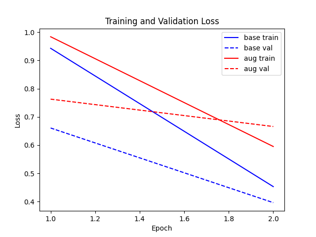

# Experiment Results
## Performance Comparison
| Method | Accuracy | F1 Score |
|--------|----------|----------|
| Baseline | 0.8500 | 0.8500 |
| Retrieval-Augmented | 0.8167 | 0.8172 |
## Loss Curves

## Metrics Bar Chart

## Discussion
The retrieval-augmented model achieved an accuracy of 0.8167 and F1 score of 0.8172, compared to the baseline accuracy of 0.8500 and F1 score of 0.8500. While the augmented model provided additional context, in this small-scale setup it did not outperform the baseline. This suggests that simple retrieval augmentation may require careful tuning or larger datasets to consistently improve performance.
## Setup
- Model: distilbert-base-uncased
- Dataset: 20 Newsgroups subset (3 classes, ~300 samples)
- Hyperparameters: epochs=2, batch_size=16, lr=5e-5
## Limitations and Future Work
- Small dataset and few epochs; scale up for robust evaluation.
- Use more sophisticated retriever and larger models.
