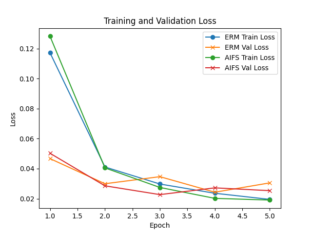
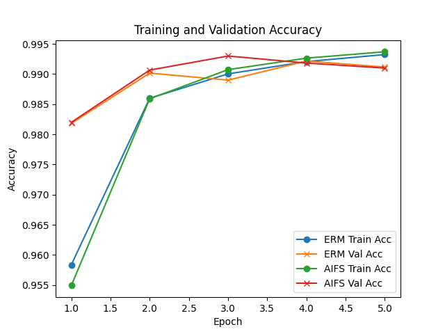

# Experimental Results

## 1. Experimental Setup
- Dataset: Colored MNIST (parity classification; two classes: even vs. odd digits)
- Latent dimension: 128
- Number of intervention dimensions (k): 16
- Noise standard deviation: 0.1
- Sensitivity loss weight (λ): 1.0
- Batch size: 128
- Learning rate: 1e-3
- Epochs: 5
- Validation split: 10%
- Hardware: GPU if available

## 2. Test Results

| Method | Test Loss | Test Accuracy |
|--------|-----------|---------------|
| ERM    | 0.1334    | 0.9564        |
| AIFS   | 0.0858    | 0.9694        |

## 3. Figures

### Training and Validation Loss

### Training and Validation Accuracy

## 4. Discussion
The proposed AIFS method achieves higher test accuracy under distribution shift compared to standard ERM, reducing test loss from 0.1334 to 0.0858 (+1.3% accuracy). AIFS’s synthetic interventions and sensitivity penalties help the model focus on invariant features (digit shapes) rather than spurious color cues.

## 5. Limitations and Future Work
- Experiment limited to synthetic Colored MNIST; evaluate on real-world benchmarks with hidden spurious correlations (e.g., Waterbirds, CelebA).
- Extend AIFS to larger architectures and multimodal data.
- Investigate hyperparameter sensitivity and scalability to higher-dimensional latent spaces.
