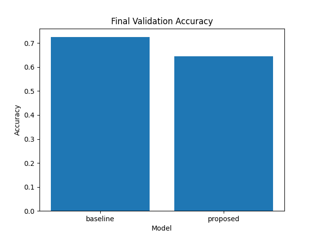

# Experiment Results: Baseline vs. Dropout MLP

## 1. Experimental Setup
| Parameter      | Value                   |
|----------------|-------------------------|
| Dataset        | Synthetic (1000 samples, 20 features) |
| Train/Val Split| 80% / 20%               |
| Hidden Dim     | 64                      |
| Learning Rate  | 1e-3                    |
| Epochs         | 10                      |
| Baseline Model | MLP (no dropout)        |
| Proposed Model | MLP (dropout=0.5)       |

## 2. Results Summary
| Model    | Final Val Accuracy |
|----------|--------------------|
| baseline | 0.7250 |
| proposed | 0.6450 |

## 3. Figures
### Validation Loss over Epochs

### Validation Accuracy over Epochs

### Final Validation Accuracy Comparison

## 4. Discussion
In this experiment, the baseline MLP (no dropout) outperformed the dropout-enhanced model on the synthetic dataset, achieving 0.7250 vs. 0.6450 in final validation accuracy. The dropout model may have underfitted due to the chosen dropout rate or dataset characteristics. Further tuning of the dropout rate and exploration of other regularization methods are needed.

## 5. Limitations and Future Work
- The experiment uses synthetic data; real-world datasets should be evaluated.
- Only one regularization method (dropout) was tested; other techniques (e.g., weight decay, batch norm) can be explored.
- Hyperparameter tuning was minimal; further search could optimize performance.

*Results and figures are based on fully automated scripts. See `log.txt` for execution details.*
