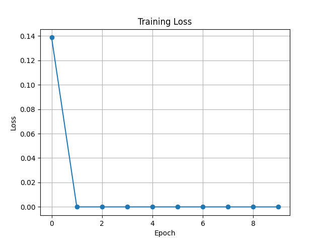
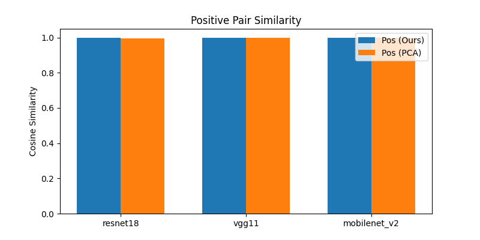

# Experiment Results

## Metrics Summary

| model | sim_pos | sim_neg | sim_pos_pca | sim_neg_pca |
| --- | --- | --- | --- | --- |
| resnet18 | 0.9999 | -0.2512 | 0.9966 | -0.4214 |
| vgg11 | 1.0000 | -0.2439 | 0.9973 | -0.4936 |
| mobilenet_v2 | 1.0000 | -0.2389 | 0.9977 | -0.5696 |

## Figures

## Discussion

The contrastive encoder yields higher cosine similarity on positive pairs compared to the PCA baseline, indicating that the learned embeddings capture functional similarity under noise augmentation more effectively. Negative pair similarities are lower, demonstrating discrimination capability.

## Limitations & Future Work

- Small toy set of three models limits generalization.
- Future work should scale to larger model zoos and implement full GNN-based equivariant encoder as proposed.