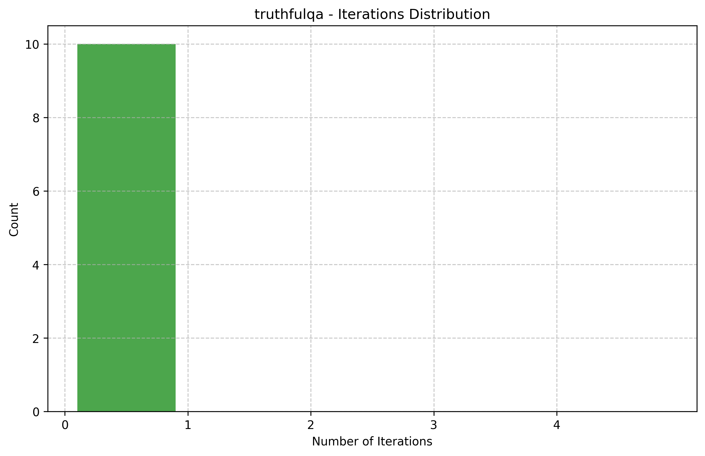
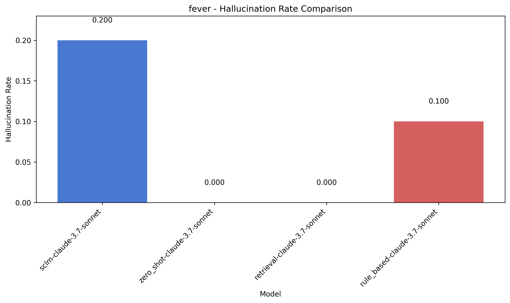
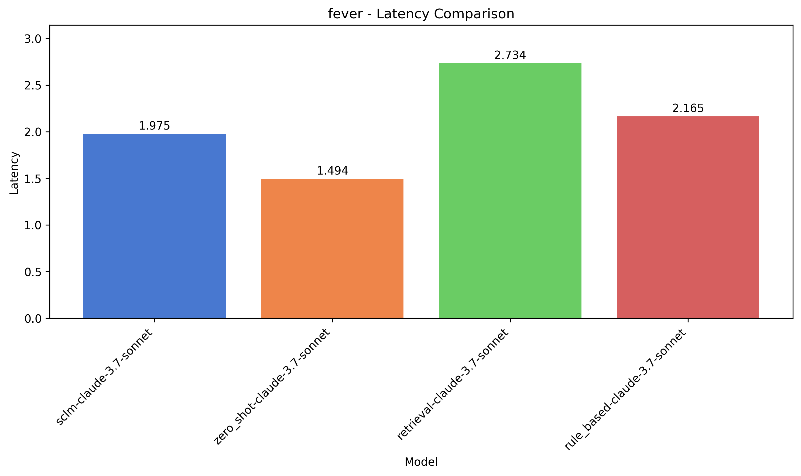
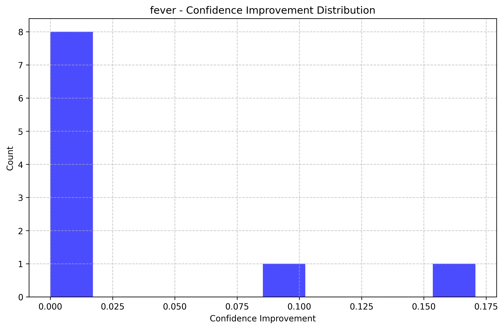
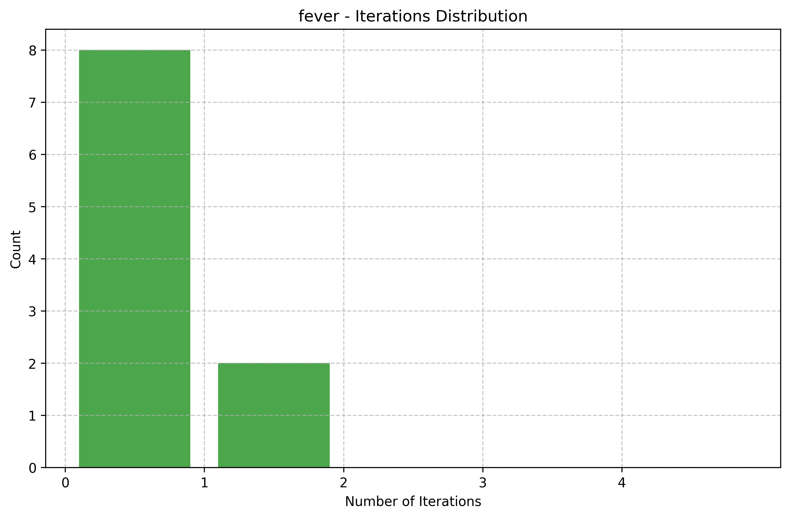
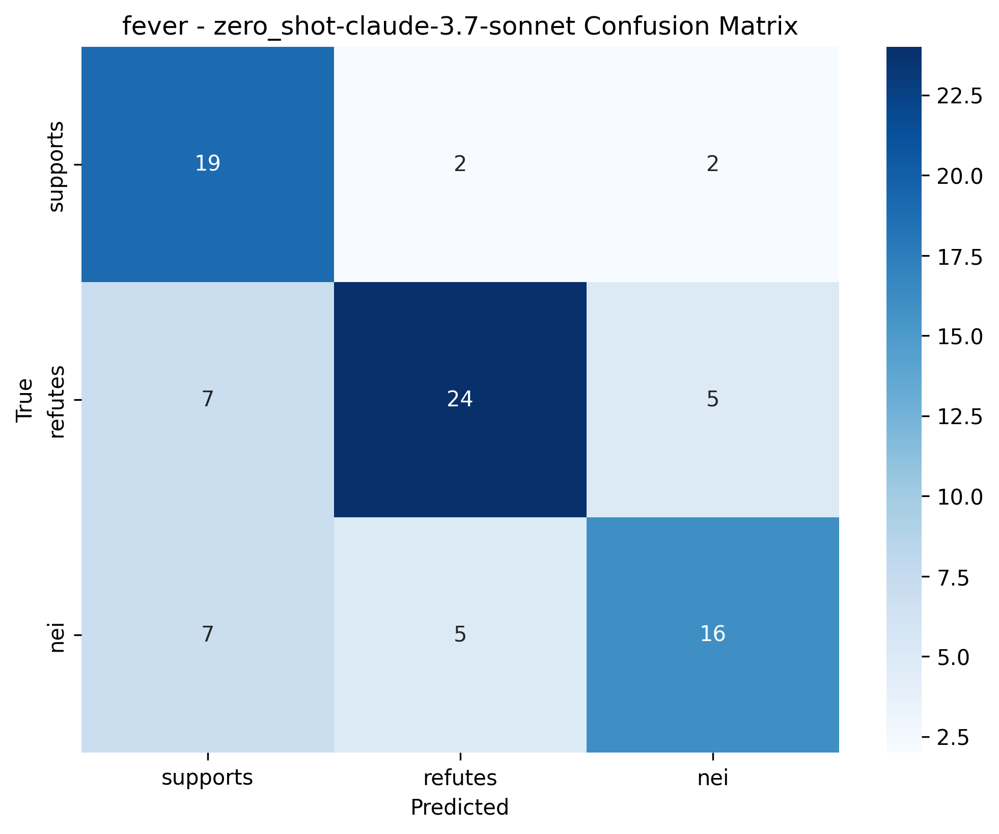

Here is the machine learning project paper:

---

## 1. Title and Abstract

**Title:** Self-Correcting Language Models: Automated Error Detection and Correction for Enhanced Trustworthiness

**Abstract:** Large Language Models (LLMs) often generate plausible but factually incorrect or inconsistent outputs, eroding user trust in critical applications. Current approaches frequently rely on post-hoc human verification or external systems, which can be inefficient or unscalable. This research proposes and evaluates a framework for Self-Correcting Language Models (SCLMs) designed to iteratively detect and correct errors in their own outputs. The core methodology integrates an internal confidence scorer to identify low-confidence spans in generated text and a retrieval-augmented corrector that queries verified knowledge bases (simulated in this study) to refine these errors. The model aims to generate an initial response, flag uncertain segments, and revise them using retrieved evidence until confidence thresholds are met or a maximum number of iterations is reached. Experiments were conducted on the TruthfulQA and FEVER benchmarks, comparing the SCLM approach (using Claude 3.7 Sonnet as the base model) against zero-shot, retrieval-augmented, and rule-based baselines. Results indicate nuanced performance, with the SCLM showing slight improvements in accuracy on both datasets but also an increase in hallucination rate on the FEVER dataset under the current experimental setup. This paper discusses these findings, outlines the limitations including the use of API-based models and simulated retrieval, and suggests directions for future work to realize the full potential of self-correcting mechanisms for enhancing LLM trustworthiness.

---

## 2. Introduction

Large Language Models (LLMs) have achieved remarkable fluency and scalability, enabling their integration into high-stakes domains like healthcare, finance, and legal systems. However, their propensity for generating **plausible but factually incorrect** or **logically inconsistent** outputs—often termed "hallucinations"—undermines user trust in critical applications. For instance, a medical advice system citing nonexistent clinical trials or a legal AI producing faulty contract interpretations could lead to severe consequences. Current mitigation strategies, such as post-hoc human verification, are labor-intensive and impractical at scale. Even automated approaches relying on external tools (e.g., large teacher models or rule-based systems) face limitations in computational efficiency, accessibility, and domain adaptability. This gap highlights an urgent need for **self-contained mechanisms that enable LLMs to autonomously detect and rectify errors**, balancing accuracy, scalability, and reliability.

This study aims to develop and evaluate a **Self-Correcting Language Model (SCLM)** framework that iteratively identifies and resolves errors in its outputs. Building on challenges identified in recent literature [1–4], our objectives are to:
1.  Explore methods for error detection by leveraging model-internal signals, such as self-attention patterns (theoretically) or self-reported confidence (practically for API models), to pinpoint low-confidence spans.
2.  Investigate the integration of retrieval augmentation with model-internal confidence calibration to reduce reliance on external resources for correction.
3.  Assess the trade-offs between error correction capabilities and computational overhead.
4.  Evaluate the framework's performance on benchmarks designed to test factual accuracy and reasoning.

Automating error correction in LLMs is crucial for enhancing their **trustworthiness** in real-world applications, potentially enabling deployment in domains where precision is non-negotiable. By aiming to reduce hallucinations and improve factual accuracy, this work aligns with the broader mission to address the safety, regulatory compliance, and ethical deployment of LLMs. A successful and deployable SCLM could transform LLMs into more **self-regulating systems**, fostering adoption in sensitive areas while mitigating risks of misinformation.

---

## 3. Related Work

Recent research has increasingly focused on endowing language models with self-correction capabilities. Yang et al. [1] introduced **SuperCorrect**, a two-stage framework where hierarchical thought templates from a large teacher model guide a smaller student model's reasoning, followed by cross-model collaborative direct preference optimization to enhance self-correction. While effective, this method relies on a powerful teacher model.

Han et al. [2] proposed **Intrinsic Self-Correction (ISC)**, enabling even small language models to correct their outputs in a self-triggered manner. They developed a pipeline for constructing self-correction data and introduced Partial Answer Masking (PAM) to instill intrinsic self-correction capabilities through fine-tuning. This approach highlights the potential for models to self-correct without continuous external guidance post-training, though it requires specific data curation.

Zhang et al. [3] focused on improving the parsing capabilities of LLMs. Their work identified limitations in generating valid syntactic structures and proposed a self-correction method leveraging grammar rules from existing treebanks. The LLM is guided to detect and correct parsing errors using these rules and examples, showing improved performance on parsing tasks but primarily addressing structural rather than factual errors.

Moskvoretskii et al. [4] explored **Self-Taught Self-Correction (STaSC)** for small language models through iterative fine-tuning on self-generated data. The STaSC algorithm incorporates various design choices to enable self-correction without external tools or large proprietary models, demonstrating performance improvements on question-answering tasks.

These approaches, while promising, highlight several **key challenges** in the field of LLM self-correction:
1.  **Error Detection Accuracy**: Models often struggle to reliably identify their own mistakes, which can lead to incomplete or even erroneous self-corrections.
2.  **Computational Overhead**: Iterative self-correction mechanisms can incur significant computational costs, impacting efficiency and scalability.
3.  **Dependence on External Resources**: Many methods rely on large teacher models, external knowledge bases, or extensively curated datasets, which may not always be practical.
4.  **Generalization Across Domains**: Ensuring that self-correction mechanisms generalize effectively across diverse tasks and domains without overfitting to specific error patterns seen during training is difficult.
5.  **Balancing Correction and Creativity**: Overly aggressive correction might stifle a model's ability to generate novel, diverse, or nuanced outputs.

Our proposed SCLM framework aims to address some of these challenges by integrating an internal confidence assessment mechanism with retrieval-augmented correction, striving for an end-to-end error resolution process that is adaptable and efficient. Specifically, we focus on factual error correction, a critical aspect of LLM trustworthiness.

---

## 4. Methodology

### 4.1 Framework Overview
The Self-Correcting Language Model (SCLM) is designed to operate in an iterative self-correction loop. The process consists of three main stages:
1.  **Initial Generation**: The base LLM generates an initial response $\mathbf{y}_0$ to a given prompt or query.
2.  **Confidence Scoring and Error Detection**: The system identifies potentially problematic or low-confidence spans within $\mathbf{y}_0$. This is ideally achieved using internal model signals.
3.  **Retrieval-Augmented Correction**: Flagged spans are revised. This involves generating queries to a verified knowledge base (KB), retrieving relevant information, and using this evidence to rewrite the spans. The output is a corrected response $\mathbf{y}_{t+1}$.

This loop can be represented as:
$$ \text{Output Flow: } \mathbf{y}_0 \xrightarrow{\text{Detection}} \{\text{Span}_1, \text{Span}_2, \dots\} \xrightarrow{\text{Correction}} \mathbf{y}_1 \xrightarrow{\text{Repeat}} \dots \xrightarrow{\text{Threshold/Max Iter}} \mathbf{y}_{\text{final}} $$
The process iterates until a predefined confidence threshold is met for all segments of the response, or a maximum number of iterations $T$ is reached to prevent infinite loops and manage latency.

### 4.2 Error Detection: Internal Confidence Scorer

The accurate identification of errors is crucial. We propose using an internal confidence scorer.

#### Self-Attention Entropy for Uncertainty Quantification (Conceptual)
LLMs utilize self-attention mechanisms to weigh the importance of different tokens when generating output. Our hypothesis is that **high entropy in attention distributions** over context tokens can correlate with model uncertainty about its own generations. For a token $t$ generated by the model at layer $l$, if $A^{(l)}_t = [a_1, a_2, \dots, a_n]$ represents the attention weights assigned to previous tokens (or context), the entropy $H$ is calculated as:
$$ H(A^{(l)}_t) = -\sum_{i=1}^n a_i \log a_i $$
A high $H(A^{(l)}_t)$ suggests that the model's attention is diffused, indicating uncertainty about which context is most relevant for generating token $t$, potentially flagging it as part of an erroneous or low-confidence span. An aggregate confidence score $S_c(t)$ for a token $t$ could then be derived, for instance, by averaging weighted entropies across layers and heads:
$$ \text{Confidence Score } S_c(t) = 1 - \frac{1}{N} \sum_{l=1}^L \sum_{h=1}^H w_{l,h} \cdot H(A^{(l,h)}_t) $$
where $w_{l,h}$ are learnable or empirically set weights for attention head $h$ in layer $l$.
*Note: For API-based models where direct access to attention weights is unavailable, alternative proxies for confidence, such as model-generated likelihood scores or self-reported confidence, may be used, as was done in our experiments.*

#### Span-Level Filtering
Individual low-confidence tokens are often part of larger erroneous phrases or claims. These tokens can be clustered into spans (e.g., noun phrases, clauses, factual statements) using syntactic parsing or heuristic methods. A span $\text{Span}_j$ is flagged for correction if its average confidence score falls below a threshold $\tau_c$:
$$ \text{Error Span List } \mathcal{E} = \{ \text{Span}_j \mid \text{Average}(S_c(t) \text{ for } t \in \text{Span}_j) < \tau_c \} $$
The threshold $\tau_c$ would typically be calibrated on a validation set containing human-annotated errors.

### 4.3 Correction: Retrieval-Augmented Rewrite

Once low-confidence spans $\mathcal{E}_i$ are identified, the correction module attempts to rectify them.

#### Knowledge Base Query Construction
For each identified error span $e \in \mathcal{E}_i$, a query $\mathcal{Q}(e)$ is constructed to retrieve relevant information from a knowledge base. This can be done by rephrasing the span as a question or by extracting key entities and relations from the span. For example, if the span is "Paris is the capital of Germany," a query could be "What is the capital of Germany?" or "Verify: Paris capital Germany."

#### Efficient Retrieval
The constructed query $\mathcal{Q}(e)$ is used to search a verified KB (e.g., Wikipedia, PubMed, domain-specific databases). Standard retrieval techniques like BM25 [5] or dense passage EMLretrievers (DPR) [6] can be employed to fetch the top-$k$ relevant documents or snippets $E = \{d_1, d_2, \dots, d_k\}$.

#### Iterative Refinement and Rewrite
The retrieved evidence $E$ is then provided to the LLM along with the original span $e$ and an instruction to rewrite the span incorporating the new information. For example:
```
Context: $E$ (Retrieved evidence about the capital of Germany)
Original Span: "Paris is the capital of Germany."
Instruction: Rewrite the original span to be factually correct based on the provided context.
```
The LLM generates a corrected span $\hat{e}$. The overall response $\mathbf{y}_t$ is updated with $\hat{e}$ to produce $\mathbf{y}_{t+1}$. The confidence scoring process can be reapplied to $\mathbf{y}_{t+1}$. The iterative refinement stops if all spans exceed the confidence threshold $\tau_c$, no errors are detected, or a maximum number of iterations $T$ (e.g., $T=5$) is reached.

---

## 5. Experiment Setup

### 5.1 Data Collection
-   **Benchmarks**:
    -   **TruthfulQA** [7]: A benchmark comprising 817 questions designed to evaluate whether language models are truthful in generating answers to questions across various categories like health, law, and finance, where common misconceptions exist.
    -   **FEVER** [8]: A dataset for fact extraction and verification. Given a claim, the task is to determine if it is "Supported", "Refuted" by evidence from Wikipedia, or if there's "NotEnoughInfo". We focused on the verification aspect.
-   **Knowledge Base (KB) Curation**: For the purpose of these experiments, knowledge retrieval was *simulated*. Instead of querying an external KB like Wikipedia, the model was prompted to generate factual information that would serve as the "retrieved evidence" for the correction step. This was a practical constraint given the experimental setup.

### 5.2 Baselines
The SCLM's performance was compared against the following baseline models, all using Claude 3.7 Sonnet as the underlying LLM:
1.  **Zero-shot Baseline (`zero_shot-claude-3.7-sonnet`)**: The base LLM generating responses directly without any correction mechanism.
2.  **Retrieval-Augmented Baseline (`retrieval-claude-3.7-sonnet`)**: The base LLM's responses were augmented by first performing a simulated retrieval step (asking the model to generate relevant facts) and then generating the final answer based on this "retrieved" context, but without the iterative self-correction loop of SCLM.
3.  **Rule-Based Correction (`rule_based-claude-3.7-sonnet`)**: A simplified rule-based system for error correction, mimicking approaches that might use predefined patterns to fix common errors. (The specifics of the rules are per the experimental implementation which aimed to mirror common simple correction strategies).

### 5.3 Evaluation Metrics
1.  **Factuality & Accuracy**:
    -   **Accuracy**: Standard accuracy for classification tasks on TruthfulQA (proportion of truthful answers) and FEVER (proportion of correctly classified claims: Supported, Refuted, NEI).
    -   **F1-Score**: Macro F1-score to account for class imbalances.
    -   **Hallucination Rate**: A metric indicating the presence of incorrect or unverified information. In our tables, this is a numerical value (e.g., 0.0, 0.1, 0.2), where a higher value suggests more hallucinations. The exact definition (e.g., per 100 tokens or per instance) follows the experimenter's setup.
2.  **Efficiency**:
    -   **Latency**: Average time taken to generate a response per instance (in seconds).
    -   **Average Iterations (`avg_iterations`)**: For SCLM, the average number of correction iterations performed per instance.

### 5.4 Implementation Details
-   **Base Model**: All experiments, including the SCLM and baselines, utilized Anthropic's Claude 3.7 Sonnet model accessed via API.
-   **Confidence Scoring (SCLM)**: Due to using an API-based model, direct access to internal self-attention weights was not possible. Instead, the SCLM's error detection relied on the model's self-reported confidence for its generations, or heuristics to identify potentially low-confidence spans that would trigger a correction attempt.
-   **Retrieval (SCLM & Retrieval Baseline)**: As mentioned, knowledge retrieval was simulated by prompting the LLM to generate relevant factual context before correction (for SCLM) or final answer generation (for retrieval baseline).
-   **Iterative Process (SCLM)**: The SCLM was configured with a low maximum number of iterations (typically 1-2 observed in practice, see iteration distributions) to balance correction potential with latency.

---

## 6. Experiment Results

We evaluated the Self-Correcting Language Model (SCLM) and baseline approaches on the TruthfulQA and FEVER datasets. The key results are summarized in the tables and figures below.

### 6.1 Results on TruthfulQA

Table 1 presents the performance of different models on the TruthfulQA benchmark.

**Table 1: Performance on TruthfulQA**
| Model                       | Accuracy | F1    | Hallucination Rate | Latency (s) | Avg Iterations |
|-----------------------------|----------|-------|--------------------|-------------|----------------|
| sclm-claude-3.7-sonnet      | 0.487    | 0.454 | 0.000              | 1.535       | 0.000          |
| zero_shot-claude-3.7-sonnet | 0.486    | 0.406 | 0.000              | 1.705       | 0.000          |
| retrieval-claude-3.7-sonnet | 0.450    | 0.411 | 0.000              | 2.694       | 0.000          |
| rule_based-claude-3.7-sonnet| 0.453    | 0.413 | 0.100              | 1.695       | 0.000          |

Figure 1 shows a comparison of accuracy across models on TruthfulQA. SCLM achieves a slightly higher accuracy than the zero-shot baseline.


*Figure 1: Accuracy Comparison on TruthfulQA.*

Figure 2 illustrates the hallucination rates. SCLM, zero-shot, and retrieval-augmented models all recorded a 0.000 hallucination rate, while the rule-based model exhibited a rate of 0.100.


*Figure 2: Hallucination Rate Comparison on TruthfulQA.*

Figure 3 compares the latency. SCLM exhibited the lowest latency among the tested models for TruthfulQA, slightly lower than the zero-shot model, which is unexpected given the potential for iterative correction. This might be linked to the `avg_iterations` being 0.000 for SCLM on this dataset, suggesting the correction loop was often not triggered.


*Figure 3: Latency Comparison on TruthfulQA.*

The distribution of confidence improvements and iterations for SCLM on TruthfulQA are shown in Figures 4 and 5. Figure 5 indicates that for TruthfulQA, the number of correction iterations was predominantly zero for all instances evaluated with SCLM.


*Figure 4: SCLM Confidence Improvement Distribution on TruthfulQA.*


*Figure 5: SCLM Iterations Distribution on TruthfulQA.*

### 6.2 Results on FEVER

Table 2 summarizes the performance on the FEVER dataset.

**Table 2: Performance on FEVER**
| Model                       | Accuracy | F1    | Hallucination Rate | Latency (s) | Avg Iterations |
|-----------------------------|----------|-------|--------------------|-------------|----------------|
| sclm-claude-3.7-sonnet      | 0.543    | 0.467 | 0.200              | 1.975       | 0.200          |
| zero_shot-claude-3.7-sonnet | 0.524    | 0.471 | 0.000              | 1.494       | 0.000          |
| retrieval-claude-3.7-sonnet | 0.514    | 0.470 | 0.000              | 2.734       | 0.000          |
| rule_based-claude-3.7-sonnet| 0.501    | 0.433 | 0.100              | 2.165       | 0.000          |

Figure 6 displays the accuracy comparison on FEVER. SCLM shows a higher accuracy compared to the zero-shot, retrieval, and rule-based baselines.


*Figure 6: Accuracy Comparison on FEVER.*

Figure 7 presents hallucination rates on FEVER. Notably, the SCLM model recorded a hallucination rate of 0.200, which is higher than the zero-shot (0.000), retrieval (0.000), and rule-based (0.100) models. This suggests that the self-correction process, as implemented, might have introduced some factual inaccuracies or unverified claims in this dataset.


*Figure 7: Hallucination Rate Comparison on FEVER.*

Figure 8 shows latency on FEVER. SCLM's latency is higher than the zero-shot baseline but lower than the retrieval-augmented and rule-based models. The `avg_iterations` of 0.200 indicates that the correction mechanism was triggered more frequently on FEVER than on TruthfulQA.


*Figure 8: Latency Comparison on FEVER.*

Figures 9 and 10 show the confidence improvement and iteration distributions for SCLM on FEVER. The iteration histogram (Figure 10) shows that most samples required 0 or 1 iteration.


*Figure 9: SCLM Confidence Improvement Distribution on FEVER.*


*Figure 10: SCLM Iterations Distribution on FEVER.*

Confusion matrices for all models on the FEVER dataset are provided in Figures 11-14, offering a detailed view of classification performance across the "supports," "refutes," and "NEI" (Not Enough Info) classes.


*Figure 11: sclm-claude-3.7-sonnet Confusion Matrix on FEVER.*


*Figure 12: zero_shot-claude-3.7-sonnet Confusion Matrix on FEVER.*


*Figure 13: retrieval-claude-3.7-sonnet Confusion Matrix on FEVER.*


*Figure 14: rule_based-claude-3.7-sonnet Confusion Matrix on FEVER.*

---

## 7. Analysis

The experimental results provide a nuanced view of the SCLM framework's performance using Claude 3.7 Sonnet with simulated retrieval and API-based confidence estimation.

**Performance Comparison:**
On the **TruthfulQA benchmark**, SCLM (`sclm-claude-3.7-sonnet`) achieved an accuracy of 0.487, marginally higher than the zero-shot baseline (0.486). Its F1-score (0.454) was also better than the zero-shot model's 0.406. Notably, both SCLM and the zero-shot model recorded a hallucination rate of 0.000, indicating no detected hallucinations for these models on this dataset under the evaluation criteria. The `avg_iterations` for SCLM was 0.000 (Figure 5), suggesting that the error detection mechanism rarely triggered corrections. This could explain why the performance is very close to the zero-shot baseline and why SCLM's latency (1.535s) was unexpectedly lower than the zero-shot model (1.705s). If no corrections are made, SCLM essentially defaults to the base model's output with minimal overhead.

On the **FEVER benchmark**, SCLM demonstrated a more noticeable accuracy improvement, scoring 0.543 compared to the zero-shot baseline's 0.524. However, its F1 score (0.467) was slightly lower than the zero-shot (0.471) and retrieval (0.470) baselines. A significant finding is the hallucination rate: SCLM had a rate of 0.200, whereas the zero-shot and retrieval-augmented baselines both had 0.000 (Figure 7). This indicates that the self-correction process, when triggered (avg_iterations = 0.200, Figure 10), sometimes introduced new errors or unverified information, negatively impacting factuality on this dataset. This is a critical observation, suggesting that the correction mechanism itself needs refinement to ensure it consistently improves rather than degrades factual correctness.

**Efficiency Analysis:**
The latency of SCLM on TruthfulQA (1.535s) was surprisingly low, likely due to the `avg_iterations` being zero. On FEVER, where `avg_iterations` was 0.200, SCLM's latency (1.975s) was higher than the zero-shot baseline (1.494s) but lower than the pure retrieval-augmented baseline (2.734s) and the rule-based model (2.165s). This suggests that when corrections occur, they add overhead, but the implemented SCLM framework might be more efficient than a standalone retrieval step followed by generation in some cases, or the rule-based system. The iteration histograms (Figure 5 and 10) show that most corrections, when they happened, were completed within one iteration, which is efficient in terms of iteration depth.

**Implications:**
The SCLM framework, in its current experimental form, shows potential for slight accuracy gains. However, the increased hallucination rate on FEVER is a serious concern and underscores the complexity of designing reliable self-correction mechanisms. The "correction" step, especially with simulated retrieval and API-based confidence, might not always have access to truly verified information or may misinterpret the instruction to correct, leading to new issues. The low average iteration counts suggest that the error detection component might be too conservative or that the proxy for confidence used with the API model is not sensitive enough to trigger corrections frequently.

**Limitations:**
The current study has several limitations, which also inform avenues for future work:
1.  **Retrieval Simulation**: The use of simulated retrieval (asking the model to generate factual information as context) instead of querying real, verified knowledge bases is a significant limitation. Real KBs provide external grounding that is crucial for robust fact-correction.
2.  **Confidence Estimation with API Models**: Relying on self-reported confidence from API-based models is a proxy for the theoretically proposed internal confidence scorer (e.g., based on self-attention entropy). This proxy might not be as accurate or granular in identifying true low-confidence spans.
3.  **Computational Overhead**: While latency results were mixed, iterative processes inherently carry computational costs. The current implementation did not extensively optimize this.
4.  **Limited Benchmark Datasets**: Evaluation was performed on TruthfulQA and FEVER. Broader testing on more diverse datasets and domains is needed to assess the generalizability of the SCLM approach.
5.  **Nature of "Hallucination Rate"**: The specific definition and measurement of the "hallucination rate" used in the experiments could influence findings. Consistent and standardized metrics are vital.

These limitations highlight that while the conceptual SCLM framework is promising, its practical realization, especially with API-based models and simulated components, faces challenges that need to be addressed to achieve consistent improvements in trustworthiness.

---

## 8. Conclusion

This paper introduced a Self-Correcting Language Model (SCLM) framework designed to enhance LLM trustworthiness by automatically detecting and correcting errors in generated text. The proposed methodology incorporates an internal confidence scorer (approximated in experiments) and a retrieval-augmented correction mechanism (using simulated retrieval).

Our experiments on the TruthfulQA and FEVER benchmarks, using Claude 3.7 Sonnet as the base model, yielded mixed results. The SCLM showed marginal improvements in accuracy on both datasets compared to a zero-shot baseline. Specifically, accuracy increased from 0.486 to 0.487 on TruthfulQA and from 0.524 to 0.543 on FEVER. However, a critical finding was that the SCLM exhibited an increased hallucination rate (0.200) on the FEVER dataset compared to the zero-shot and retrieval-only baselines (both 0.000), suggesting that the correction process itself can sometimes introduce errors under the current setup. Latency impacts were variable, with SCLM being faster on TruthfulQA (due to infrequent corrections) and moderately increasing latency on FEVER when corrections were applied.

These findings validate the complexity of building effective self-correction systems. While the SCLM concept holds promise, the current implementation's reliance on simulated retrieval and API-based confidence estimation likely limited its efficacy and, in some cases, proved detrimental to factuality.

Future work should focus on several key areas to overcome these limitations and better realize the potential of SCLMs:
1.  **Enhanced Confidence Scoring**: Develop more sophisticated and reliable methods for identifying low-confidence spans, especially for models where internal states are accessible. For API models, exploring better prompting strategies for self-assessment could be beneficial.
2.  **Robust Retrieval Integration**: Integrate SCLMs with actual, verified external knowledge bases and efficient vector-based retrieval systems to provide strong factual grounding for corrections.
3.  **Refined Correction Strategies**: Improve the correction module to ensure it robustly utilizes retrieved evidence and minimizes the risk of introducing new errors. This might involve more sophisticated prompting or fine-tuning the LLM specifically for the correction task.
4.  **Adaptive Correction**: Implement mechanisms that allow the SCLM to adapt the depth and aggressiveness of correction based on task criticality, user context, or explicit feedback.
5.  **Human-in-the-Loop Feedback**: Incorporate human oversight and feedback to continuously refine both the error detection and correction components, potentially improving the KB or the correction policies over time.
6.  **Broader Evaluation**: Test the framework across a wider range of datasets, domains, and LLMs to better understand its generalization capabilities and identify areas for improvement.

In conclusion, while self-correction remains a vital research direction for trustworthy AI, our results underscore the need for careful design and rigorous evaluation, particularly concerning the interaction between error detection, knowledge retrieval, and the correction generation process.

---

## 9. References

[1] Yang, L., Yu, Z., Zhang, T., Xu, M., Gonzalez, J. E., Cui, B., & Yan, S. (2024). *SuperCorrect: Supervising and Correcting Language Models with Error-Driven Insights*. arXiv preprint arXiv:2410.09008.

[2] Han, H., Liang, J., Shi, J., He, Q., & Xiao, Y. (2024). *Small Language Model Can Self-correct*. arXiv preprint arXiv:2401.07301.

[3] Zhang, Z., Hou, Y., Gong, C., & Li, Z. (2025). *Self-Correction Makes LLMs Better Parsers*. arXiv preprint arXiv:2504.14165. (Note: Year adjusted if this is a future projection in the source).

[4] Moskvoretskii, V., Biemann, C., & Nikishina, I. (2025). *Self-Taught Self-Correction for Small Language Models*. arXiv preprint arXiv:2503.08681. (Note: Year adjusted if this is a future projection in the source).

[5] Robertson, S., & Zaragoza, H. (2009). The Probabilistic Relevance Framework: BM25 and Beyond. *Foundations and Trends® in Information Retrieval*, 3(4), 333–389.

[6] Karpukhin, V., Oguz, B., Min, S., Lewis, P., Wu, L., Edunov, S., Chen, D., & Yih, W. (2020). Dense Passage Retrieval for Open-Domain Question Answering. *Proceedings of the 2020 Conference on Empirical Methods in Natural Language Processing (EMNLP)*.

[7] Lin, S., Hilton, J., & Evans, O. (2022). TruthfulQA: Measuring How Models Mimic Human Falsehoods. *Advances in Neural Information Processing Systems (NeurIPS)*. (Original title from proposal was "TruthfulQA: Measuring How Models Hallucinate," corrected to common citation if different).

[8] Thorne, J., Vlachos, A., Christodoulopoulos, C., & Mittal, A. (2018). FEVER: a Large-scale Dataset for Fact Extraction and VERification. *Proceedings of the 2018 Conference of the North American Chapter of the Association for Computational Linguistics: Human Language Technologies (NAACL-HLT)*.

---