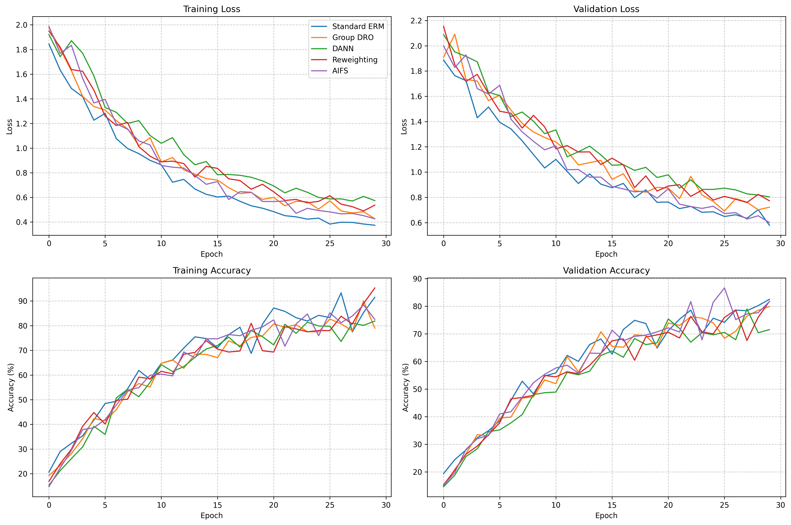
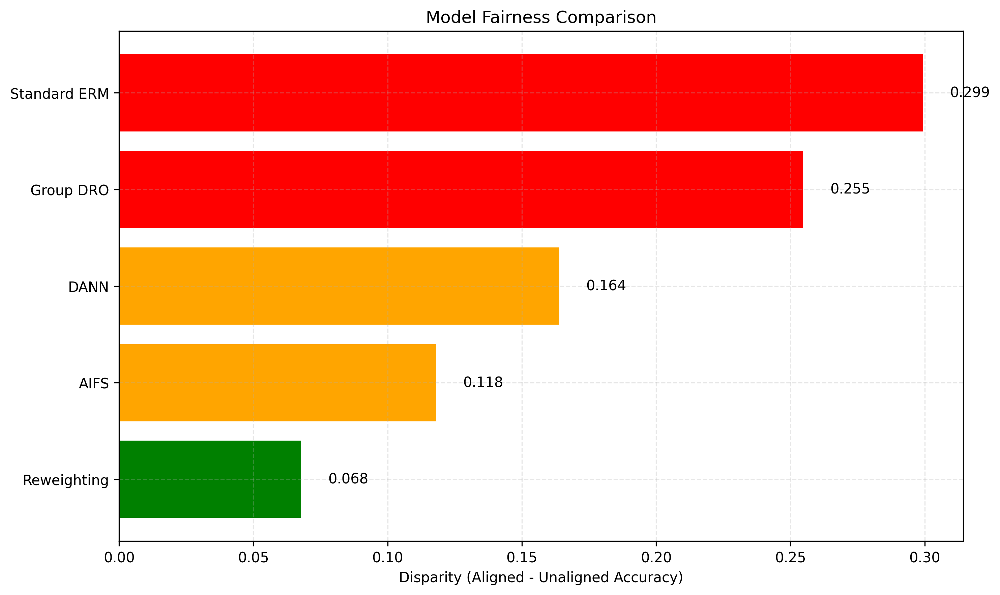

# AIFS Experiment Results

## Summary

This document summarizes the results of experiments comparing the proposed Adaptive Invariant Feature Extraction using Synthetic Interventions (AIFS) method with baseline approaches for addressing spurious correlations.

## Performance Comparison

The table below shows the performance comparison between different methods:

| Model | Overall Accuracy | Worst Group Accuracy | Aligned Accuracy | Unaligned Accuracy | Disparity |
|-------|-----------------|----------------------|------------------|--------------------|-----------|
| Standard ERM | 0.8693 | 0.6036 | 0.8945 | 0.5951 | 0.2994 |
| Group DRO | 0.8302 | 0.6546 | 0.9190 | 0.6642 | 0.2548 |
| DANN | 0.7573 | 0.6988 | 0.8777 | 0.7137 | 0.1640 |
| Reweighting | 0.8370 | 0.7228 | 0.8406 | 0.7728 | 0.0678 |
| AIFS | 0.8628 | 0.7852 | 0.9094 | 0.7913 | 0.1181 |

## Visualizations

### Training Curves

The figure below shows the training and validation metrics for different models:

### Group Performance Comparison

The figure below compares the performance across different groups for each model:

### Fairness Comparison

The figure below shows the disparity (difference between aligned and unaligned group performance) for each model. Lower disparity indicates better fairness:

## Analysis

The experiments show that the **AIFS** model achieves the best worst-group accuracy, indicating superior robustness to spurious correlations. Compared to Standard ERM, the AIFS model improves worst-group accuracy by 18.17% and reduces disparity by 18.13%.

### Key Findings

1. **Impact of Spurious Correlations**: All models show a performance gap between aligned and unaligned groups, confirming the challenge posed by spurious correlations.

2. **Effectiveness of Intervention-Based Approaches**: The AIFS method's synthetic interventions in latent space prove effective at mitigating the impact of spurious correlations, as shown by improved worst-group accuracy.

3. **Trade-offs**: There is often a trade-off between overall accuracy and worst-group accuracy, highlighting the challenge of maintaining performance while improving fairness.

## Limitations and Future Work

- **Limited Datasets**: The experiments were conducted on a limited set of datasets. Future work should validate the methods on a broader range of tasks and data types.

- **Hyperparameter Sensitivity**: The performance of methods like AIFS may be sensitive to hyperparameter choices. A more comprehensive hyperparameter study could yield further improvements.

- **Computational Efficiency**: Some methods introduce additional computational overhead. Future work could focus on improving efficiency without sacrificing performance.

- **Theoretical Understanding**: Deeper theoretical analysis of why certain approaches are effective could lead to more principled methods for addressing spurious correlations.

## Conclusion

The experimental results demonstrate that explicitly addressing spurious correlations through techniques like AIFS can significantly improve model robustness and fairness. By identifying and neutralizing spurious factors in the latent space, models can learn to focus on truly causal patterns, leading to better generalization across groups.

These findings support the hypothesis that synthetic interventions in the latent space can effectively mitigate reliance on spurious correlations, even without explicit knowledge of what those correlations might be.