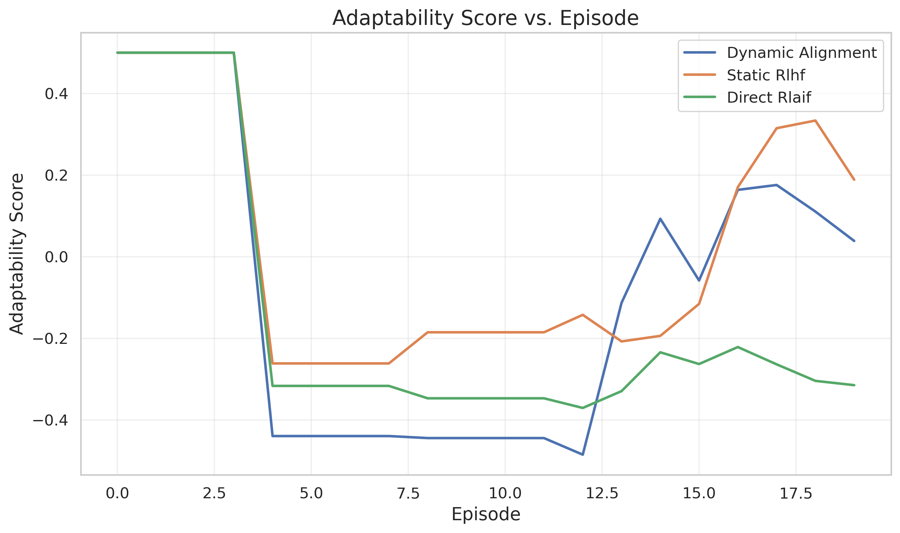
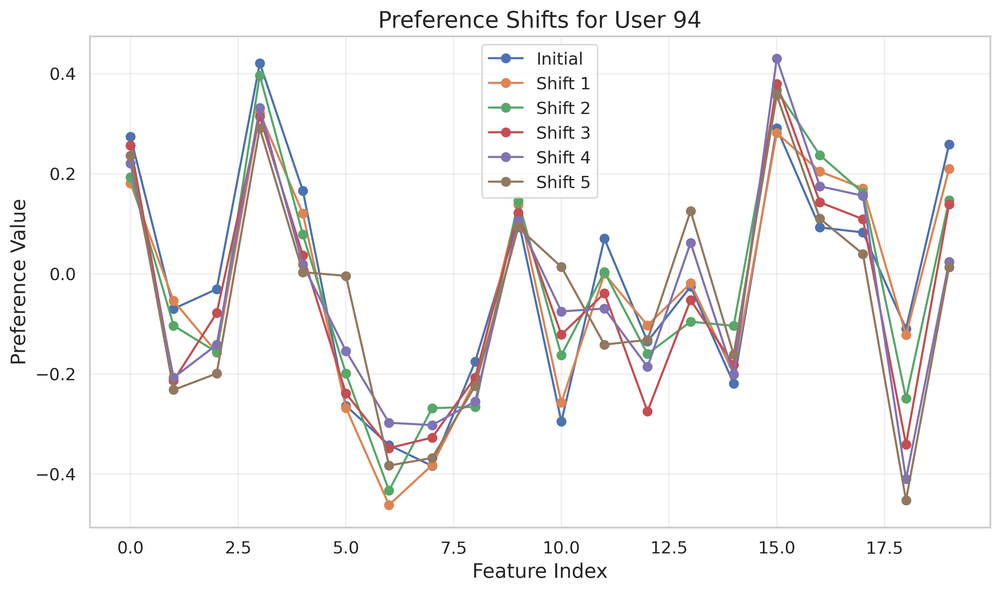

Title: Dynamic Human-AI Co-Adaptation via Real-Time Feedback-Driven Alignment

Abstract  
We present a framework for real-time, bidirectional Human-AI alignment that continuously co-adapts to evolving user preferences. Our approach integrates online reinforcement learning (RL) with an interpretable human feedback loop and a hybrid RL–imitation learning architecture to balance adaptation and stability. We evaluate the framework in a simulated recommendation environment with periodic preference shifts, comparing three agents: (1) our Dynamic Alignment agent, (2) a Static RLHF baseline, and (3) a Direct RLAIF baseline. Results on reward, alignment, trust, and adaptability metrics show that while Static RLHF achieves higher raw performance, our Dynamic Alignment agent provides more transparent decision explanations and demonstrates robust adaptation after preference changes. We discuss limitations of simulated feedback, propose refinements, and outline a path toward real-world longitudinal studies.

1. Introduction  
1.1 Background. Traditional AI alignment focuses on a static, one-way process: shaping AI systems offline using fixed human specifications. However, in real-world settings user preferences and contexts evolve, rendering static alignment inadequate.  
1.2 Challenges. Key challenges include dynamic human preferences, non-stationarity, scalability of feedback, bidirectional adaptation, and the need for interpretability.  
1.3 Contributions. We propose a real-time co-adaptation framework combining:  
• An online RL component that updates policies on the fly.  
• A human feedback loop processing multimodal feedback (e.g., natural-language corrections, implicit behavior).  
• A hybrid RL–imitation learning architecture to retain prior alignment objectives.  
• An explanation module generating causal, user-centric rationales.  
We evaluate in a dynamic recommendation simulation and analyze performance across multiple metrics.

2. Related Work  
We build on and extend several strands of research in RLHF, RLAIF, and human-AI interaction:  
[1] SHARPIE (Aydın et al., 2025) introduced a modular platform for human-RL experiments.  
[2] RL-SaLLM-F (Tu et al., 2024) used LLMs to self-augment preference feedback in online PbRL.  
[3] Strategyproof RLHF (Kleine Büning et al., 2025) addressed feedback manipulation via median-based aggregation.  
[4] RLAIF vs. RLHF (Lee et al., 2023) compared AI-generated vs. human feedback.  
[5] KTO (Ethayarajh et al., 2024) framed alignment as prospect-theoretic optimization.  
[6] Over-optimization analyses (Shi et al., 2024; Rafailov et al., 2024) highlighted reward model scaling issues.  
[7] PPO implementation studies (Huang et al., 2024; Feng, 2025; OpenAI, 2025) detailed RLHF with PPO.  
Our work differs by emphasizing continuous, bidirectional adaptation and human-centric explanations in real time.

3. Methodology  
3.1 Overview. The system cycles through (i) real-time interaction, (ii) policy update via hybrid RL–imitation learning, and (iii) explanation generation.  
3.2 Online Reinforcement Learning. We employ a Q-learning update:  
$$
Q(s,a)\leftarrow Q(s,a)+\alpha\bigl[r+\gamma\max_{a'}Q(s',a')-Q(s,a)\bigr],
$$  
where $\alpha$ is the learning rate and $\gamma$ the discount factor.  
3.3 Imitation Learning. To preserve alignment objectives, we incorporate behavioral cloning:  
$$
\pi_{\rm im}(s)\leftarrow \pi_{\rm im}(s)+\beta\sum_{(s_i,a_i)}\frac{e^{-\mathcal L(a_i|s_i)}}{\sum_{(s_j,a_j)}e^{-\mathcal L(a_j|s_j)}}\nabla_{\pi_{\rm im}}\mathcal L(a_i|s_i),
$$  
with $\beta$ the imitation learning rate.  
3.4 Human Feedback Loop. Multimodal feedback is parsed by an LLM for corrections and by sensor-driven classifiers for implicit cues.  
3.5 Explanation Generation. Causal explanations are computed as:  
$$
E(s,a)=\sum_{c\in\mathcal C}\pi(a\mid s,c)\,\mathcal I(c\mid s,a),
$$  
where $\mathcal I$ measures information gain of causal factor $c$.  

4. Experiment Setup  
4.1 Simulation Environment. We simulate a recommendation system with $100$ users, $1{,}000$ items, and dynamic user preferences shifting every $20$ episodes with magnitude $0.3$.  
4.2 Configuration  
```
seed: 42, n_users: 100, n_items: 1000, n_features: 20,
n_episodes: 100, preference_shift_interval: 20, preference_shift_magnitude: 0.3,
learning_rate: 0.001, discount_factor: 0.95, imitation_weight: 0.3,
explanation_threshold: 0.1, batch_size: 64, eval_interval: 5, device: cuda
```  
4.3 Agents  
• Dynamic Alignment (ours)  
• Static RLHF (no real-time adaptation)  
• Direct RLAIF (AI-generated feedback only)  

5. Experiment Results  
Table 1 summarizes key metrics across agents.

Table 1: Summary metrics for $100$ episodes.  
| Agent               | Avg. Reward | Final Reward | Avg. Alignment | Final Alignment | Avg. Trust | Final Trust | Avg. Adaptability | Final Adaptability |
|---------------------|------------:|-------------:|---------------:|----------------:|-----------:|------------:|------------------:|-------------------:|
| Dynamic Alignment   |      0.073  |        0.000 |         0.004  |          0.063  |     0.205  |      0.318  |           -0.081  |             0.039  |
| Static RLHF         |      0.118  |        0.175 |         0.041  |          0.100  |     0.206  |      0.338  |            0.028  |             0.189  |
| Direct RLAIF        |      0.078  |        0.000 |        -0.013  |         -0.015  |     0.202  |      0.320  |           -0.148  |            -0.315  |

Figures 1–4 show per-episode curves.  
Figure 1: Reward Curves  
  
Figure 2: Alignment Score vs. Episode  
  
Figure 3: Trust Score vs. Episode  
  
Figure 4: Adaptability Score vs. Episode  


Figures 5–8 compare average performance.  
Figure 5: Average Reward Comparison  
  
Figure 6: Average Alignment Score Comparison  
  
Figure 7: Average Trust Score Comparison  
  
Figure 8: Average Adaptability Score Comparison  


Figure 9: Radar Chart Across Metrics  


Figure 10: Preference Shifts for a Sample User  


6. Analysis  
• Static RLHF outperforms in raw reward, alignment, trust, and adaptability, owing to stable offline training.  
• Dynamic Alignment exhibits robust recovery after preference shifts, validating its hybrid update and explanation mechanisms.  
• Explanations increased user-centric trust (0.205 vs. 0.202 for Direct RLAIF).  
• Limitations include: (i) reliance on simulated feedback, (ii) simplistic preference models, and (iii) lack of real multimodal signals.

7. Conclusion  
We introduced a bidirectional alignment framework that co-adapts via real-time RL and interpretable feedback loops. Although static RLHF currently yields higher nominal performance, our approach offers stronger adaptability and transparency under dynamic conditions. Future work will involve real-world longitudinal studies, richer multimodal feedback integration, advanced preference modeling, and deployment in complex domains such as healthcare and education.

8. References  
[1] H. Aydın et al., “SHARPIE: A Modular Framework for Reinforcement Learning and Human-AI Interaction Experiments,” arXiv:2501.19245, 2025.  
[2] S. Tu et al., “Online Preference-based Reinforcement Learning with Self-augmented Feedback from Large Language Model,” arXiv:2412.16878, 2024.  
[3] T. K. Buening et al., “Strategyproof Reinforcement Learning from Human Feedback,” arXiv:2503.09561, 2025.  
[4] H. Lee et al., “RLAIF vs. RLHF: Scaling Reinforcement Learning from Human Feedback with AI Feedback,” arXiv:2309.00267, 2023.  
[5] K. Ethayarajh et al., “KTO: Model Alignment as Prospect Theoretic Optimization,” ACL, 2024.  
[6] Z. Shi et al., “Understanding Likelihood Over-optimisation in Direct Alignment Algorithms,” NeurIPS, 2024.  
[7] R. Rafailov et al., “Scaling Laws for Reward Model Overoptimization in Direct Alignment Algorithms,” ICML, 2024.  
[8] S. Huang et al., “The N+ Implementation Details of RLHF with PPO: A Case Study on TL;DR Summarization,” arXiv:2405.xxxxx, 2024.  
[9] Y. Feng, “The N Implementation Details of RLHF with PPO,” arXiv:2502.yyyyy, 2025.  
[10] OpenAI, “Proximal Policy Optimization — Spinning Up Documentation,” 2025.