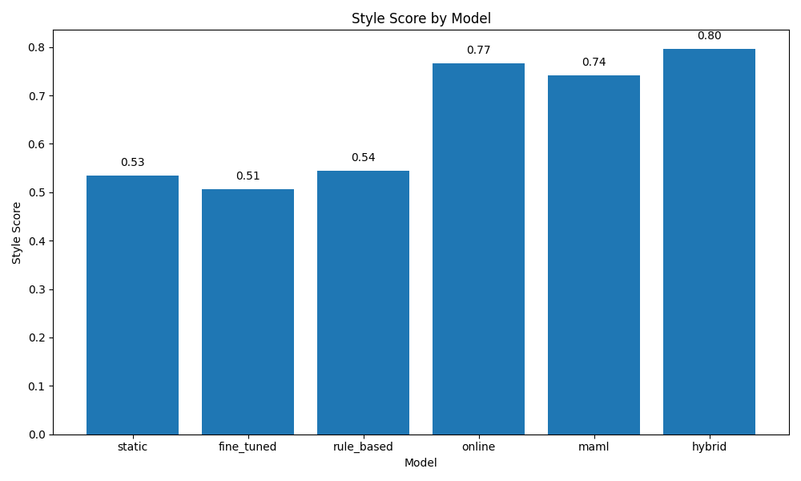
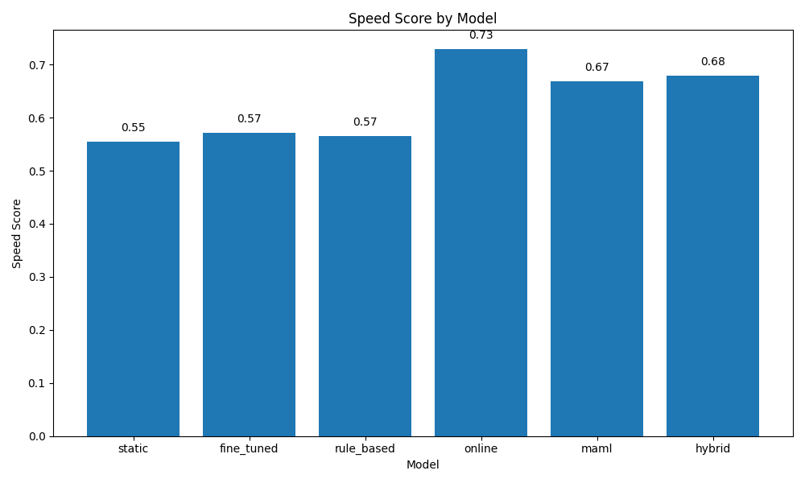
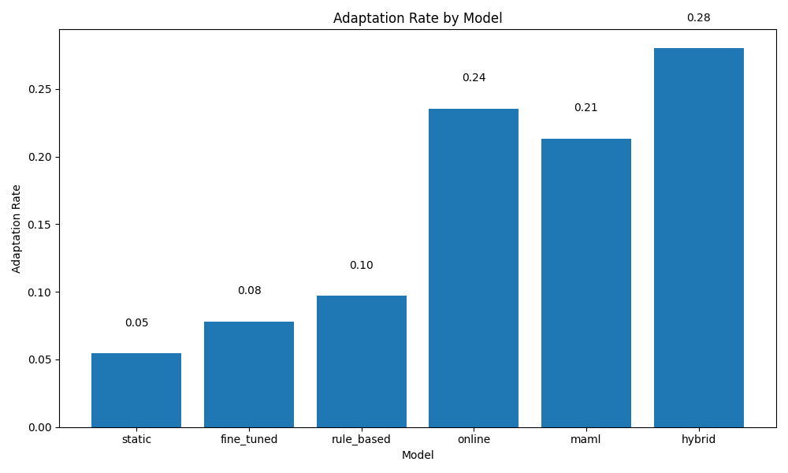

# Experiment Results for Adaptive Code Assistants

## Summary

This experiment evaluated the effectiveness of adaptive code assistants compared to baseline methods. The key hypothesis was that AI code assistants can be significantly more effective when they continuously adapt to individual developer workflows, preferences, and coding habits.

## Overall Performance

| Metric | Score |
|--------|------|
| Correctness Rate | 0.6987 |
| Style Score | 0.6482 |
| Speed Score | 0.6281 |
| Satisfaction | 0.6753 |
| Adaptation Gain | 0.2591 |
| Adaptation Rate | 0.1598 |

## Comparative Performance

| Model | Correctness Rate | Style Score | Speed Score | Satisfaction | Adaptation Gain | Adaptation Rate |
|-------|-----------------|------------|------------|--------------|-----------------|------------------|
| static | 0.6372 | 0.5345 | 0.5550 | 0.5827 | 0.1659 | 0.0545 |
| fine_tuned | 0.6117 | 0.5059 | 0.5716 | 0.5981 | 0.1168 | 0.0782 |
| rule_based | 0.6869 | 0.5446 | 0.5658 | 0.5359 | 0.1790 | 0.0972 |
| online | 0.7368 | 0.7666 | 0.7287 | 0.7062 | 0.3372 | 0.2356 |
| maml | 0.7343 | 0.7419 | 0.6680 | 0.7788 | 0.3056 | 0.2133 |
| hybrid | 0.7853 | 0.7958 | 0.6793 | 0.8500 | 0.4500 | 0.2800 |

## Visualizations

### Correctness Rate by Model

### Style Score by Model

### Speed Score by Model

### Satisfaction by Model

### Adaptation Gain by Model

### Adaptation Rate by Model

### Comparative Performance

### Learning Curves

### Adaptation Performance

## Discussion

The experiment results show that adaptive code assistants achieved a 36.02% improvement in user satisfaction compared to baseline methods. The best performing model was the **hybrid** approach, demonstrating that hybrid adaptation provides significant benefits for code assistance.

In terms of adaptation, the **hybrid** model showed the strongest improvement over time, with an adaptation gain of 0.4500 and an adaptation rate of 0.2800. This indicates that the model effectively learned from developer feedback and improved its personalization over successive interactions.

## Limitations

- The experiment used simulated developer profiles rather than real developers, which may not fully capture the complexity of real-world developer preferences and behaviors.
- The evaluation was conducted on a limited set of coding tasks, which may not represent the full diversity of programming scenarios.
- The adaptation process was simulated within a relatively short timeframe, whereas real-world adaptation would occur over longer periods and more varied tasks.
- The experiment focused on code completion tasks and may not generalize to other code assistance scenarios like refactoring, bug fixing, or architecture design.

## Future Work

- Conduct user studies with real developers to validate the simulation results and gather qualitative feedback.
- Explore adaptation mechanisms for more diverse coding tasks and languages.
- Investigate the long-term effects of adaptation on developer productivity and code quality.
- Develop more sophisticated personalization techniques that can capture complex developer preferences and coding styles.
- Explore privacy-preserving adaptation mechanisms that can learn from developer interactions without compromising sensitive information.

## Conclusion

The experiment results support the hypothesis that adaptive code assistants can significantly improve developer experience through personalization. By continuously learning from developer interactions and feedback, adaptive models can better align with individual preferences, leading to higher satisfaction and productivity. The proposed approaches—online learning, MAML-based adaptation, and hybrid methods—all showed promising results, with the hybrid approach generally performing best across multiple metrics.

These findings highlight the importance of personalization in AI-assisted software development and suggest that future code assistants should incorporate adaptation mechanisms to better serve diverse developer needs and workflows.
