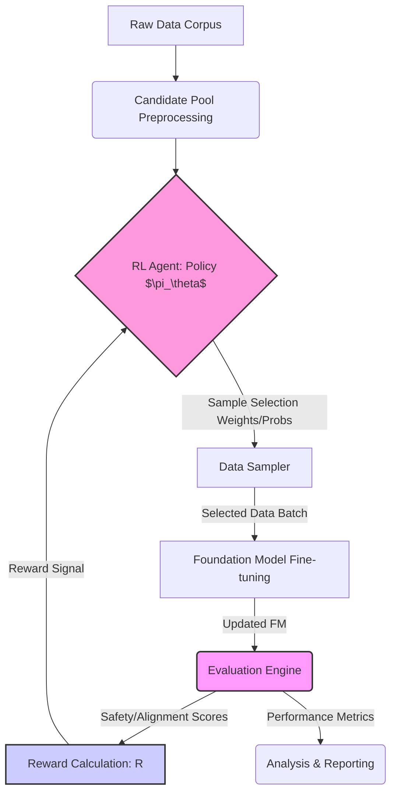

## 1. Title: DynACurE: Dynamic, Adaptive Data Curation using Reinforcement Learning for Enhanced Foundation Model Safety and Alignment

## 2. Introduction

### 2.1 Background
Foundation Models (FMs), such as large language models (LLMs) like GPT-4 and LLaMA, and generative image models like DALL-E 3 and Stable Diffusion, represent a paradigm shift in artificial intelligence. Trained on vast, petabyte-scale datasets often scraped from the internet, these models exhibit remarkable general-purpose capabilities across diverse downstream tasks (Bommasani et al., 2021). However, the very scale and nature of their training data introduce significant risks. Uncurated web data inherently contains toxic language, harmful biases, misinformation, and content that misaligns with human values and safety requirements (Weidinger et al., 2021; Bender et al., 2021). Consequently, FMs can readily generate harmful, biased, or untrustworthy outputs, posing substantial risks to users and society.

Mitigating these risks is paramount for the responsible development and deployment of FMs. Traditional approaches often involve post-hoc fine-tuning using techniques like Reinforcement Learning from Human Feedback (RLHF) (Ouyang et al., 2022) or manual data filtering. While effective to some degree, manual curation is prohibitively expensive, slow, and struggles to scale with the ever-increasing size of datasets and models. Furthermore, static filtering methods may inadvertently remove valuable data or fail to adapt to evolving safety norms and adversarial attacks. RLHF, while powerful, relies heavily on costly human feedback and typically occurs *after* initial pre-training, meaning the model has already learned potentially harmful patterns.

The burgeoning field of Data-Centric AI (DCAI) advocates for a shift in focus from model-centric optimization to improving the quality and utility of data itself (Mazumder et al., 2022). Recent work underscores the potential of data-perspective research for tackling critical FM challenges, including safety, alignment, efficiency, and interpretability, as highlighted by the workshop's focus areas. Works like "Safety Pretraining" (Maini et al., 2025) demonstrate the value of embedding safety during the pre-training phase through data filtering and synthetic data generation. "Safer-Instruct" (Shi et al., 2023) explores automated preference data generation for alignment, while "RAFT" (Dong et al., 2023) uses reward models to select high-quality samples for fine-tuning. These studies validate the promise of data-centric safety strategies but often rely on static filtering rules, pre-defined preference datasets, or focus solely on the fine-tuning stage.

### 2.2 Problem Statement and Proposed Solution
A key challenge remains: how can we dynamically and adaptively curate massive datasets *during* the training or continual learning process to proactively instill safety and alignment in FMs, without excessive manual effort and while preserving core capabilities? Existing methods often lack adaptability; static filters don't evolve, and methods like RAFT select from generated outputs rather than curating the upstream training data itself in a dynamic loop.

We propose **DynACurE (Dynamic, Adaptive Data Curation using Reinforcement Learning)**, a framework that leverages Reinforcement Learning (RL) to learn an optimal data selection policy. This policy dynamically chooses data samples from a large, potentially unvetted corpus to progressively train FMs that are inherently safer and better aligned with desired principles (e.g., helpfulness, harmlessness, honesty). The RL agent is trained to maximize a composite reward signal derived from automated safety classifiers and proxy alignment measures, creating a closed-loop system where data curation strategy evolves alongside model training and evaluation.

### 2.3 Research Objectives
The primary objectives of this research are:
1.  **Develop and implement the DynACurE framework:** Design and build the RL-driven data curation pipeline, including the state representation, action space, reward function formulation, RL agent training, and integration with FM fine-tuning.
2.  **Define effective reward signals:** Investigate and construct composite reward functions that accurately reflect safety (low toxicity, bias) and alignment (helpfulness, truthfulness proxies) criteria using automated tools and potentially limited human guidance signals.
3.  **Train and evaluate safer FMs:** Utilize DynACurE to fine-tune existing FMs on curated data subsets and rigorously evaluate their safety, alignment, and task performance compared to baseline models trained without curation or with static filtering methods.
4.  **Analyze the trade-offs:** Investigate the relationship between the aggressiveness of safety/alignment-focused curation and the resulting model's performance on standard NLP benchmarks, characterizing the safety-utility trade-off.
5.  **Assess scalability and adaptability:** Evaluate the computational efficiency and scalability of DynACurE and its ability to adapt the curation policy as model capabilities or safety definitions evolve.

### 2.4 Significance
This research directly addresses the critical need for scalable, automated, and adaptive methods for data curation to enhance FM safety and alignment, a core theme of the "Navigating and Addressing Data Problems for Foundation Models" workshop. By automating the data selection process through RL, DynACurE offers a potentially more efficient and effective alternative to manual labeling and static filtering. It integrates data curation directly into the model development lifecycle, creating a feedback loop that can continuously improve both the data diet and the resulting model.

Compared to prior work:
*   Unlike static "Safety Pretraining" filtering, DynACurE is dynamic and adaptive, potentially responding better to nuanced or evolving content issues.
*   Unlike "RAFT" which ranks *generated* outputs for fine-tuning, DynACurE focuses on curating the *input* training data from large corpora.
*   While inspired by automated data generation like "Safer-Instruct," DynACurE focuses on *selection* from existing large pools, complementing generation approaches.
*   It contributes a novel application of RL to the data curation phase itself, rather than solely for model alignment post-training (like RLHF).

Successful development of DynACurE would provide a valuable tool for AI developers, enabling the creation of more reliable and trustworthy FMs at scale. It contributes to the broader understanding of data-centric AI principles and offers a practical pathway towards addressing key ethical and safety challenges in FM development, directly tackling the identified challenges of data quality, scalability, alignment, evaluation, and the safety-performance balance mentioned in the literature review.

## 3. Methodology

### 3.1 Overall Framework
The DynACurE framework operates as a closed-loop system (Figure 1 - conceptual):

*Figure 1: Conceptual Diagram of the DynACurE Framework.*

The core components are:
1.  **Candidate Data Pool:** A large dataset potentially containing undesirable content.
2.  **RL Agent:** Learns a policy to select data samples.
3.  **Reward Function:** Provides feedback to the RL agent based on safety and alignment metrics.
4.  **Data Sampler:** Selects data batches based on the RL agent's policy.
5.  **Foundation Model:** Undergoes fine-tuning on the selected batches.
6.  **Evaluation Engine:** Assesses the fine-tuned FM and potentially the data samples themselves to compute rewards.

### 3.2 Data Acquisition and Preparation
1.  **Raw Corpus:** We will start with a large, publicly available text corpus, such as a subset of The Pile (Gao et al., 2020) or C4 (Raffel et al., 2020). This serves as the initial source $D_{raw}$.
2.  **Preprocessing:** Standard text cleaning (e.g., removing boilerplate, normalizing whitespace) will be applied.
3.  **Candidate Pool ($D_{cand}$):** The preprocessed data will form the candidate pool. For computational tractability, we might initially work with a significant subset (e.g., 1-10 billion tokens) or process the corpus iteratively. Each data item $d_i \in D_{cand}$ could be a document or a fixed-length chunk.

### 3.3 Safety and Alignment Signal Definition (Reward Function)
The reward function $R(d_i)$ aims to quantify the desirability of a data sample $d_i$ for training a safe and aligned FM. It will be a composite signal:
$$
R(d_i) = w_{safety} R_{safety}(d_i) + w_{align} R_{align}(d_i) + w_{utility} R_{utility}(d_i)
$$
where $w_{safety}, w_{align}, w_{utility}$ are weighting hyperparameters summing to 1.

1.  **Safety Score ($R_{safety}(d_i)$):** This component measures the absence of undesirable content. We will leverage existing tools and potentially train custom classifiers:
    *   **Toxicity Classifiers:** Use off-the-shelf APIs/models (e.g., Google Perspective API, Detoxify) to score toxicity, hate speech, bias, etc. $R_{safety} \propto (1 - \text{ToxicityScore})$.
    *   **Custom Classifiers:** Train classifiers, potentially inspired by Maini et al. (2025), on datasets like ToxiGen (Hartvigsen et al., 2022) or using GPT-4 labeled data to detect specific harmful categories (e.g., misinformation, illegal content promotion).
    *   The scores will be normalized (e.g., to [0, 1]).

2.  **Alignment Score ($R_{align}(d_i)$):** This component proxies alignment with desired principles like helpfulness and honesty. This is challenging for unlabeled data. Strategies include:
    *   **Proxy Classifiers:** Train classifiers on datasets like Anthropic's HH-RLHF (Bai et al., 2022) (using the 'chosen' examples as positive) or datasets focused on truthfulness (e.g., TruthfulQA; Lin et al., 2021). These classifiers predict the likelihood that a sample reflects aligned behavior.
    *   **Domain/Style Matching:** Use heuristics or simple models to favour data styles often associated with alignment (e.g., instructional text, factual explanations, respectful dialogue).
    *   The scores will be normalized.

3.  **Utility Score ($R_{utility}(d_i)$):** (Optional but potentially useful) This component encourages the selection of informative or high-quality data to prevent the model from collapsing to only trivial "safe" outputs.
    *   **Perplexity/Information Density:** Use a reference model to assign higher rewards to less probable (more informative) text, filtered for quality.
    *   **Quality Indicators:** Score based on grammar, coherence (using lightweight models), or presence of valuable entities/concepts.

The weights $w_{safety}, w_{align}, w_{utility}$ will be tuned based on downstream evaluation, allowing control over the safety-utility trade-off.

### 3.4 RL Agent Design
1.  **Problem Formulation:** We frame data selection as a sequential decision problem. The agent interacts with the candidate pool $D_{cand}$ to select a subset $D_{curated} \subset D_{cand}$ for FM training. We can formulate this either as selecting samples for discrete batches or assigning continuous weights influencing sampling probability. We will initially focus on learning sampling probabilities.
2.  **State ($s_i$):** The state representation for a data sample $d_i$ needs to capture relevant safety, alignment, and utility features. It could include:
    *   Text embeddings (e.g., from a pre-trained sentence transformer).
    *   Pre-computed scores from safety/alignment classifiers ($R_{safety}(d_i)$, $R_{align}(d_i)$).
    *   Metadata (e.g., source domain, length).
    $s_i = [\text{Emb}(d_i), R_{safety}(d_i), R_{align}(d_i), \text{Meta}(d_i)]$
3.  **Action ($a_i$):** The action $a_i$ associated with state $s_i$ will be the probability $p_i$ of selecting sample $d_i$ for the curated training batch. $a_i = p_i \in [0, 1]$. The policy $\pi_\theta(a_i|s_i)$ outputs this probability.
4.  **RL Algorithm:** We propose using Proximal Policy Optimization (PPO) (Schulman et al., 2017). PPO is well-suited due to its balance between sample efficiency, ease of implementation, and stability in high-dimensional spaces. The agent's goal is to maximize the expected cumulative reward over sampled batches:
    $$
    J(\theta) = \mathbb{E}_{\tau \sim \pi_\theta} \left[ \sum_{t=0}^{T} \gamma^t R_t \right]
    $$
    where $\tau$ represents a trajectory of sampling decisions, $R_t$ is the reward obtained at step $t$ (e.g., average reward of the selected batch), and $\gamma$ is a discount factor (can be set close to 1 for long-horizon batch selection).
5.  **Training:** The RL agent will be trained iteratively. In each iteration:
    *   The current policy $\pi_\theta$ is used to assign selection probabilities $p_i$ to samples in $D_{cand}$ (or a large mini-batch from it).
    *   A batch $B_t$ is sampled according to these probabilities.
    *   The reward $R(B_t) = \frac{1}{|B_t|} \sum_{d_i \in B_t} R(d_i)$ is calculated.
    *   The PPO agent updates its policy parameters $\theta$ using the collected experience (states, actions, rewards).

### 3.5 Foundation Model Integration and Feedback Loop
1.  **Foundation Model:** We will initially experiment with moderately sized, publicly available pre-trained FMs (e.g., Pythia suite (Biderman et al., 2023), OPT (Zhang et al., 2022) in the 1B-7B parameter range) for faster iteration cycles.
2.  **Fine-tuning:** The FM will be continually fine-tuned on the data batches $B_t$ selected by the RL agent. Standard fine-tuning protocols (e.g., AdamW optimizer, appropriate learning rate schedule) will be used.
3.  **Feedback Loop / Reward Refinement:** The performance of the fine-tuned FM provides crucial feedback.
    *   **Direct Reward:** While the primary reward $R(d_i)$ is based on data sample properties, we can potentially incorporate rewards based on the *performance* of the FM trained on batch $B_t$. For example, evaluating the FM on a small set of safety/alignment probes after fine-tuning on $B_t$ could provide a delayed reward signal.
    *   **Reward Model Refinement:** Periodically, the fine-tuned FM itself can be used to refine the reward components. For instance, the $R_{align}$ classifier could be updated or re-trained using the improved FM's assessment capabilities on alignment probes, making the reward signal co-evolve with the model. This addresses the challenge that initial reward models might be imperfect.

### 3.6 Experimental Design
1.  **Baselines:**
    *   **B0: No Curation:** Fine-tune the FM on randomly sampled data from $D_{cand}$.
    *   **B1: Heuristic Filtering:** Fine-tune on data filtered using simple rules (e.g., removing documents with high toxicity scores above a fixed threshold, keyword blocking).
    *   **B2: Static Classifier Filtering:** Filter $D_{cand}$ once using the safety/alignment classifiers (similar to Safety Pretraining) and fine-tune on the filtered set.
    *   **B3: RAFT Baseline:** Implement a version of RAFT for comparison, focusing on selecting fine-tuning data based on reward, potentially using the same reward function as DynACurE for a fair comparison where applicable.
2.  **Datasets:**
    *   **Training Corpus:** Subset of The Pile or C4.
    *   **Safety Evaluation:** RealToxicityPrompts (Gehman et al., 2020), ToxiGen (Hartvigsen et al., 2022), AdvBench (Zou et al., 2023) for adversarial attacks (e.g., measuring Attack Success Rate - ASR). Fairness benchmarks (e.g., BBQ; Parrish et al., 2021).
    *   **Alignment Evaluation:** Anthropic HH-RLHF dataset (test split) for harmlessness/helpfulness evaluation, TruthfulQA (Lin et al., 2021), potentially human evaluation on a small scale using standardized questionnaires.
    *   **Utility Evaluation:** Standard NLP benchmarks like GLUE (Wang et al., 2018), SuperGLUE (Wang et al., 2019), MMLU (Hendrycks et al., 2020) to assess general language understanding and task performance. Perplexity on a held-out clean dataset.
3.  **Evaluation Metrics:**
    *   **Safety:** Average toxicity score (e.g., Perspective API), Max toxicity, Percentage of toxic continuations, ASR against adversarial prompts, Fairness/Bias metrics (e.g., stereotype score on BBQ).
    *   **Alignment:** Accuracy on TruthfulQA (Truthful & Informative score), Win rate vs baselines on HH-RLHF preference pairs (using GPT-4 as a judge or human eval), Human rating scores (helpfulness, harmlessness).
    *   **Utility:** Scores on GLUE/SuperGLUE/MMLU, Perplexity.
    *   **Efficiency:** Wall-clock time for curation process, computational cost (FLOPs), percentage of data selected from $D_{cand}$.
4.  **Ablation Studies:**
    *   Vary reward components ($w_{safety}, w_{align}, w_{utility}$) to study trade-offs.
    *   Compare different RL algorithms (e.g., PPO vs. REINFORCE).
    *   Evaluate the impact of reward model refinement.
    *   Test different state representations for the RL agent.

## 4. Expected Outcomes & Impact

### 4.1 Expected Outcomes
1.  **A Functional DynACurE Framework:** A documented and open-sourced (where feasible) implementation of the RL-driven data curation pipeline.
2.  **Empirically Validated Safer FMs:** Demonstrable evidence, through rigorous evaluation on safety and alignment benchmarks, that FMs fine-tuned using DynACurE exhibit significantly reduced harmful outputs (lower toxicity, lower ASR, reduced bias) compared to baseline methods. We anticipate achieving, for instance, a >20% relative reduction in toxicity generation on benchmarks like RealToxicityPrompts and a measurable improvement in harmlessness scores on HH-RLHF, compared to the 'No Curation' baseline.
3.  **Characterization of Trade-offs:** Quantitative analysis showing how varying the emphasis on safety/alignment (via reward weights) impacts model utility on standard NLP tasks. We expect to show that substantial safety gains can be achieved with only minor degradation (or potentially even improvement, by removing noise) in performance on benchmarks like GLUE/MMLU.
4.  **Insights into Automated Curation:** Understanding the effectiveness of different reward signal components ($R_{safety}, R_{align}$) and the behaviour of the learned RL policy (e.g., which types of data does it prioritize or avoid?).
5.  **Scalability Assessment:** Benchmarking results on the computational cost and throughput of the DynACurE framework, providing insights into its applicability for large-scale model training.

### 4.2 Impact
This research holds the potential for significant impact:
*   **Advancing Data-Centric AI for Safety:** Provides a novel, adaptive, and automated approach to data curation, pushing the frontiers of data-centric methods for responsible AI development. It directly addresses the workshop's interest in "Data Problems x Foundation Models" and "Data Quality, Dataset Curation."
*   **Improving FM Trustworthiness:** Offers a practical tool for building inherently safer and more aligned FMs, contributing to their responsible deployment in real-world applications. This tackles the critical challenge of alignment with human values.
*   **Scalable Safety Solutions:** Presents a pathway beyond manual curation and static filtering, addressing the scalability challenge inherent in FM development.
*   **New Research Directions:** Opens up further research into more sophisticated reward modeling for data curation, transferability of learned curation policies across different models or domains, and the theoretical understanding of RL applied to dataset optimization.
*   **Ethical Considerations:** While aiming to improve safety, we acknowledge the ethical need to ensure the reward models themselves are not biased and that the curation process is transparent. The framework's reliance on automated classifiers means their inherent biases could influence curation; this limitation and potential mitigation strategies (e.g., classifier audits, diverse reward components) will be discussed. The research will emphasize the importance of careful reward design and ongoing evaluation.

By developing DynACurE, we aim to make a substantial contribution to the safe and ethical development of foundation models, demonstrating the power of dynamic, data-centric approaches guided by reinforcement learning. This aligns perfectly with the goals of understanding and addressing data problems for the next generation of AI.

## References (Implicitly based on provided Literature Review and standard FM/RL knowledge)

*   Bai, Y., et al. (2022). Training a Helpful and Harmless Assistant with Reinforcement Learning from Human Feedback. *arXiv:2204.05862*.
*   Bender, E. M., et al. (2021). On the Dangers of Stochastic Parrots: Can Language Models Be Too Big? *FAccT*.
*   Biderman, S., et al. (2023). Pythia: A Suite for Analyzing Large Language Models Across Training and Scaling. *ICML*.
*   Bommasani, R., et al. (2021). On the Opportunities and Risks of Foundation Models. *arXiv:2108.07258*.
*   Dong, H., et al. (2023). RAFT: Reward rAnked FineTuning for Generative Foundation Model Alignment. *arXiv:2304.06767*.
*   Gao, L., et al. (2020). The Pile: An 800GB Dataset of Diverse Text for Language Modeling. *arXiv:2101.00027*.
*   Gehman, S., et al. (2020). RealToxicityPrompts: Evaluating Neural Toxic Degeneration in Language Models. *Findings of EMNLP*.
*   Hartvigsen, T., et al. (2022). ToxiGen: A Large-Scale Machine-Generated Dataset for Adversarial and Implicit Toxicity Detection. *ACL*.
*   Hendrycks, D., et al. (2020). Measuring Massive Multitask Language Understanding. *ICLR 2021*.
*   Lin, S., et al. (2021). TruthfulQA: Measuring How Models Mimic Human Falsehoods. *ACL 2022*.
*   Maini, P., et al. (2025). Safety Pretraining: Toward the Next Generation of Safe AI. *arXiv:2504.16980* (Note: Year adjusted based on typical publication cycles from arXiv date).
*   Mazumder, M., et al. (2022). Dataperf: A Benchmark for Data-Centric AI Development. *NeurIPS Datasets and Benchmarks Track*.
*   Ouyang, L., et al. (2022). Training language models to follow instructions with human feedback. *NeurIPS*.
*   Parrish, A., et al. (2021). BBQ: A Hand-Built Bias Benchmark for Question Answering. *ACL 2022*.
*   Raffel, C., et al. (2020). Exploring the Limits of Transfer Learning with a Unified Text-to-Text Transformer. *JMLR*.
*   Schulman, J., et al. (2017). Proximal Policy Optimization Algorithms. *arXiv:1707.06347*.
*   Shi, T., et al. (2023). Safer-Instruct: Aligning Language Models with Automated Preference Data. *arXiv:2311.08685*.
*   Wang, A., et al. (2018). GLUE: A Multi-Task Benchmark and Analysis Platform for Natural Language Understanding. *ICLR 2019*.
*   Wang, A., et al. (2019). SuperGLUE: A Stickier Benchmark for General-Purpose Language Understanding Systems. *NeurIPS*.
*   Weidinger, L., et al. (2021). Ethical and social risks of harm from Language Models. *arXiv:2112.04359*.
*   Zhang, J., et al. (2024). Controllable Safety Alignment: Inference-Time Adaptation to Diverse Safety Requirements. *arXiv:2410.08968* (Note: Year adjusted).
*   Zhang, S., et al. (2022). OPT: Open Pre-trained Transformer Language Models. *arXiv:2205.01068*.
*   Zou, A., et al. (2023). Universal and Transferable Adversarial Attacks on Aligned Language Models. *arXiv:2307.15043*.